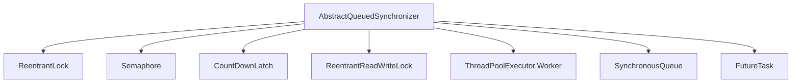
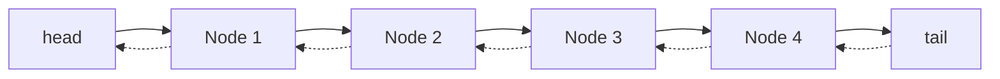
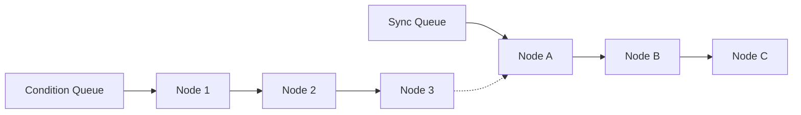
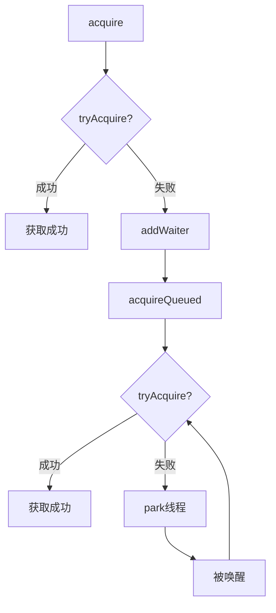
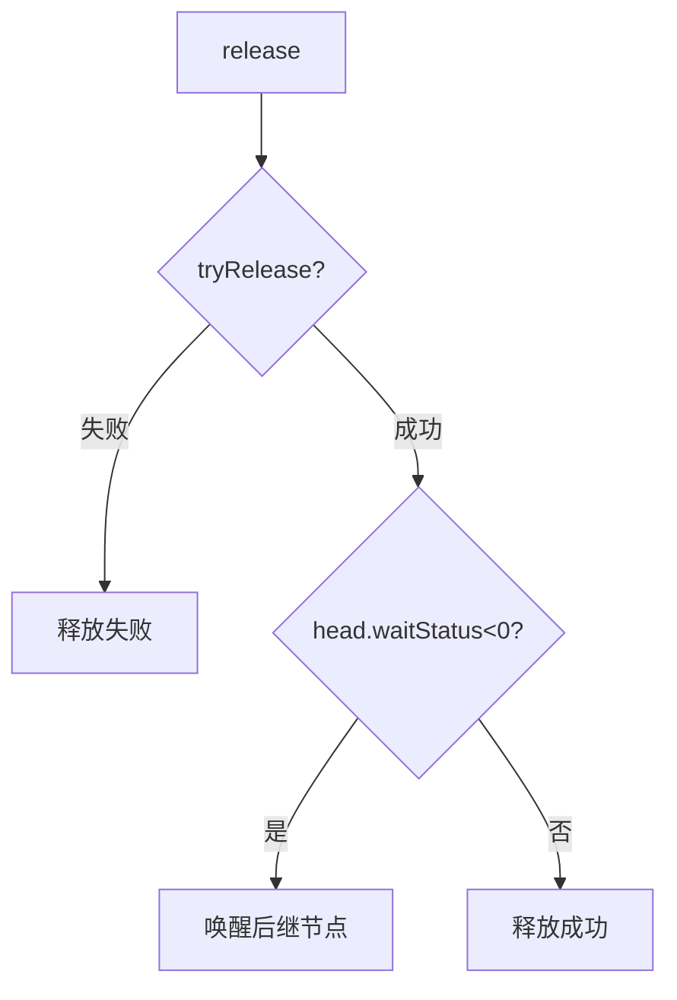
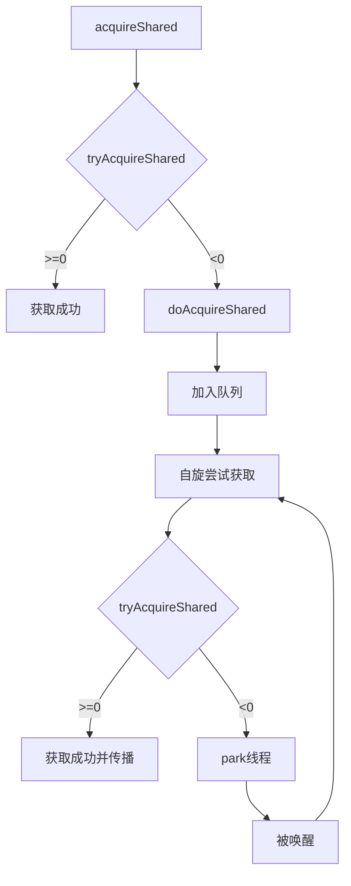
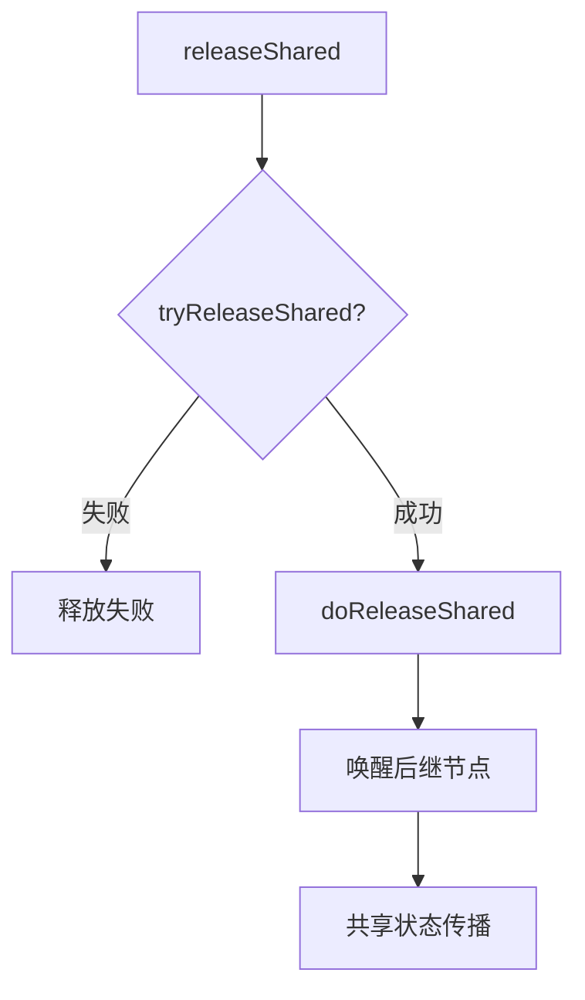

## 1. AQS概述

### 1.1 什么是AQS

AbstractQueuedSynchronizer（简称AQS）是Java并发包（java.util.concurrent）中的核心组件，是构建锁和同步器的框架。AQS提供了一种实现阻塞锁和相关同步器（信号量、事件等）的框架，依赖于一个先进先出（FIFO）的等待队列，并为锁和同步器的实现提供了通用的基础设施。

```java
public abstract class AbstractQueuedSynchronizer
    extends AbstractOwnableSynchronizer
    implements java.io.Serializable {
    // ...
}
```

### 1.2 AQS的核心思想

AQS的核心思想可以概括为：

<div class="grid cards" markdown>

-   **状态管理**
    - 使用一个整型变量state表示同步状态
    - 通过CAS操作和volatile保证状态更新的原子性和可见性
    - 子类根据需要定义state的含义和使用方式

-   **等待队列**
    - 使用CLH队列（Craig, Landin, and Hagersten locks）的变体实现等待队列
    - 线程获取同步状态失败时，将被封装成Node加入队列
    - 等待队列中的线程按FIFO顺序获取同步状态

-   **模板方法模式**
    - 提供了一系列模板方法（如acquire、release）定义框架
    - 子类通过实现特定的方法（如tryAcquire、tryRelease）来定制行为
    - 将通用的排队机制与特定的同步语义分离

</div>

### 1.3 AQS的应用场景

AQS框架被广泛应用于Java并发包中的多种同步器实现：



## 2. AQS内部结构

### 2.1 同步状态

AQS使用一个int类型的成员变量state来表示同步状态：

```java
private volatile int state;
```

- 对于独占锁（如ReentrantLock）：state=0表示未锁定，state>0表示已锁定
- 对于共享锁（如Semaphore）：state表示可用许可的数量
- 对于ReentrantReadWriteLock：state的高16位表示读锁计数，低16位表示写锁计数

AQS提供了三个方法来操作同步状态：

```java
protected final int getState()
protected final void setState(int newState)
protected final boolean compareAndSetState(int expect, int update)
```

### 2.2 等待队列

AQS维护一个等待队列，用于存放等待获取同步状态的线程。这是一个CLH队列的变体，是一个双向链表。



队列中的每个节点（Node）表示一个等待的线程，包含以下主要字段：

```java
static final class Node {
    // 共享模式
    static final Node SHARED = new Node();
    // 独占模式
    static final Node EXCLUSIVE = null;
    
    // 等待状态
    static final int CANCELLED =  1;  // 线程已取消
    static final int SIGNAL    = -1;  // 后继节点需要唤醒
    static final int CONDITION = -2;  // 线程在条件队列中等待
    static final int PROPAGATE = -3;  // 共享模式下传播
    
    volatile int waitStatus;  // 等待状态
    volatile Node prev;       // 前驱节点
    volatile Node next;       // 后继节点
    volatile Thread thread;   // 关联的线程
    Node nextWaiter;          // 条件队列中的下一个节点
    
    // ...
}
```

### 2.3 条件队列

AQS还提供了ConditionObject内部类，用于实现条件变量的功能，类似于传统的Object.wait/notify机制，但具有更强的灵活性。



条件队列与同步队列的关系：
- 条件队列是单向链表，节点通过nextWaiter连接
- 当调用condition.signal()时，会将条件队列中的节点转移到同步队列
- 一个锁可以有多个条件变量，每个条件变量对应一个条件队列

## 3. AQS的工作机制

### 3.1 独占模式

独占模式下，同一时刻只有一个线程能够获取同步状态。

#### 3.1.1 获取同步状态



主要流程：
1. 调用tryAcquire尝试获取同步状态
2. 如果获取成功，直接返回
3. 如果获取失败，将当前线程封装成Node加入等待队列
4. 在队列中自旋尝试获取同步状态
5. 如果仍然失败，则阻塞当前线程，等待前驱节点唤醒

关键代码：
```java
public final void acquire(int arg) {
    if (!tryAcquire(arg) &&
        acquireQueued(addWaiter(Node.EXCLUSIVE), arg))
        selfInterrupt();
}
```

#### 3.1.2 释放同步状态



主要流程：
1. 调用tryRelease尝试释放同步状态
2. 如果释放成功，检查头节点的waitStatus
3. 如果头节点的waitStatus<0，说明有后继节点需要唤醒
4. 唤醒后继节点

关键代码：
```java
public final boolean release(int arg) {
    if (tryRelease(arg)) {
        Node h = head;
        if (h != null && h.waitStatus != 0)
            unparkSuccessor(h);
        return true;
    }
    return false;
}
```

### 3.2 共享模式

共享模式下，多个线程可以同时获取同步状态。

#### 3.2.1 获取同步状态



主要流程：
1. 调用tryAcquireShared尝试获取共享同步状态
2. 如果返回值>=0，表示获取成功
3. 如果返回值<0，将当前线程封装成Node加入等待队列
4. 在队列中自旋尝试获取共享同步状态
5. 如果获取成功，根据情况唤醒后继节点（共享状态传播）

关键代码：
```java
public final void acquireShared(int arg) {
    if (tryAcquireShared(arg) < 0)
        doAcquireShared(arg);
}
```

#### 3.2.2 释放同步状态



主要流程：
1. 调用tryReleaseShared尝试释放共享同步状态
2. 如果释放成功，唤醒后继节点
3. 后继节点获取同步状态后，继续唤醒其后继节点（共享状态传播）

关键代码：
```java
public final boolean releaseShared(int arg) {
    if (tryReleaseShared(arg)) {
        doReleaseShared();
        return true;
    }
    return false;
}
```

## 4. AQS的模板方法

AQS使用模板方法设计模式，提供了一系列模板方法供子类调用，同时要求子类实现一些特定的方法来定制行为。

### 4.1 需要子类实现的方法

| 方法 | 描述 | 使用场景 |
|------|------|---------|
| tryAcquire(int) | 尝试以独占模式获取同步状态 | 独占锁的获取 |
| tryRelease(int) | 尝试以独占模式释放同步状态 | 独占锁的释放 |
| tryAcquireShared(int) | 尝试以共享模式获取同步状态 | 共享锁的获取 |
| tryReleaseShared(int) | 尝试以共享模式释放同步状态 | 共享锁的释放 |
| isHeldExclusively() | 当前同步器是否被当前线程独占 | 条件变量的支持 |

### 4.2 AQS提供的模板方法

<div class="grid cards" markdown>

-   **独占模式**
    - acquire(int)：获取同步状态，忽略中断
    - acquireInterruptibly(int)：获取同步状态，响应中断
    - tryAcquireNanos(int, long)：尝试在指定时间内获取同步状态
    - release(int)：释放同步状态

-   **共享模式**
    - acquireShared(int)：获取共享同步状态，忽略中断
    - acquireSharedInterruptibly(int)：获取共享同步状态，响应中断
    - tryAcquireSharedNanos(int, long)：尝试在指定时间内获取共享同步状态
    - releaseShared(int)：释放共享同步状态

-   **条件变量**
    - await()：等待条件满足
    - awaitUninterruptibly()：等待条件满足，忽略中断
    - awaitNanos(long)：在指定时间内等待条件满足
    - signal()：唤醒一个等待线程
    - signalAll()：唤醒所有等待线程

</div>

## 5. 基于AQS的同步器实现分析

### 5.1 ReentrantLock

ReentrantLock是一个可重入的独占锁，它有公平和非公平两种模式。

```java
public class ReentrantLock implements Lock, java.io.Serializable {
    private final Sync sync;
    
    abstract static class Sync extends AbstractQueuedSynchronizer {
        // ...
    }
    
    static final class NonfairSync extends Sync {
        // ...
    }
    
    static final class FairSync extends Sync {
        // ...
    }
}
```

**state的含义**：表示锁的重入次数
- state=0：锁未被持有
- state>0：锁被持有，值表示重入次数

**非公平锁的tryAcquire实现**：

```java
protected final boolean tryAcquire(int acquires) {
    return nonfairTryAcquire(acquires);
}

final boolean nonfairTryAcquire(int acquires) {
    final Thread current = Thread.currentThread();
    int c = getState();
    if (c == 0) {  // 锁未被持有
        if (compareAndSetState(0, acquires)) {  // CAS设置状态
            setExclusiveOwnerThread(current);   // 设置持有线程
            return true;
        }
    }
    else if (current == getExclusiveOwnerThread()) {  // 当前线程已持有锁
        int nextc = c + acquires;
        if (nextc < 0)  // 溢出检查
            throw new Error("Maximum lock count exceeded");
        setState(nextc);  // 增加重入次数
        return true;
    }
    return false;  // 获取失败
}
```

**公平锁的tryAcquire实现**：

```java
protected final boolean tryAcquire(int acquires) {
    final Thread current = Thread.currentThread();
    int c = getState();
    if (c == 0) {
        // 与非公平锁的区别：先检查队列中是否有前驱节点
        if (!hasQueuedPredecessors() &&
            compareAndSetState(0, acquires)) {
            setExclusiveOwnerThread(current);
            return true;
        }
    }
    else if (current == getExclusiveOwnerThread()) {
        int nextc = c + acquires;
        setState(nextc);
        return true;
    }
    return false;
}
```

**tryRelease实现**：

```java
protected final boolean tryRelease(int releases) {
    int c = getState() - releases;
    if (Thread.currentThread() != getExclusiveOwnerThread())
        throw new IllegalMonitorStateException();
    boolean free = false;
    if (c == 0) {  // 锁完全释放
        free = true;
        setExclusiveOwnerThread(null);
    }
    setState(c);  // 减少重入次数
    return free;
}
```

### 5.2 Semaphore

Semaphore是一个计数信号量，用于控制同时访问特定资源的线程数量。

**state的含义**：表示可用许可的数量

**tryAcquireShared实现**：

```java
protected int tryAcquireShared(int acquires) {
    return nonfairTryAcquireShared(acquires);
}

final int nonfairTryAcquireShared(int acquires) {
    for (;;) {
        int available = getState();
        int remaining = available - acquires;
        if (remaining < 0 ||
            compareAndSetState(available, remaining))
            return remaining;
    }
}
```

**tryReleaseShared实现**：

```java
protected final boolean tryReleaseShared(int releases) {
    for (;;) {
        int current = getState();
        int next = current + releases;
        if (compareAndSetState(current, next))
            return true;
    }
}
```

### 5.3 CountDownLatch

CountDownLatch是一个同步辅助类，允许一个或多个线程等待一组操作完成。

**state的含义**：表示计数器的值，初始化为一个正数，表示需要等待的操作数量

**tryAcquireShared实现**：

```java
protected int tryAcquireShared(int acquires) {
    return (getState() == 0) ? 1 : -1;
}
```

**tryReleaseShared实现**：

```java
protected boolean tryReleaseShared(int releases) {
    for (;;) {
        int c = getState();
        if (c == 0)
            return false;
        int nextc = c - 1;
        if (compareAndSetState(c, nextc))
            return nextc == 0;
    }
}
```

## 6. AQS在实际应用中的最佳实践

### 6.1 自定义同步器

自定义同步器需要遵循以下步骤：

1. 继承AbstractQueuedSynchronizer类
2. 根据需要实现tryAcquire、tryRelease等方法
3. 定义state的含义和使用方式
4. 提供对外的方法，调用AQS的模板方法

示例：实现一个简单的互斥锁

```java
public class Mutex {
    private static class Sync extends AbstractQueuedSynchronizer {
        // 是否处于占用状态
        protected boolean isHeldExclusively() {
            return getState() == 1;
        }

        // 尝试获取锁
        public boolean tryAcquire(int acquires) {
            if (compareAndSetState(0, 1)) {
                setExclusiveOwnerThread(Thread.currentThread());
                return true;
            }
            return false;
        }

        // 尝试释放锁
        protected boolean tryRelease(int releases) {
            if (getState() == 0) throw new IllegalMonitorStateException();
            setExclusiveOwnerThread(null);
            setState(0);
            return true;
        }
    }

    private final Sync sync = new Sync();

    public void lock() { sync.acquire(1); }
    public boolean tryLock() { return sync.tryAcquire(1); }
    public void unlock() { sync.release(1); }
    public boolean isLocked() { return sync.isHeldExclusively(); }
}
```

### 6.2 限流器

使用Semaphore实现简单的限流器：

```java
public class RateLimiter {
    private final Semaphore semaphore;
    private final int permitsPerSecond;
    private final ScheduledExecutorService scheduler;

    public RateLimiter(int permitsPerSecond) {
        this.semaphore = new Semaphore(permitsPerSecond);
        this.permitsPerSecond = permitsPerSecond;
        this.scheduler = Executors.newScheduledThreadPool(1);
        
        // 每秒释放许可
        this.scheduler.scheduleAtFixedRate(() -> {
            semaphore.release(permitsPerSecond - semaphore.availablePermits());
        }, 1, 1, TimeUnit.SECONDS);
    }

    public boolean tryAcquire() {
        return semaphore.tryAcquire();
    }

    public void shutdown() {
        scheduler.shutdown();
    }
}
```

## 7. 性能考量与最佳实践

### 7.1 性能考量

使用AQS时需要注意以下性能因素：

1. **锁竞争**：高并发环境下，锁竞争会导致大量线程进入等待队列，影响性能
2. **锁粒度**：锁的粒度过大会导致并发度降低，粒度过小会增加锁的管理开销
3. **公平性**：公平锁会导致更多的上下文切换，通常性能低于非公平锁
4. **自旋**：适当的自旋可以避免线程切换，但过度自旋会浪费CPU资源

### 7.2 最佳实践

1. **选择合适的同步器**：根据场景选择合适的同步器，避免过度设计
2. **避免长时间持有锁**：减少锁持有时间，提高并发度
3. **减少锁粒度**：使用细粒度锁或分段锁，提高并发度
4. **优先使用并发集合**：优先使用JUC包中的并发集合，而不是自己实现
5. **避免嵌套锁**：避免在持有锁的情况下再获取其他锁，防止死锁

## 8. 总结

AQS是Java并发包中的核心组件，它通过状态管理、等待队列和模板方法模式，为各种同步器提供了统一的实现框架。

**核心要点**：
- AQS使用一个int类型的state表示同步状态
- AQS维护一个FIFO的等待队列，用于存放等待获取同步状态的线程
- AQS提供了独占模式和共享模式两种同步方式
- AQS使用模板方法设计模式，子类只需实现少量方法即可