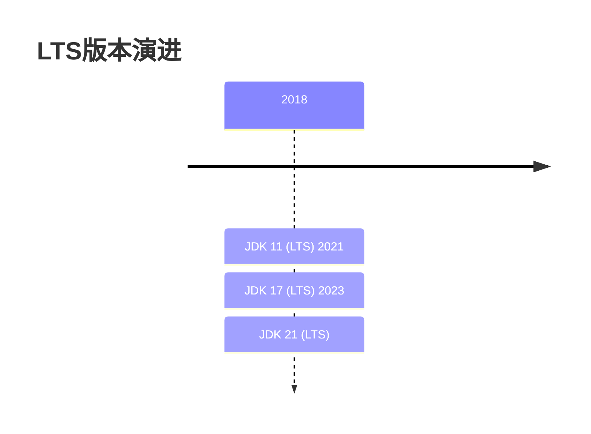

## 1. 核心特性概览  
  
### 1.1 版本演进  
  

  
### 1.2 重要特性矩阵  
  
| 特性类别       | 主要改进                          | JEP编号       |  
|----------------|-----------------------------------|---------------|  
| 语言增强       | 密封类(Sealed Classes)           | JEP 409       |  
| API更新        | 新随机数生成器API                 | JEP 356       |  
| 性能优化       | 向量API(第二次孵化)               | JEP 414       |  
| 内存管理       | 弹性元空间                        | JEP 387       |  
| 安全增强       | 强封装JDK内部API                   | JEP 403       |  
  
## 2. 语言特性增强  
  
### 2.1 密封类(Sealed Classes)  
  
**语法示例**：  
```java  
public sealed class Shape  
    permits Circle, Square, Rectangle { }  
public final class Circle extends Shape {  
    private float radius;}  
  
public non-sealed class Square extends Shape {  
    private float side;}  
```  
  
**设计优势**：  
1. 明确类层次关系  
2. 增强模式匹配安全性  
3. 优化编译器检查  
  
### 2.2 模式匹配(Switch表达式增强)  
  
**改进示例**：  
```java  
String formatted = switch (obj) {  
    case Integer i -> String.format("int %d", i);    case Long l    -> String.format("long %d", l);    case Double d  -> String.format("double %f", d);    case String s  -> String.format("String %s", s);    default        -> obj.toString();};  
```  
  
## 3. API增强  
  
### 3.1 新随机数生成器  
  
**使用示例**：  
```java  
RandomGenerator generator = RandomGenerator.of("L64X128MixRandom");  
int randomInt = generator.nextInt();  
double randomDouble = generator.nextDouble();  
```  
  
**可用算法**：  
- L32X64MixRandom  
- L64X128MixRandom  
- L128X256MixRandom  
  
### 3.2 上下文序列化(JEP 415)  
  
**新API**：  
```java  
var context = new SerializationContext();  
var serializer = context.serializer();  
var deserializer = context.deserializer();  
  
byte[] data = serializer.serialize(obj);  
Object restored = deserializer.deserialize(data);  
```  
  
## 4. JVM改进  
  
### 4.1 弹性元空间(JEP 387)  
  
**配置参数**：  
```bash  
-XX:MetaspaceReclaimPolicy=balanced  
-XX:MetaspaceMaxReclaimDelay=5.0  
```  
  
**优化效果**：  
1. 减少元空间内存占用  
2. 改进垃圾回收效率  
3. 降低内存碎片  
  
### 4.2 向量API(第二次孵化)  
  
**计算示例**：  
```java  
var vectorA = FloatVector.fromArray(FloatVector.SPECIES_256, arrayA, 0);  
var vectorB = FloatVector.fromArray(FloatVector.SPECIES_256, arrayB, 0);  
var result = vectorA.mul(vectorB).add(vectorC);  
```  
  
**性能优势**：  
- 相比标量计算提升3-5倍  
- 支持AVX-512指令集  
  
## 5. 废弃和移除  
  
### 5.1 重要变更  
  
| 类型       | 内容                          | 替代方案              |  
|------------|-------------------------------|-----------------------|  
| 移除       | Applet API                    | 无(现代浏览器已废弃)   |  
| 废弃       | Security Manager              | 模块系统替代           |  
| 移除       | RMI Activation                | 使用现代RPC框架         |  
  
### 5.2 强封装JDK内部API  
  
**影响范围**：  
- sun.misc.Unsafe  
- com.sun.* 内部包  
- JDK实现细节类  
  
**解决方案**：  
```bash  
--add-opens=java.base/java.lang=ALL-UNNAMED  
```  
  
## 6. 迁移指南  
  
### 6.1 兼容性检查  
  
**工具使用**：  
```bash  
jdeprscan --release 17 my-app.jarjdeps --jdk-internals my-app.jar```  
  
### 6.2 分阶段升级  
  
1. **编译测试**：  
   ```bash  
   javac --release 17 -Xlint:deprecation src/*.java   ```  
2. **运行时验证**：  
   ```bash  
   java -XX:+ShowCodeDetailsInExceptionMessages -jar app.jar   ```  
## 7. 生产实践  
  
### 7.1 推荐配置  
  
**基础参数**：  
```bash  
-XX:+UseZGC  
-XX:+EnableJVMCI  
-XX:-UseBiasedLocking  
```  
  
**容器环境**：  
```bash  
-XX:+UseContainerSupport  
-XX:MaxRAMPercentage=75.0  
```  
  
### 7.2 性能监控  
  
**新增JMX指标**：  
- jdk.GarbageCollector  
- jdk.MetaspaceSummary  
- jdk.JavaThreadStatistics  
  
## 8. 未来方向  
  
### 8.1 预览特性  
  
1. **模式匹配增强**：  
   ```java  
   if (obj instanceof Point(int x, int y)) {  
       System.out.println(x + y);   }  
   ```  
2. **虚拟线程**：  
   ```java  
   Thread.startVirtualThread(() -> {  
       // 轻量级线程任务  
   });  
   ```  
### 8.2 项目Loom  
  
**核心改进**：  
- 虚拟线程(轻量级线程)  
- 结构化并发  
- 预计JDK21正式发布