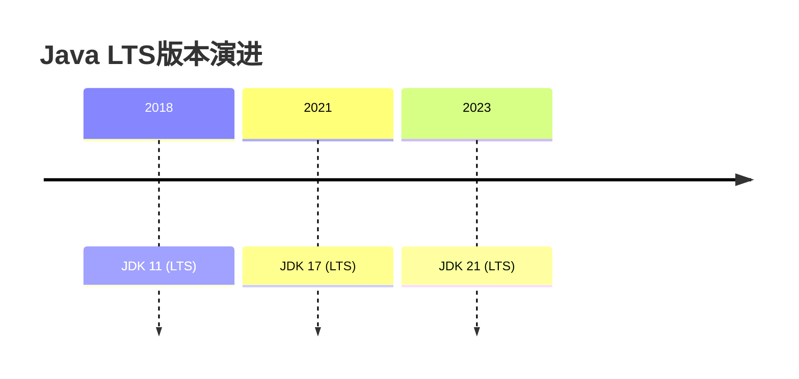

## 1. 核心特性概览

### 1.1 版本演进



### 1.2 重要特性矩阵

<div class="grid cards" markdown>

-   **语言增强**
    - 密封类 (JEP 409)
    - 模式匹配 (JEP 406)
    - 文本块 (JEP 378)

-   **API更新**
    - 新随机数API (JEP 356)
    - 上下文序列化 (JEP 415)
    - 外部函数API (JEP 412)

-   **性能优化**
    - 向量API (JEP 414)
    - 弹性元空间 (JEP 387)
    - ZGC改进 (JEP 376)

</div>

[返回概览](#overview)

## 2. 语言特性增强

### 2.1 密封类 (Sealed Classes)

```java
public sealed interface Shape
    permits Circle, Rectangle, Triangle {
}

public final class Circle implements Shape {
    private final double radius;
    // ...
}
```

**优势**：
- 明确类层次关系
- 增强模式匹配安全性
- 优化编译器检查

### 2.2 模式匹配增强

```java
// instanceof模式匹配
/**
 * 使用instanceof进行类型检查的同时直接声明变量s（类型为String）
 *  这是Java 16+的模式匹配语法，比传统写法if (obj instanceof String)更简洁
 * 后续可以直接使用变量s而无需显式类型转换
 */
if (obj instanceof String s && s.length() > 5) {
    System.out.println(s.toUpperCase());
}

// 使用 JDK 17 的增强 switch 表达式进行模式匹配  
// 根据 obj 的类型返回不同的字符串  
return switch (obj) {  
    // 如果 obj 是 Integer 类型，绑定到变量 i，并返回格式化字符串  
    case Integer i -> "int: " + i;  
    // 如果 obj 是 String 类型，绑定到变量 s，并返回格式化字符串  
    case String s -> "string: " + s;  
    // 如果 obj 不是上述类型，则返回默认字符串  
    default -> "other";  
};  

```

## 3. API更新

### 3.1 新随机数API

```java
RandomGenerator generator = RandomGenerator.of("L64X128MixRandom");
int randomInt = generator.nextInt(1, 100);
```

**可用算法**：
- L32X64MixRandom
- L64X128MixRandom
- L128X256MixRandom

<details>
<summary>点击查看性能对比</summary>

| 算法 | 吞吐量(ops/ms) | 内存占用 |
|------|--------------|--------|
| L64X128MixRandom | 1,250,000 | 256B |
| LegacyRandom | 850,000 | 1KB |
</details>

## 4. 生产实践

### 4.1 推荐配置

```bash
# JVM基础参数
-XX:+UseZGC
-XX:+EnableJVMCI
-XX:MaxRAMPercentage=75.0

# 容器环境
-XX:+UseContainerSupport
-XX:ActiveProcessorCount=2
```

### 4.2 迁移检查

```bash
# 检查废弃API
jdeprscan --release 17 my-app.jar

# 分析依赖
jdeps --jdk-internals my-app.jar
```

## 5. 未来方向

### 5.1 预览特性

```java
// 记录模式 (JDK 21)
if (obj instanceof Point(int x, int y)) {
    System.out.println(x + y);
}

// 虚拟线程
Thread.startVirtualThread(() -> {
    // 轻量级并发任务
});
```
