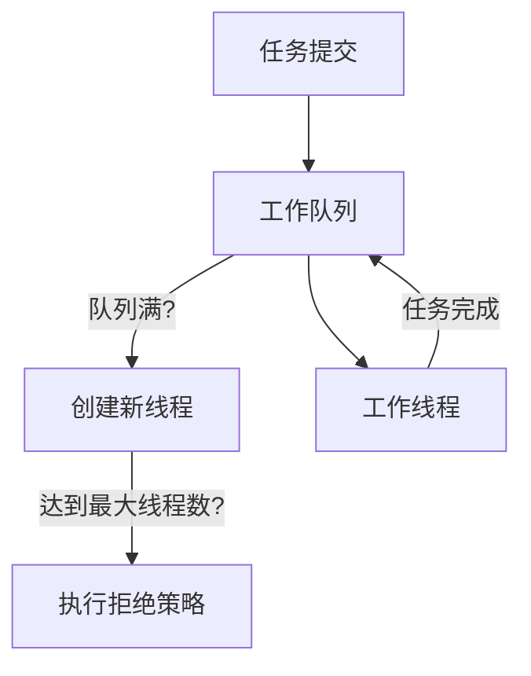
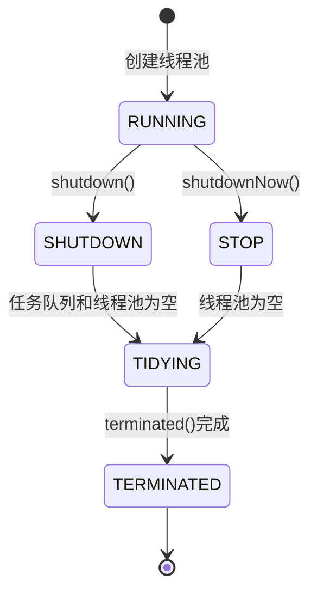
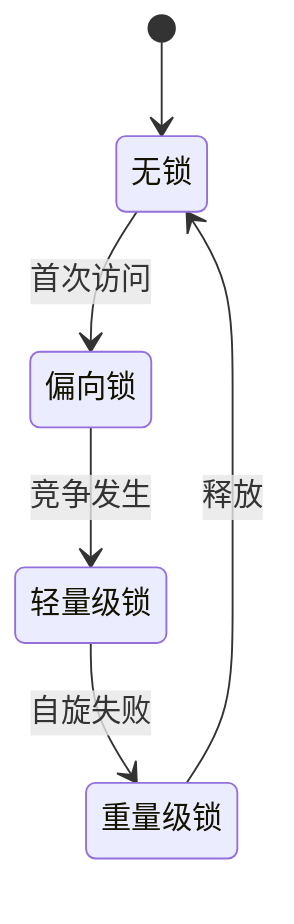
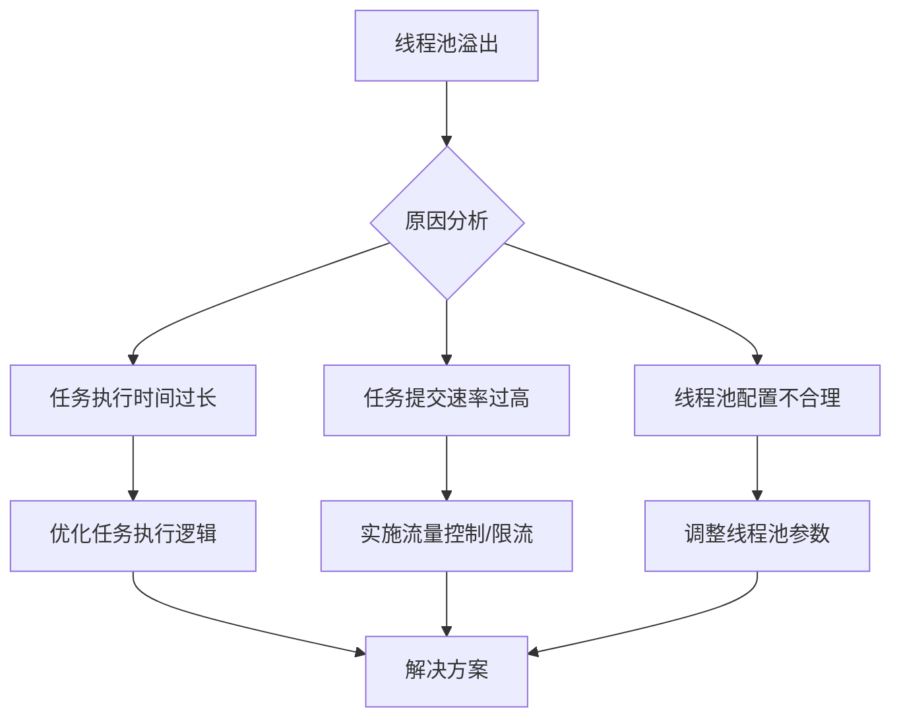

## 1. 核心模型

### 1.1 线程池架构



### 1.2 核心参数配置

<div class="grid cards" markdown>

-   **基本参数**
    - corePoolSize: CPU密集型N+1
    - maximumPoolSize: 核心线程2-3倍
    - keepAliveTime: 30-60秒

-   **高级配置**
    - workQueue: ArrayBlockingQueue
    - threadFactory: 自定义命名
    - handler: 拒绝策略

</div>

### 1.3 线程池生命周期



线程池状态说明：
- **RUNNING**: 接受新任务并处理队列中的任务
- **SHUTDOWN**: 不接受新任务，但处理队列中的任务
- **STOP**: 不接受新任务，不处理队列中的任务，中断正在进行的任务
- **TIDYING**: 所有任务已终止，线程数为0，即将调用terminated()
- **TERMINATED**: terminated()执行完成

## 2. 锁机制详解

### 2.1 锁状态转换



### 2.2 JVM参数优化

```bash
# 偏向锁配置
-XX:+UseBiasedLocking  
-XX:BiasedLockingStartupDelay=0

# 自旋优化  
-XX:PreBlockSpin=10
```

### 2.3 锁实现原理

| 锁类型 | 实现机制 | 适用场景 |
|-------|---------|---------|
| 偏向锁 | 线程ID存储在对象头 | 单线程访问 |
| 轻量级锁 | CAS操作替换对象头 | 线程交替执行 |
| 重量级锁 | 操作系统互斥量 | 高并发竞争 |

## 3. 实战应用

### 3.1 电商支付系统

```java
// 线程池配置
ThreadPoolExecutor executor = new ThreadPoolExecutor(
    8, 32, 60, TimeUnit.SECONDS,
    new ArrayBlockingQueue<>(1000),
    new NamedThreadFactory("payment"),
    new PaymentRejectHandler()
);

// 库存锁实现
private final Lock stockLock = new ReentrantLock(true);

public void processPayment(Order order) {
    stockLock.lock();
    try {
        // 扣减库存逻辑
    } finally {
        stockLock.unlock();
    }
}
```

<details>
<summary>点击查看监控指标</summary>

| 指标 | 监控方式 | 阈值 |
|------|---------|------|
| 活跃线程 | getActiveCount() | ≤最大线程数 |
| 队列堆积 | getQueue().size() | ≤队列容量 |
</details>

### 3.2 日志处理系统

```java
// 异步日志处理线程池
ThreadPoolExecutor logExecutor = new ThreadPoolExecutor(
    2, 5, 60, TimeUnit.SECONDS,
    new LinkedBlockingQueue<>(10000),
    new ThreadFactoryBuilder().setNameFormat("log-processor-%d").build(),
    new ThreadPoolExecutor.DiscardOldestPolicy()
);

// 使用CountDownLatch等待批处理完成
public void processBatchLogs(List<LogEntry> logs) {
    final CountDownLatch latch = new CountDownLatch(logs.size());
    
    for (LogEntry log : logs) {
        logExecutor.execute(() -> {
            try {
                processLog(log);
            } finally {
                latch.countDown();
            }
        });
    }
    
    try {
        latch.await(30, TimeUnit.SECONDS);
    } catch (InterruptedException e) {
        Thread.currentThread().interrupt();
    }
}
```

## 4. 性能调优

### 4.1 线程池优化策略

1. **IO密集型应用**：
   ```java
   // 增大线程数
   int poolSize = Runtime.getRuntime().availableProcessors() * 3;
   ```

2. **CPU密集型应用**：
   ```java
   // 使用无界队列
   new LinkedBlockingQueue<>()
   ```

### 4.2 锁竞争解决方案

```java
// 读写锁分离
private final ReadWriteLock rwLock = new ReentrantReadWriteLock();

public void updateData() {
    rwLock.writeLock().lock();
    try {
        // 更新操作
    } finally {
        rwLock.writeLock().unlock();
    }
}
```

### 4.3 线程池监控与动态调整

```java
public class MonitorableThreadPool extends ThreadPoolExecutor {
    private final AtomicLong totalTasks = new AtomicLong(0);
    private final AtomicLong rejectedTasks = new AtomicLong(0);
    private final ConcurrentHashMap<String, Long> taskExecutionTimes = new ConcurrentHashMap<>();
    
    @Override
    protected void beforeExecute(Thread t, Runnable r) {
        super.beforeExecute(t, r);
        taskExecutionTimes.put(r.toString(), System.nanoTime());
    }
    
    @Override
    protected void afterExecute(Runnable r, Throwable t) {
        long startTime = taskExecutionTimes.remove(r.toString());
        long executionTime = System.nanoTime() - startTime;
        // 记录执行时间统计
        
        super.afterExecute(r, t);
    }
    
    // 动态调整核心线程数
    public void adjustCorePoolSize(int newSize) {
        if (newSize > getCorePoolSize()) {
            // 逐步增加核心线程数
            for (int i = getCorePoolSize(); i < newSize; i++) {
                setCorePoolSize(i + 1);
                // 可以添加延迟，观察系统响应
                try {
                    Thread.sleep(1000);
                } catch (InterruptedException e) {
                    Thread.currentThread().interrupt();
                    break;
                }
            }
        } else {
            // 直接设置较小的值
            setCorePoolSize(newSize);
        }
    }
}
```

## 5. 高级特性

### 5.1 锁性能对比

<div class="grid cards" markdown>

-   **synchronized**
    - 简单同步
    - 中等吞吐
    - JVM级优化

-   **ReentrantLock**
    - 条件变量
    - 高吞吐
    - 可中断

-   **StampedLock**
    - 读多写少
    - 极高吞吐
    - 乐观读

</div>

### 5.2 Fork/Join框架

```java
public class SumTask extends RecursiveTask<Long> {
    private static final int THRESHOLD = 10000;
    private final long[] array;
    private final int start;
    private final int end;
    
    public SumTask(long[] array, int start, int end) {
        this.array = array;
        this.start = start;
        this.end = end;
    }
    
    @Override
    protected Long compute() {
        if (end - start <= THRESHOLD) {
            // 小任务直接计算
            long sum = 0;
            for (int i = start; i < end; i++) {
                sum += array[i];
            }
            return sum;
        } else {
            // 大任务拆分
            int middle = (start + end) / 2;
            SumTask leftTask = new SumTask(array, start, middle);
            SumTask rightTask = new SumTask(array, middle, end);
            
            leftTask.fork(); // 异步执行左半部分
            long rightResult = rightTask.compute(); // 同步执行右半部分
            long leftResult = leftTask.join(); // 等待左半部分结果
            
            return leftResult + rightResult;
        }
    }
}

// 使用Fork/Join池
ForkJoinPool pool = new ForkJoinPool();
long[] array = new long[1000000];
// 初始化数组...
long result = pool.invoke(new SumTask(array, 0, array.length));
```

### 5.3 CompletableFuture

```java
// 异步任务组合
CompletableFuture<String> future1 = CompletableFuture.supplyAsync(() -> {
    // 模拟远程调用
    try {
        Thread.sleep(1000);
    } catch (InterruptedException e) {
        Thread.currentThread().interrupt();
    }
    return "Result from API 1";
});

CompletableFuture<String> future2 = CompletableFuture.supplyAsync(() -> {
    // 另一个远程调用
    try {
        Thread.sleep(800);
    } catch (InterruptedException e) {
        Thread.currentThread().interrupt();
    }
    return "Result from API 2";
});

// 组合两个异步结果
CompletableFuture<String> combined = future1.thenCombine(future2, 
    (result1, result2) -> result1 + " + " + result2);

// 添加超时处理
try {
    String result = combined.get(2, TimeUnit.SECONDS);
    System.out.println(result);
} catch (InterruptedException | ExecutionException | TimeoutException e) {
    System.err.println("Error or timeout: " + e.getMessage());
}
```

## 6. 常见问题与解决方案

### 6.1 线程池溢出



**解决方案**：

1. **任务分类与隔离**：
   ```java
   // 为不同类型任务创建专用线程池
   ThreadPoolExecutor ioPool = new ThreadPoolExecutor(/* IO密集型配置 */);
   ThreadPoolExecutor computePool = new ThreadPoolExecutor(/* CPU密集型配置 */);
   ```

2. **任务优先级**：
   ```java
   // 使用优先级队列
   PriorityBlockingQueue<Runnable> priorityQueue = new PriorityBlockingQueue<>();
   ThreadPoolExecutor priorityExecutor = new ThreadPoolExecutor(
       corePoolSize, maxPoolSize, keepAliveTime, TimeUnit.SECONDS,
       priorityQueue
   );
   ```

3. **熔断机制**：
   ```java
   // 使用Semaphore限制并发
   private final Semaphore semaphore = new Semaphore(100);
   
   public void executeTask(Runnable task) {
       if (!semaphore.tryAcquire()) {
           // 触发熔断，拒绝任务
           throw new RejectedExecutionException("Circuit breaker open");
       }
       
       try {
           executor.execute(() -> {
               try {
                   task.run();
               } finally {
                   semaphore.release();
               }
           });
       } catch (Exception e) {
           semaphore.release();
           throw e;
       }
   }
   ```

### 6.2 死锁问题

**检测工具**：

```java
// 使用ThreadMXBean检测死锁
ThreadMXBean threadMXBean = ManagementFactory.getThreadMXBean();
long[] deadlockedThreads = threadMXBean.findDeadlockedThreads();

if (deadlockedThreads != null) {
    ThreadInfo[] threadInfos = threadMXBean.getThreadInfo(deadlockedThreads, true, true);
    System.err.println("检测到死锁:");
    for (ThreadInfo info : threadInfos) {
        System.err.println(info);
    }
}
```

**预防措施**：

1. **锁顺序一致性**：确保多个锁总是以相同顺序获取
   ```java
   // 按账户ID排序，确保锁获取顺序一致
   if (from.getId() < to.getId()) {
       synchronized (from) {
           synchronized (to) {
               // 转账逻辑
           }
       }
   } else {
       synchronized (to) {
           synchronized (from) {
               // 转账逻辑
           }
       }
   }
   ```

2. **超时锁**：使用带超时的锁避免无限等待
   ```java
   boolean locked = lock.tryLock(1, TimeUnit.SECONDS);
   if (locked) {
       try {
           // 执行需要锁保护的代码
       } finally {
           lock.unlock();
       }
   } else {
       // 获取锁失败的处理
   }
   ```

## 7. 最佳实践

### 7.1 线程池配置指南

| 应用类型 | corePoolSize | maximumPoolSize | 队列类型 | 队列容量 |
|---------|-------------|-----------------|---------|---------|
| CPU密集型 | N+1 | 2N | LinkedBlockingQueue | 无界或较大 |
| IO密集型 | 2N | 4N | ArrayBlockingQueue | 500-2000 |
| 混合型 | 2N | 3N | LinkedBlockingQueue | 1000-5000 |
| 定时任务 | N | 2N | DelayedWorkQueue | 默认 |

*N为CPU核心数*

### 7.2 线程池使用规范

1. **避免使用Executors工厂方法**：
   - 使用ThreadPoolExecutor自定义参数
   - 防止资源耗尽风险

2. **合理命名线程**：
   ```java
   ThreadFactory namedFactory = new ThreadFactoryBuilder()
       .setNameFormat("worker-%d")
       .setDaemon(false)
       .setPriority(Thread.NORM_PRIORITY)
       .setUncaughtExceptionHandler((t, e) -> log.error("线程异常", e))
       .build();
   ```

3. **优雅关闭线程池**：
   ```java
   void shutdownPoolGracefully(ExecutorService pool) {
       pool.shutdown();
       try {
           if (!pool.awaitTermination(60, TimeUnit.SECONDS)) {
               pool.shutdownNow();
               if (!pool.awaitTermination(60, TimeUnit.SECONDS)) {
                   log.error("线程池未能终止");
               }
           }
       } catch (InterruptedException ie) {
           pool.shutdownNow();
           Thread.currentThread().interrupt();
       }
   }
   ```

### 7.3 锁使用最佳实践

1. **最小化锁范围**：
   ```java
   // 不推荐
   synchronized void processData() {
       // 准备数据 - 不需要同步
       // 更新共享状态 - 需要同步
   }
   
   // 推荐
   void processData() {
       // 准备数据 - 不需要同步
       
       synchronized (this) {
           // 更新共享状态 - 需要同步
       }
   }
   ```

2. **避免在锁内执行耗时操作**：
   ```java
   // 不推荐
   synchronized void process() {
       // 网络请求或IO操作
   }
   
   // 推荐
   void process() {
       Data data;
       synchronized (this) {
           data = prepareData();
       }
       // 锁外执行耗时操作
       sendDataOverNetwork(data);
   }
   ```

