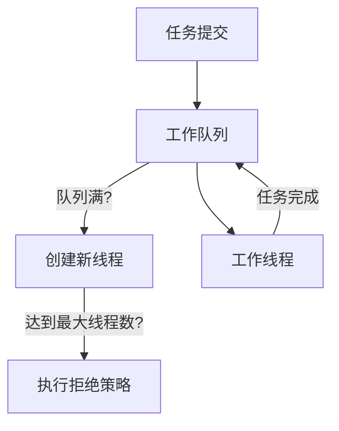
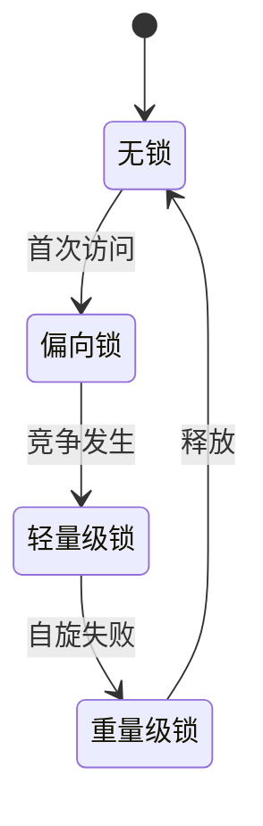

## 1. 核心模型

### 1.1 线程池架构



### 1.2 核心参数配置

<div class="grid cards" markdown>

-   **基本参数**
    - corePoolSize: CPU密集型N+1
    - maximumPoolSize: 核心线程2-3倍
    - keepAliveTime: 30-60秒

-   **高级配置**
    - workQueue: ArrayBlockingQueue
    - threadFactory: 自定义命名
    - handler: 拒绝策略

</div>

## 2. 锁机制详解

### 2.1 锁状态转换



### 2.2 JVM参数优化

```bash
# 偏向锁配置
-XX:+UseBiasedLocking  
-XX:BiasedLockingStartupDelay=0

# 自旋优化  
-XX:PreBlockSpin=10
```

## 3. 实战应用

### 3.1 电商支付系统

```java
// 线程池配置
ThreadPoolExecutor executor = new ThreadPoolExecutor(
    8, 32, 60, TimeUnit.SECONDS,
    new ArrayBlockingQueue<>(1000),
    new NamedThreadFactory("payment"),
    new PaymentRejectHandler()
);

// 库存锁实现
private final Lock stockLock = new ReentrantLock(true);

public void processPayment(Order order) {
    stockLock.lock();
    try {
        // 扣减库存逻辑
    } finally {
        stockLock.unlock();
    }
}
```

<details>
<summary>点击查看监控指标</summary>

| 指标 | 监控方式 | 阈值 |
|------|---------|------|
| 活跃线程 | getActiveCount() | ≤最大线程数 |
| 队列堆积 | getQueue().size() | ≤队列容量 |
</details>

## 4. 性能调优

### 4.1 线程池优化策略

1. **IO密集型应用**：
   ```java
   // 增大线程数
   int poolSize = Runtime.getRuntime().availableProcessors() * 3;
   ```

2. **CPU密集型应用**：
   ```java
   // 使用无界队列
   new LinkedBlockingQueue<>()
   ```

### 4.2 锁竞争解决方案

```java
// 读写锁分离
private final ReadWriteLock rwLock = new ReentrantReadWriteLock();

public void updateData() {
    rwLock.writeLock().lock();
    try {
        // 更新操作
    } finally {
        rwLock.writeLock().unlock();
    }
}
```

## 5. 高级特性

### 5.1 锁性能对比

<div class="grid cards" markdown>

-   **synchronized**
    - 简单同步
    - 中等吞吐

-   **ReentrantLock**
    - 条件变量
    - 高吞吐

-   **StampedLock**
    - 读多写少
    - 极高吞吐

</div>

