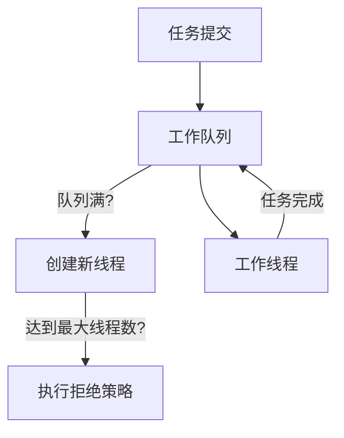
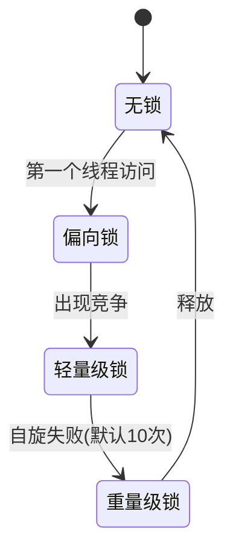

## 1. 线程池核心模型

### 1.1 线程池架构



### 1.2 核心参数说明

| 参数名                      | 作用       | 推荐设置原则                   |  
|--------------------------|----------|--------------------------|  
| corePoolSize             | 核心线程数    | CPU密集型：N+1<br>IO密集型：2N+1 |  
| maximumPoolSize          | 最大线程数    | 核心线程数的2-3倍               |  
| keepAliveTime            | 空闲线程存活时间 | 30-60秒                   |  
| workQueue                | 任务队列     | 根据业务特点选择                 |  
| threadFactory            | 线程创建工厂   | 自定义命名和优先级                |  
| rejectedExecutionHandler | 拒绝策略     | 根据业务容忍度选择                |  

## 2. 锁升级机制

### 2.1 锁状态转换



### 2.2 关键参数

```bash  
-XX:+UseBiasedLocking          # 启用偏向锁(JDK15后默认禁用)  
-XX:BiasedLockingStartupDelay=0 # 偏向锁启动延迟(ms)  
-XX:PreBlockSpin=10            # 自旋次数阈值  
```  

## 3. 项目应用场景

### 3.1 电商系统案例

**场景**：订单支付异步处理

```java  
// 支付结果处理线程池  
ThreadPoolExecutor paymentExecutor = new ThreadPoolExecutor(
        8,  // 8核CPU  
        32, // 峰值3倍  
        60, TimeUnit.SECONDS, new ArrayBlockingQueue<>(1000), new NamedThreadFactory("payment-process"), new PaymentRejectPolicy() // 记录日志并降级处理  
);  
```  

**锁应用**：

```java  
// 库存扣减使用ReentrantLock  
private final Lock stockLock = new ReentrantLock(true); // 公平锁  

public boolean reduceStock(Long itemId, int num) {
    stockLock.lock();
    try {        // 扣减库存逻辑  
    } finally {
        stockLock.unlock();
    }
}  
```  

### 3.2 金融交易系统

**场景**：批量交易处理

```java  
// 交易处理线程池（无界队列）  
ExecutorService tradeExecutor = Executors.newFixedThreadPool(
        Runtime.getRuntime().availableProcessors() * 2, new TradeThreadFactory());

// 使用StampedLock优化读多写少场景  
private final StampedLock sl = new StampedLock();

public double readAccountBalance(long accountId) {
    long stamp = sl.tryOptimisticRead();    // 读取操作...  
    if (!sl.validate(stamp)) {
        stamp = sl.readLock();
        try {            // 重新读取  
        } finally {
            sl.unlockRead(stamp);
        }
    }
    return balance;
}  
```  

## 4. 性能调优

### 4.1 线程池监控指标

| 指标名称   | 监控方式                       | 健康阈值              |  
|--------|----------------------------|-------------------|  
| 活跃线程数  | getActiveCount()           | ≤ maximumPoolSize |  
| 队列堆积数  | getQueue().size()          | ≤ queueCapacity   |  
| 最大执行时间 | 自定义AOP监控                   | P99 < 1s          |  
| 拒绝任务数  | 扩展RejectedExecutionHandler | 报警阈值 > 0          |  

### 4.2 锁竞争优化

1. **减小锁粒度**：
   ```java  
   // 粗粒度锁  
   synchronized(this) { /* 整个方法 */ }   // 细粒度锁  
   synchronized(userId.intern()) { /* 按用户ID锁定 */ }  
   ```  
2. **锁分离技术**：
   ```java  
   // 读写锁分离  
   private final ReadWriteLock rwLock = new ReentrantReadWriteLock();  
   ```  

## 5. 常见问题排查

### 5.1 线程池问题

**现象**：任务处理延迟高

- 检查队列堆积：`executor.getQueue().size()`
- 分析线程栈：`jstack <pid>`
- 解决方案：调整队列容量或最大线程数

### 5.2 锁竞争问题

**诊断命令**：

```bash  
jcmd <pid> Thread.print -l# 查找BLOCKED状态线程  
```  

**优化方案**：

1. 使用`jstack`分析锁持有情况
2. 考虑改用`ConcurrentHashMap`等并发集合
3. 评估是否可用无锁编程

## 6. 最佳实践

### 6.1 线程池使用原则

1. **明确任务性质**：
    - CPU密集型：小线程池+无界队列
    - IO密集型：大线程池+有界队列

2. **优雅关闭**：
   ```java  
   executor.shutdown();  
   if (!executor.awaitTermination(60, TimeUnit.SECONDS)) {       executor.shutdownNow();   }  
   ```  

### 6.2 锁使用准则

1. **锁顺序**：
   ```java  
   // 定义全局锁顺序  
   private static final Object LOCK_ORDER_1 = new Object();  
   private static final Object LOCK_ORDER_2 = new Object();   // 始终按相同顺序获取锁  
   synchronized(LOCK_ORDER_1) {  
       synchronized(LOCK_ORDER_2) {           // ...       }   }  
   ```  
2. **锁超时**：
   ```java  
   if (lock.tryLock(100, TimeUnit.MILLISECONDS)) {  
       try { /* ... */ }       finally { lock.unlock(); }  
   }  
   ```  

## 7. 高级特性

### 7.1 ForkJoinPool

**适用场景**：可拆分计算任务

```java  
public class FibonacciTask extends RecursiveTask<Long> {
    protected Long compute() {        // 分治算法实现  
    }
}

ForkJoinPool pool = new ForkJoinPool(4);  
pool.

invoke(new FibonacciTask(30));  
```  

### 7.2 锁性能对比

| 锁类型           | 适用场景 | 吞吐量 |  
|---------------|------|-----|  
| synchronized  | 简单同步 | 中等  |  
| ReentrantLock | 复杂条件 | 高   |  
| StampedLock   | 读多写少 | 极高  |  
| ReadWriteLock | 读写分离 | 高   |