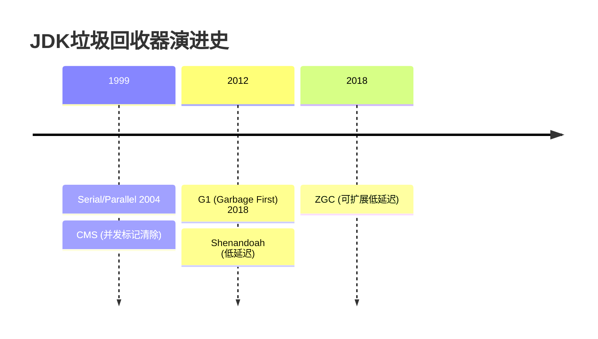

> JDK 垃圾回收器深度解析：G1、CMS、ZGC与Shenandoah  
  
## 1. 核心原理与设计目标  
  
### 1.1 回收器演进路线  
  

  
### 1.2 设计目标对比  
  
| 回收器      | 主要目标                     | 适用场景                |  
|------------|----------------------------|-------------------------|  
| CMS        | 降低老年代停顿时间           | 中小堆内存，响应敏感     |  
| G1         | 平衡吞吐量和延迟             | 大堆内存(4G+)，通用场景  |  
| ZGC        | 亚毫秒级停顿                 | 超大堆内存(8G+)，低延迟  |  
| Shenandoah | 低延迟且与堆大小无关         | 需要稳定低停顿的云原生   |  
  
## 2. 算法机制详解  
  
### 2.1 G1回收器  
  
**内存布局**：  
```mermaid  
graph TD  
    H[Heap] --> R[Region]    R -->|1-32MB| E[Eden]    R --> S[Survivor]    R --> O[Old]    R --> H[Humongous]  
```  
  
**工作流程**：  
1. 初始标记(STW)  
2. 并发标记  
3. 最终标记(STW)  
4. 筛选回收(并行)  
  
**关键参数**：  
```bash  
-XX:+UseG1GC  
-XX:MaxGCPauseMillis=200  
-XX:G1NewSizePercent=5  
-XX:G1HeapRegionSize=4M  
```  
  
### 2.2 ZGC回收器  
  
**颜色指针技术**：  
```java  
// 指针结构  
| 63-46 | 45-44 | 43-42 | 41-0 |  
|-------|-------|-------|------|  
| 未使用 | Mark1 | Mark0 | 地址  |  
```  
  
**阶段划分**：  
1. 并发标记  
2. 并发预备重分配  
3. 并发重分配  
4. 并发重映射  
  
**配置示例**：  
```bash  
-XX:+UseZGC  
-XX:ConcGCThreads=4  
-XX:ZAllocationSpikeTolerance=3  
```  
  
## 3. 性能调优指南  
  
### 3.1 通用优化原则  
  
1. **堆大小设置**：  
   ```bash  
   -Xms4g -Xmx4g  # 避免动态扩容  
   ```  
2. **线程数配置**：  
   ```bash  
   -XX:ParallelGCThreads=CPU核数的1/4  
   ```  
3. **监控参数**：  
   ```bash  
   -Xlog:gc*=info:file=gc.log:time,uptime,level,tags  
   ```  
### 3.2 场景化配置  
  
**高吞吐场景**：  
```bash  
-XX:+UseParallelGC  
-XX:MaxGCPauseMillis=500  
-XX:GCTimeRatio=19  
```  
  
**低延迟场景**：  
```bash  
-XX:+UseZGC  
-XX:SoftMaxHeapSize=8G  
-XX:ZCollectionInterval=30  
```  
  
## 4. 生产实践  
  
### 4.1 监控指标  
  
**关键指标**：  
- GC频率  
- 停顿时间(P99/P999)  
- 内存回收效率  
- 并发阶段CPU占用  
  
**JVM参数**：  
```bash  
-XX:+PrintGCDetails  
-XX:+PrintGCDateStamps  
-XX:+PrintAdaptiveSizePolicy  
```  
  
### 4.2 故障模式  
  
| 现象                | 可能原因               | 解决方案               |  
|---------------------|-----------------------|-----------------------|  
| 长时间Full GC        | 内存泄漏/分配速率过高  | 分析堆转储/调整新生代  |  
| 并发模式失败         | 回收速度跟不上分配速度  | 增加并发线程数         |  
| 晋升失败             | 老年代空间不足         | 调整晋升阈值/增大堆    |  
  
## 5. 高级特性  
  
### 5.1 ZGC压缩指针  
  
```java  
// 启用压缩指针(默认)  
-XX:+UseCompressedOops  // 最大堆大小影响  
-XX:ObjectAlignmentInBytes=8  
```  
  
### 5.2 Shenandoah并发回收  
  
**工作阶段**：  
1. 初始标记(STW)  
2. 并发标记  
3. 最终标记(STW)  
4. 并发压缩  
  
**独特优势**：  
- 并发整理内存碎片  
- 停顿时间与堆大小无关  
- 增量回收机制  
  
## 6. 最佳实践  
  
### 6.1 参数推荐  
  
**G1配置**：  
```bash  
-XX:+UseG1GC  
-XX:MaxGCPauseMillis=200  
-XX:G1ReservePercent=10  
-XX:InitiatingHeapOccupancyPercent=35  
```  
  
**ZGC配置**：  
```bash  
-XX:+UseZGC -XX:ZProactive=true  
-XX:ZUncommitDelay=300  
```  
  
### 6.2 升级建议  
  
1. **JDK8用户**：  
   - 升级到JDK11+使用ZGC  
   - 或使用Shenandoah backport版本  
  
2. **JDK11+用户**：  
   - 优先考虑ZGC  
   - 超大堆(16G+)验证Shenandoah  
  
## 7. 工具链  
  
### 7.1 分析工具  
  
1. **命令行工具**：  
   ```bash  
   jstat -gcutil <pid> 1s   jcmd <pid> GC.heap_info   ```  
2. **图形化工具**：  
   - VisualVM  
   - GCViewer  
   - JProfiler  
  
### 7.2 日志分析  
  
**示例日志**：  
```  
[0.123s][info][gc] GC(1) Pause Young (G1 Evacuation) 256M->128M (1024M) 12.345ms  
```  
  
**关键字段**：  
- 停顿类型  
- 内存变化  
- 停顿时间  
- 发生时间戳  
  
## 8. 未来演进  
  
### 8.1 Project Lilliput  
  
**目标**：  
- 减少对象头大小  
- 兼容现有回收器  
- 预计JDK21+引入  
  
### 8.2 Generational ZGC  
  
**改进点**：  
- 分代收集  
- 减少内存占用  
- 提升吞吐量  
- JDK21+预览