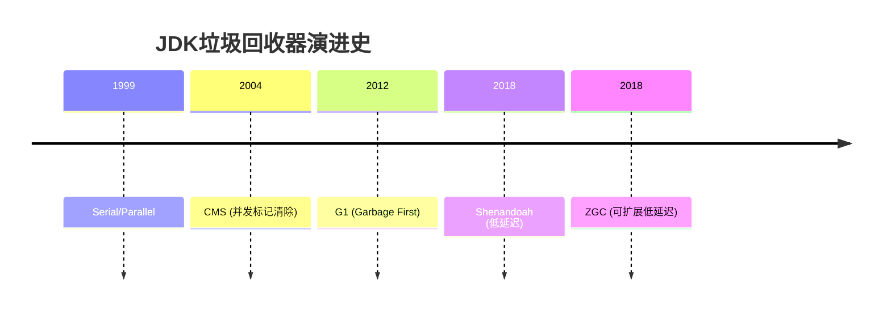

## 1. 核心原理与设计目标 {#overview}

### 1.1 回收器演进路线



### 1.2 设计目标对比


#### 回收器类型
- CMS
- G1
- ZGC
- Shenandoah

<--->

#### 核心优势
- 低老年代停顿
- 吞吐量与延迟平衡
- 亚毫秒级停顿
- 堆大小无关延迟


返回概览

## 2. 算法机制详解 {#algorithms}

### 2.1 G1回收器


graph TD
    H[Heap] --> R[Region]
    R -->|1-32MB| E[Eden]
    R --> S[Survivor]
    R --> O[Old]
    R --> H[Humongous]



```bash
-XX:+UseG1GC
-XX:MaxGCPauseMillis=200
-XX:G1NewSizePercent=5
-XX:G1HeapRegionSize=4M
```


### 2.2 ZGC回收器

```java
// 颜色指针结构
| 63-46 | 45-44 | 43-42 | 41-0 |
|-------|-------|-------|------|
| 未使用 | Mark1 | Mark0 | 地址  |
```



```bash
-XX:+UseZGC
-XX:ConcGCThreads=4
```



```bash
-XX:ZAllocationSpikeTolerance=3
-XX:ZProactive=true
```



## 3. 性能调优指南 {#tuning}

### 3.1 通用优化原则

1. **堆大小设置**：
   ```bash
   -Xms4g -Xmx4g  # 避免动态扩容
   ```
2. **线程数配置**：
   ```bash
   -XX:ParallelGCThreads=CPU核数的1/4
   ```

### 3.2 场景化配置

| 场景类型 | 推荐回收器 | 关键参数 |
|---------|----------|---------|
| 高吞吐 | ParallelGC | `-XX:GCTimeRatio=19` |
| 低延迟 | ZGC | `-XX:SoftMaxHeapSize=8G` |

## 4. 生产实践 {#production}

### 4.1 监控指标


pie
    title 关键监控指标
    "GC频率" : 35
    "停顿时间" : 30
    "内存效率" : 20
    "CPU占用" : 15


### 4.2 故障模式


```bash
# 查看GC统计
jstat -gcutil <pid> 1s

# 分析堆内存
jcmd <pid> GC.heap_info
```


## 5. 高级特性 {#advanced}

### 5.1 ZGC压缩指针

```bash
-XX:+UseCompressedOops
-XX:ObjectAlignmentInBytes=8
```

### 5.2 Shenandoah并发回收


#### 优势
- 并发整理碎片
- 稳定低停顿
- 增量回收

<--->

#### 限制
- JDK11+支持
- 内存开销略高


## 6. 最佳实践 {#best-practice}

### 6.1 参数推荐



```bash
-XX:+UseG1GC
-XX:MaxGCPauseMillis=200
```



```bash
-XX:+UseZGC
-XX:ZUncommitDelay=300
```



## 7. 工具链 {#tools}

### 7.1 分析工具

1. **命令行工具**：
   ```bash
   jcmd <pid> VM.flags
   ```
2. **图形化工具**：
   - VisualVM
   - JProfiler

## 8. 未来演进 {#future}

### 8.1 Project Lilliput

- 减少对象头大小
- JDK21+引入

返回顶部
