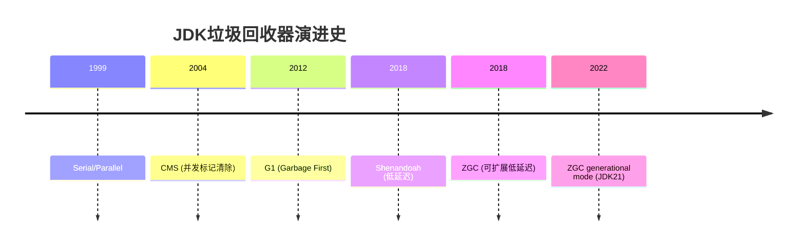
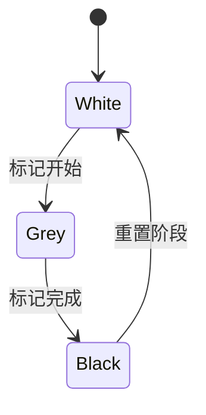
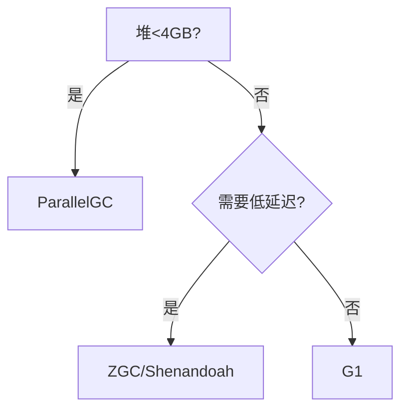

## 1. 核心原理与设计目标 {#core-principles}

### 1.1 回收器演进路线



### 1.2 设计哲学对比

<div class="grid cards" markdown>

-   **CMS特点**
    - 并发标记清除
    - 老年代优先
    - 内存碎片问题
    - JDK14移除

-   **G1特点**
    - 区域化收集
    - 可预测停顿
    - 吞吐量优先
    - JDK9默认

-   **ZGC特点**
    - 亚毫秒停顿
    - 染色指针
    - TB级堆支持
    - 并发压缩

</div>

## 2. 算法机制详解 {#algorithms}

### 2.1 G1回收器原理


**关键机制**：
- 增量并行回收
- Remembered Set维护
- 停顿预测模型

### 2.2 ZGC核心技术

**三色标记改进**：


**配置示例**：
```bash
-XX:+UseZGC 
-XX:ZAllocationSpikeTolerance=5
-XX:ZProactive=true
```

## 3. 生产调优 {#production-tuning}

### 3.1 参数矩阵

| 回收器 | 关键参数 | 推荐值 | 作用 |
|-------|---------|-------|-----|
| G1 | MaxGCPauseMillis | 200ms | 目标停顿时间 |
| ZGC | ZAllocationSpikeTolerance | 2-5 | 分配尖峰容忍度 |
| Shenandoah | ShenandoahGarbageThreshold | 75 | 触发回收阈值 |

### 3.2 监控指标

**关键Metrics**：
- GC停顿时间
- 分配速率
- 老年代占用
- 并发阶段耗时

**JVM参数**：
```bash
-Xlog:gc*=debug:file=gc.log
-XX:+PrintGCDetails
```

## 4. 场景实践 {#scenarios}

### 4.1 高吞吐场景

**G1配置**：
```bash
-XX:G1NewSizePercent=30 
-XX:G1MaxNewSizePercent=60
-XX:G1HeapWastePercent=10
```

### 4.2 低延迟场景

**ZGC优化**：
```bash
-XX:ZCollectionInterval=120
-XX:ZUncommitDelay=300
-XX:SoftMaxHeapSize=80%
```

## 5. 深度对比 {#deep-comparison}

### 5.1 内存模型差异

| 特性 | G1 | ZGC | Shenandoah |
|-----|----|-----|-----------|
| 分代 | ✓ | JDK21+ | ✓ |
| 压缩 | 部分 | 并发 | 并发 |
| 最大堆 | 4TB | 16TB | 4TB |
| 指针大小 | 64位 | 46位 | 64位 |

### 5.2 选择决策树



## 6. 常见问题 {#faq}

### 6.1 G1调优技巧

**避免Full GC**：
```bash
-XX:InitiatingHeapOccupancyPercent=45
-XX:G1ReservePercent=15
```

### 6.2 ZGC内存占用

**监控建议**：
```bash
jcmd <pid> GC.metaspace
jstat -gcutil <pid>
```
