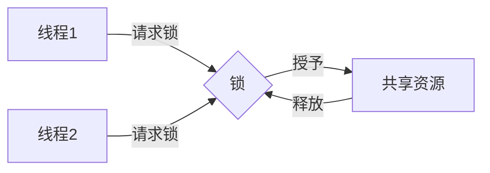
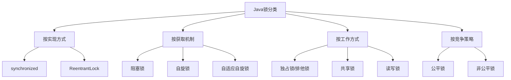
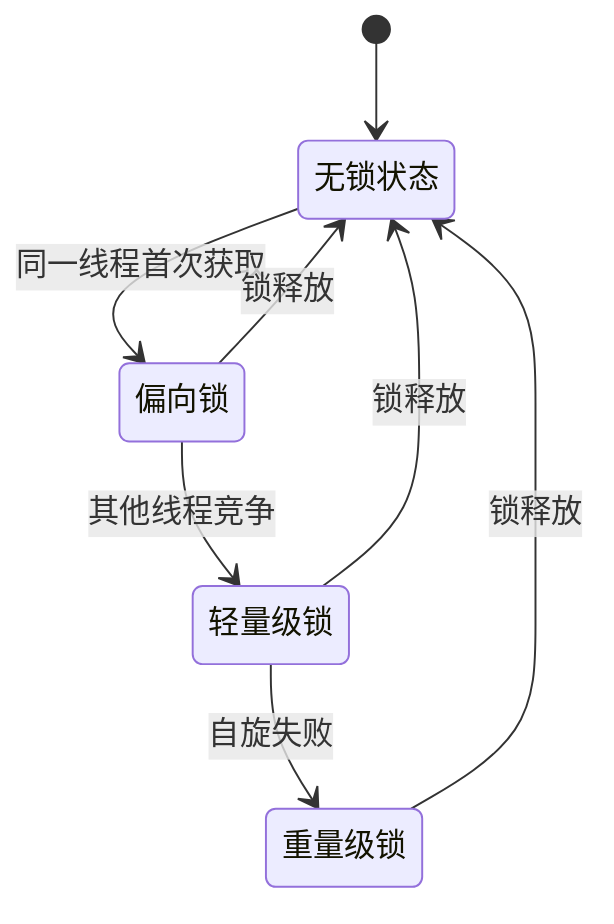
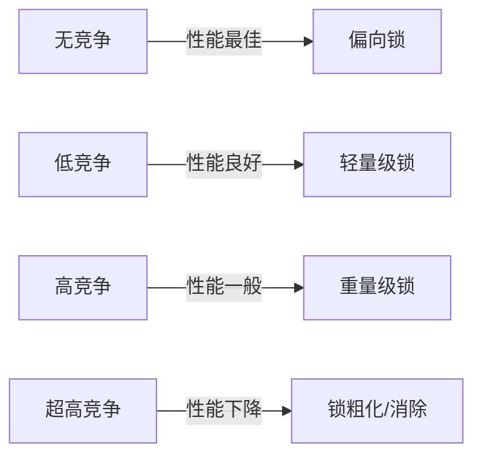
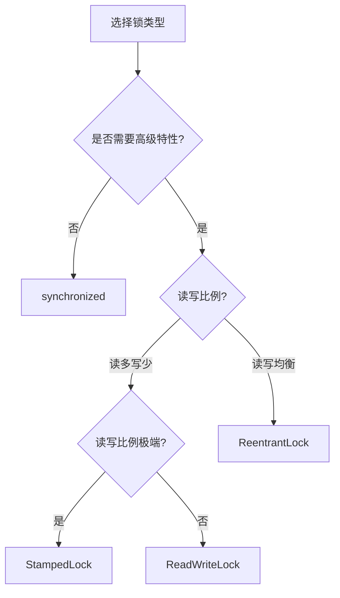

## 1. 锁的基本概念

### 1.1 什么是锁

在并发编程中，锁是一种同步机制，用于控制多个线程对共享资源的访问，确保在同一时刻只有一个线程可以访问被保护的资源，从而避免数据不一致问题。



### 1.2 锁的基本属性

<div class="grid cards" markdown>

-   **互斥性**
    - 同一时刻只允许一个线程持有锁
    - 其他线程必须等待锁释放

-   **可重入性**
    - 允许同一线程多次获取同一把锁
    - 避免自身死锁

-   **公平性**
    - 公平锁：按请求顺序获取锁
    - 非公平锁：允许"插队"获取锁

-   **阻塞性**
    - 阻塞锁：未获得锁的线程进入等待状态
    - 非阻塞锁：未获得锁时立即返回

</div>

### 1.3 锁的目标与挑战

| 目标 | 挑战 | 平衡策略 |
|------|------|---------|
| 保证线程安全 | 性能开销 | 细粒度锁设计 |
| 避免死锁 | 实现复杂性 | 锁顺序规范 |
| 提高并发度 | 活锁风险 | 锁分离与分段 |
| 降低等待时间 | 饥饿问题 | 公平锁与超时机制 |

## 2. Java中的锁类型

### 2.1 synchronized关键字

```java
// 对象锁
public void synchronizedMethod() {
    synchronized (this) {
        // 临界区代码
    }
}

// 类锁
public static void synchronizedStaticMethod() {
    synchronized (ClassName.class) {
        // 临界区代码
    }
}

// 方法锁（隐式对象锁）
public synchronized void method() {
    // 整个方法作为临界区
}
```

### 2.2 ReentrantLock

```java
private final Lock lock = new ReentrantLock(true); // 参数true表示公平锁

public void lockMethod() {
    lock.lock();
    try {
        // 临界区代码
    } finally {
        lock.unlock(); // 必须在finally块中释放锁
    }
}

// 可中断锁
public void interruptibleLock() throws InterruptedException {
    lock.lockInterruptibly();
    try {
        // 临界区代码
    } finally {
        lock.unlock();
    }
}

// 尝试获取锁
public void tryLock() {
    boolean acquired = lock.tryLock(1, TimeUnit.SECONDS);
    if (acquired) {
        try {
            // 获取锁成功，执行临界区代码
        } finally {
            lock.unlock();
        }
    } else {
        // 获取锁失败，执行替代逻辑
    }
}
```

### 2.3 读写锁

```java
private final ReadWriteLock rwLock = new ReentrantReadWriteLock();
private final Lock readLock = rwLock.readLock();
private final Lock writeLock = rwLock.writeLock();

// 读操作：允许多个线程同时读取
public Data read() {
    readLock.lock();
    try {
        return doRead();
    } finally {
        readLock.unlock();
    }
}

// 写操作：独占访问
public void write(Data data) {
    writeLock.lock();
    try {
        doWrite(data);
    } finally {
        writeLock.unlock();
    }
}
```

### 2.4 StampedLock

```java
private final StampedLock stampedLock = new StampedLock();

// 乐观读：不阻塞写线程
public Data optimisticRead() {
    long stamp = stampedLock.tryOptimisticRead();
    Data data = doRead();
    
    // 检查读取期间是否有写操作
    if (!stampedLock.validate(stamp)) {
        // 升级为悲观读锁
        stamp = stampedLock.readLock();
        try {
            data = doRead();
        } finally {
            stampedLock.unlockRead(stamp);
        }
    }
    
    return data;
}

// 写操作
public void write(Data data) {
    long stamp = stampedLock.writeLock();
    try {
        doWrite(data);
    } finally {
        stampedLock.unlockWrite(stamp);
    }
}
```

### 2.5 锁分类对比



## 3. 锁的实现原理

### 3.1 synchronized实现原理



<div class="grid cards" markdown>

-   **偏向锁**
    - 目标：减少同一线程获取锁的开销
    - 原理：在对象头记录线程ID
    - 条件：无竞争环境

-   **轻量级锁**
    - 目标：避免线程进入内核态
    - 原理：CAS操作替换对象头
    - 条件：线程交替执行

-   **重量级锁**
    - 目标：处理高竞争环境
    - 原理：基于操作系统互斥量
    - 条件：多线程同时竞争

</div>

### 3.2 对象头与锁标志位

| 状态 | 标志位 | 存储内容 |
|------|-------|---------|
| 无锁 | 01 | 对象的hashCode |
| 偏向锁 | 01 | 线程ID + epoch |
| 轻量级锁 | 00 | 指向栈中锁记录的指针 |
| 重量级锁 | 10 | 指向监视器(Monitor)的指针 |
| GC标记 | 11 | 空 |

### 3.3 AQS(AbstractQueuedSynchronizer)原理

```java
// ReentrantLock内部使用AQS实现
public class ReentrantLock implements Lock {
    private final Sync sync;
    
    // 内部同步器
    abstract static class Sync extends AbstractQueuedSynchronizer {
        // 实现锁的获取和释放
    }
    
    // 公平锁实现
    static final class FairSync extends Sync {
        protected final boolean tryAcquire(int acquires) {
            // 检查队列中是否有前驱节点
            // 有则返回失败，无则尝试获取锁
        }
    }
    
    // 非公平锁实现
    static final class NonfairSync extends Sync {
        protected final boolean tryAcquire(int acquires) {
            // 直接尝试获取锁，不考虑队列
        }
    }
}
```

AQS核心原理：
1. 使用volatile int state表示同步状态
2. 使用FIFO队列管理等待线程
3. 使用CAS操作保证状态更新的原子性

## 4. 锁的性能对比

### 4.1 不同锁的性能特性

| 锁类型 | 适用场景 | 优势 | 劣势 |
|-------|---------|------|------|
| synchronized | 简单同步需求 | JVM级优化，自动释放 | 功能单一，不可中断 |
| ReentrantLock | 高级同步需求 | 可中断，可超时，可公平 | 需手动释放，代码复杂 |
| ReadWriteLock | 读多写少场景 | 提高读并发性 | 写操作阻塞所有读 |
| StampedLock | 读超多写极少 | 乐观读不阻塞写 | API复杂，不可重入 |

### 4.2 锁竞争程度对比



### 4.3 锁优化技术

1. **锁消除**：JIT编译器在即时编译时，对不可能存在共享资源竞争的锁进行消除

2. **锁粗化**：将多个连续的加锁、解锁操作合并为一次加锁、解锁操作

3. **锁分段**：将一个大锁分解为多个小锁，提高并行度
   ```java
   // 分段锁示例：ConcurrentHashMap (JDK 7)
   public class ConcurrentHashMap<K, V> {
       // 默认分为16个段
       final Segment<K, V>[] segments;
       
       static final class Segment<K, V> extends ReentrantLock {
           // 每个段都有自己的锁
           transient volatile HashEntry<K, V>[] table;
       }
   }
   ```
4. **锁降级**：从写锁降级为读锁，提高并发读取性能
   ```java
   rwLock.writeLock().lock();
   try {
       // 写操作
       doWrite();
       
       // 获取读锁
       rwLock.readLock().lock();
   } finally {
       // 释放写锁，保留读锁
       rwLock.writeLock().unlock();
   }
   
   try {
       // 继续以读锁状态访问
       doRead();
   } finally {
       rwLock.readLock().unlock();
   }
   ```

## 5. 锁的最佳实践

### 5.1 选择合适的锁



### 5.2 减少锁竞争

1. **减小锁粒度**：
   ```java
   // 不推荐
   public synchronized void processList(List<Item> items) {
       for (Item item : items) {
           process(item);
       }
   }
   
   // 推荐
   public void processList(List<Item> items) {
       for (Item item : items) {
           synchronized (item) {
               process(item);
           }
       }
   }
   ```

2. **避免锁中执行耗时操作**：
   ```java
   // 不推荐
   synchronized void saveData(Data data) {
       // 数据库操作（耗时IO）
       databaseService.save(data);
   }
   
   // 推荐
   void saveData(Data data) {
       Data dataCopy;
       synchronized (this) {
           dataCopy = data.clone();
       }
       // 锁外执行耗时操作
       databaseService.save(dataCopy);
   }
   ```

3. **使用ThreadLocal避免共享**：
   ```java
   private static final ThreadLocal<SimpleDateFormat> dateFormatter = 
       ThreadLocal.withInitial(() -> new SimpleDateFormat("yyyy-MM-dd"));
   
   // 每个线程使用自己的实例，无需加锁
   public String formatDate(Date date) {
       return dateFormatter.get().format(date);
   }
   ```

### 5.3 避免死锁

1. **固定锁顺序**：
   ```java
   // 按ID排序确保锁获取顺序一致
   public void transfer(Account from, Account to, double amount) {
       Account first = from.getId() < to.getId() ? from : to;
       Account second = from.getId() < to.getId() ? to : from;
       
       synchronized (first) {
           synchronized (second) {
               // 转账逻辑
           }
       }
   }
   ```

2. **使用超时锁**：
   ```java
   boolean locked = lock.tryLock(1, TimeUnit.SECONDS);
   if (locked) {
       try {
           // 执行需要锁保护的代码
       } finally {
           lock.unlock();
       }
   } else {
       // 获取锁失败的处理
   }
   ```

3. **避免嵌套锁**：尽量减少同时持有多个锁的场景

## 6. 常见问题与解决方案

### 6.1 死锁问题

**检测工具**：
```java
// 使用ThreadMXBean检测死锁
ThreadMXBean threadMXBean = ManagementFactory.getThreadMXBean();
long[] deadlockedThreads = threadMXBean.findDeadlockedThreads();

if (deadlockedThreads != null) {
    ThreadInfo[] threadInfos = threadMXBean.getThreadInfo(deadlockedThreads);
    System.err.println("检测到死锁:");
    for (ThreadInfo info : threadInfos) {
        System.err.println(info);
    }
}
```

### 6.2 活锁问题

活锁是指线程持续重试一个总是失败的操作，导致无法继续执行。

**解决方案**：
- 引入随机等待时间
- 实现退避策略（指数退避）

### 6.3 锁争用(Contention)

**解决方案**：
- 减少锁持有时间
- 使用并发集合代替同步集合
- 使用ThreadLocal减少共享

## 7. 实战案例

### 7.1 缓存实现

```java
public class ConcurrentCache<K, V> {
    private final Map<K, V> cache = new ConcurrentHashMap<>();
    private final ReadWriteLock rwLock = new ReentrantReadWriteLock();
    
    public V get(K key, Function<K, V> loader) {
        // 先尝试无锁读取
        V value = cache.get(key);
        if (value != null) {
            return value;
        }
        
        // 加读锁再次检查
        rwLock.readLock().lock();
        try {
            value = cache.get(key);
            if (value != null) {
                return value;
            }
        } finally {
            rwLock.readLock().unlock();
        }
        
        // 加写锁加载数据
        rwLock.writeLock().lock();
        try {
            // 再次检查（双重检查锁定）
            value = cache.get(key);
            if (value == null) {
                value = loader.apply(key);
                cache.put(key, value);
            }
            return value;
        } finally {
            rwLock.writeLock().unlock();
        }
    }
}
```

### 7.2 限流器实现

```java
public class RateLimiter {
    private final long ratePerSecond;
    private final AtomicLong lastRequestTime = new AtomicLong(0);
    private final AtomicLong permitsLeft = new AtomicLong(0);
    
    public RateLimiter(long ratePerSecond) {
        this.ratePerSecond = ratePerSecond;
    }
    
    public boolean tryAcquire() {
        long now = System.currentTimeMillis();
        long last = lastRequestTime.get();
        
        // 计算新增的令牌数
        long newPermits = (now - last) * ratePerSecond / 1000;
        
        if (newPermits > 0) {
            // 尝试更新最后请求时间
            if (lastRequestTime.compareAndSet(last, now)) {
                permitsLeft.addAndGet(newPermits);
            }
        }
        
        // 尝试获取令牌
        while (true) {
            long currentPermits = permitsLeft.get();
            if (currentPermits <= 0) {
                return false;
            }
            
            if (permitsLeft.compareAndSet(currentPermits, currentPermits - 1)) {
                return true;
            }
        }
    }
}
```

## 8. 总结

Java并发锁机制是构建高性能、线程安全应用的基础。本文详细介绍了锁的基本概念、Java中的锁类型、实现原理、性能对比、最佳实践、常见问题及实战案例。

选择合适的锁机制需要考虑：
- 并发访问模式（读多写少？写多读少？）
- 性能要求（响应时间？吞吐量？）
- 功能需求（可中断？超时？公平性？）

遵循锁的最佳实践可以显著提高应用性能并避免并发问题：
- 减小锁粒度
- 避免锁中执行耗时操作
- 固定锁顺序避免死锁
- 使用ThreadLocal减少共享

随着Java并发编程的发展，锁机制也在不断优化，从早期的synchronized到现代的StampedLock，为开发者提供了更多选择和更好的性能。
