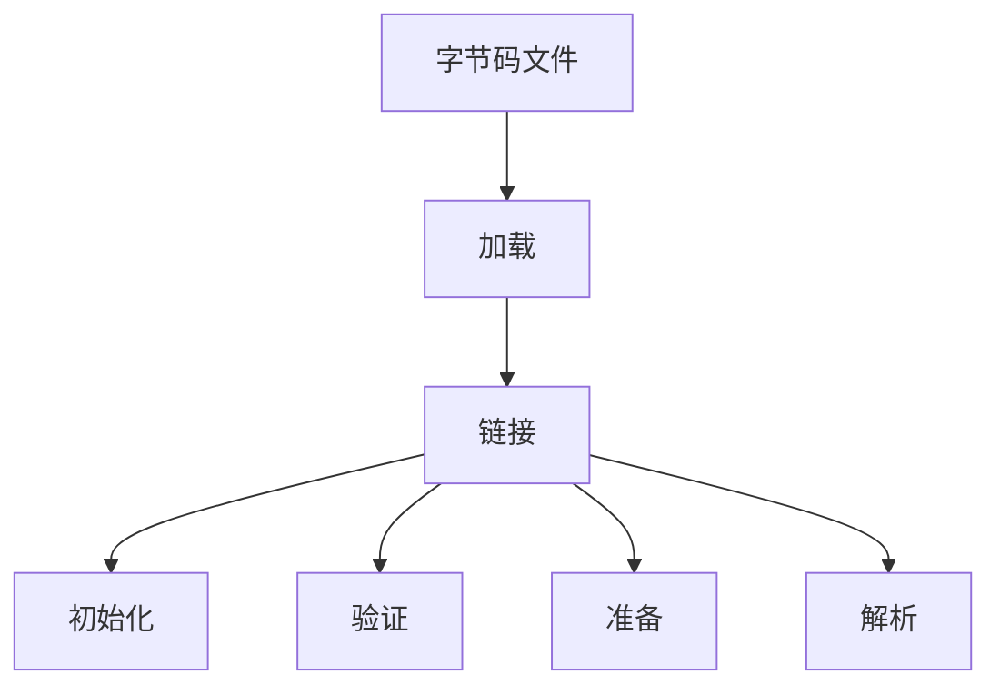
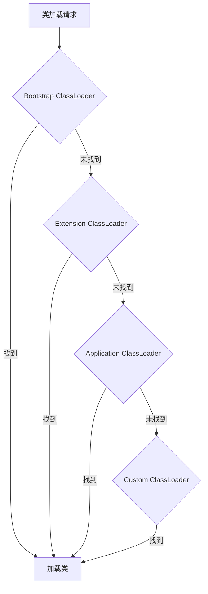

## 1. 类加载基础概念

类加载是JVM将类的字节码文件加载到内存、创建对应的Class对象的过程。这个过程是Java程序运行的基础。



## 2. 类加载的各个阶段

### 2.1 加载（Loading）

在加载阶段，JVM主要完成三件事：

1. **查找字节码**：根据完全限定类名查找字节码文件
2. **加载字节码**：将字节码文件加载到内存
3. **创建Class对象**：在内存中生成Class对象

```java
// 常见的类加载方式
Class<?> clazz1 = Class.forName("com.example.MyClass");
Class<?> clazz2 = Thread.currentThread().getContextClassLoader().loadClass("com.example.MyClass");
Class<?> clazz3 = MyClass.class;
```

### 2.2 链接（Linking）

链接阶段分为三个步骤：

#### 2.2.1 验证（Verification）

确保加载的字节码符合JVM规范，包括：

- 文件格式验证
- 元数据验证
- 字节码验证
- 符号引用验证

```java
// 验证相关的异常示例
try {
    Class.forName("com.example.InvalidClass");
} catch (ClassFormatError e) {
    System.out.println("类格式验证失败");
} catch (VerifyError e) {
    System.out.println("字节码验证失败");
}
```

#### 2.2.2 准备（Preparation）

为类的静态变量分配内存并设置初始值：

```java
public class StaticFieldExample {
    // 准备阶段：分配内存，设置默认值0
    private static int value;
    
    // 准备阶段：分配内存，设置默认值null
    private static String str;
    
    // 准备阶段：分配内存，设置为100（final常量）
    private static final int CONSTANT = 100;
}
```

#### 2.2.3 解析（Resolution）

将符号引用替换为直接引用：

```java
public class ResolutionExample {
    // 符号引用示例
    private static Method method;
    private static Field field;
    
    static {
        try {
            // 解析过程：将符号引用转换为直接引用
            method = String.class.getMethod("length");
            field = String.class.getField("value");
        } catch (NoSuchMethodException | NoSuchFieldException e) {
            e.printStackTrace();
        }
    }
}
```

### 2.3 初始化（Initialization）

执行类构造器<clinit>方法：

```java
public class InitializationExample {
    // 静态变量的显式初始化
    private static int counter = 1;
    
    // 静态代码块
    static {
        System.out.println("类初始化");
        counter = 2;
    }
    
    // 静态方法
    public static void increment() {
        counter++;
    }
}
```

## 3. 类加载器

### 3.1 类加载器分类

Java中有四种类加载器：

| 加载器类型 | 负责加载的类 | 加载路径 |
|-----------|------------|----------|
| 启动类加载器（Bootstrap） | 核心类库 | JAVA_HOME/lib |
| 扩展类加载器（Extension） | 扩展类库 | JAVA_HOME/lib/ext |
| 应用类加载器（Application） | 应用程序类 | classpath |
| 自定义类加载器 | 自定义类 | 自定义路径 |

### 3.2 自定义类加载器示例

```java
public class CustomClassLoader extends ClassLoader {
    private String classPath;
    
    public CustomClassLoader(String classPath) {
        this.classPath = classPath;
    }
    
    @Override
    protected Class<?> findClass(String name) throws ClassNotFoundException {
        try {
            byte[] classData = loadClassData(name);
            return defineClass(name, classData, 0, classData.length);
        } catch (IOException e) {
            throw new ClassNotFoundException("Could not load class " + name, e);
        }
    }
    
    private byte[] loadClassData(String className) throws IOException {
        String path = classPath + File.separatorChar + 
                     className.replace('.', File.separatorChar) + ".class";
        try (FileInputStream fis = new FileInputStream(path)) {
            ByteArrayOutputStream baos = new ByteArrayOutputStream();
            int bufferSize = 1024;
            byte[] buffer = new byte[bufferSize];
            int bytesNumRead;
            while ((bytesNumRead = fis.read(buffer)) != -1) {
                baos.write(buffer, 0, bytesNumRead);
            }
            return baos.toByteArray();
        }
    }
}
```

## 4. 双亲委派模型

### 4.1 工作原理



### 4.2 实现代码

```java
public class ClassLoader {
    protected Class<?> loadClass(String name, boolean resolve) 
            throws ClassNotFoundException {
        synchronized (getClassLoadingLock(name)) {
            // 首先检查类是否已经加载
            Class<?> c = findLoadedClass(name);
            if (c == null) {
                try {
                    // 委托给父类加载器加载
                    if (parent != null) {
                        c = parent.loadClass(name, false);
                    } else {
                        c = findBootstrapClassOrNull(name);
                    }
                } catch (ClassNotFoundException e) {
                    // 父类加载器无法加载时
                }
                
                if (c == null) {
                    // 尝试自己加载
                    c = findClass(name);
                }
            }
            if (resolve) {
                resolveClass(c);
            }
            return c;
        }
    }
}
```

## 5. 常见问题和解决方案

### 5.1 类加载器泄漏

```java
public class ClassLoaderLeakExample {
    static class LeakingClass {
        static final ThreadLocal<byte[]> threadLocal = new ThreadLocal<>();
        
        static {
            // 可能导致类加载器泄漏
            threadLocal.set(new byte[1024 * 1024]);
        }
    }
    
    // 解决方案
    public static void preventLeak() {
        ThreadLocal<?> threadLocal = LeakingClass.threadLocal;
        // 在类卸载前清理ThreadLocal
        threadLocal.remove();
    }
}
```

### 5.2 NoClassDefFoundError处理

```java
public class ClassNotFoundHandler {
    public static void handleMissingClass() {
        try {
            Class.forName("com.example.MissingClass");
        } catch (ClassNotFoundException e) {
            // 1. 记录错误
            logger.error("类未找到", e);
            
            // 2. 尝试动态下载或生成类
            downloadAndLoadClass("com.example.MissingClass");
            
            // 3. 使用备选方案
            useAlternativeClass();
        }
    }
}
```

## 6. 实际应用场景

### 6.1 热部署实现

```java
public class HotDeployClassLoader extends ClassLoader {
    private String classPath;
    private Set<String> loadedClasses = new HashSet<>();
    
    public Class<?> loadClass(String name, boolean resolve) 
            throws ClassNotFoundException {
        // 系统类使用系统类加载器加载
        if (name.startsWith("java.")) {
            return super.loadClass(name, resolve);
        }
        
        // 检查类是否需要重新加载
        if (loadedClasses.contains(name)) {
            return findClass(name);
        }
        
        try {
            Class<?> clazz = findClass(name);
            loadedClasses.add(name);
            if (resolve) {
                resolveClass(clazz);
            }
            return clazz;
        } catch (ClassNotFoundException e) {
            return super.loadClass(name, resolve);
        }
    }
}
```

### 6.2 插件系统实现

```java
public class PluginClassLoader extends URLClassLoader {
    private final String pluginName;
    
    public PluginClassLoader(String pluginName, URL[] urls, ClassLoader parent) {
        super(urls, parent);
        this.pluginName = pluginName;
    }
    
    @Override
    protected Class<?> loadClass(String name, boolean resolve) 
            throws ClassNotFoundException {
        // 插件私有的类优先加载
        if (name.startsWith("plugin." + pluginName)) {
            return findClass(name);
        }
        // 其他类委托给父加载器
        return super.loadClass(name, resolve);
    }
}
```

## 7. 性能优化建议

### 7.1 类加载优化

1. **预加载关键类**：
```java
public class PreloadClasses {
    public static void preload() {
        try {
            // 预加载常用类
            Class.forName("com.example.CommonClass1");
            Class.forName("com.example.CommonClass2");
        } catch (ClassNotFoundException e) {
            logger.error("预加载失败", e);
        }
    }
}
```

2. **延迟加载非关键类**：
```java
public class LazyLoadExample {
    private static class LazyHolder {
        static final ExpensiveClass INSTANCE = new ExpensiveClass();
    }
    
    public static ExpensiveClass getInstance() {
        return LazyHolder.INSTANCE;
    }
}
```

### 7.2 类加载器优化

1. **缓存优化**：
```java
public class CachedClassLoader extends ClassLoader {
    private final Map<String, WeakReference<Class<?>>> cache = 
        new ConcurrentHashMap<>();
    
    @Override
    protected Class<?> findClass(String name) throws ClassNotFoundException {
        WeakReference<Class<?>> ref = cache.get(name);
        Class<?> clazz = (ref != null) ? ref.get() : null;
        
        if (clazz == null) {
            clazz = defineClass(name, loadClassData(name));
            cache.put(name, new WeakReference<>(clazz));
        }
        
        return clazz;
    }
}
```

2. **并行类加载**：
```java
public class ParallelClassLoader {
    public static void loadClasses(List<String> classNames) {
        ExecutorService executor = Executors.newFixedThreadPool(
            Runtime.getRuntime().availableProcessors()
        );
        
        List<Future<?>> futures = new ArrayList<>();
        
        for (String className : classNames) {
            futures.add(executor.submit(() -> {
                try {
                    Class.forName(className);
                } catch (ClassNotFoundException e) {
                    logger.error("加载类失败: " + className, e);
                }
            }));
        }
        
        // 等待所有类加载完成
        for (Future<?> future : futures) {
            try {
                future.get();
            } catch (Exception e) {
                logger.error("并行加载失败", e);
            }
        }
        
        executor.shutdown();
    }
}
```

## 8. 总结

类加载是Java程序运行的基础机制，通过了解类加载的过程和原理，我们可以：

1. **更好地处理类加载问题**
   - 解决ClassNotFoundException
   - 处理NoClassDefFoundError
   - 避免类加载器泄漏

2. **优化应用性能**
   - 合理使用类加载器
   - 实现高效的类加载策略
   - 优化类加载过程

3. **实现高级特性**
   - 热部署
   - 插件系统
   - 动态代码执行

关键注意点：
- 理解双亲委派模型的重要性
- 正确处理类加载器的生命周期
- 注意类加载的性能影响
- 合理使用自定义类加载器

<details>
<summary>类加载器调试技巧</summary>

```java
// 1. 查看类的加载器
System.out.println(MyClass.class.getClassLoader());

// 2. 查看类加载器层次结构
ClassLoader loader = MyClass.class.getClassLoader();
while (loader != null) {
    System.out.println(loader);
    loader = loader.getParent();
}

// 3. 查看加载的类
instrumentation.getAllLoadedClasses();
```
</details>
