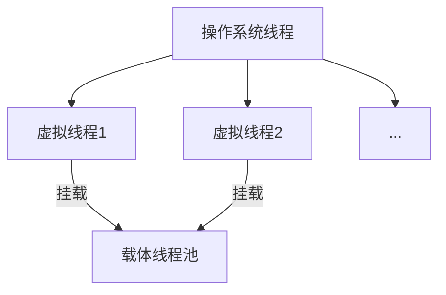
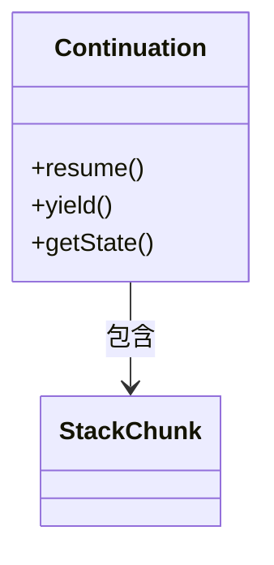

## 1. 核心概念 {#concepts}

### 1.1 虚拟线程架构



### 1.2 实现原理

**调度机制**：
- 协作式调度：虚拟线程通过显式挂起点(yield point)主动让出控制权
- 工作窃取：ForkJoinPool作为默认调度器，支持工作窃取算法
- 挂载/卸载：虚拟线程可在载体线程间灵活迁移

**栈管理**：
- 栈帧分块存储(Stack Chuck)
- 按需扩容/缩容
- 最小初始栈大小~200B

**内存模型**：
- 延续(Continuation)保存执行状态
- 对象头优化(减少内存占用)
- 轻量级锁机制

[返回核心概念](#concepts)

## 2. 基础API {#api}

### 2.1 创建虚拟线程

**方式一：直接创建**
```java
Thread vThread = Thread.ofVirtual()
    .name("worker-", 0)
    .start(() -> {
        // 任务逻辑
    });
```

### 2.2 结构化并发

```java
try (var scope = new StructuredTaskScope.ShutdownOnFailure()) {
    Future<String> user = scope.fork(() -> fetchUser());
    Future<Integer> order = scope.fork(() -> fetchOrder());
    scope.join();
    scope.throwIfFailed();
    return new Response(user.resultNow(), order.resultNow());
}
```

## 3. 底层实现 {#implementation}

### 3.1 延续(Continuation)



**关键特性**：
- 保存线程执行上下文
- 支持嵌套调用
- 与载体线程解耦

### 3.2 调度器实现

```java
// 伪代码展示调度逻辑
void schedule(VirtualThread vt) {
    if (vt.isRunnable()) {
        ForkJoinPool.execute(() -> {
            mount(vt);  // 挂载到载体线程
            vt.run();
            unmount(vt); // 卸载
        });
    }
}
```

## 5. 调试监控 {#monitoring}

### 5.1 诊断工具

```bash
jcmd <pid> Thread.dump_to_file -format=json vthreads.json
```

[返回顶部](#concepts)
