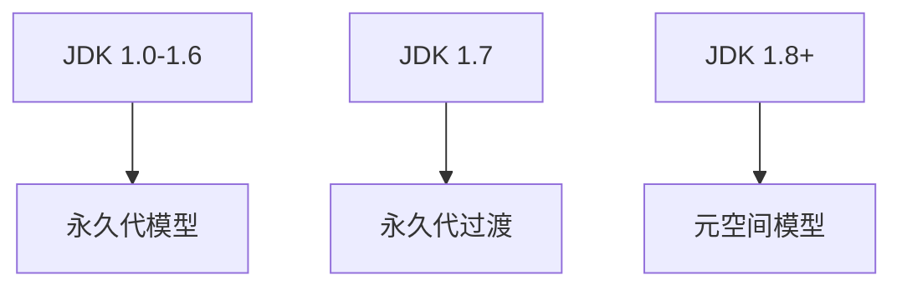
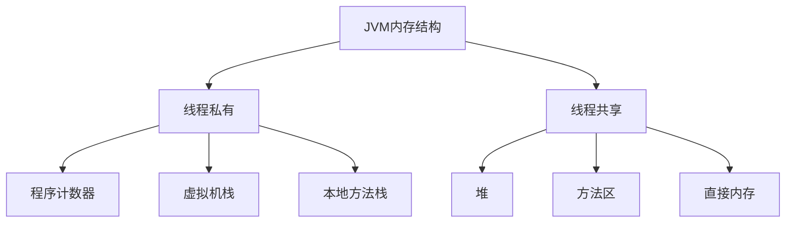
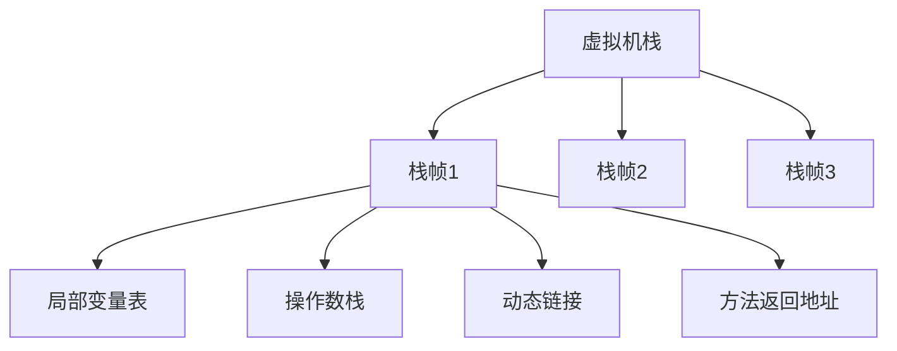
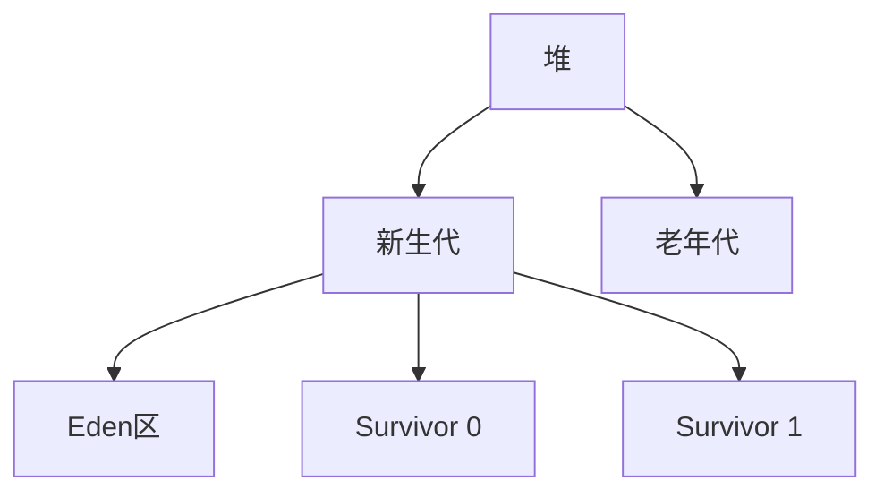
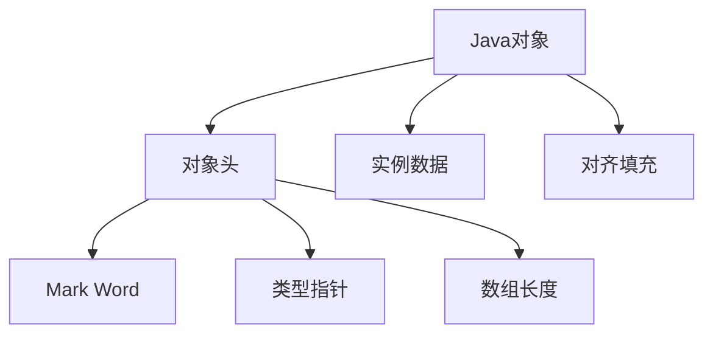
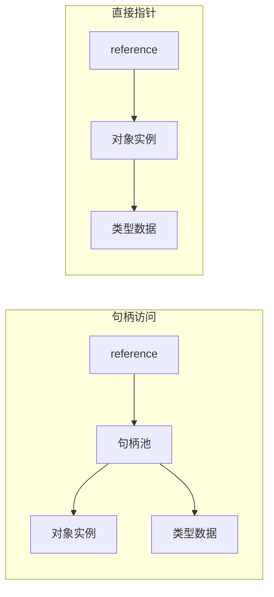
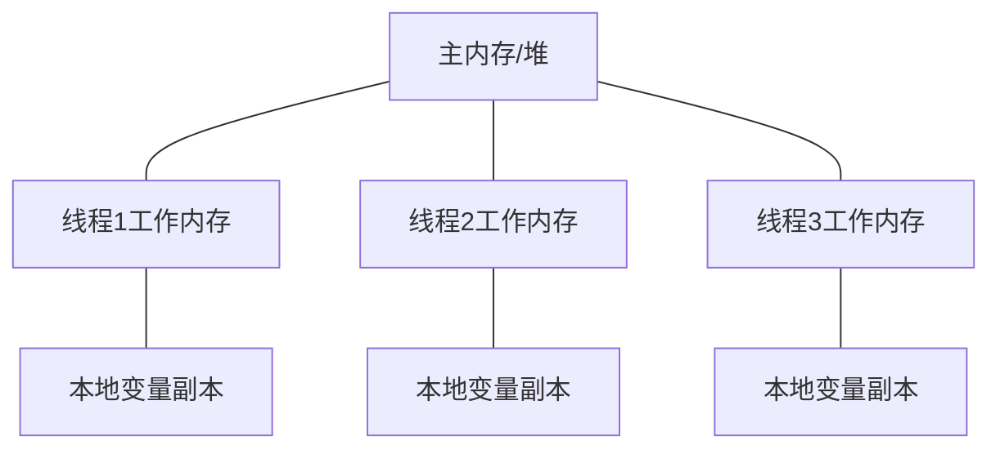

## 1. JVM内存结构概述

### 1.1 JVM内存模型的演进

JVM内存模型随着Java版本的迭代不断演进，从早期的简单分代到现代的复杂结构，不断优化以适应不同的应用场景。

### 1.2 内存结构总览

JVM内存结构主要分为线程私有区域和线程共享区域两大类。

-   **线程私有区域**
    - 程序计数器：记录当前线程执行位置
    - 虚拟机栈：存储方法执行的栈帧
    - 本地方法栈：执行Native方法的栈

-   **线程共享区域**
    - 堆：存储对象实例
    - 方法区：存储类信息、常量、静态变量
    - 直接内存：NIO操作的直接缓冲区

## 2. JVM内存区域详解

### 2.1 程序计数器(Program Counter Register)

程序计数器是一块较小的内存空间，可看作当前线程所执行字节码的行号指示器。

**特点**：
- 线程私有，每个线程都有独立的程序计数器
- 唯一一个不会发生OutOfMemoryError的内存区域
- 执行Native方法时，计数器值为空(Undefined)

**作用**：
- 字节码解释器通过改变计数器的值来选取下一条需要执行的字节码指令
- 在多线程环境下，为线程切换后能恢复到正确的执行位置提供支持

### 2.2 虚拟机栈(VM Stack)

虚拟机栈描述的是Java方法执行的内存模型，每个方法在执行时都会创建一个栈帧。

**栈帧组成**：
- 局部变量表：存储方法参数和局部变量
- 操作数栈：执行字节码指令的工作区
- 动态链接：指向运行时常量池的方法引用
- 方法返回地址：方法执行完毕后的返回位置

**异常情况**：
- StackOverflowError：栈深度超过虚拟机允许的最大深度
- OutOfMemoryError：无法申请到足够的内存创建新的栈帧

### 2.3 本地方法栈(Native Method Stack)

本地方法栈与虚拟机栈类似，区别在于虚拟机栈为Java方法服务，而本地方法栈为Native方法服务。

**特点**：
- 线程私有
- 可能抛出StackOverflowError和OutOfMemoryError
- 具体实现由虚拟机自由实现（如HotSpot将本地方法栈和虚拟机栈合二为一）

### 2.4 堆(Heap)

堆是JVM管理的最大一块内存区域，所有线程共享，主要用于存储对象实例和数组。

**特点**：
- 线程共享，几乎所有对象实例都在这里分配
- 垃圾收集器管理的主要区域（GC堆）
- 可以物理上不连续，但逻辑上应该连续
- 可以固定大小或动态扩展

**分代模型**：
- 新生代：存放新创建的对象，分为Eden和两个Survivor区
- 老年代：存放长期存活的对象和大对象

### 2.5 方法区(Method Area)

方法区用于存储已被虚拟机加载的类信息、常量、静态变量、即时编译器编译后的代码等数据。

**实现变化**：
- JDK 1.7及之前：永久代(PermGen)
- JDK 1.8及之后：元空间(Metaspace)，使用本地内存

**存储内容**：
- 类信息（类的版本、字段、方法、接口等）
- 运行时常量池
- 静态变量
- JIT编译后的代码缓存

**特点**：
- 线程共享
- 可能抛出OutOfMemoryError
- 元空间使用本地内存，默认情况下可以动态扩展

### 2.6 运行时常量池(Runtime Constant Pool)

运行时常量池是方法区的一部分，用于存放编译期生成的各种字面量和符号引用。

**特点**：
- Class文件中的常量池表在类加载后存放于运行时常量池
- 具有动态性，运行期间也可以将新的常量放入池中（如String.intern()）
- JDK 1.7前属于永久代，1.8后属于元空间

### 2.7 直接内存(Direct Memory)

直接内存不是JVM运行时数据区的一部分，但被频繁使用，特别是在NIO操作中。

**特点**：
- 不受JVM堆大小限制，但受物理内存限制
- 分配回收成本较高，但读写性能高
- 避免了在Java堆和Native堆之间来回复制数据

## 3. 内存分配与回收

### 3.1 对象创建过程

**内存分配方式**：
- 指针碰撞：内存规整时使用，将指针向空闲方向移动对象大小的距离
- 空闲列表：内存不规整时使用，维护一个列表记录可用内存块

**线程安全保障**：
- CAS+失败重试：保证操作的原子性
- TLAB(Thread Local Allocation Buffer)：为每个线程预先分配一小块内存

### 3.2 对象内存布局

Java对象在内存中的布局分为三个部分：

**对象头**：
- Mark Word：存储对象的运行时数据（如哈希码、GC分代年龄、锁状态标志等）
- 类型指针：指向对象的类元数据
- 数组长度：如果对象是数组，还需要记录数组长度

**实例数据**：
- 对象真正存储的有效信息
- 包括父类继承和子类定义的所有实例字段

**对齐填充**：
- 非必须，起占位符作用
- HotSpot要求对象大小必须是8字节的整数倍

### 3.3 对象访问方式

Java程序通过栈上的reference引用操作堆上的具体对象，主要有两种访问方式：

**句柄访问**：
- Java引用存储句柄地址，句柄池中存储对象实例数据与类型数据的地址
- 优点：reference中存储的是稳定的句柄地址，对象移动时只需修改句柄中的实例数据指针

**直接指针**：
- Java引用直接存储对象地址，对象中包含类型数据的指针
- 优点：访问速度更快，节省一次指针定位的时间开销
- HotSpot采用此种方式

## 4. JMM(Java Memory Model)

### 4.1 JMM基本概念

Java内存模型(JMM)是一种抽象的概念，并不真实存在，它描述了一组规则或规范，定义了程序中各个变量的访问方式。

**目的**：
- 屏蔽各种硬件和操作系统的内存访问差异
- 实现Java程序在各平台下一致的内存访问效果
- 解决并发编程中的原子性、可见性和有序性问题

**核心内容**：
- 主内存与工作内存
- 内存间交互操作
- 重排序规则
- happens-before原则

### 4.2 主内存与工作内存

**交互机制**：
- 所有变量存储在主内存中
- 每个线程有自己的工作内存，保存主内存变量的副本
- 线程对变量的操作必须在工作内存中进行
- 不同线程无法直接访问对方工作内存

### 4.3 内存间操作

JMM定义了8种操作来完成主内存和工作内存的交互：

| 操作 | 作用 |
|------|------|
| lock | 作用于主内存变量，将变量标识为一条线程独占状态 |
| unlock | 作用于主内存变量，解除独占状态 |
| read | 作用于主内存变量，将变量值传输到工作内存 |
| load | 作用于工作内存变量，将read操作获取的值放入工作内存 |
| use | 作用于工作内存变量，将变量值传递给执行引擎 |
| assign | 作用于工作内存变量，将执行引擎的值赋给变量 |
| store | 作用于工作内存变量，将变量值传送到主内存 |
| write | 作用于主内存变量，将store操作获取的值放入主内存 |

### 4.4 并发问题的根源

-   **可见性**
    - 一个线程对共享变量的修改，另一线程能立即看到
    - 缓存导致的可见性问题
    - 解决方案：volatile、synchronized、final

-   **原子性**
    - 一个操作不可中断，要么全部执行，要么全不执行
    - 线程切换导致的原子性问题
    - 解决方案：synchronized、Lock、原子类

-   **有序性**
    - 程序执行的顺序按照代码的先后顺序执行
    - 编译优化导致的有序性问题
    - 解决方案：volatile、synchronized、happens-before规则

### 4.4 happens-before原则

happens-before是JMM中的一个重要概念，它定义了操作之间的内存可见性。如果一个操作happens-before另一个操作，那么第一个操作的结果对第二个操作可见。

**主要规则**：
- 程序顺序规则：一个线程内，按照代码顺序，前面的操作happens-before后面的操作
- 监视器锁规则：解锁操作happens-before后续的加锁操作
- volatile变量规则：对volatile变量的写操作happens-before后续的读操作
- 传递性：如果A happens-before B，且B happens-before C，则A happens-before C
- 线程启动规则：Thread.start()方法happens-before线程中的每一个操作
- 线程终止规则：线程中的所有操作happens-before其他线程检测到该线程已终止
- 线程中断规则：调用线程的interrupt()方法happens-before被中断线程检测到中断事件
- 对象终结规则：一个对象的初始化完成happens-before它的finalize()方法开始

### 4.5 内存屏障

内存屏障是一种CPU指令，用于控制特定条件下的重排序和内存可见性。JMM把内存屏障分为四类：

| 屏障类型 | 指令示例 | 说明 |
|---------|---------|------|
| LoadLoad | Load1; LoadLoad; Load2 | 确保Load1的数据加载先于Load2及后续指令的数据加载 |
| StoreStore | Store1; StoreStore; Store2 | 确保Store1的数据对其他处理器可见先于Store2及后续指令的数据 |
| LoadStore | Load1; LoadStore; Store2 | 确保Load1的数据加载先于Store2及后续指令的数据刷新到内存 |
| StoreLoad | Store1; StoreLoad; Load2 | 确保Store1的数据对其他处理器变得可见先于Load2及后续指令的数据加载 |

### 4.6 关键字的内存语义

**volatile关键字**：
- 保证可见性：对volatile变量的写会立即刷新到主内存，读会从主内存获取最新值
- 禁止重排序：通过插入内存屏障实现
- 不保证原子性：复合操作如i++仍然不是原子的

**synchronized关键字**：
- 保证原子性：同一时刻只允许一个线程执行同步代码块
- 保证可见性：解锁前会将工作内存中的变量值刷新到主内存
- 保证有序性：禁止同步代码块内的重排序

**final关键字**：
- 保证可见性：被final修饰的字段在构造器中一旦初始化完成，其他线程就能看见final字段的值
- 禁止重排序：禁止final字段的写重排序到构造函数之外

## 5. 内存问题排查与优化

### 5.1 常见内存问题

-   **内存泄漏**
    - 症状：内存占用持续增长，最终OOM
    - 原因：对象不再使用但仍被引用
    - 排查：内存分析工具（MAT、JProfiler）

-   **内存溢出**
    - 症状：OutOfMemoryError
    - 原因：内存需求超过可用内存
    - 排查：分析堆转储文件，调整内存参数

-   **栈溢出**
    - 症状：StackOverflowError
    - 原因：递归调用过深，栈帧过多
    - 排查：检查递归逻辑，调整栈大小

-   **直接内存溢出**
    - 症状：DirectMemorySize异常
    - 原因：NIO操作未释放直接内存
    - 排查：检查直接缓冲区使用情况

### 5.2 内存分析工具

| 工具 | 用途 |
|------|------|
| jps | 列出Java进程 |
| jstat | 监控JVM统计信息 |
| jmap | 生成堆转储文件 |
| jhat | 分析堆转储文件 |
| MAT | Eclipse内存分析工具 |
| JProfiler | 商业级性能分析工具 |
| VisualVM | 可视化监控工具 |

### 5.3 内存优化策略

**堆内存优化**：
- 合理设置堆大小：-Xms和-Xmx设置为相同值，避免堆调整
- 优化对象创建：对象池、缓存、延迟加载
- 及时释放引用：使用完毕的对象设为null

**方法区优化**：
- 控制类加载数量：减少动态类加载
- 控制常量池大小：减少String.intern()调用
- JDK 8后设置元空间大小：-XX:MetaspaceSize和-XX:MaxMetaspaceSize

**栈内存优化**：
- 控制递归深度：避免无限递归
- 调整栈大小：-Xss参数设置合理的栈大小

## 6. 最佳实践

### 6.1 内存分配建议

- 根据应用特点设置合理的堆大小和比例
- 新生代大小通常为堆的1/3到1/4
- Eden与Survivor比例默认为8:1:1
- 避免创建过多的大对象和长生命周期对象

### 6.2 代码优化建议

- 及时关闭资源：使用try-with-resources语法
- 合理使用缓存：避免缓存膨胀和内存泄漏
- 使用软引用/弱引用：对内存敏感的缓存场景
- 避免使用finalize()：性能低下且不可靠
- 使用局部变量：减少共享变量的使用

### 6.3 并发编程建议

- 正确使用synchronized和volatile
- 优先使用并发容器和原子类
- 避免过度同步：影响性能
- 遵循happens-before规则
- 使用线程池管理线程：避免频繁创建和销毁线程

## 7. 总结

JVM内存模型是Java平台的核心组成部分，理解JVM内存结构和Java内存模型对于编写高效、稳定的Java程序至关重要。本文详细介绍了JVM内存区域划分、对象创建与访问方式、Java内存模型的核心概念以及内存问题的排查与优化策略，希望能帮助开发者更好地理解JVM内存机制，编写出更加高效、稳定的Java应用。
