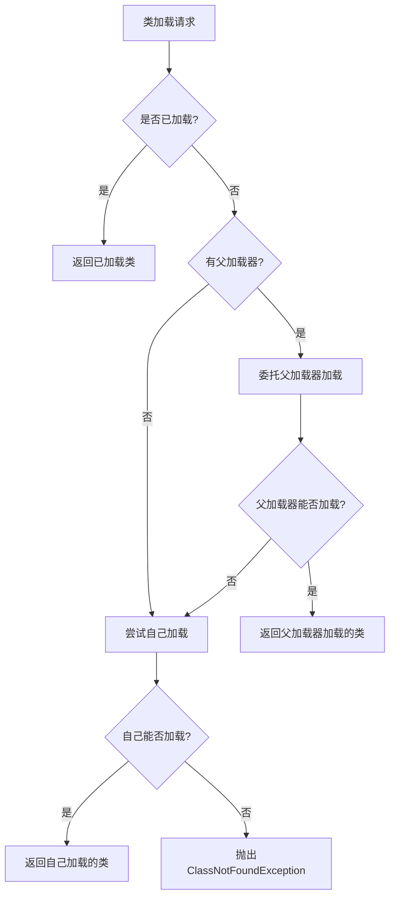
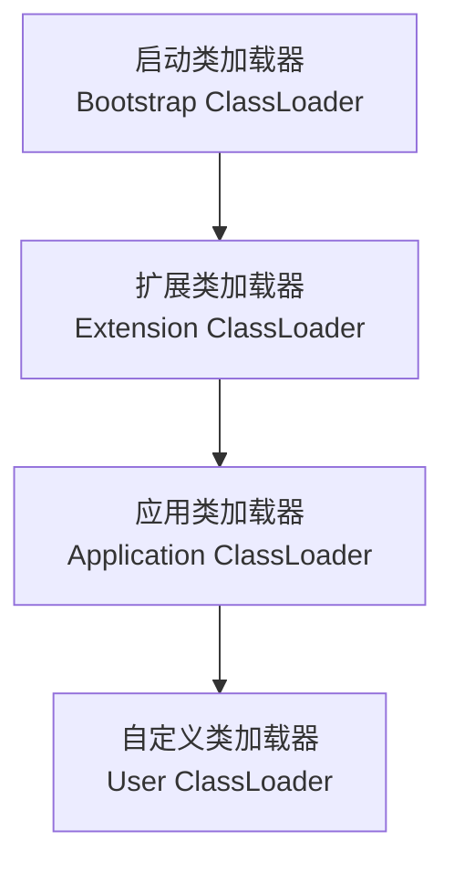
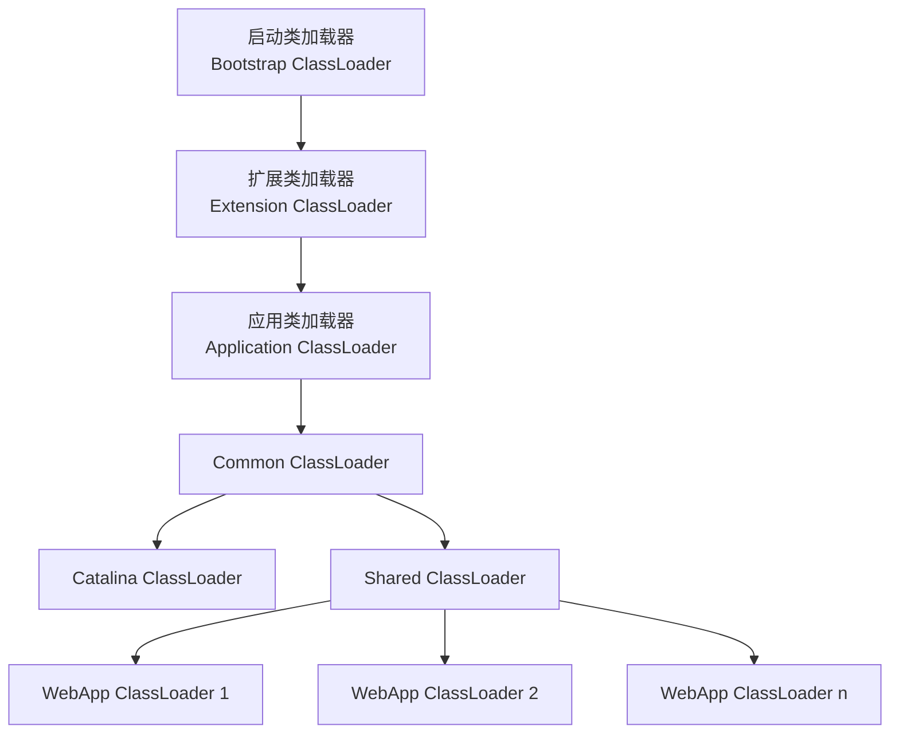

## 1. 双亲委派模型概述

### 1.1 什么是双亲委派模型

双亲委派模型(Parent Delegation Model)是Java虚拟机中类加载器的一种层次结构关系和工作机制。在这种机制下，一个类加载器收到类加载请求时，会先将请求委派给父类加载器完成，只有当父类加载器无法完成加载时，子类加载器才会尝试自己加载。



### 1.2 为什么需要双亲委派模型

双亲委派模型的设计初衷主要有以下几点：

<div class="grid cards" markdown>

-   **安全性**
    - 防止核心API被篡改
    - 避免恶意代码替换JDK的核心类
    - 保护Java程序的基础行为

-   **避免类重复加载**
    - 确保类的唯一性
    - 节省内存空间
    - 提高类加载效率

-   **保证类的一致性**
    - 确保Java核心类库的类型安全
    - 避免类型混乱
    - 维护Java类型体系的完整性

</div>

## 2. 类加载器层次结构

### 2.1 JVM内置类加载器

Java虚拟机内置了三种类加载器，它们共同组成了类加载器的层次结构：



**启动类加载器(Bootstrap ClassLoader)**：
- 最顶层的类加载器，由C++实现，是JVM的一部分
- 负责加载Java核心类库，如rt.jar、resources.jar等
- 加载路径：`$JAVA_HOME/jre/lib`
- 不是继承自ClassLoader类，无法在Java代码中直接引用

**扩展类加载器(Extension ClassLoader)**：
- JDK 9之前：sun.misc.Launcher$ExtClassLoader
- JDK 9之后：jdk.internal.loader.ClassLoaders$PlatformClassLoader
- 负责加载Java扩展类库，如javax.*包
- 加载路径：`$JAVA_HOME/jre/lib/ext`或java.ext.dirs系统变量指定的路径

**应用类加载器(Application ClassLoader)**：
- JDK 9之前：sun.misc.Launcher$AppClassLoader
- JDK 9之后：jdk.internal.loader.ClassLoaders$AppClassLoader
- 负责加载应用程序classpath下的类
- 也称为系统类加载器(System ClassLoader)
- 是ClassLoader.getSystemClassLoader()方法的返回值

### 2.2 自定义类加载器

除了JVM内置的类加载器外，开发者还可以自定义类加载器来满足特定需求：

**常见自定义类加载器场景**：
- 热部署/热插拔
- 从非标准来源加载类（如网络、数据库）
- 自定义类加载规则
- 实现类隔离（如Tomcat的WebappClassLoader）

**自定义类加载器的实现步骤**：
1. 继承ClassLoader类
2. 重写findClass()方法（推荐）
3. 实现类字节码的获取和转换
4. 调用defineClass()方法将字节码转换为Class对象

## 3. 双亲委派模型的实现机制

### 3.1 源码分析

双亲委派模型的核心实现在ClassLoader类的loadClass方法中：

```java
protected Class<?> loadClass(String name, boolean resolve) throws ClassNotFoundException {
    synchronized (getClassLoadingLock(name)) {
        // 首先检查类是否已经被加载
        Class<?> c = findLoadedClass(name);
        if (c == null) {
            try {
                // 如果有父加载器，则委托父加载器加载
                if (parent != null) {
                    c = parent.loadClass(name, false);
                } else {
                    // 如果没有父加载器，则委托启动类加载器加载
                    c = findBootstrapClassOrNull(name);
                }
            } catch (ClassNotFoundException e) {
                // 父加载器无法加载时抛出异常
            }

            if (c == null) {
                // 如果父加载器无法加载，则调用自己的findClass方法加载
                c = findClass(name);
            }
        }
        if (resolve) {
            resolveClass(c);
        }
        return c;
    }
}
```

### 3.2 工作流程

双亲委派模型的工作流程可以概括为以下步骤：

1. **检查缓存**：首先检查请求的类是否已经被加载过
2. **委托父加载**：如果未加载，则将加载请求委托给父类加载器
3. **递归委托**：父类加载器重复步骤1和2，直到委托到启动类加载器
4. **尝试加载**：启动类加载器尝试加载类
5. **逐级返回**：如果启动类加载器无法加载，则依次交由子类加载器尝试加载
6. **自己加载**：如果所有父类加载器都无法加载，则由发起请求的类加载器自己尝试加载
7. **失败处理**：如果仍然无法加载，则抛出ClassNotFoundException异常

## 4. 双亲委派模型的优点和作用

### 4.1 安全性保障

双亲委派模型最重要的作用是保障Java程序的安全性：

**防止核心API被篡改**：
- 假设有人编写了一个java.lang.String类，企图替换JDK的String类
- 在双亲委派模型下，加载该类的请求会先委托给启动类加载器
- 启动类加载器会优先加载JDK中的java.lang.String类
- 自定义的同名类永远不会被加载，从而保护了Java核心API

**示例**：尝试自定义java.lang.String类

```java
package java.lang;

public class String {
    public static void main(String[] args) {
        System.out.println("自定义的String类");
    }
}
```

运行结果：
```
错误: 在类 java.lang.String 中找不到 main 方法
```

### 4.2 保证类的唯一性

双亲委派模型确保同一个类在JVM中只会被加载一次：

- 当多个类加载器尝试加载同一个类时，由于委派机制，最终都会委托给最顶层的可加载此类的加载器来加载
- 这保证了Java类型体系的统一性和安全性
- 避免了类的重复加载，节省了内存空间

### 4.3 隔离不同应用程序类

在一些应用服务器（如Tomcat、JBoss等）中，双亲委派模型可以实现不同应用程序类的隔离：

- 每个Web应用程序都有自己的类加载器
- 不同应用程序的类加载器互相独立
- 共享的类（如JDK核心类）由父类加载器加载，确保一致性
- 应用程序特有的类由各自的类加载器加载，实现隔离

## 5. 破坏双亲委派模型

### 5.1 为什么需要破坏双亲委派

尽管双亲委派模型有诸多优点，但在某些场景下需要打破这种机制：

<div class="grid cards" markdown>

-   **SPI机制**
    - Java的Service Provider Interface需要加载厂商实现的代码
    - 核心类调用用户代码，而非用户代码调用核心类
    - 典型例子：JDBC、JCE、JNDI、JAXB等

-   **热部署/热插拔**
    - 需要在运行时重新加载同名类
    - OSGi等模块化系统的类加载机制
    - 开发工具的HotSwap功能

-   **Tomcat类加载器**
    - 需要隔离不同Web应用的类
    - 同时允许共享部分类库
    - 实现类的动态加载和卸载

</div>

### 5.2 破坏双亲委派的方式

#### 5.2.1 线程上下文类加载器

线程上下文类加载器(Thread Context ClassLoader)是Java提供的一种灵活的类加载机制，可以打破双亲委派模型：

```java
// 获取当前线程的上下文类加载器
ClassLoader contextClassLoader = Thread.currentThread().getContextClassLoader();

// 设置当前线程的上下文类加载器
Thread.currentThread().setContextClassLoader(newClassLoader);

// 使用上下文类加载器加载类
Class<?> clazz = contextClassLoader.loadClass("com.example.MyClass");
```

**应用场景**：
- JDBC中的ServiceLoader机制
- JNDI服务
- 各种Java SPI机制

#### 5.2.2 自定义类加载器重写loadClass方法

通过重写ClassLoader的loadClass方法，可以改变默认的双亲委派行为：

```java
@Override
protected Class<?> loadClass(String name, boolean resolve) throws ClassNotFoundException {
    // 检查类是否已加载
    Class<?> loadedClass = findLoadedClass(name);
    if (loadedClass != null) {
        return loadedClass;
    }
    
    // 对于特定包下的类，优先自己加载
    if (name.startsWith("com.example.special")) {
        return findClass(name);
    }
    
    // 其他类遵循双亲委派模型
    return super.loadClass(name, resolve);
}
```

#### 5.2.3 使用OSGi等模块化系统

OSGi(Open Service Gateway Initiative)是一个Java模块化系统，它实现了一种全新的类加载机制：

- 每个Bundle(模块)都有自己的类加载器
- 类加载器之间是网状结构，而非树状结构
- 通过Import-Package和Export-Package声明依赖关系
- 允许同一个类的不同版本共存

## 6. 实际应用案例

### 6.1 Tomcat的类加载机制

Tomcat作为一个Web应用服务器，需要隔离不同的Web应用，同时又要共享部分类库，因此它实现了自己的类加载机制：



**Tomcat类加载器层次**：
- Common ClassLoader：加载Tomcat和Web应用共享的类
- Catalina ClassLoader：加载Tomcat专用的类
- Shared ClassLoader：加载所有Web应用共享的类
- WebApp ClassLoader：每个Web应用有自己的类加载器

**打破双亲委派的方式**：
- WebApp ClassLoader优先加载Web应用自己的类
- 如果找不到，再委托父加载器加载
- 这种"先自己后委托"的方式打破了双亲委派模型

### 6.2 JDBC的SPI机制

JDBC是Java访问数据库的标准API，它使用SPI机制加载数据库驱动：

```java
// 注册JDBC驱动
Class.forName("com.mysql.jdbc.Driver");

// 获取数据库连接
Connection conn = DriverManager.getConnection("jdbc:mysql://localhost:3306/test", "user", "password");
```

**JDBC如何打破双亲委派**：
- DriverManager位于rt.jar中，由启动类加载器加载
- 数据库驱动实现位于应用程序classpath中，由应用类加载器加载
- 正常情况下，启动类加载器无法访问应用类加载器加载的类
- JDBC通过线程上下文类加载器解决这个问题

```java
// JDBC 4.0之前需要手动注册驱动
Class.forName("com.mysql.jdbc.Driver");

// JDBC 4.0之后使用SPI机制自动加载驱动
Connection conn = DriverManager.getConnection("jdbc:mysql://localhost:3306/test");
```

### 6.3 Java模块化系统(JPMS)

Java 9引入的模块系统(Java Platform Module System, JPMS)对类加载机制进行了重大改变：

- 引入了模块(Module)的概念
- 每个模块声明自己的依赖和导出包
- 通过模块描述符(module-info.java)控制访问权限
- 增强了封装性，减少了对双亲委派模型的依赖

## 7. 常见问题与解决方案

### 7.1 类加载器的命名空间

**问题**：不同类加载器加载的同名类是否相同？

**解答**：
- 不同类加载器加载的同名类是不同的类型
- 类的唯一性由"类加载器 + 类的全限定名"共同确定
- 这就是类加载器的命名空间概念

**示例**：
```java
ClassLoader loader1 = new CustomClassLoader();
ClassLoader loader2 = new CustomClassLoader();
Class<?> class1 = loader1.loadClass("com.example.Test");
Class<?> class2 = loader2.loadClass("com.example.Test");
System.out.println(class1 == class2); // 输出false
```

### 7.2 NoClassDefFoundError与ClassNotFoundException

**问题**：这两个异常有什么区别？

**解答**：
- ClassNotFoundException：当尝试使用Class.forName等方法加载类时，如果找不到类，则抛出此异常
- NoClassDefFoundError：当JVM或类加载器尝试加载类的定义时，找不到类的定义，则抛出此错误

### 7.2 类加载器的死锁问题

**问题**：类加载过程中可能出现死锁吗？

**解答**：
- 可能出现，特别是在多线程环境下
- 当多个线程同时加载相互依赖的类时，可能发生死锁
- JVM内部的类加载锁机制可能导致死锁

**解决方案**：
- 避免复杂的类加载器层次结构
- 避免在类初始化过程中进行复杂的操作
- 使用并发工具类代替synchronized关键字

## 8. 总结

双亲委派模型是Java类加载机制的核心，它通过层次化的类加载器结构和委派加载的机制，保证了Java程序的安全性、一致性和高效性。

**核心要点**：
- 双亲委派模型是一种类加载器的层次结构和工作机制
- 类加载请求会先委托给父类加载器，父类无法加载时才由子类加载器加载
- 主要目的是保证Java核心类库的安全性和一致性
- 在某些特殊场景下，需要打破双亲委派模型，如SPI机制、热部署等
- 了解双亲委派模型有助于解决类加载相关的问题，如类冲突、类隔离等

通过深入理解双亲委派模型，我们可以更好地掌握Java类加载机制，解决实际开发中遇到的类加载问题，并在必要时合理地打破双亲委派模型以满足特定需求。
