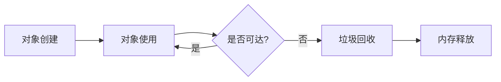
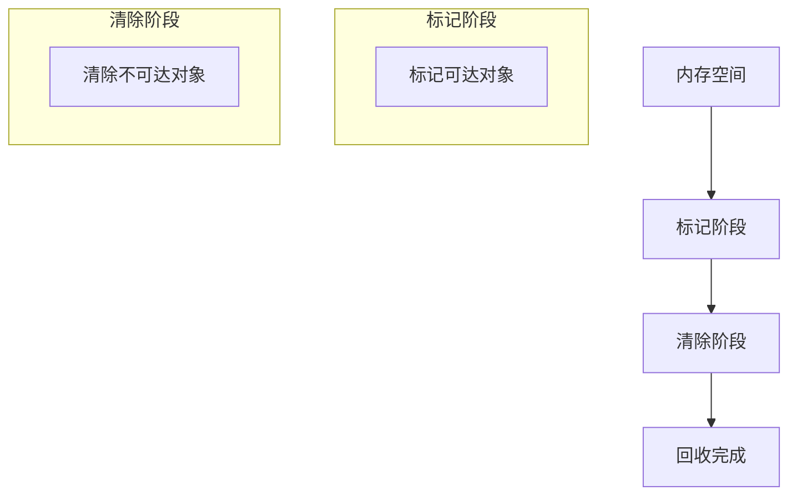
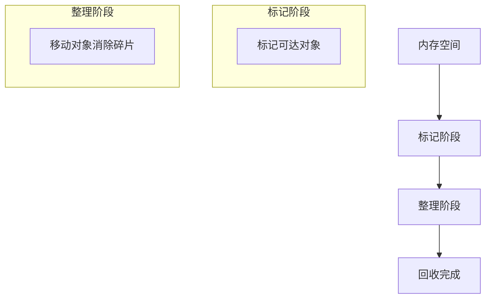
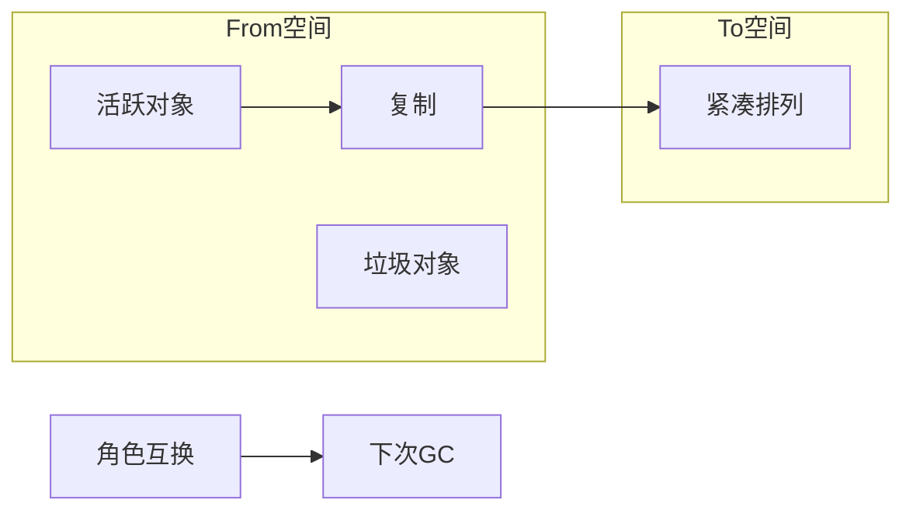
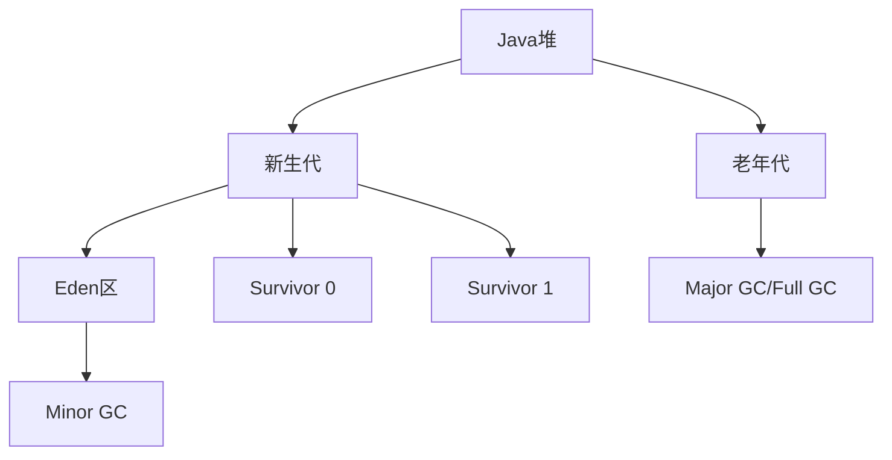
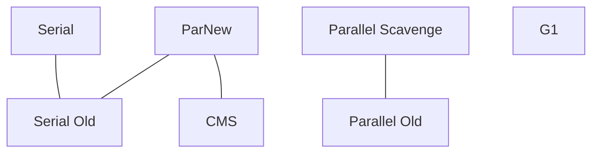
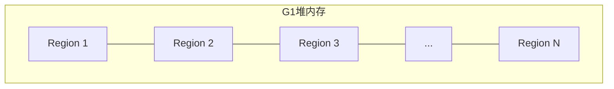
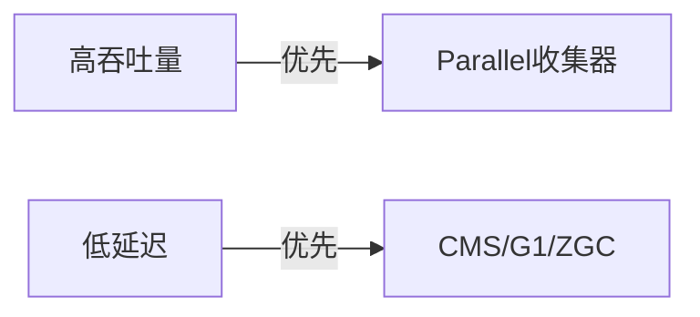
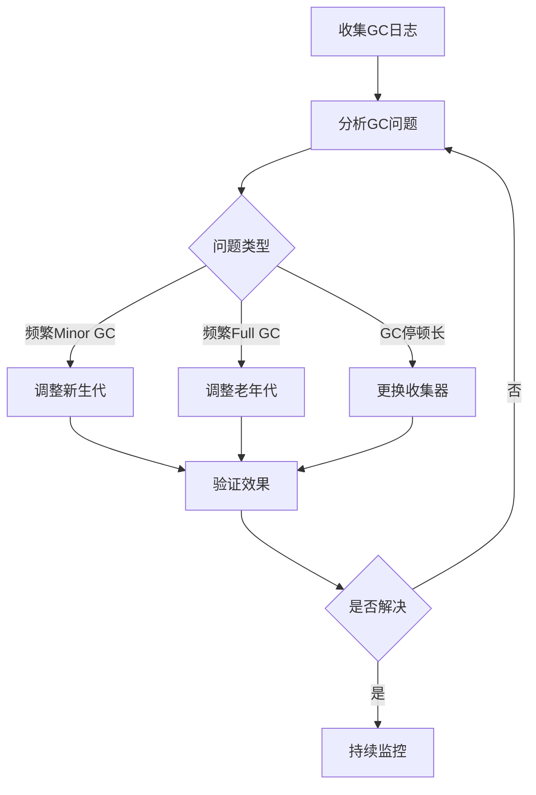

## 1. 垃圾回收基础

### 1.1 什么是垃圾回收

垃圾回收(Garbage Collection，简称GC)是JVM自动管理内存的机制，负责识别和回收不再使用的对象所占用的内存空间，防止内存泄漏，保障程序的稳定运行。



### 1.2 垃圾判定算法

<div class="grid cards" markdown>

-   **引用计数法**
    - 原理：每个对象维护一个引用计数器
    - 优点：实现简单，判定效率高
    - 缺点：无法解决循环引用问题

-   **可达性分析**
    - 原理：从GC Roots开始搜索，不可达对象视为垃圾
    - 优点：能解决循环引用问题
    - 缺点：需要STW(Stop-The-World)暂停应用

</div>

### 1.3 GC Roots包括

- 虚拟机栈中引用的对象
- 方法区中静态属性引用的对象
- 方法区中常量引用的对象
- 本地方法栈中JNI引用的对象
- 同步锁(synchronized)持有的对象

## 2. 经典垃圾回收算法

### 2.1 标记-清除算法(Mark-Sweep)



**优点**：
- 实现简单
- 与保守式GC算法兼容

**缺点**：
- 效率低下（需要遍历两次）
- 产生大量内存碎片

### 2.2 标记-整理算法(Mark-Compact)



**优点**：
- 解决内存碎片问题
- 适合对象存活率高的场景

**缺点**：
- 移动对象开销大
- 需要STW，暂停时间长

### 2.3 复制算法(Copying)



**优点**：
- 效率高
- 无内存碎片

**缺点**：
- 内存利用率低（只使用一半空间）
- 对象存活率高时复制开销大

### 2.4 分代收集算法(Generational Collection)



**原理**：
- 新生代：对象朝生夕死，使用复制算法
- 老年代：对象存活率高，使用标记-整理或标记-清除算法

**优点**：
- 针对不同年龄对象采用不同策略
- 兼顾效率和空间利用率

## 3. JVM垃圾回收器

### 3.1 新生代回收器

<div class="grid cards" markdown>

-   **Serial**
    - 单线程回收器
    - 简单高效
    - Client模式默认
    - 适用场景：单CPU环境

-   **ParNew**
    - Serial的多线程版本
    - 与CMS配合使用
    - 适用场景：多CPU环境

-   **Parallel Scavenge**
    - 关注吞吐量
    - 自适应调节策略
    - 适用场景：后台运算任务

</div>

### 3.2 老年代回收器

<div class="grid cards" markdown>

-   **Serial Old**
    - 单线程标记-整理算法
    - Client模式默认
    - 适用场景：单CPU环境

-   **Parallel Old**
    - Parallel Scavenge老年代版本
    - 多线程标记-整理算法
    - 适用场景：注重吞吐量

-   **CMS**
    - 并发标记清除
    - 低延迟为目标
    - 适用场景：交互式应用

-   **G1**
    - 区域化分代式
    - 可预测停顿时间
    - 适用场景：大内存、低延迟

</div>

### 3.3 垃圾回收器组合关系



## 4. 垃圾回收器详解

### 4.1 CMS回收器(Concurrent Mark Sweep)

CMS是一种以获取最短回收停顿时间为目标的收集器，适用于互联网站或B/S系统服务端。

**工作流程**：


**优缺点**：

| 优点 | 缺点 |
|------|------|
| 并发收集，低停顿 | 对CPU资源敏感 |
| 适合交互式应用 | 无法处理浮动垃圾 |
| 可与ParNew配合 | 产生空间碎片 |

### 4.2 G1回收器(Garbage First)

G1是一款面向服务端应用的垃圾收集器，适用于多核CPU和大内存环境。

**内存布局**：



**工作流程**：


**优缺点**：

| 优点 | 缺点 |
|------|------|
| 可预测停顿时间 | JDK8前不够成熟 |
| 区域化内存布局 | 内存占用较大 |
| 按收益优先回收 | CPU消耗较高 |

### 4.3 ZGC(Z Garbage Collector)

ZGC是JDK 11引入的低延迟垃圾收集器，目标是在任何堆大小下都能将STW时间控制在10ms以内。

**工作原理**：
- 基于Region内存布局
- 使用读屏障和染色指针
- 并发处理标记、整理和复制

**优缺点**：

| 优点 | 缺点 |
|------|------|
| 超低延迟(<10ms) | 吞吐量比G1低 |
| 可扩展至TB级内存 | 仅支持Linux/x64 |
| 与应用并发执行 | JDK11-14为实验性功能 |

## 5. 垃圾回收器性能对比

### 5.1 吞吐量vs延迟



### 5.2 适用场景对比

| 收集器 | 适用场景 | 内存范围 | Java版本 |
|-------|---------|---------|---------|
| Serial+Serial Old | 单CPU客户端 | 小内存 | JDK1.3+ |
| ParNew+CMS | 多CPU交互式应用 | 中等内存 | JDK1.4+ |
| Parallel+Parallel Old | 后台批处理 | 中等内存 | JDK1.6+ |
| G1 | 大内存低延迟 | 大内存 | JDK1.7+ |
| ZGC | 超低延迟 | 超大内存 | JDK11+ |

## 6. 垃圾回收调优

### 6.1 常用JVM参数

```bash
# 堆大小设置
-Xms<size>            # 初始堆大小
-Xmx<size>            # 最大堆大小

# 新生代设置
-XX:NewRatio=n        # 新生代与老年代比例
-XX:SurvivorRatio=n   # Eden与Survivor比例
-XX:MaxTenuringThreshold=n  # 晋升老年代阈值

# 收集器选择
-XX:+UseSerialGC      # Serial+Serial Old
-XX:+UseParNewGC      # ParNew+Serial Old
-XX:+UseParallelGC    # Parallel Scavenge+Serial Old
-XX:+UseParallelOldGC # Parallel Scavenge+Parallel Old
-XX:+UseConcMarkSweepGC # ParNew+CMS
-XX:+UseG1GC          # G1
-XX:+UseZGC           # ZGC

# GC日志
-XX:+PrintGCDetails
-XX:+PrintGCDateStamps
-Xloggc:/path/to/gc.log
```

### 6.2 调优策略

<div class="grid cards" markdown>

-   **降低Minor GC频率**
    - 增大新生代空间
    - 调整Eden与Survivor比例
    - 适当增加晋升阈值

-   **降低Full GC频率**
    - 增大老年代空间
    - 及时回收大对象
    - 控制对象晋升速度

-   **降低GC停顿时间**
    - 使用低延迟收集器(CMS/G1/ZGC)
    - 减小堆内存总量
    - 增加并行线程数

-   **提高吞吐量**
    - 使用Parallel收集器
    - 增大堆内存
    - 减少GC触发频率

</div>

### 6.3 调优步骤



## 7. 实战案例

### 7.1 频繁Full GC问题

**现象**：应用运行一段时间后，出现频繁Full GC，每次停顿时间长，影响服务响应。

**分析**：GC日志显示老年代空间不足，导致频繁Full GC

**解决方案**：
1. 增大老年代空间：`-XX:NewRatio=2`（老年代:新生代=2:1）
2. 调整对象晋升阈值：`-XX:MaxTenuringThreshold=15`
3. 使用CMS收集器：`-XX:+UseConcMarkSweepGC`

**效果**：Full GC频率从每小时5-6次降至每天1-2次，停顿时间从500ms降至200ms以内

### 7.2 内存碎片问题

**现象**：使用CMS收集器，虽然老年代空间充足，但仍然频繁触发Full GC

**分析**：CMS使用标记-清除算法，产生大量内存碎片，无法分配大对象

**解决方案**：
1. 开启内存碎片整理：`-XX:+UseCMSCompactAtFullCollection`
2. 设置碎片整理触发阈值：`-XX:CMSFullGCsBeforeCompaction=5`
3. 考虑切换到G1收集器：`-XX:+UseG1GC`

**效果**：大对象分配失败导致的Full GC次数显著减少

## 8. 常见问题与解决方案

### 8.1 内存泄漏

**症状**：
- 老年代对象持续增长
- Full GC后内存占用不降低
- 最终导致OutOfMemoryError

**排查工具**：
- JVisualVM
- MAT(Memory Analyzer Tool)
- JProfiler

**常见原因**：
- 集合类引用未清理
- 静态字段持有对象
- 线程局部变量未释放
- 连接/IO资源未关闭

### 8.2 过早晋升

**症状**：
- 短生命周期对象进入老年代
- 增加Full GC频率

**解决方案**：
- 增大新生代空间：`-Xmn`或`-XX:NewRatio`
- 增加Survivor空间：`-XX:SurvivorRatio=8`
- 调整晋升阈值：`-XX:MaxTenuringThreshold=15`

### 8.3 Stop-The-World过长

**症状**：
- 应用周期性出现长时间停顿
- 响应时间波动大

**解决方案**：
- 使用并发收集器：CMS/G1/ZGC
- 减小堆内存大小
- 控制对象创建速率
- 增加GC线程数：`-XX:ParallelGCThreads=N`

## 9. 最佳实践

### 9.1 选择合适的垃圾回收器

- **Web应用**：CMS或G1，注重低延迟
- **批处理系统**：Parallel，注重高吞吐量
- **微服务**：G1，平衡吞吐量和延迟
- **实时交易系统**：ZGC，超低延迟

### 9.2 堆内存配置

- 初始堆大小等于最大堆大小：`-Xms=Xmx`，避免堆调整
- 新生代大小：总堆的25%-50%，根据对象存活率调整
- 避免设置过大堆：增加GC停顿时间
- 避免设置过小堆：增加GC频率

### 9.3 监控与分析

- 开启GC日志：`-XX:+PrintGCDetails -XX:+PrintGCDateStamps`
- 使用工具分析：GCViewer、GCeasy
- 定期检查GC趋势，及时调优
- 建立性能基准，对比调优效果
