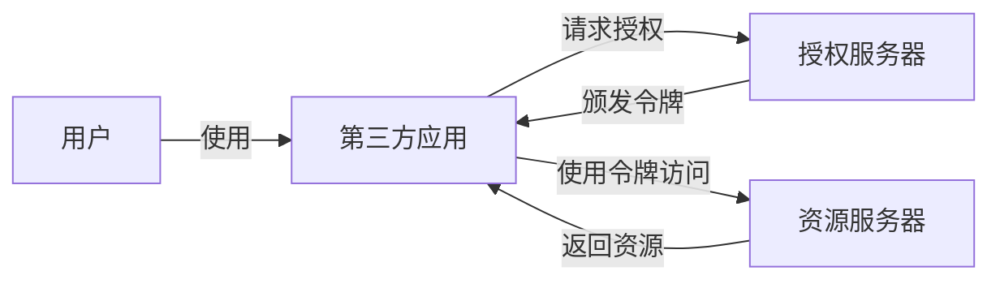
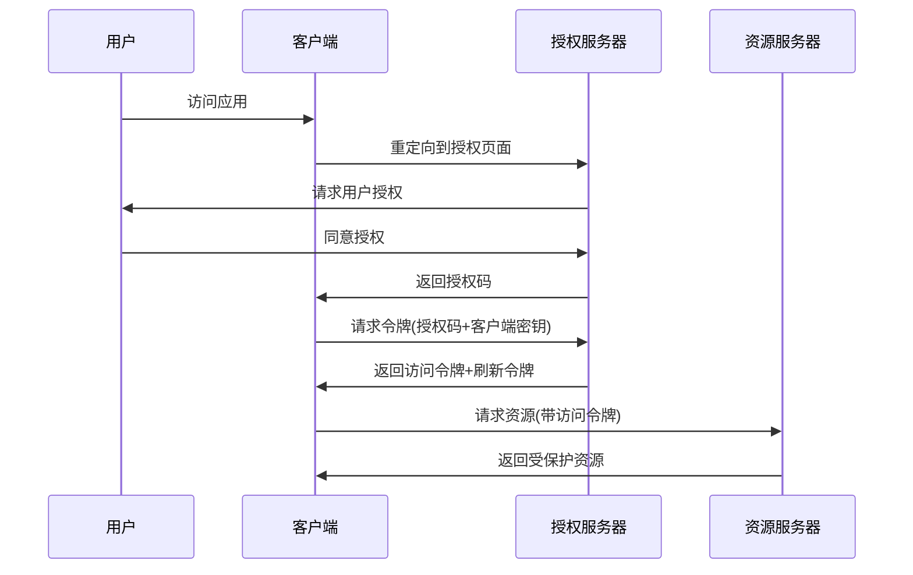
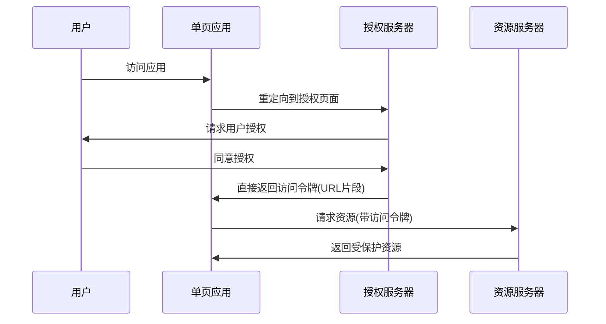
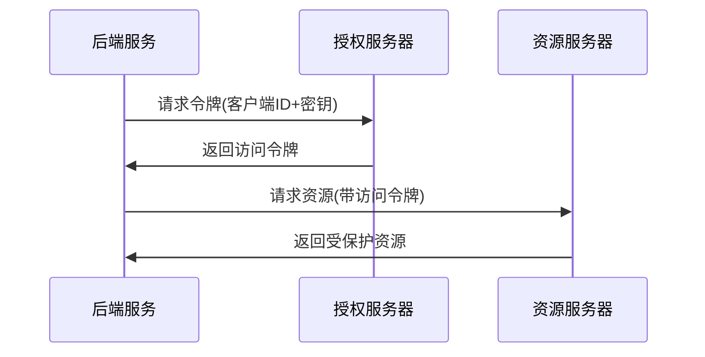
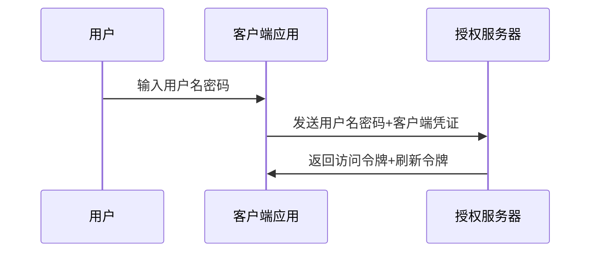
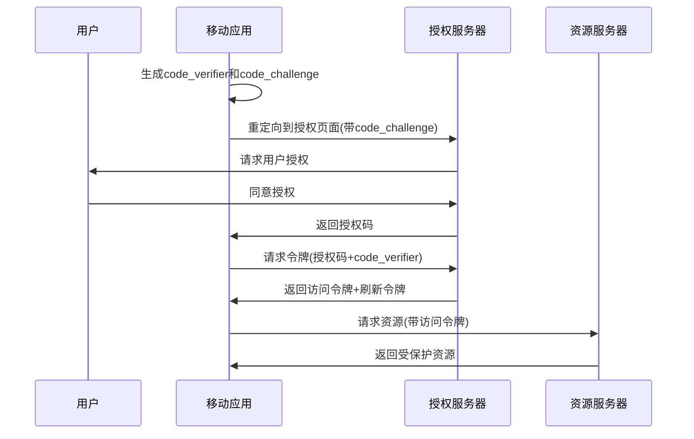
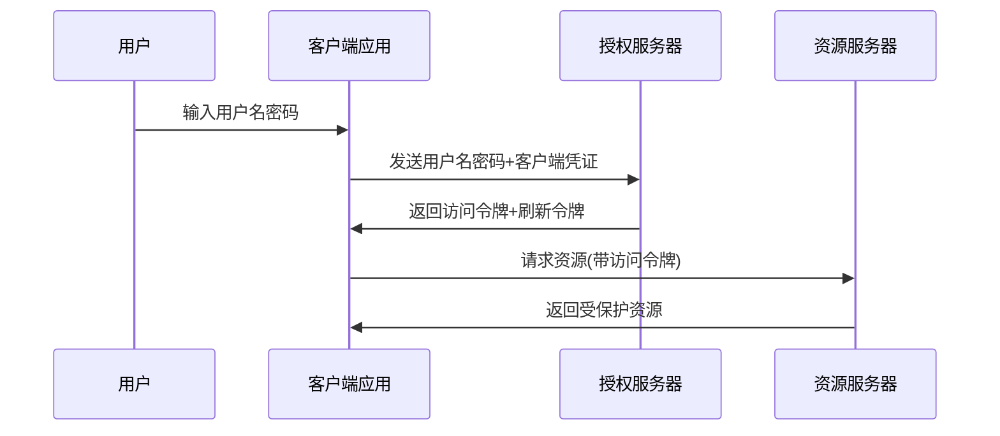

## 1. OAuth2基础概念

### 1.1 什么是OAuth2

OAuth2是一个授权框架，允许第三方应用在不获取用户凭证的情况下，获得对用户资源的有限访问权限。它通过将用户认证委托给托管用户账户的服务，并授权第三方应用访问用户账户来解决这一问题。



### 1.2 核心角色

<div class="grid cards" markdown>

-   **资源所有者**
    - 通常是用户本人
    - 能够授予对受保护资源的访问权限
    - 与授权服务器进行交互以批准授权

-   **客户端**
    - 请求访问受保护资源的应用
    - 可以是Web应用、移动应用或桌面应用
    - 需要在授权服务器注册

-   **授权服务器**
    - 验证资源所有者身份
    - 获取资源所有者授权
    - 颁发访问令牌给客户端

-   **资源服务器**
    - 托管受保护的资源
    - 接受并验证访问令牌
    - 根据令牌权限提供资源访问

</div>

### 1.3 令牌类型

| 令牌类型 | 描述 | 用途 | 生命周期 |
|---------|------|------|---------|
| 访问令牌 | 用于访问受保护资源的凭证 | API调用授权 | 短期(小时级) |
| 刷新令牌 | 用于获取新访问令牌 | 延长会话 | 长期(天/月级) |
| ID令牌 | 包含用户身份信息(OpenID Connect) | 用户认证 | 与访问令牌相同 |

## 2. 授权流程

### 2.1 授权码模式

最安全的OAuth2流程，适用于服务端应用。



**安全特点**：
- 客户端密钥不暴露给浏览器
- 授权码只使用一次
- 支持刷新令牌

### 2.2 隐式模式

简化的流程，适用于无法安全存储客户端密钥的公共客户端。



**安全考量**：
- 令牌直接暴露在浏览器
- 不支持刷新令牌
- OAuth 2.1已不推荐使用

### 2.3 客户端凭证模式

服务器到服务器的通信，无用户参与。



**适用场景**：
- 微服务间通信
- 后台作业
- 系统集成

### 2.4 密码模式

直接使用用户名密码获取令牌，仅适用于高度可信的第一方应用。



**安全风险**：
- 客户端直接处理用户凭证
- OAuth 2.1已不推荐使用

### 2.5 PKCE增强授权码模式

为公共客户端(如移动应用、SPA)设计的安全流程。



**安全增强**：
- 防止授权码拦截攻击
- 无需客户端密钥
- OAuth 2.1推荐的公共客户端流程

### 2.5 密码模式

直接使用用户名密码获取令牌，仅适用于高度可信的第一方应用。



**安全风险**：
- 客户端直接处理用户凭证
- OAuth 2.1已不推荐使用
- 仅适用于无法实现其他流程的场景

## 3. 安全最佳实践 {#security}

### 3.1 令牌安全

1. **使用短期访问令牌**：
   - 访问令牌有效期: 15-60分钟
   - 刷新令牌有效期: 14-30天

2. **令牌存储**：
   - 服务端应用：安全的服务器存储
   - 浏览器应用：内存存储优于localStorage
   - 移动应用：安全加密存储

3. **传输安全**：
   - 必须使用HTTPS
   - 避免URL参数传递令牌
   - 使用Authorization头传递令牌

### 3.2 客户端安全

1. **客户端注册**：
   - 使用动态客户端注册
   - 验证重定向URI
   - 限制授权范围

2. **防止CSRF攻击**：
   - 使用state参数
   - 验证请求来源
   - 实现CSRF令牌

## 4. OAuth 2.1新特性

OAuth 2.1是对OAuth 2.0的简化和安全增强版本。

### 4.1 主要变更

| 变更 | 描述 |
|------|------|
| 移除隐式流程 | 不再支持隐式授权类型 |
| 移除密码模式 | 不再支持资源所有者密码凭证授权类型 |
| 强制PKCE | 所有公共客户端必须使用PKCE |
| 强制使用HTTPS | 所有端点必须使用HTTPS |
| 重定向URI限制 | 更严格的重定向URI验证 |

### 4.2 安全增强

1. **强制使用PKCE**：
   - 所有客户端类型都应使用PKCE
   - 防止授权码拦截攻击

2. **令牌绑定**：
   - 将访问令牌绑定到客户端
   - 防止令牌被盗用

3. **JWT最佳实践**：
   - 使用适当的算法(如RS256)
   - 验证所有声明
   - 实施适当的密钥轮换

## 5. 常见问题解答

### 5.1 OAuth2与认证的关系

OAuth2主要是一个**授权**框架，而非**认证**协议。它解决的是"应用A如何访问应用B中的用户数据"问题，而非"这个用户是谁"的问题。

OpenID Connect(OIDC)是建立在OAuth2之上的认证层，添加了ID令牌和用户信息端点，用于解决认证问题。

### 5.2 选择合适的授权流程

| 客户端类型 | 推荐流程 | 备注 |
|----------|---------|------|
| 服务端Web应用 | 授权码 | 可以安全存储客户端密钥 |
| 单页应用(SPA) | 授权码+PKCE | 替代不安全的隐式流程 |
| 移动应用 | 授权码+PKCE | 防止授权码拦截 |
| 后台服务/API | 客户端凭证 | 无用户参与的场景 |

### 5.3 刷新令牌最佳实践

1. **安全存储**：刷新令牌必须安全存储，与访问令牌分开
2. **轮换策略**：每次使用刷新令牌后应颁发新的刷新令牌
3. **检测滥用**：实现刷新令牌轮换检测，防止令牌泄露

## 6. 实现示例

### 6.1 授权服务器(Spring Security)

```java
@Configuration
public class AuthServerConfig {
    @Bean
    public RegisteredClientRepository clientRepository() {
        RegisteredClient client = RegisteredClient.withId("client-id")
            .clientId("client")
            .clientSecret("{noop}secret")
            .authorizationGrantType(AuthorizationGrantType.AUTHORIZATION_CODE)
            .authorizationGrantType(AuthorizationGrantType.REFRESH_TOKEN)
            .redirectUri("https://client.example.com/callback")
            .scope("read")
            .build();
            
        return new InMemoryRegisteredClientRepository(client);
    }
}
```

### 6.2 资源服务器

```java
@Configuration
@EnableWebSecurity
public class ResourceServerConfig {
    @Bean
    public SecurityFilterChain securityFilterChain(HttpSecurity http) throws Exception {
        http.authorizeHttpRequests(authorize -> authorize
                .requestMatchers("/api/public/**").permitAll()
                .requestMatchers("/api/user/**").hasAuthority("SCOPE_read")
                .anyRequest().authenticated()
            )
            .oauth2ResourceServer(oauth2 -> oauth2.jwt());
            
        return http.build();
    }
}
```

### 6.3 前端PKCE实现(关键步骤)

```javascript
// 1. 生成code_verifier和code_challenge
const codeVerifier = generateRandomString(128);
const codeChallenge = base64UrlEncode(
  await crypto.subtle.digest("SHA-256", new TextEncoder().encode(codeVerifier))
);

// 2. 发起授权请求
const authUrl = `https://auth-server.com/oauth2/authorize?
  response_type=code&
  client_id=spa-client&
  code_challenge=${codeChallenge}&
  code_challenge_method=S256`;

// 3. 交换授权码获取令牌
const tokenResponse = await fetch("https://auth-server.com/oauth2/token", {
  method: "POST",
  body: `grant_type=authorization_code&
         code=${code}&
         code_verifier=${codeVerifier}`
});
```

## 7. 总结

OAuth2是现代API安全的基础，提供了灵活的授权框架，适用于各种应用场景。选择合适的授权流程并遵循安全最佳实践至关重要。

随着OAuth 2.1的推出，安全性得到进一步增强，特别是对公共客户端的保护。PKCE的广泛应用和对不安全流程的废弃，使OAuth生态系统更加安全可靠。

无论是构建API还是集成第三方服务，理解OAuth2的核心概念和安全实践都是现代应用开发的必备技能。
