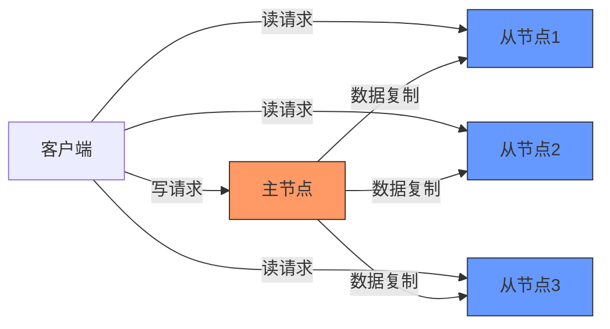
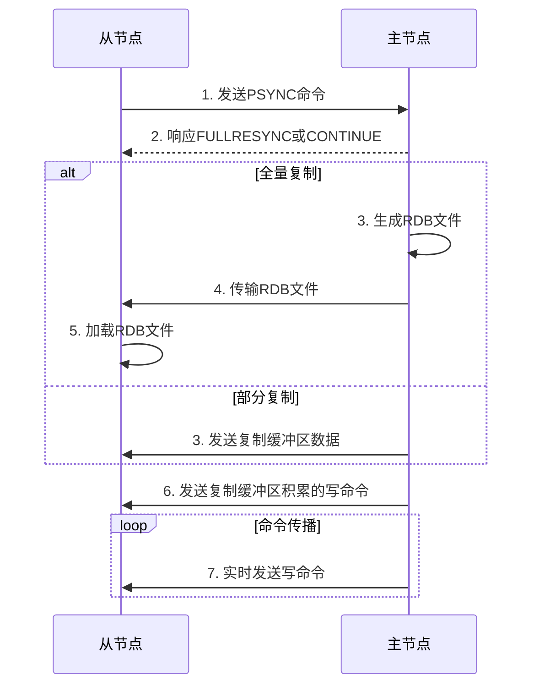
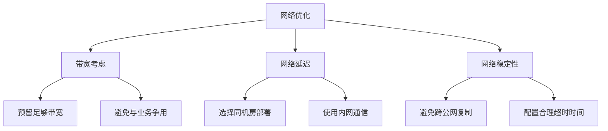

> Redis主从复制是构建高可用Redis系统的基础，通过将数据从主节点复制到从节点，实现数据备份、负载均衡和故障恢复。本文深入探讨Redis主从复制的工作原理、实现方式和最佳实践。


## 1. 主从复制概述

### 1.1 什么是主从复制

Redis主从复制(Replication)是指将一台Redis服务器(主节点，master)的数据，复制到其他Redis服务器(从节点，slave)的过程。通过主从复制，可以实现数据的备份，提高系统的可用性和读性能。



### 1.2 主从复制的作用

<div class="grid cards" markdown>

-   **数据备份**
    - 实现数据的热备份
    - 避免单点故障
    - 提高数据安全性

-   **负载均衡**
    - 主节点处理写操作
    - 从节点处理读操作
    - 提高系统整体性能

-   **高可用基础**
    - 为故障转移提供基础
    - 是Redis Sentinel和Cluster的基础
    - 支持动态扩容

-   **数据分流**
    - 减轻主服务器压力
    - 提高系统响应速度
    - 支持就近访问

</div>

## 2. 主从复制原理

### 2.1 复制流程

Redis主从复制的完整流程包括连接建立、数据同步和命令传播三个阶段。



### 2.2 全量复制

全量复制(Full Resynchronization)是Redis主从复制的一种方式，用于初次复制或无法进行部分复制时。

**全量复制流程**：

1. **从节点发送PSYNC命令**：从节点向主节点发送PSYNC命令，请求复制数据
2. **主节点响应FULLRESYNC**：主节点返回FULLRESYNC响应，表示需要进行全量复制
3. **主节点执行BGSAVE**：主节点执行BGSAVE命令，生成RDB文件
4. **主节点传输RDB文件**：主节点将RDB文件发送给从节点
5. **从节点加载RDB文件**：从节点清空自身数据，加载接收到的RDB文件
6. **主节点发送缓冲区数据**：主节点将复制期间收到的写命令发送给从节点
7. **复制完成**：从节点完成数据加载，与主节点数据一致

### 2.3 部分复制

部分复制(Partial Resynchronization)是Redis 2.8引入的特性，用于处理主从节点短时间断线后的复制。

**部分复制流程**：

1. **从节点发送PSYNC命令**：从节点发送PSYNC [runid] [offset]命令
2. **主节点验证复制偏移量**：检查请求的偏移量是否在复制积压缓冲区内
3. **主节点响应CONTINUE**：如果可以进行部分复制，主节点返回CONTINUE响应
4. **主节点发送缺失数据**：主节点从复制积压缓冲区中发送从节点缺失的数据
5. **复制恢复**：从节点接收并应用缺失的数据，恢复复制状态

### 2.4 命令传播

命令传播(Command Propagation)是指在主从节点完成数据同步后，主节点将自己执行的写命令实时发送给从节点的过程。

**命令传播特点**：

- 主节点接收到写命令后，先执行命令，再将命令发送给所有从节点
- 命令以追加方式写入复制积压缓冲区，并发送给从节点
- 从节点接收到命令后，执行命令，保持与主节点数据一致
- 命令传播是异步进行的，可能存在主从数据短暂不一致的情况

## 3. 主从复制配置

### 3.1 从节点配置

配置Redis从节点有三种方式：

#### 3.1.1 配置文件方式

在redis.conf文件中添加以下配置：

```conf
# 指定主节点的IP和端口
replicaof 192.168.1.100 6379

# 如果主节点设置了密码，需要配置主节点密码
masterauth "your_master_password"

# 从节点是否只读（建议设置为yes）
replica-read-only yes
```

#### 3.1.2 启动参数方式

在启动Redis服务时，通过命令行参数指定主节点：

```bash
redis-server --replicaof 192.168.1.100 6379 --masterauth "your_master_password"
```

#### 3.1.3 运行时命令方式

在Redis运行过程中，通过REPLICAOF命令动态设置主节点：

```bash
# 连接到Redis客户端
redis-cli

# 执行REPLICAOF命令
> REPLICAOF 192.168.1.100 6379
OK

# 如果主节点有密码，设置主节点密码
> CONFIG SET masterauth "your_master_password"
OK
```

### 3.2 主节点配置

主节点不需要特殊配置即可接受从节点的连接，但可以进行一些优化配置：

```conf
# 设置主节点密码（可选，提高安全性）
requirepass "your_master_password"

# 配置复制积压缓冲区大小（默认1MB，建议根据写入量调整）
repl-backlog-size 100mb

# 配置复制积压缓冲区存活时间（默认3600秒）
repl-backlog-ttl 3600

# 配置主节点最少从节点数量（可选，提高可用性）
min-replicas-to-write 1
min-replicas-max-lag 10
```

### 3.3 验证主从状态

通过以下命令验证主从复制状态：

```bash
# 在主节点执行，查看复制相关信息
redis-cli> INFO replication

# 输出示例（主节点）
# Replication
role:master
connected_slaves:2
slave0:ip=192.168.1.101,port=6379,state=online,offset=1234,lag=0
slave1:ip=192.168.1.102,port=6379,state=online,offset=1234,lag=1
...

# 在从节点执行，查看复制相关信息
redis-cli> INFO replication

# 输出示例（从节点）
# Replication
role:slave
master_host:192.168.1.100
master_port:6379
master_link_status:up
master_last_io_seconds_ago:5
master_sync_in_progress:0
...
```

## 4. 主从复制优化

### 4.1 网络优化



**网络优化建议**：

1. **带宽规划**：确保主从节点之间有足够的网络带宽，特别是进行全量复制时
2. **网络质量**：尽量使用内网通信，避免跨公网进行复制
3. **部署位置**：主从节点尽量部署在同一机房或同一可用区，减少网络延迟
4. **超时配置**：根据网络情况调整复制超时参数

```conf
# 复制超时时间（默认60秒）
repl-timeout 60

# 复制连接空闲超时时间（默认0，表示不超时）
repl-ping-replica-period 10
```

### 4.2 复制积压缓冲区优化

复制积压缓冲区(replication backlog)是一个用于部分复制的环形缓冲区，合理配置可以减少全量复制的次数。

**优化建议**：

1. **合理设置大小**：根据主节点写入量和从节点可能断线的最长时间来设置
2. **计算公式**：`repl-backlog-size = 写入速率 * 可能断线的最长时间 * 2`
3. **监控使用情况**：通过INFO replication命令监控积压缓冲区使用情况

```conf
# 设置复制积压缓冲区大小为1GB
repl-backlog-size 1gb

# 设置复制积压缓冲区存活时间（主节点没有从节点时，多久后释放积压缓冲区）
repl-backlog-ttl 7200
```

### 4.3 磁盘优化

全量复制过程中，主节点需要生成RDB文件，从节点需要加载RDB文件，磁盘性能对复制效率有重要影响。

**优化建议**：

1. **使用SSD**：使用SSD存储Redis数据和RDB文件，提高读写速度
2. **预留足够空间**：确保磁盘有足够空间存储RDB文件（至少是内存数据大小的两倍）
3. **避免磁盘竞争**：Redis实例和其他IO密集型应用尽量不要共用磁盘
4. **调整RDB压缩级别**：在CPU和网络带宽之间权衡，选择合适的RDB压缩级别

```conf
# 设置RDB压缩级别（0-9，0表示不压缩，默认为6）
rdbcompression yes
rdb-compression-level 6
```

### 4.4 从节点数量优化

从节点数量会影响主节点的性能，需要根据实际情况进行优化。

**优化建议**：

1. **控制直连从节点数量**：一般建议直接连接到主节点的从节点不超过10个
2. **使用级联复制**：当从节点较多时，可以使用级联复制结构，减轻主节点压力
3. **监控主节点负载**：通过INFO命令监控主节点CPU使用率和网络流量

```mermaid
graph TD
    M[主节点] --> S1[从节点1]
    M --> S2[从节点2]
    M --> S3[从节点3]
    S1 --> SS1[子从节点1]
    S1 --> SS2[子从节点2]
    S2 --> SS3[子从节点3]
    S2 --> SS4[子从节点4]
    
    style M fill:#f96,stroke:#333
    style S1 fill:#69f,stroke:#333
    style S2 fill:#69f,stroke:#333
    style S3 fill:#69f,stroke:#333
    style SS1 fill:#9cf,stroke:#333
    style SS2 fill:#9cf,stroke:#333
    style SS3 fill:#9cf,stroke:#333
    style