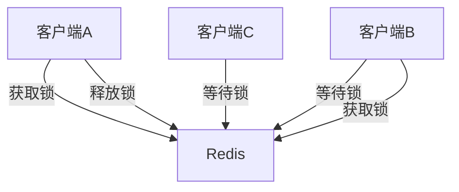
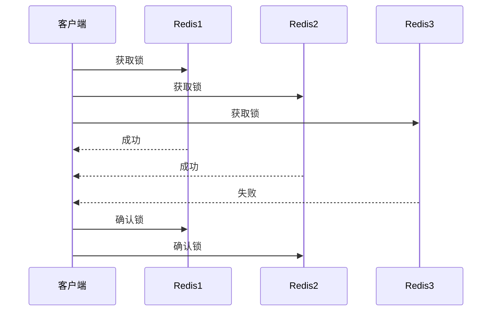
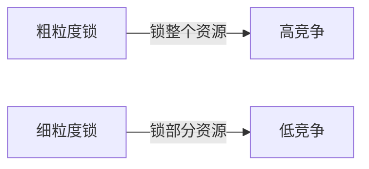

> 分布式锁是分布式系统中实现互斥访问共享资源的重要机制。Redis因其高性能和原子操作特性，成为实现分布式锁的常用方案。本文详细介绍Redis分布式锁的各种实现方式、算法原理和最佳实践。

## 1. 分布式锁概述

### 1.1 什么是分布式锁

分布式锁是在分布式系统中，多个节点之间协调对共享资源访问的同步机制。它具有以下特性：

- **互斥性**：同一时刻只有一个客户端能持有锁
- **安全性**：锁只能由持有者释放
- **容错性**：即使部分节点故障，锁服务仍可用
- **避免死锁**：锁最终能被释放，不会永久阻塞



### 1.2 分布式锁的应用场景

| 场景 | 说明 |
|------|------|
| 秒杀系统 | 防止超卖 |
| 分布式任务调度 | 避免重复执行 |
| 缓存更新 | 防止缓存击穿 |
| 全局配置变更 | 保证配置一致性 |

## 2. Redis实现分布式锁的方式

### 2.1 基本实现方案

#### SETNX + EXPIRE方案

```bash
# 获取锁
SET lock_key unique_value NX EX 30

# 释放锁
if redis.call("get",KEYS[1]) == ARGV[1] then
    return redis.call("del",KEYS[1])
else
    return 0
end
```

#### 优缺点分析

**优点**：
- 实现简单
- 性能高

**缺点**：
- 非公平锁
- 锁续期问题
- 单点故障风险

### 2.2 Redisson实现

Redisson提供了完整的分布式锁实现：

```java
RLock lock = redisson.getLock("myLock");
try {
    // 尝试加锁，最多等待100秒，锁自动释放时间30秒
    boolean res = lock.tryLock(100, 30, TimeUnit.SECONDS);
    if (res) {
        // 业务逻辑
    }
} finally {
    lock.unlock();
}
```

## 3. Redlock算法

### 3.1 Redlock原理

Redlock是Redis官方推荐的分布式锁算法，基于多个独立Redis节点：

1. 获取当前时间戳
2. 依次向N个Redis节点获取锁
3. 计算获取锁耗时
4. 当从多数节点获取锁成功，且总耗时小于锁有效期时，认为获取成功
5. 锁有效时间 = 初始有效时间 - 获取锁耗时
6. 如果获取失败，向所有节点释放锁



### 3.2 Redlock实现

```bash
# 获取锁
SET lock_key unique_value NX PX 30000

# 释放锁
if redis.call("get",KEYS[1]) == ARGV[1] then
    return redis.call("del",KEYS[1])
else
    return 0
end
```

## 4. 分布式锁最佳实践

### 4.1 锁续期方案

```java
// Redisson的看门狗机制
private void scheduleExpirationRenewal(long threadId) {
    // 每10秒续期一次
    Timeout task = commandExecutor.getConnectionManager()
        .newTimeout(new TimerTask() {
            @Override
            public void run(Timeout timeout) throws Exception {
                // 续期逻辑
                renewExpiration();
            }
        }, internalLockLeaseTime / 3, TimeUnit.MILLISECONDS);
}
```

### 4.2 避免常见陷阱

1. **非原子操作问题**：
   - 错误：先SETNX再EXPIRE
   - 正确：使用原子命令`SET key value NX EX seconds`

2. **锁误释放问题**：
   - 错误：直接DEL删除锁
   - 正确：验证value再删除

3. **锁续期问题**：
   - 错误：不处理业务超时
   - 正确：实现锁续期机制

## 5. 常见问题与解决方案

### 5.1 锁等待问题

**问题表现**：
- 大量客户端等待同一个锁
- 系统吞吐量下降

**解决方案**：
1. 实现锁分段
2. 使用公平锁
3. 优化锁粒度

### 5.2 锁续期失败

**问题表现**：
- 业务未完成但锁已过期
- 其他客户端获取到锁导致数据不一致

**解决方案**：
1. 实现自动续期机制
2. 合理设置锁超时时间
3. 监控锁续期状态

### 5.3 集群脑裂问题

**问题表现**：
- 网络分区导致多个客户端持有锁
- 数据不一致

**解决方案**：
1. 使用Redlock等多节点方案
2. 设置合理的超时时间
3. 实现锁状态检查机制

## 6. 性能优化建议

### 6.1 锁粒度优化



### 6.2 读写锁分离

```java
// Redisson读写锁示例
RReadWriteLock rwLock = redisson.getReadWriteLock("myLock");
RLock readLock = rwLock.readLock();
RLock writeLock = rwLock.writeLock();

// 读操作
readLock.lock();
try {
    // 读取数据
} finally {
    readLock.unlock();
}

// 写操作
writeLock.lock();
try {
    // 修改数据
} finally {
    writeLock.unlock();
}
```

### 6.3 监控与告警

1. **监控指标**：
   - 锁等待时间
   - 锁持有时间
   - 锁竞争次数

2. **告警阈值**：
   - 锁等待超过1秒
   - 锁持有超过10秒
   - 锁竞争率超过50%
