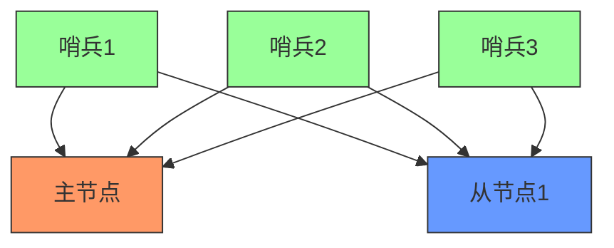
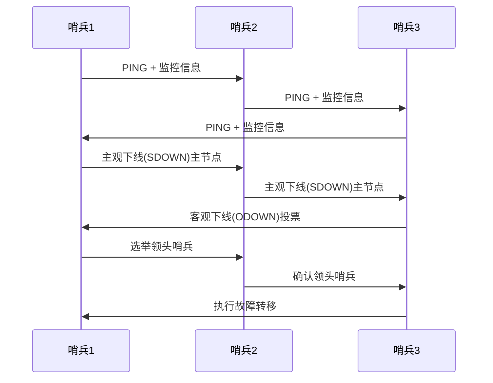
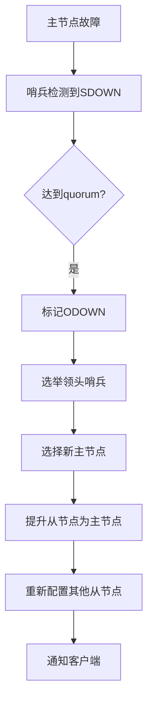
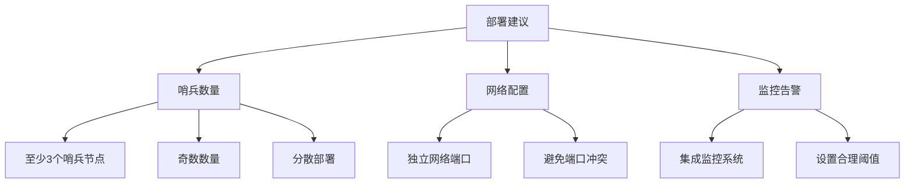

> Redis哨兵(Sentinel)是Redis官方推荐的高可用性解决方案，用于管理Redis主从复制集群，实现自动故障检测和故障转移。本文详细介绍哨兵系统的工作原理、配置方法和最佳实践。

## 1. 哨兵系统概述

### 1.1 什么是哨兵

Redis哨兵是一个分布式系统，用于监控Redis主从服务器，并在主服务器故障时自动进行故障转移。哨兵系统的主要功能包括：

- **监控**：持续检查主从服务器是否正常运行
- **通知**：当被监控的Redis实例出现问题时，通过API通知系统管理员
- **自动故障转移**：当主节点不可用时，自动将从节点升级为主节点
- **配置提供者**：为客户端提供服务发现功能，返回当前可用的主节点地址



### 1.2 哨兵系统特性

<div class="grid cards" markdown>

-   **高可用性**
    - 自动检测节点故障
    - 自动进行故障转移
    - 避免单点故障

-   **分布式设计**
    - 多个哨兵节点协同工作
    - 基于Raft协议实现共识
    - 避免脑裂问题

-   **服务发现**
    - 客户端可以通过哨兵获取当前主节点
    - 自动更新配置
    - 无需手动修改客户端配置

-   **监控告警**
    - 实时监控Redis实例状态
    - 支持多种通知方式
    - 可集成到监控系统

</div>

## 2. 哨兵工作原理

### 2.1 哨兵节点通信

哨兵节点之间通过发布/订阅频道进行通信，主要交换以下信息：

1. **心跳检测**：定期向其他哨兵发送PING命令
2. **主观下线(SDOWN)**：当哨兵认为某个Redis实例不可用时
3. **客观下线(ODOWN)**：当多个哨兵达成共识认为主节点不可用时
4. **故障转移**：选举领头哨兵并执行故障转移



### 2.2 故障检测流程

1. **主观下线(Subjectively Down)**：
   - 单个哨兵节点检测到主节点无响应
   - 标记主节点为SDOWN状态
   - 向其他哨兵节点发送SDOWN通知

2. **客观下线(Objectively Down)**：
   - 当足够数量的哨兵(quorum)确认主节点不可达
   - 标记主节点为ODOWN状态
   - 开始故障转移流程

3. **领头哨兵选举**：
   - 使用Raft协议选举领头哨兵
   - 只有获得多数票的哨兵才能成为领头哨兵
   - 领头哨兵负责执行故障转移

4. **故障转移**：
   - 选择最合适的从节点作为新主节点
   - 将从节点提升为主节点
   - 配置其他从节点复制新主节点
   - 更新客户端配置

## 3. 哨兵配置方法

### 3.1 哨兵基本配置

创建哨兵配置文件`sentinel.conf`：

```conf
# 哨兵端口
port 26379

# 监控的主节点名称、IP、端口和quorum数量
sentinel monitor mymaster 127.0.0.1 6379 2

# 主节点超时时间（毫秒）
sentinel down-after-milliseconds mymaster 30000

# 故障转移超时时间（毫秒）
sentinel failover-timeout mymaster 180000

# 并行同步的从节点数量
sentinel parallel-syncs mymaster 1

# 主节点密码（如果有）
sentinel auth-pass mymaster yourpassword
```

### 3.2 启动哨兵

启动哨兵服务：

```bash
redis-sentinel /path/to/sentinel.conf
```

或者：

```bash
redis-server /path/to/sentinel.conf --sentinel
```

### 3.3 多哨兵部署

为了实现高可用，建议部署至少3个哨兵节点：

```conf
# 哨兵1配置
port 26379
sentinel monitor mymaster 192.168.1.100 6379 2

# 哨兵2配置
port 26380
sentinel monitor mymaster 192.168.1.100 6379 2

# 哨兵3配置
port 26381
sentinel monitor mymaster 192.168.1.100 6379 2
```

## 4. 哨兵监控与故障转移

### 4.1 监控Redis实例

哨兵会定期向Redis实例发送以下命令进行监控：

1. **INFO命令**：获取主从复制信息
2. **PING命令**：检查实例是否存活
3. **PUBLISH命令**：与其他哨兵通信

### 4.2 故障转移流程



### 4.3 验证哨兵状态

使用Redis CLI连接哨兵节点查看状态：

```bash
redis-cli -p 26379

# 查看主节点信息
> SENTINEL get-master-addr-by-name mymaster
1) "192.168.1.100"
2) "6379"

# 查看所有哨兵节点
> SENTINEL sentinels mymaster

# 查看监控的主节点信息
> SENTINEL master mymaster

# 查看从节点信息
> SENTINEL slaves mymaster
```

## 5. 哨兵最佳实践

### 5.1 部署建议



**具体建议**：

1. **哨兵数量**：部署至少3个哨兵节点，且数量为奇数
2. **节点分布**：将哨兵节点分散在不同物理机上
3. **网络配置**：为哨兵配置独立的网络端口(默认26379)
4. **监控告警**：集成哨兵到监控系统，设置合理的告警阈值
5. **日志记录**：配置适当的哨兵日志级别，便于故障排查

### 5.2 配置优化

```conf
# 调整故障检测灵敏度
sentinel down-after-milliseconds mymaster 5000

# 调整故障转移超时时间
sentinel failover-timeout mymaster 60000

# 调整并行同步数量
sentinel parallel-syncs mymaster 2

# 启用通知脚本
sentinel notification-script mymaster /path/to/notify.sh

# 启用客户端重配置脚本
sentinel client-reconfig-script mymaster /path/to/reconfig.sh
```

### 5.3 客户端集成

客户端连接Redis时应通过哨兵获取主节点地址：

```python
from redis.sentinel import Sentinel

# 配置哨兵列表
sentinels = [
    ('192.168.1.101', 26379),
    ('192.168.1.102', 26379),
    ('192.168.1.103', 26379)
]

# 创建哨兵连接
sentinel = Sentinel(sentinels, socket_timeout=0.1)

# 获取主节点连接
master = sentinel.master_for('mymaster', socket_timeout=0.1)

# 获取从节点连接
slave = sentinel.slave_for('mymaster', socket_timeout=0.1)
```

## 6. 常见问题与解决方案

### 6.1 脑裂问题(Split-Brain)

**问题表现**：
- 网络分区导致多个主节点同时存在
- 数据不一致
- 客户端连接到不同的主节点

**解决方案**：
1. **合理设置quorum**：确保多数哨兵能达成共识
2. **配置min-slaves-to-write**：主节点必须有足够从节点才接受写操作
3. **设置适当的超时时间**：避免过早触发故障转移

```conf
# 主节点配置
min-replicas-to-write 1
min-replicas-max-lag 10

# 哨兵配置
sentinel down-after-milliseconds mymaster 5000
```

### 6.2 故障转移失败

**问题表现**：
- 主节点故障但未自动切换
- 哨兵日志显示选举失败
- 客户端持续连接失败

**解决方案**：
1. **检查哨兵数量**：确保有足够哨兵达成共识
2. **检查网络连接**：确保哨兵之间可以通信
3. **检查从节点状态**：确保有健康的从节点可提升
4. **检查配置一致性**：所有哨兵配置应一致

### 6.3 哨兵节点故障

**问题表现**：
- 部分哨兵节点不可用
- 无法达成quorum数量
- 故障转移无法触发

**解决方案**：
1. **增加哨兵节点**：部署更多哨兵提高容错能力
2. **监控哨兵健康**：将哨兵纳入监控系统
3. **自动恢复机制**：配置哨兵自动重启
4. **定期检查日志**：及时发现并解决问题

### 6.4 客户端连接问题

**问题表现**：
- 客户端无法获取主节点地址
- 客户端持续使用旧的主节点地址
- 连接超时或失败

**解决方案**：
1. **实现正确的客户端逻辑**：正确处理连接断开和重试
2. **配置合理的超时时间**：避免长时间阻塞
3. **使用支持哨兵的客户端库**：如Redis-py等
4. **实现重试机制**：自动重试获取新主节点地址
