> Redis不仅仅是一个简单的键值存储，它支持多种强大的数据类型，这些数据类型使Redis成为构建高性能应用的理想选择。本文将深入探讨Redis的各种数据类型及其实际应用。


## 1. 基础数据类型

Redis提供了五种基础数据类型，它们构成了Redis强大功能的基石。

### 1.1 字符串(String)

字符串是Redis最基本的数据类型，可以存储文本、序列化对象或二进制数据。

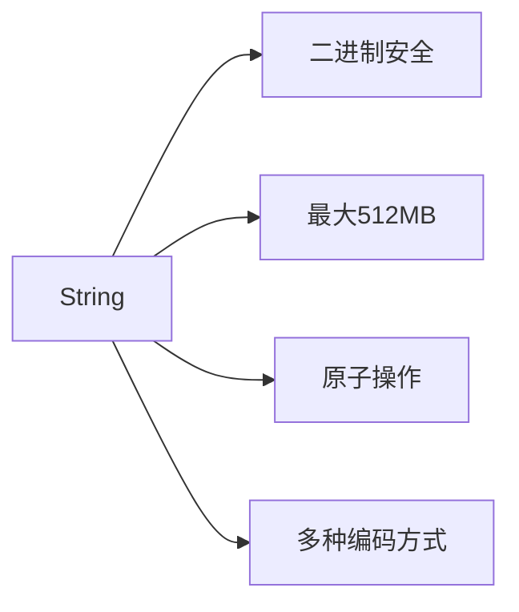

#### 内部编码

| 编码方式 | 条件 | 特点 |
|---------|------|------|
| int | 8字节长整型 | 节省内存 |
| embstr | ≤44字节字符串 | 内存连续分配 |
| raw | >44字节字符串 | 需要两次内存分配 |

#### 常用命令

```redis
# 基本操作
SET key value [EX seconds] [PX milliseconds] [NX|XX]
GET key
DEL key

# 原子操作
INCR key
DECR key
INCRBY key increment
DECRBY key decrement

# 批量操作
MSET key1 value1 key2 value2 ...
MGET key1 key2 ...
```

#### 应用场景

<div class="grid cards" markdown>

-   **缓存**
    - 存储HTML片段
    - API响应缓存
    - 用户会话数据

-   **计数器**
    - 页面访问统计
    - 用户点赞数
    - 库存计数

-   **分布式锁**
    - SETNX实现
    - 带过期时间的锁
    - 原子操作保证

</div>

### 1.2 列表(List)

Redis列表是简单的字符串列表，按照插入顺序排序，支持双向操作。

```mermaid
graph TD
    A[List] --> B[双向链表]
    A --> C[按插入顺序排序]
    A --> D[支持范围操作]
    B --> E[头部操作O(1)]
    B --> F[尾部操作O(1)]
    B --> G[中间操作O(N)]
```

#### 内部实现

Redis 3.2之前使用ziplist和linkedlist，3.2之后统一使用quicklist（ziplist和linkedlist的结合）。

```c
// quicklist结构伪代码
typedef struct quicklist {
    quicklistNode *head;
    quicklistNode *tail;
    unsigned long count;        // 所有元素总数
    unsigned long len;          // quicklistNode节点数量
    int fill : 16;              // ziplist大小限制
    unsigned int compress : 16; // 压缩深度
} quicklist;
```

#### 常用命令

```redis
# 添加元素
LPUSH key value [value ...]
RPUSH key value [value ...]

# 移除元素
LPOP key
RPOP key

# 查询操作
LRANGE key start stop
LLEN key
LINDEX key index

# 阻塞操作
BLPOP key [key ...] timeout
BRPOP key [key ...] timeout
```

#### 应用场景

1. **消息队列**：
   ```redis
   # 生产者
   LPUSH messages "message content"
   
   # 消费者
   BRPOP messages 0
   ```

2. **最新动态**：
   ```redis
   # 添加新动态
   LPUSH user:1001:timeline "post:5001"
   
   # 获取最新10条动态
   LRANGE user:1001:timeline 0 9
   ```

3. **任务队列**：
   ```redis
   # 添加任务
   RPUSH tasks:image-processing '{"id":"img1","url":"http://example.com/img1.jpg"}'
   
   # 获取任务
   BLPOP tasks:image-processing 0
   ```

### 1.3 哈希(Hash)

哈希是字段和值的映射表，适合存储对象。

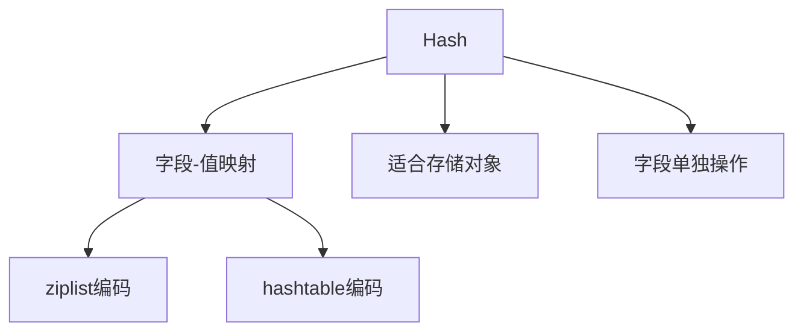

#### 内部编码

| 编码方式 | 条件 | 特点 |
|---------|------|------|
| ziplist | 元素数量<512且所有值<64字节 | 内存效率高 |
| hashtable | 不满足ziplist条件 | 读写效率高 |

#### 常用命令

```redis
# 设置字段值
HSET key field value
HMSET key field1 value1 [field2 value2 ...]

# 获取字段值
HGET key field
HMGET key field1 [field2 ...]
HGETALL key

# 其他操作
HDEL key field [field ...]
HEXISTS key field
HLEN key
HINCRBY key field increment
```

#### 应用场景

<details>
<summary>用户信息存储示例</summary>

```redis
# 存储用户信息
HMSET user:1001 username "张三" email "zhangsan@example.com" age 28 visits 10

# 获取特定字段
HGET user:1001 username

# 获取所有信息
HGETALL user:1001

# 增加访问次数
HINCRBY user:1001 visits 1

# 更新年龄
HSET user:1001 age 29
```
</details>

### 1.4 集合(Set)

集合是无序的字符串集合，支持交集、并集、差集等操作。

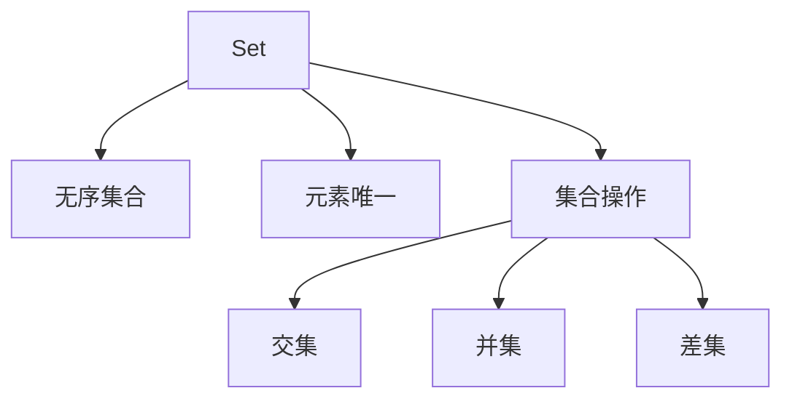

#### 内部编码

| 编码方式 | 条件 | 特点 |
|---------|------|------|
| intset | 所有元素为整数且数量<512 | 内存效率高 |
| hashtable | 不满足intset条件 | 查找效率O(1) |

#### 常用命令

```redis
# 添加/删除元素
SADD key member [member ...]
SREM key member [member ...]

# 查询操作
SMEMBERS key
SISMEMBER key member
SCARD key
SRANDMEMBER key [count]
SPOP key [count]

# 集合操作
SINTER key [key ...]
SUNION key [key ...]
SDIFF key [key ...]
SINTERSTORE destination key [key ...]
```

#### 应用场景

1. **标签系统**：
   ```redis
   # 为文章添加标签
   SADD article:1000:tags "redis" "database" "nosql"
   
   # 查找同时有redis和database标签的文章
   SINTER tag:redis:articles tag:database:articles
   ```

2. **好友关系**：
   ```redis
   # 添加好友关系
   SADD user:1001:friends 1002 1003 1004
   
   # 查找共同好友
   SINTER user:1001:friends user:1002:friends
   ```

3. **IP黑名单**：
   ```redis
   # 添加IP到黑名单
   SADD blacklist:ip "192.168.1.1" "10.0.0.1"
   
   # 检查IP是否在黑名单
   SISMEMBER blacklist:ip "192.168.1.1"
   ```

### 1.5 有序集合(Sorted Set)

有序集合类似集合，但每个元素关联一个分数，用于排序。

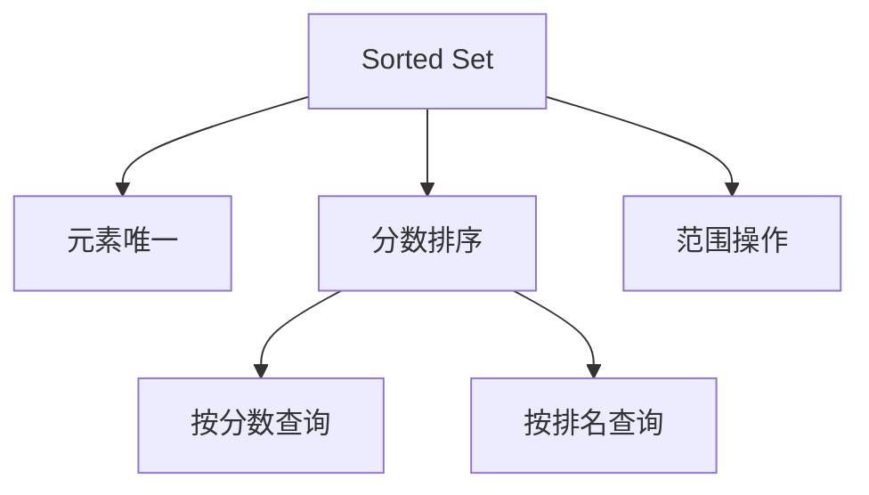

#### 内部编码

| 编码方式 | 条件 | 特点 |
|---------|------|------|
| ziplist | 元素数量<128且所有值<64字节 | 内存效率高 |
| skiplist | 不满足ziplist条件 | 查找效率O(log N) |

#### 常用命令

```redis
# 添加元素
ZADD key score member [score member ...]

# 查询操作
ZRANGE key start stop [WITHSCORES]
ZREVRANGE key start stop [WITHSCORES]
ZRANGEBYSCORE key min max [WITHSCORES]
ZRANK key member
ZSCORE key member
ZCARD key

# 删除操作
ZREM key member [member ...]
ZREMRANGEBYRANK key start stop
ZREMRANGEBYSCORE key min max

# 集合操作
ZUNIONSTORE destination numkeys key [key ...] [WEIGHTS weight [weight ...]] [AGGREGATE SUM|MIN|MAX]
ZINTERSTORE destination numkeys key [key ...] [WEIGHTS weight [weight ...]] [AGGREGATE SUM|MIN|MAX]
```

#### 应用场景

1. **排行榜**：
   ```redis
   # 添加玩家分数
   ZADD leaderboard 3500 "player:1001" 3200 "player:1002" 4000 "player:1003"
   
   # 获取前10名
   ZREVRANGE leaderboard 0 9 WITHSCORES
   
   # 获取玩家排名
   ZREVRANK leaderboard "player:1001"
   ```

2. **权重队列**：
   ```redis
   # 添加任务及优先级
   ZADD tasks 10 "task:1001" 5 "task:1002" 8 "task:1003"
   
   # 获取最高优先级任务
   ZPOPMAX tasks
   ```

3. **时间轴**：
   ```redis
   # 添加事件(使用时间戳作为分数)
   ZADD timeline 1609459200 "event:1001" 1609545600 "event:1002"
   
   # 获取某时间段内的事件
   ZRANGEBYSCORE timeline 1609459200 1609632000
   ```

## 2. 高级数据类型

Redis 5.0及以上版本引入了更多高级数据类型，进一步扩展了Redis的应用场景。

### 2.1 位图(Bitmap)

位图不是实际的数据类型，而是在字符串类型上定义的一组面向位操作的命令。

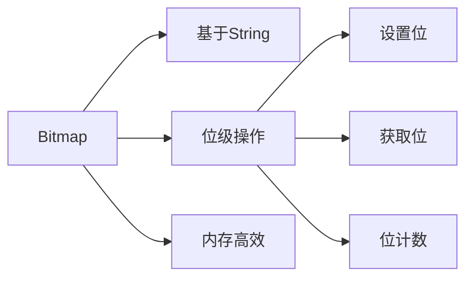

#### 常用命令

```redis
# 设置位
SETBIT key offset value

# 获取位
GETBIT key offset

# 位计数
BITCOUNT key [start end]

# 位操作
BITOP operation destkey key [key ...]
BITPOS key bit [start] [end]
```

#### 应用场景

1. **用户活跃度统计**：
   ```redis
   # 记录用户1001在2023年1月1日登录
   SETBIT user:activity:2023-01-01 1001 1
   
   # 检查用户1001在2023年1月1日是否活跃
   GETBIT user:activity:2023-01-01 1001
   
   # 统计2023年1月1日活跃用户数
   BITCOUNT user:activity:2023-01-01
   ```

2. **布隆过滤器**：
   ```redis
   # 使用多个哈希函数计算位置并设置位
   SETBIT bloom:filter 5 1
   SETBIT bloom:filter 15 1
   SETBIT bloom:filter 25 1
   
   # 检查元素是否可能存在
   GETBIT bloom:filter 5 && GETBIT bloom:filter 15 && GETBIT bloom:filter 25
   ```

### 2.2 HyperLogLog

HyperLogLog是用于基数统计的概率数据结构，使用极小的内存完成计数。

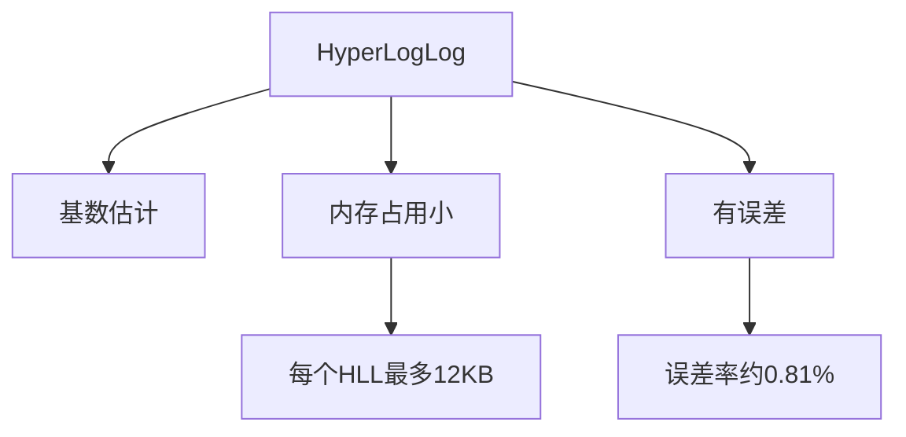

#### 常用命令

```redis
# 添加元素
PFADD key element [element ...]

# 获取基数估计
PFCOUNT key [key ...]

# 合并多个HyperLogLog
PFMERGE destkey sourcekey [sourcekey ...]
```

#### 应用场景

1. **UV统计**：
   ```redis
   # 记录网站访问用户
   PFADD page:visitors:2023-01-01 "user:1001" "user:1002" "user:1003"
   
   # 获取当日UV
   PFCOUNT page:visitors:2023-01-01
   
   # 合并一周的UV
   PFMERGE page:visitors:weekly page:visitors:2023-01-01 page:visitors:2023-01-02 ... page:visitors:2023-01-07
   ```

2. **大数据集去重**：
   ```redis
   # 添加数据
   PFADD unique:items "item1" "item2" "item3" "item1"
   
   # 获取唯一项数量
   PFCOUNT unique:items
   ```

### 2.3 地理空间索引(Geo)

Geo允许存储地理位置信息，并进行半径查询和距离计算。

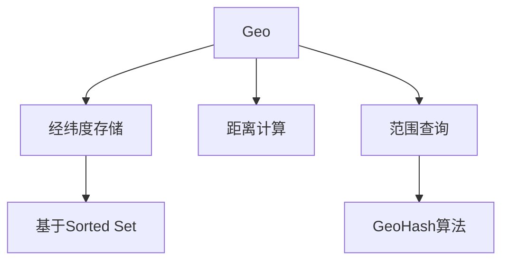

#### 常用命令

```redis
# 添加地理位置
GEOADD key longitude latitude member [longitude latitude member ...]

# 计算距离
GEODIST key member1 member2 [unit]

# 获取坐标
GEOPOS key member [member ...]

# 范围查询
GEORADIUS key longitude latitude radius m|km|ft|mi [WITHCOORD] [WITHDIST] [WITHHASH] [COUNT count]
GEORADIUSBYMEMBER key member radius m|km|ft|mi [WITHCOORD] [WITHDIST] [WITHHASH] [COUNT count]
```

#### 应用场景

<div class="grid cards" markdown>

-   **附近的人**
    - 存储用户位置
    - 实时更新坐标
    - 按距离查询

-   **店铺查找**
    - 存储商家位置
    - 按距离排序
    - 结合其他筛选条件

</div>

```redis
# 添加餐厅位置
GEOADD restaurants 116.48105 39.99756 "restaurant:1001" 116.47805 39.99406 "restaurant:1002"

# 查找用户5公里内的餐厅
GEORADIUS restaurants 116.48000 39.99600 5 km WITHDIST

# 计算两个餐厅之间的距离
GEODIST restaurants "restaurant:1001" "restaurant:1002" km
```

### 2.4 流(Stream)

Stream是Redis 5.0引入的一个新数据类型，主要用于消息队列场景。

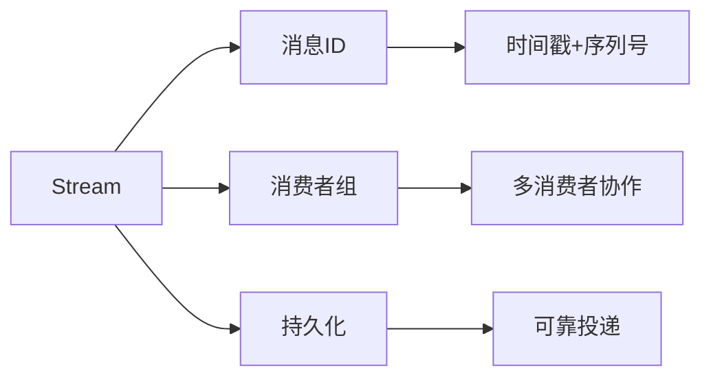

#### 常用命令

```redis
# 添加消息
XADD key ID field value [field value ...]

# 读取消息
XREAD [COUNT count] [BLOCK milliseconds] STREAMS key [key ...] ID [ID ...]

# 创建消费者组
XGROUP CREATE key groupname ID

# 消费者组读取
XREADGROUP GROUP group consumer [COUNT count] [BLOCK milliseconds] STREAMS key [key ...] ID [ID ...]

# 确认消息处理
XACK key group ID [ID ...]
```

#### 应用场景

1. **事件流处理**：
   ```redis
   # 生产者添加事件
   XADD events * type "login" user_id "1001" ip "192.168.1.1"
   
   # 消费者读取事件
   XREAD COUNT 10 STREAMS events 0
   ```

2. **消费者组示例**：
   ```redis
   # 创建消费者组
   XGROUP CREATE orders orders-group $
   
   # 消费者1读取消息
   XREADGROUP GROUP orders-group consumer1 COUNT 1 STREAMS orders >
   
   # 消费者2读取消息
   XREADGROUP GROUP orders-group consumer2 COUNT 1 STREAMS orders >
   
   # 确认消息处理
   XACK orders orders-group 1609459200-0
   ```

## 3. 数据类型选择指南

### 3.1 选择合适的数据类型

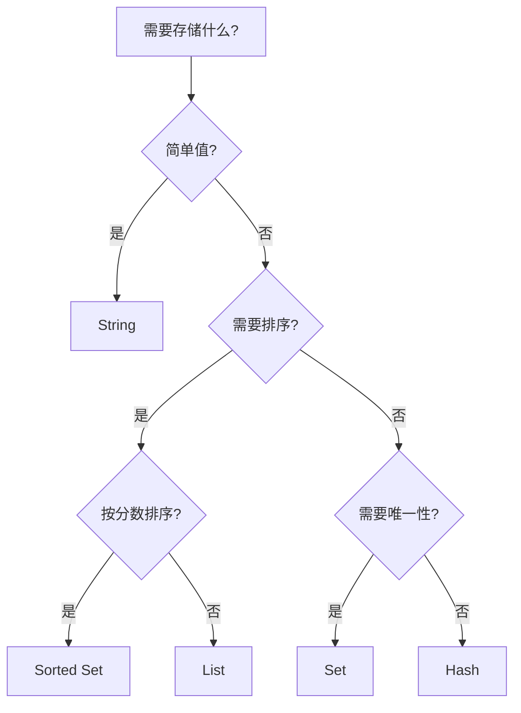

### 3.2 数据类型对比表

| 数据类型 | 适用场景 | 时间复杂度 | 内存占用 | 限制 |
|---------|---------|-----------|---------|------|
| String | 缓存、计数器、分布式锁 | O(1) | 低 | 512MB |
| List | 消息队列、最新动态 | O(1)头尾, O(N)中间 | 中 | 2^32-1元素 |
| Hash | 对象存储、字段更新 | O(1) | 中 | 2^32-1字段 |
| Set | 标签系统、去重 | O(1) | 中 | 2^32-1元素 |
| Sorted Set | 排行榜、权重队列 | O(log N) | 高 | 2^32-1元素 |
| Bitmap | 状态标记、布隆过滤器 | O(1) | 极低 | 2^32位 |
| HyperLogLog | 基数统计 | O(1) | 极低 | 12KB固定 |
| Geo | 地理位置应用 | O(log N) | 中 | 基于Sorted Set |
| Stream | 消息队列、事件溯源 | O(1) | 中 | 内存限制 |

## 4. 性能优化与最佳实践

### 4.1 键设计原则

1. **命名规范**：
   ```
   对象类型:ID:字段
   ```
   例如：`user:1001:profile`, `product:5001:inventory`

2. **避免大key**：
   - 将大对象拆分为多个小对象
   - 使用Hash存储对象字段而非整个序列化对象
   - 定期检查大key：`redis-cli --bigkeys`

3. **使用合理的过期策略**：
   ```redis
   # 设置过期时间
   SET session:token:123 "data" EX 3600
   
   # 或者
   SETEX session:token:123 3600 "data"
   ```

### 4.2 内存优化

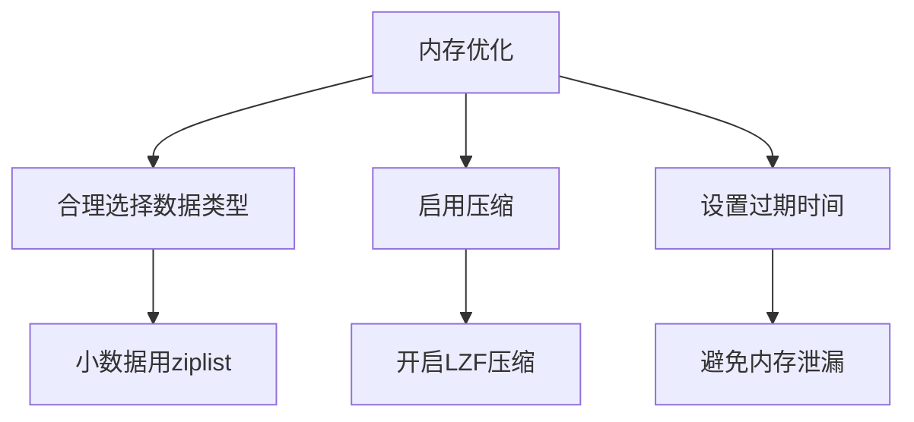

**配置示例**：
```conf
# redis.conf内存优化
hash-max-ziplist-entries 512
hash-max-ziplist-value 64
zset-max-ziplist-entries 128
zset-max-ziplist-value 64
set-max-intset-entries 512
```

### 4.3 批量操作

使用批量命令减少网络往返：

```redis
# 不推荐
SET key1 value1
SET key2 value2
SET key3 value3

# 推荐
MSET key1 value1 key2 value2 key3 value3
```

使用管道(Pipeline)批量发送命令：

```java
// Java示例
Pipeline pipeline = jedis.pipelined();
for (int i = 0; i < 1000; i++) {
    pipeline.set("key" + i, "value" + i);
}
pipeline.sync();
```

### 4.4 事务与Lua脚本

使用事务保证操作原子性：

```redis
MULTI
INCR inventory:product:1001
DECR pending:orders
EXEC
```

使用Lua脚本实现复杂逻辑：

```redis
EVAL "
local current = redis.call('GET', KEYS[1])
if current and tonumber(current) > tonumber(ARGV[1]) then
    return redis.call('DECRBY', KEYS[1], ARGV[1])
else
    return 0
end
" 1 inventory:product:1001 5
```

## 5. 实战应用案例

### 5.1 电商库存系统

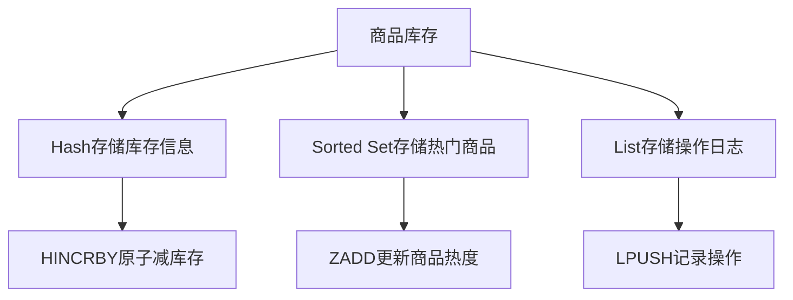

**实现代码**：

```redis
# 初始化商品库存
HMSET product:1001 name "iPhone 13" price 6799 stock 100 sold 0

# 减库存操作(Lua脚本)
EVAL "
local stock = redis.call('HGET', KEYS[1], 'stock')
if tonumber(stock) >= tonumber(ARGV[1]) then
    redis.call('HINCRBY', KEYS[1], 'stock', -tonumber(ARGV[1]))
    redis.call('HINCRBY', KEYS[1], 'sold', tonumber(ARGV[1]))
    redis.call('LPUSH', KEYS[2], 'Sold '..ARGV[1]..' of '..KEYS[1]..' at '..ARGV[2])
    return 1
else
    return 0
end
" 2 product:1001 product:logs 1 "2023-01-01 12:00:00"

# 更新商品热度
ZINCRBY hot:products 1 "product:1001"

# 获取热门商品
ZREVRANGE hot:products 0 9 WITHSCORES
```

### 5.2 社交网络关系图

```java
// 用户关注关系管理
public class UserRelationService {
    private Jedis jedis;
    
    public void follow(String userId, String targetId) {
        Transaction tx = jedis.multi();
        // 用户的关注集合
        tx.sadd("user:" + userId + ":following", targetId);
        // 目标用户的粉丝集合
        tx.sadd("user:" + targetId + ":followers", userId);
        tx.exec();
    }
    
    public void unfollow(String userId, String targetId) {
        Transaction tx = jedis.multi();
        tx.srem("user:" + userId + ":following", targetId);
        tx.srem("user:" + targetId + ":followers", userId);
        tx.exec();
    }
    
    public Set<String> getCommonFollows(String userId1, String userId2) {
        // 获取共同关注
        return jedis.sinter("user:" + userId1 + ":following", "user:" + userId2 + ":following");
    }
    
    public boolean isFollowing(String userId, String targetId) {
        return jedis.sismember("user:" + userId + ":following", targetId);
    }
}
```

### 5.3 实时分析系统

使用Redis数据类型构建实时分析系统：

<div class="grid cards" markdown>

-   **HyperLogLog**
    - 实时UV统计
    - 独立访客计数
    - 低内存占用

-   **Sorted Set**
    - 热门内容排行
    - 时间衰减计分
    - 多维度排序

-   **Bitmap**
    - 用户行为标记
    - 活跃用户统计
    - A/B测试分组

</div>

**实时统计示例**：

```redis
# 记录页面访问
PFADD page:home:uv:2023-01-01 "user:1001" "user:1002"
ZINCRBY page:popularity 1 "home"
SETBIT user:activity:2023-01-01 1001 1

# 获取统计数据
PFCOUNT page:home:uv:2023-01-01
ZREVRANGE page:popularity 0 9 WITHSCORES
BITCOUNT user:activity:2023-01-01
```

## 6. 参考资料

- [Redis官方文档 - 数据类型](https://redis.io/topics/data-types)
- [Redis命令参考](https://redis.io/commands)
- [Redis设计与实现](http://redisbook.com/) - 黄健宏著
- [Redis实战](https://book.douban.com/subject/26612779/) - Josiah L. Carlson著
- [Redis开发与运维](https://book.douban.com/subject/26971561/) - 付磊、张益军著
