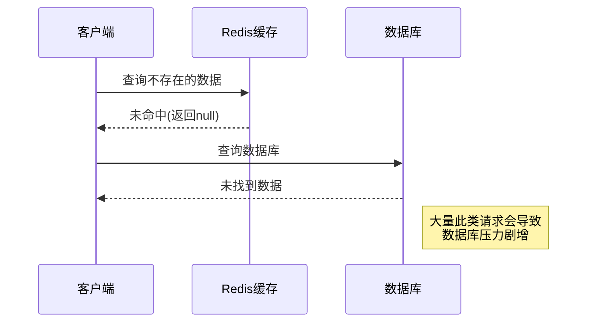
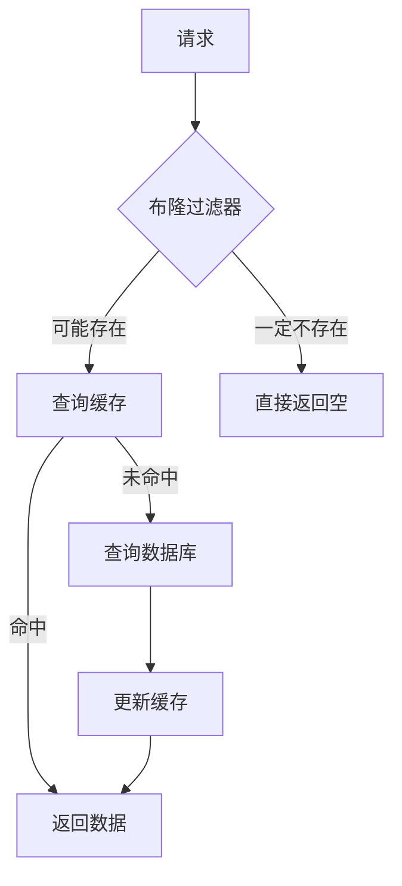
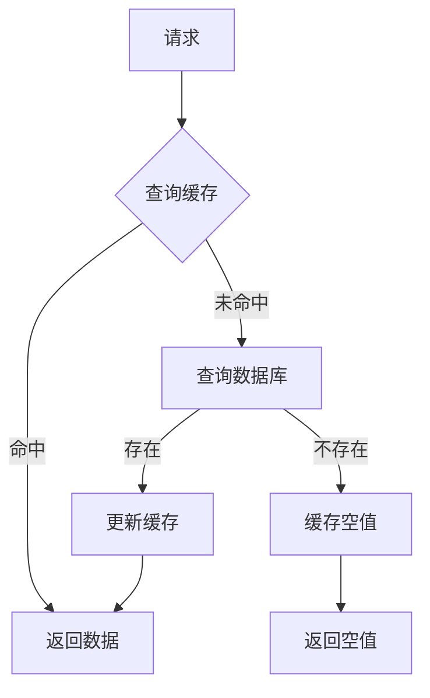
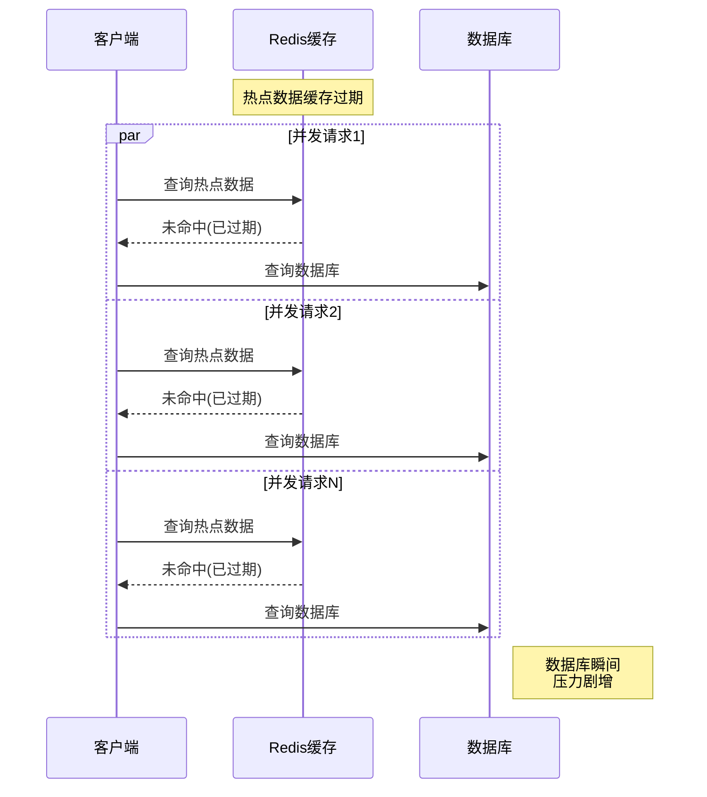
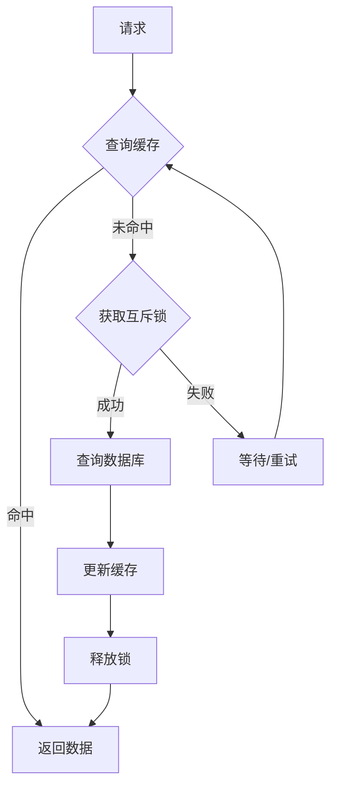
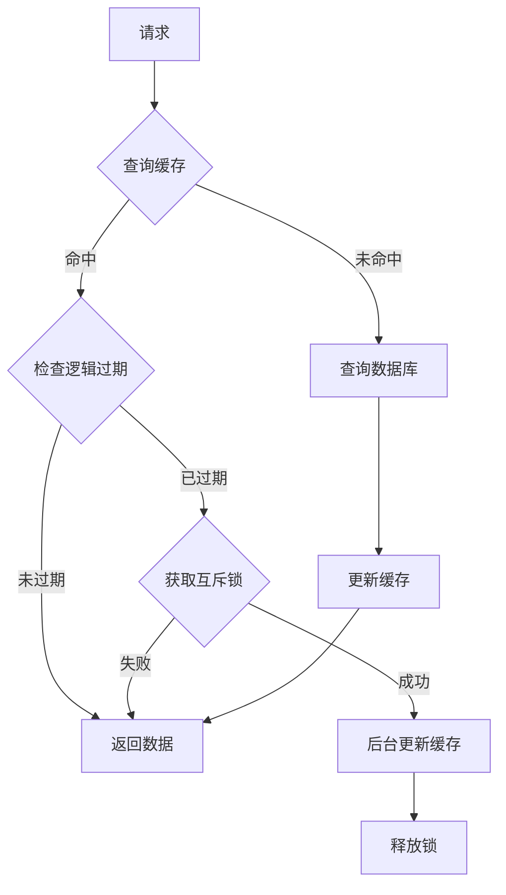
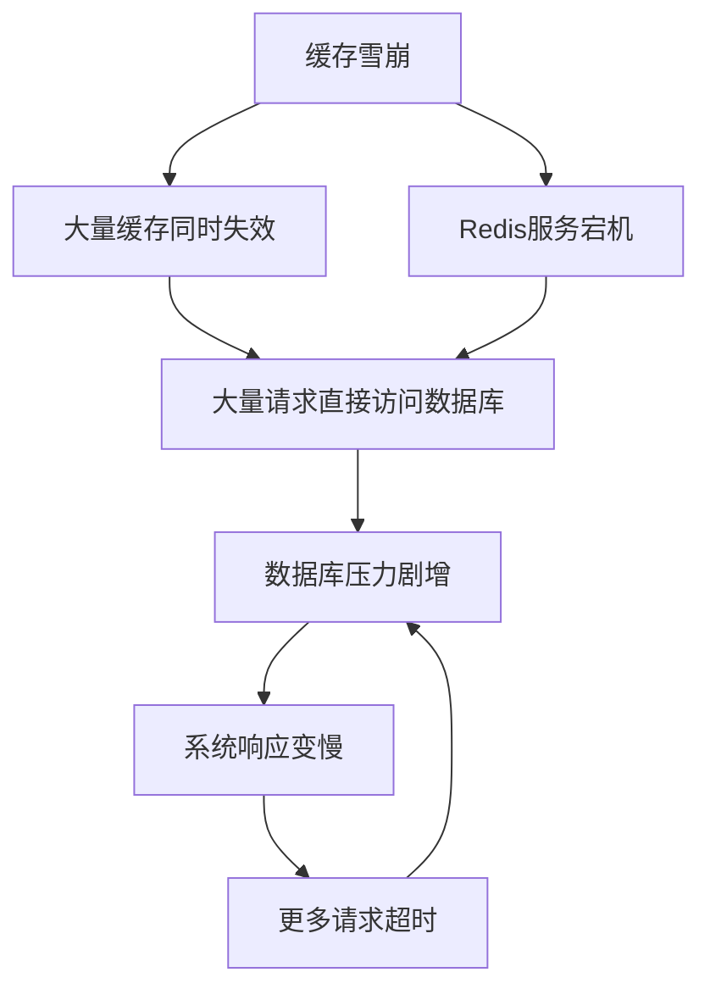
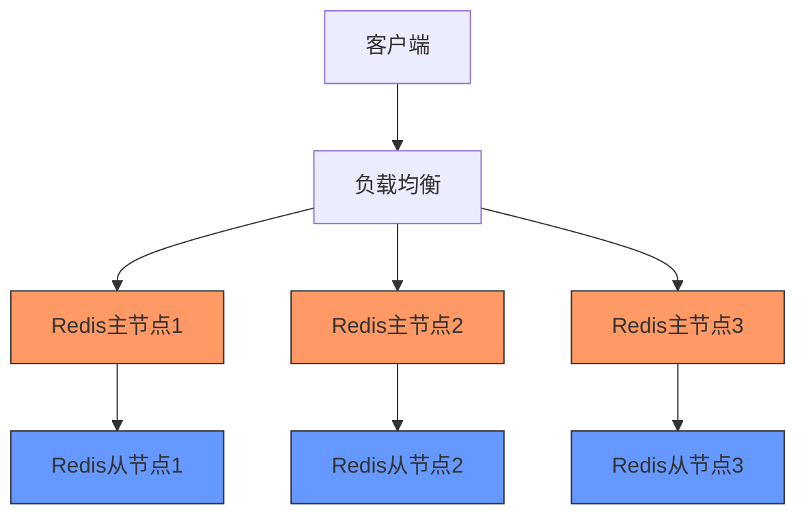
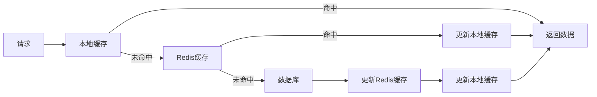
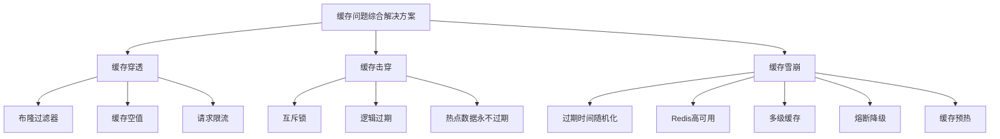

> 在高并发系统中，缓存是提升性能的关键组件，但不当的缓存策略可能导致系统崩溃。本文深入探讨Redis缓存中的三大经典问题：缓存穿透、缓存击穿和缓存雪崩，并提供全面的解决方案。

## 1. 缓存穿透(Cache Penetration)

### 1.1 问题定义

缓存穿透是指查询一个**不存在的数据**，因为缓存中没有该数据，所以会直接请求数据库，这样缓存就起不到作用，如果有大量这样的请求，数据库可能会因为压力过大而崩溃。



### 1.2 产生原因

<div class="grid cards" markdown>

-   **恶意攻击**
    - 专门查询不存在的数据
    - 构造随机参数
    - 导致缓存失效

-   **业务误操作**
    - 误删数据
    - 缓存与数据库不一致
    - 参数错误

-   **程序bug**
    - 查询逻辑错误
    - 参数处理异常
    - 缓存更新失败

</div>

### 1.3 解决方案

#### 1.3.1 布隆过滤器

布隆过滤器是一种空间效率很高的概率型数据结构，用于判断一个元素是否在集合中。它可能会误判，但不会漏判。



**Java实现示例**：

```java
public class BloomFilterExample {
    private static final int SIZE = 1000000; // 预计元素数量
    private static final double FPP = 0.01; // 误判率
    
    private BloomFilter<String> bloomFilter;
    private RedisTemplate redisTemplate;
    private UserMapper userMapper;
    
    public BloomFilterExample() {
        this.bloomFilter = BloomFilter.create(
            Funnels.stringFunnel(Charset.defaultCharset()), SIZE, FPP);
        
        // 初始化布隆过滤器，将数据库中所有用户ID添加到过滤器
        List<String> allUserIds = userMapper.getAllUserIds();
        for (String userId : allUserIds) {
            bloomFilter.put(userId);
        }
    }
    
    public User getUserById(String userId) {
        // 1. 判断布隆过滤器中是否可能存在
        if (!bloomFilter.mightContain(userId)) {
            return null; // 一定不存在，直接返回
        }
        
        // 2. 查询缓存
        String key = "user:" + userId;
        User user = (User) redisTemplate.opsForValue().get(key);
        if (user != null) {
            return user; // 缓存命中，直接返回
        }
        
        // 3. 查询数据库
        user = userMapper.getUserById(userId);
        if (user != null) {
            // 更新缓存
            redisTemplate.opsForValue().set(key, user, 30, TimeUnit.MINUTES);
        } else {
            // 数据库也不存在，可能是布隆过滤器误判
            // 设置一个短期的空值缓存
            redisTemplate.opsForValue().set(key, new NullValueObject(), 5, TimeUnit.MINUTES);
        }
        
        return user;
    }
}
```

#### 1.3.2 缓存空对象

当查询的数据不存在时，在缓存中设置一个空值或默认值，避免每次查询都访问数据库。



**代码示例**：

```java
public User getUserById(String userId) {
    String key = "user:" + userId;
    
    // 1. 查询缓存
    String jsonValue = redisTemplate.opsForValue().get(key);
    
    // 2. 判断是否为空值标记
    if ("__NULL__".equals(jsonValue)) {
        return null; // 返回空值
    }
    
    // 3. 缓存命中
    if (jsonValue != null) {
        return JSON.parseObject(jsonValue, User.class);
    }
    
    // 4. 查询数据库
    User user = userMapper.getUserById(userId);
    
    // 5. 更新缓存
    if (user != null) {
        redisTemplate.opsForValue().set(key, JSON.toJSONString(user), 30, TimeUnit.MINUTES);
    } else {
        // 设置空值，过期时间较短
        redisTemplate.opsForValue().set(key, "__NULL__", 5, TimeUnit.MINUTES);
    }
    
    return user;
}
```

#### 1.3.3 请求限流

对API进行限流保护，防止恶意攻击。

```java
@RestController
public class UserController {
    
    private final RateLimiter rateLimiter = RateLimiter.create(100.0); // 每秒允许100个请求
    
    @GetMapping("/user/{id}")
    public ResponseEntity<User> getUser(@PathVariable String id) {
        // 尝试获取令牌，如果获取不到则拒绝请求
        if (!rateLimiter.tryAcquire()) {
            return ResponseEntity.status(HttpStatus.TOO_MANY_REQUESTS).build();
        }
        
        // 正常处理逻辑
        User user = userService.getUserById(id);
        if (user == null) {
            return ResponseEntity.notFound().build();
        }
        return ResponseEntity.ok(user);
    }
}
```

### 1.4 方案对比

| 解决方案 | 优点 | 缺点 | 适用场景 |
|---------|------|------|---------|
| 布隆过滤器 | 内存占用小，效率高 | 有误判可能，需要维护过滤器 | 数据量大，查询频繁 |
| 缓存空对象 | 实现简单，立即生效 | 额外的内存消耗，可能造成数据不一致 | 数据量适中，变化不频繁 |
| 请求限流 | 保护系统，防止恶意攻击 | 可能影响正常用户体验 | 作为辅助手段配合使用 |

## 2. 缓存击穿(Cache Breakdown)

### 2.1 问题定义

缓存击穿是指**热点数据**的缓存突然失效（过期），此时大量并发请求直接访问数据库，可能导致数据库瞬间压力过大。



### 2.2 产生原因

1. **热点数据过期**：高频访问的数据缓存设置了过期时间，且在同一时间过期
2. **缓存重建慢**：从数据库获取数据并重建缓存的过程较慢
3. **并发请求多**：大量请求同时到达，都发现缓存过期，同时查询数据库

### 2.3 解决方案

#### 2.3.1 互斥锁(Mutex)

使用互斥锁保证只有一个线程去查询数据库和重建缓存，其他线程等待或重试。



**代码示例**：

```java
public String getDataWithMutex(String key) {
    // 1. 查询缓存
    String value = redisTemplate.opsForValue().get(key);
    if (value != null) {
        return value;
    }
    
    // 2. 缓存未命中，尝试获取互斥锁
    String lockKey = "lock:" + key;
    boolean locked = redisTemplate.opsForValue().setIfAbsent(lockKey, "1", 10, TimeUnit.SECONDS);
    
    try {
        if (locked) {
            // 3. 获取锁成功，再次检查缓存(双重检查，防止其他线程已经重建了缓存)
            value = redisTemplate.opsForValue().get(key);
            if (value != null) {
                return value;
            }
            
            // 4. 查询数据库
            value = queryDatabase(key);
            
            // 5. 更新缓存
            redisTemplate.opsForValue().set(key, value, calculateRandomExpireTime(), TimeUnit.SECONDS);
            return value;
        } else {
            // 6. 获取锁失败，等待一段时间后重试
            Thread.sleep(50);
            return getDataWithMutex(key);
        }
    } catch (Exception e) {
        log.error("获取数据异常", e);
        return null;
    } finally {
        // 7. 释放锁
        if (locked) {
            redisTemplate.delete(lockKey);
        }
    }
}

// 计算随机过期时间，避免同时过期
private int calculateRandomExpireTime() {
    return 3600 + new Random().nextInt(300); // 基础时间 + 随机时间
}
```

#### 2.3.2 逻辑过期

不设置真正的过期时间，而是在value中维护一个逻辑过期时间，当发现逻辑过期时，使用后台线程更新缓存。



**代码示例**：

```java
public class LogicalExpireExample {
    
    private RedisTemplate redisTemplate;
    private ExecutorService executor = Executors.newFixedThreadPool(10);
    
    // 包装类，包含数据和逻辑过期时间
    @Data
    static class ValueWithExpire {
        private Object data;
        private Long expireTime; // 过期时间戳
        
        public ValueWithExpire(Object data, long ttl) {
            this.data = data;
            this.expireTime = System.currentTimeMillis() + ttl * 1000;
        }
        
        public boolean isExpired() {
            return System.currentTimeMillis() > expireTime;
        }
    }
    
    public Object getDataWithLogicalExpire(String key) {
        // 1. 查询缓存
        String json = redisTemplate.opsForValue().get(key);
        if (json == null) {
            // 缓存未命中，直接返回null（实际应用中可能需要查询数据库）
            return null;
        }
        
        // 2. 反序列化
        ValueWithExpire value = JSON.parseObject(json, ValueWithExpire.class);
        
        // 3. 判断是否过期
        if (!value.isExpired()) {
            // 未过期，直接返回
            return value.getData();
        }
        
        // 4. 已过期，尝试获取互斥锁
        String lockKey = "lock:" + key;
        boolean locked = redisTemplate.opsForValue().setIfAbsent(lockKey, "1", 10, TimeUnit.SECONDS);
        
        // 5. 无论是否获取到锁，都返回旧值
        if (locked) {
            // 获取到锁，异步更新缓存
            executor.submit(() -> {
                try {
                    // 查询数据库
                    Object newData = queryDatabase(key);
                    
                    // 更新缓存
                    ValueWithExpire newValue = new ValueWithExpire(newData, 3600);
                    redisTemplate.opsForValue().set(key, JSON.toJSONString(newValue));
                } finally {
                    // 释放锁
                    redisTemplate.delete(lockKey);
                }
            });
        }
        
        // 返回旧值
        return value.getData();
    }
    
    private Object queryDatabase(String key) {
        // 实际查询数据库的逻辑
        return "Data for " + key;
    }
}

#### 2.3.3 热点数据永不过期

对于某些特别热点的数据，可以设置永不过期，或者使用定时任务在访问低峰期更新缓存。

```java
@Scheduled(cron = "0 0 3 * * ?") // 每天凌晨3点执行
public void refreshHotData() {
    List<String> hotKeys = getHotKeys();
    for (String key : hotKeys) {
        try {
            // 查询数据库获取最新数据
            Object newData = queryDatabase(key);
            
            // 更新缓存，不设置过期时间
            redisTemplate.opsForValue().set(key, JSON.toJSONString(newData));
            
            log.info("热点数据[{}]更新成功", key);
        } catch (Exception e) {
            log.error("热点数据[{}]更新失败", key, e);
        }
    }
}
```

### 2.4 方案对比

| 解决方案 | 优点 | 缺点 | 适用场景 |
|---------|------|------|---------|
| 互斥锁 | 简单有效，保证一致性 | 可能阻塞其他请求，增加延迟 | 并发量不是特别高的场景 |
| 逻辑过期 | 不阻塞请求，响应速度快 | 可能返回旧数据，实现复杂 | 高并发且允许短时间数据不一致的场景 |
| 永不过期 | 彻底避免击穿问题 | 可能返回旧数据，需要额外维护 | 极高并发且变更不频繁的数据 |

## 3. 缓存雪崩(Cache Avalanche)

### 3.1 问题定义

缓存雪崩是指**大量缓存数据在同一时间失效**或**Redis服务宕机**，导致大量请求直接访问数据库，引起数据库压力剧增甚至崩溃的情况。



### 3.2 产生原因

<div class="grid cards" markdown>

-   **同时设置相同过期时间**
    - 批量导入数据
    - 固定时间点设置过期
    - 系统重启后批量加载

-   **Redis服务不可用**
    - 服务器宕机
    - 网络故障
    - 内存溢出
    - 高负载导致响应慢

-   **缓存预热不足**
    - 系统上线后未预热
    - 冷启动流量过大
    - 缓存数据不合理

</div>

### 3.3 解决方案

#### 3.3.1 过期时间随机化

为缓存设置随机过期时间，避免同时过期。

```java
public void setWithRandomExpire(String key, Object value) {
    // 基础过期时间 + 随机过期时间
    int baseTime = 3600; // 1小时
    int randomTime = new Random().nextInt(1800); // 0-30分钟的随机时间
    
    redisTemplate.opsForValue().set(key, JSON.toJSONString(value), baseTime + randomTime, TimeUnit.SECONDS);
}
```

#### 3.3.2 Redis高可用

构建Redis集群，提供故障转移机制。



**Redis Sentinel配置示例**：

```conf
# sentinel.conf
sentinel monitor mymaster 127.0.0.1 6379 2
sentinel down-after-milliseconds mymaster 5000
sentinel failover-timeout mymaster 60000
sentinel parallel-syncs mymaster 1
```

**Redis Cluster配置示例**：

```conf
# redis.conf
cluster-enabled yes
cluster-config-file nodes.conf
cluster-node-timeout 5000
```

#### 3.3.3 多级缓存

构建多级缓存架构，例如：本地缓存 + Redis缓存 + 数据库。



**多级缓存实现示例**：

```java
public class MultiLevelCache {
    
    private LoadingCache<String, Object> localCache;
    private RedisTemplate redisTemplate;
    private UserMapper userMapper;
    
    public MultiLevelCache() {
        // 初始化本地缓存
        localCache = CacheBuilder.newBuilder()
            .maximumSize(10000) // 最大缓存条数
            .expireAfterWrite(5, TimeUnit.MINUTES) // 过期时间
            .build(new CacheLoader<String, Object>() {
                @Override
                public Object load(String key) throws Exception {
                    // 从Redis加载数据
                    return loadFromRedis(key);
                }
            });
    }
    
    public Object getData(String key) {
        try {
            // 1. 查询本地缓存
            return localCache.get(key);
        } catch (ExecutionException e) {
            log.error("获取缓存数据异常", e);
            return null;
        }
    }
    
    private Object loadFromRedis(String key) {
        // 2. 查询Redis缓存
        String json = redisTemplate.opsForValue().get(key);
        if (json != null) {
            return JSON.parseObject(json);
        }
        
        // 3. 查询数据库
        Object data = queryDatabase(key);
        if (data != null) {
            // 4. 更新Redis缓存，设置随机过期时间
            int expireTime = 3600 + new Random().nextInt(1800);
            redisTemplate.opsForValue().set(key, JSON.toJSONString(data), expireTime, TimeUnit.SECONDS);
        }
        
        return data;
    }
    
    private Object queryDatabase(String key) {
        // 实际查询数据库的逻辑
        return userMapper.getByKey(key);
    }
}
```

#### 3.3.4 熔断降级

当缓存失效导致数据库压力过大时，启用熔断机制，返回默认值或错误提示。

```java
@Service
public class UserService {
    
    @Autowired
    private RedisTemplate redisTemplate;
    
    @Autowired
    private UserMapper userMapper;
    
    @HystrixCommand(
        fallbackMethod = "getUserByIdFallback",
        commandProperties = {
            @HystrixProperty(name = "circuitBreaker.enabled", value = "true"),
            @HystrixProperty(name = "circuitBreaker.requestVolumeThreshold", value = "10"),
            @HystrixProperty(name = "circuitBreaker.sleepWindowInMilliseconds", value = "10000"),
            @HystrixProperty(name = "circuitBreaker.errorThresholdPercentage", value = "50")
        }
    )
    public User getUserById(String userId) {
        // 1. 查询缓存
        String key = "user:" + userId;
        User user = (User) redisTemplate.opsForValue().get(key);
        if (user != null) {
            return user;
        }
        
        // 2. 查询数据库
        user = userMapper.getUserById(userId);
        if (user != null) {
            // 3. 更新缓存
            redisTemplate.opsForValue().set(key, user, 3600 + new Random().nextInt(1800), TimeUnit.SECONDS);
        }
        
        return user;
    }
    
    // 降级方法
    public User getUserByIdFallback(String userId) {
        log.warn("进入降级方法，用户ID: {}", userId);
        // 返回默认用户或从备用数据源查询
        return new User(userId, "默认用户", 0);
    }
}
```

#### 3.3.5 缓存预热

系统上线前，提前将热点数据加载到缓存中。

```java
@Component
public class CacheWarmUpRunner implements ApplicationRunner {
    
    @Autowired
    private RedisTemplate redisTemplate;
    
    @Autowired
    private UserMapper userMapper;
    
    @Override
    public void run(ApplicationArguments args) throws Exception {
        log.info("开始缓存预热...");
        
        // 1. 获取热点数据列表
        List<User> hotUsers = userMapper.getHotUsers(100);
        
        // 2. 将数据加载到缓存
        for (User user : hotUsers) {
            String key = "user:" + user.getId();
            // 设置随机过期时间
            int expireTime = 3600 + new Random().nextInt(1800);
            redisTemplate.opsForValue().set(key, user, expireTime, TimeUnit.SECONDS);
            log.info("预热缓存: {}", key);
        }
        
        log.info("缓存预热完成，共预热{}条数据", hotUsers.size());
    }
}
```

### 3.4 方案对比

| 解决方案 | 优点 | 缺点 | 适用场景 |
|---------|------|------|---------|
| 过期时间随机化 | 简单易实现，有效避免同时过期 | 不解决服务宕机问题 | 所有使用Redis缓存的场景 |
| Redis高可用 | 提高系统可用性，避免单点故障 | 成本高，配置复杂 | 对可用性要求高的生产环境 |
| 多级缓存 | 降低Redis压力，提高响应速度 | 增加系统复杂度，可能导致数据不一致 | 高并发、高可用要求的场景 |
| 熔断降级 | 保护系统核心功能，提高可用性 | 可能影响用户体验 | 系统负载较高的场景 |
| 缓存预热 | 避免冷启动问题，提高系统稳定性 | 需要提前了解热点数据 | 系统重启或上线时 |

## 4. 综合解决方案

在实际应用中，通常需要结合多种方案来全面解决缓存问题。



### 4.1 最佳实践

1. **合理设计缓存键**：
   - 使用统一的命名规范
   - 避免使用过长的键名
   - 包含业务信息，便于管理

2. **设置合理的过期策略**：
   - 根据数据更新频率设置过期时间
   - 使用随机过期时间避免同时失效
   - 对热点数据考虑永不过期策略

3. **缓存更新策略**：
   - 先更新数据库，再删除缓存
   - 使用消息队列实现缓存异步更新
   - 考虑使用Canal等工具监听数据库变更

4. **监控与报警**：
   - 监控缓存命中率
   - 监控缓存服务可用性
   - 设置合理的报警阈值

### 4.2 代码实现示例

以下是一个综合解决方案的示例代码：

```java
@Service
public class CacheService {
    
    @Autowired
    private RedisTemplate redisTemplate;
    
    @Autowired
    private BloomFilter<String> bloomFilter;
    
    @Autowired
    private UserMapper userMapper;
    
    private LoadingCache<String, Object> localCache;
    
    public CacheService() {
        // 初始化本地缓存
        localCache = CacheBuilder.newBuilder()
            .maximumSize(10000)
            .expireAfterWrite(5, TimeUnit.MINUTES)
            .build(new CacheLoader<String, Object>() {
                @Override
                public Object load(String key) throws Exception {
                    return loadFromRedis(key);
                }
            });
    }
    
    @HystrixCommand(fallbackMethod = "getUserByIdFallback")
    public User getUserById(String userId) {
        String key = "user:" + userId;
        
        // 1. 布隆过滤器判断是否存在
        if (!bloomFilter.mightContain(userId)) {
            return null; // 一定不存在
        }
        
        try {
            // 2. 查询本地缓存
            return (User) localCache.get(key);
        } catch (ExecutionException e) {
            log.error("获取缓存数据异常", e);
            return getUserByIdFallback(userId);
        }
    }
    
    private Object loadFromRedis(String key) {
        // 3. 查询Redis缓存
        String json = redisTemplate.opsForValue().get(key);
        if (json != null) {
            if ("__NULL__".equals(json)) {
                return null; // 空值缓存
            }
            return JSON.parseObject(json, User.class);
        }
        
        // 4. 尝试获取互斥锁
        String lockKey = "lock:" + key;
        boolean locked = redisTemplate.opsForValue().setIfAbsent(lockKey, "1", 10, TimeUnit.SECONDS);
        
        try {
            if (locked) {
                // 双重检查
                json = redisTemplate.opsForValue().get(key);
                if (json != null) {
                    return JSON.parseObject(json, User.class);
                }
                
                // 5. 查询数据库
                String userId = key.substring(key.lastIndexOf(":") + 1);
                User user = userMapper.getUserById(userId);
                
                // 6. 更新缓存
                if (user != null) {
                    // 设置随机过期时间
                    int expireTime = 3600 + new Random().nextInt(1800);
                    redisTemplate.opsForValue().set(key, JSON.toJSONString(user), expireTime, TimeUnit.SECONDS);
                    return user;
                } else {
                    // 缓存空值，短期过期
                    redisTemplate.opsForValue().set(key, "__NULL__", 5, TimeUnit.MINUTES);
                    return null;
                }
            } else {
                // 获取锁失败，短暂休眠后重试
                Thread.sleep(50);
                json = redisTemplate.opsForValue().get(key);
                if (json != null) {
                    return JSON.parseObject(json, User.class);
                }
                // 返回降级结果
                return getUserByIdFallback(userId);
            }
        } catch (Exception e) {
            log.error("加载缓存数据异常", e);
            return getUserByIdFallback(key.substring(key.lastIndexOf(":") + 1));
        } finally {
            // 释放锁
            if (locked) {
                redisTemplate.delete(lockKey);
            }
        }
    }
    
    // 降级方法
    public User getUserByIdFallback(String userId) {
        log.warn("进入降级方法，用户ID: {}", userId);
        return new User(userId, "默认用户", 0);
    }
}
```

## 5. 参考资料

- [Redis官方文档](https://redis.io/documentation)
- [《Redis设计与实现》](http://redisbook.com/) - 黄健宏著
- [《Redis开发与运维》](https://book.douban.com/subject/26971561/) - 付磊、张益军著
- [《大型网站技术架构：核心原理与案例分析》](https://book.douban.com/subject/25723064/) - 李智慧著
- [布隆过滤器原理与实现](https://github.com/redisson/redisson/wiki/6.-分布式对象#68-布隆过滤器bloom-filter)
