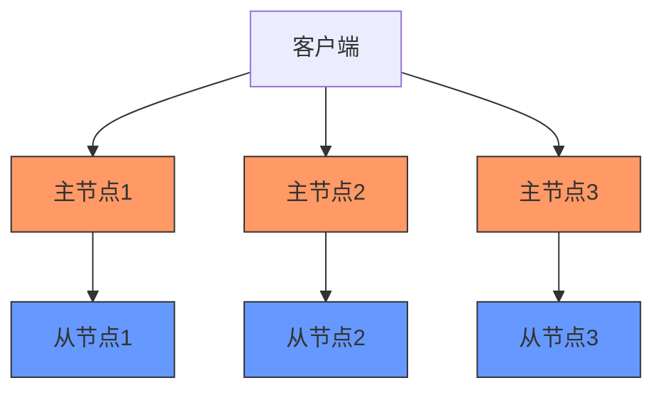
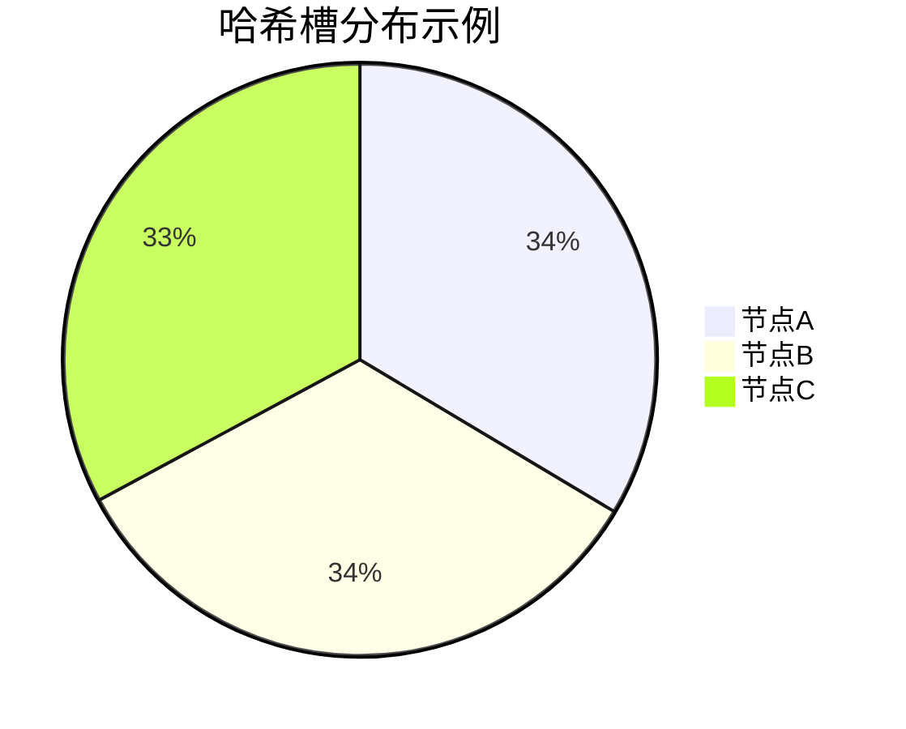
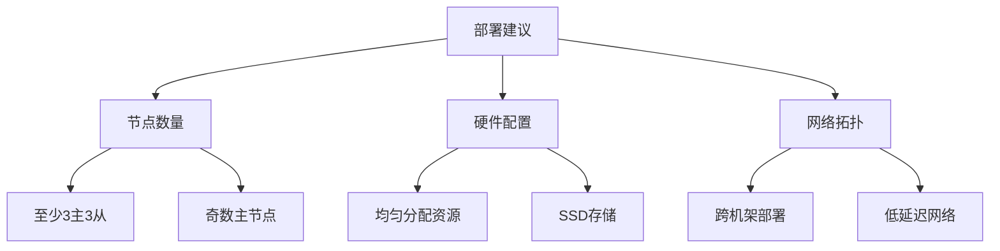

> Redis集群是Redis官方提供的分布式解决方案，通过数据分片和主从复制实现高可用和水平扩展。本文详细介绍Redis集群的架构原理、配置方法和运维实践。

## 1. Redis集群概述

### 1.1 什么是Redis集群

Redis集群是Redis的分布式实现，具有以下核心特性：

- **数据分片**：数据自动分散在多个节点上
- **高可用**：每个分片使用主从复制保证可用性
- **无中心节点**：所有节点平等，通过Gossip协议通信
- **自动故障转移**：主节点故障时自动提升从节点
- **线性扩展**：可通过增加节点提高集群容量和性能



### 1.2 集群与哨兵模式对比

| 特性 | Redis集群 | 哨兵模式 |
|------|----------|----------|
| 数据分布 | 自动分片 | 单主节点 |
| 扩展性 | 水平扩展 | 垂直扩展 |
| 高可用 | 内置 | 依赖哨兵 |
| 性能 | 更高 | 一般 |
| 复杂度 | 较高 | 较低 |
| 适用场景 | 大数据量 | 中小规模 |

## 2. 集群数据分片

### 2.1 哈希槽(Hash Slot)

Redis集群使用16384个哈希槽进行数据分片：

- 每个键通过CRC16算法计算后取模16384得到槽位
- 每个主节点负责一部分哈希槽
- 集群重组时只需移动槽位，不需移动数据



### 2.2 键哈希算法

键的哈希计算规则：

```python
def get_slot(key):
    # 只对{}中的内容计算哈希
    start = key.find('{')
    if start != -1:
        end = key.find('}', start+1)
        if end != -1 and end != start+1:
            key = key[start+1:end]
    return crc16(key) % 16384
```

**最佳实践**：使用哈希标签确保相关键在同一节点

```bash
# 这两个键会被分配到同一槽位
SET user:{1000}:name "Alice"
SET user:{1000}:email "alice@example.com"
```

## 3. 集群配置与部署

### 3.1 集群节点配置

每个节点需要启用集群模式：

```conf
# redis.conf
port 6379
cluster-enabled yes
cluster-config-file nodes-6379.conf
cluster-node-timeout 15000
```

### 3.2 创建集群

使用redis-cli创建集群：

```bash
redis-cli --cluster create \
  192.168.1.101:6379 \
  192.168.1.102:6379 \
  192.168.1.103:6379 \
  192.168.1.104:6379 \
  192.168.1.105:6379 \
  192.168.1.106:6379 \
  --cluster-replicas 1
```

### 3.3 集群节点角色

| 命令 | 描述 |
|------|------|
| `CLUSTER NODES` | 查看所有节点信息 |
| `CLUSTER INFO` | 查看集群状态 |
| `CLUSTER SLOTS` | 查看槽位分布 |

## 4. 集群运维管理

### 4.1 节点管理

**添加主节点**：

```bash
redis-cli --cluster add-node 新节点:端口 集群任意节点:端口
```

**添加从节点**：

```bash
redis-cli --cluster add-node 新节点:端口 集群任意节点:端口 --cluster-slave
```

### 4.2 槽位迁移

**重新分配槽位**：

```bash
redis-cli --cluster reshard 集群任意节点:端口
```

**迁移指定槽位**：

```bash
redis-cli --cluster reshard 集群任意节点:端口 \
  --cluster-from 源节点ID \
  --cluster-to 目标节点ID \
  --cluster-slots 槽位数 \
  --cluster-yes
```

## 5. 集群最佳实践

### 5.1 部署建议



### 5.2 客户端配置

**Java客户端示例**：

```java
JedisCluster jedis = new JedisCluster(
    new HostAndPort("192.168.1.101", 6379),
    new HostAndPort("192.168.1.102", 6379),
    1000, 1000, 5,
    "password", new GenericObjectPoolConfig<>()
);
```

## 6. 常见问题与解决方案

### 6.1 集群不完全覆盖

**问题表现**：
- 部分槽位未分配
- 集群状态为fail
- 某些键无法访问

**解决方案**：
1. 检查所有节点是否正常运行
2. 使用`CLUSTER INFO`查看集群状态
3. 重新分配未覆盖的槽位

### 6.2 节点故障处理

**自动恢复流程**：
1. 从节点检测主节点故障
2. 发起选举成为新主节点
3. 更新集群配置
4. 原主节点恢复后成为从节点

**手动干预**：
```bash
redis-cli --cluster failover --cluster-master-id 节点ID 集群任意节点:端口
```

## 7. 集群监控与调优

### 7.1 关键监控指标

| 指标 | 命令 | 健康值 |
|------|------|--------|
| 集群状态 | `CLUSTER INFO` | ok |
| 槽位覆盖 | `CLUSTER SLOTS` | 16384 |
| 节点状态 | `CLUSTER NODES` | connected |

### 7.2 性能调优参数

```conf
# 节点超时时间(毫秒)
cluster-node-timeout 15000

# 迁移并行度
cluster-migration-barrier 1

# 副本有效性检查
cluster-replica-validity-factor 10
```
