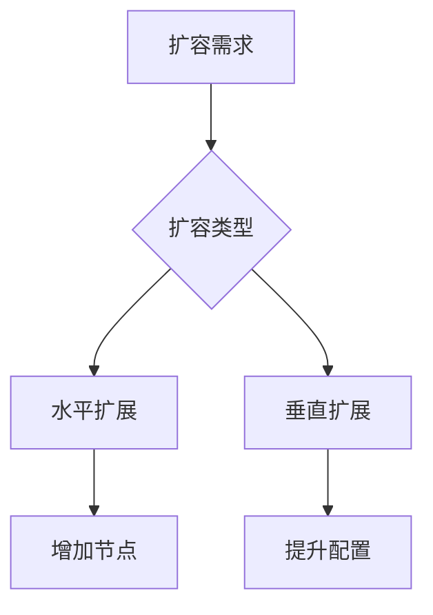
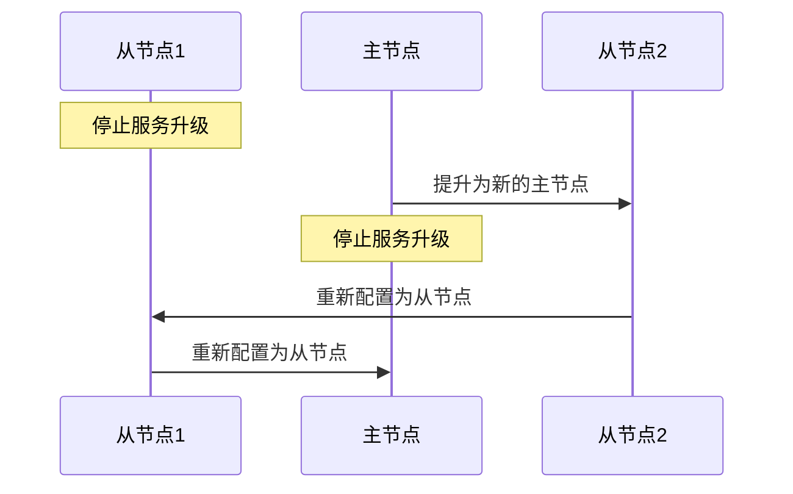
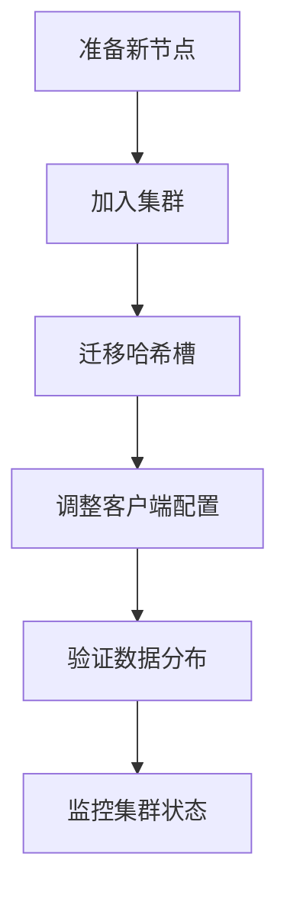
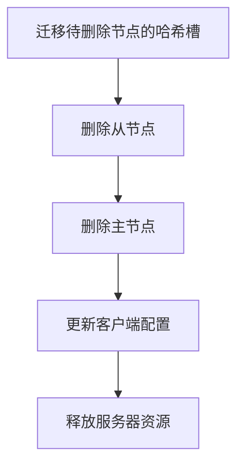

> Redis集群的扩缩容是运维工作中的重要环节，合理的扩缩容方案可以保证服务的高可用性和性能。本文详细介绍Redis集群的水平扩展、垂直扩展方案以及数据迁移策略。

## 1. Redis扩缩容概述

### 1.1 扩缩容场景

| 场景类型 | 触发条件 | 解决方案 |
|---------|---------|---------|
| 容量不足 | 内存使用率持续高于80% | 水平扩展增加节点 |
| QPS瓶颈 | CPU使用率持续高于70% | 垂直扩展提升配置 |
| 业务收缩 | 资源利用率长期低于30% | 安全缩容节点 |
| 性能优化 | 响应时间不达标 | 调整分片策略 |



### 1.2 扩缩容核心指标

**关键监控指标**：
- 内存使用率
- CPU使用率
- 网络吞吐量
- 命令延迟
- 缓存命中率

**扩容阈值建议**：
- 内存：持续3天>80%
- CPU：持续3天>70%
- QPS：达到当前集群70%容量

## 2. 水平扩展方案

### 2.1 增加主节点

**操作流程**：
1. 准备新节点并加入集群
2. 迁移部分哈希槽到新节点
3. 调整客户端路由配置

```bash
# 添加新主节点
redis-cli --cluster add-node 新节点IP:端口 集群任意节点IP:端口

# 迁移哈希槽
redis-cli --cluster reshard 集群任意节点IP:端口
```

### 2.2 增加从节点

**操作流程**：
1. 准备新节点
2. 指定复制目标主节点
3. 加入集群作为从节点

```bash
# 添加新从节点
redis-cli --cluster add-node 新节点IP:端口 集群任意节点IP:端口 --cluster-slave --cluster-master-id 主节点ID
```

## 3. 垂直扩展方案

### 3.1 升级单节点配置

**操作步骤**：
1. 逐个从节点升级
2. 主从切换
3. 升级原主节点
4. 恢复复制关系



### 3.2 配置调整建议

| 参数 | 默认值 | 优化建议 |
|------|--------|---------|
| maxmemory | 0 | 设置为物理内存的70-80% |
| maxmemory-policy | noeviction | 根据业务选择淘汰策略 |
| tcp-keepalive | 300 | 设置为60秒 |
| timeout | 0 | 设置为300秒 |

## 4. 数据迁移策略

### 4.1 在线迁移方案

**使用redis-cli工具迁移**：

```bash
# 迁移指定哈希槽
redis-cli --cluster reshard 集群任意节点IP:端口 \
    --cluster-from 源节点ID \
    --cluster-to 目标节点ID \
    --cluster-slots 迁移槽数量 \
    --cluster-yes
```

### 4.2 离线迁移方案

**使用RDB文件迁移**：
1. 源节点执行BGSAVE
2. 拷贝RDB文件到新节点
3. 新节点加载RDB
4. 加入集群

```bash
# 生成RDB文件
redis-cli -h 源节点IP BGSAVE

# 加载RDB文件
redis-server --dbfilename dump.rdb --dir /data/redis
```

## 5. 扩缩容操作步骤

### 5.1 扩容完整流程



### 5.2 缩容完整流程



## 6. 最佳实践与注意事项

### 6.1 操作最佳实践

**扩容建议**：
1. 选择业务低峰期操作
2. 先扩容从节点再扩容主节点
3. 保持分片均匀分布
4. 批量操作不超过集群节点的50%

**缩容注意事项**：
1. 确保有足够剩余容量
2. 先缩容从节点再缩容主节点
3. 保留至少一个从节点做备份
4. 更新所有客户端配置

### 6.2 监控与回滚

**监控指标**：
- 集群状态：`CLUSTER INFO`
- 节点状态：`CLUSTER NODES`
- 槽位分布：`CLUSTER SLOTS`

**回滚方案**：
1. 停止新流量
2. 恢复旧配置
3. 数据一致性检查
4. 逐步恢复服务

## 7. 常见问题与解决方案

### 7.1 扩容后性能下降

**可能原因**：
- 数据分布不均匀
- 客户端未更新路由表
- 新节点配置不一致

**解决方案**：
1. 检查槽位分布均匀性
2. 刷新客户端集群配置
3. 验证新节点参数配置

### 7.2 缩容后数据丢失

**可能原因**：
- 槽位迁移未完成
- 从节点有未同步数据
- 误删除活跃节点

**解决方案**：
1. 检查迁移日志确认完成状态
2. 从备份恢复数据
3. 紧急扩容恢复节点

### 7.3 客户端连接异常

**典型表现**：
- MOVED重定向错误
- ASK重定向错误
- 连接超时

**处理方案**：
1. 更新客户端集群配置
2. 实现自动重试机制
3. 检查网络连通性
