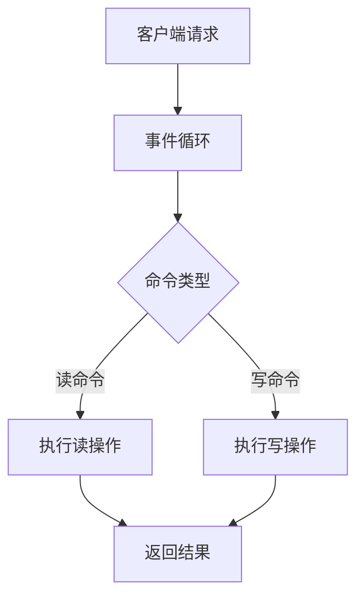
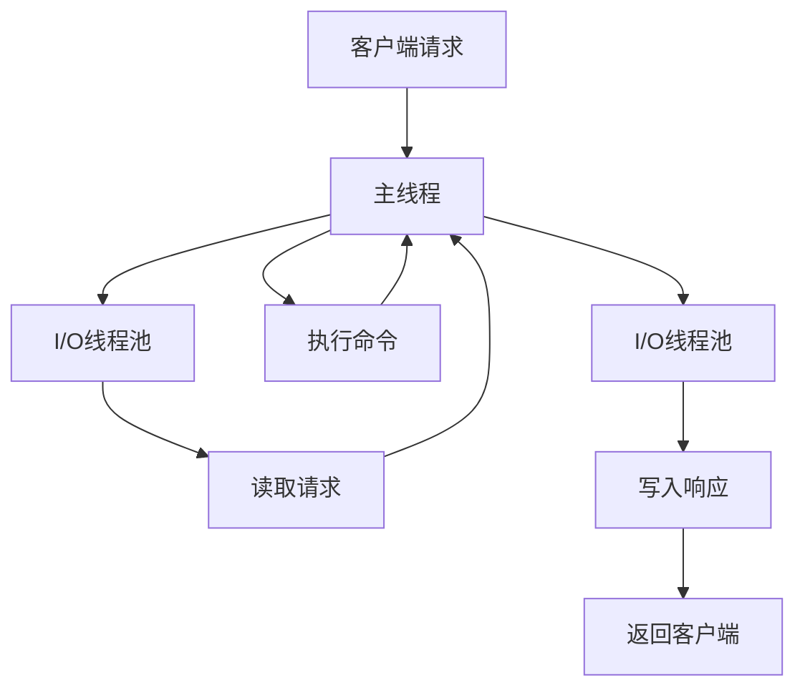
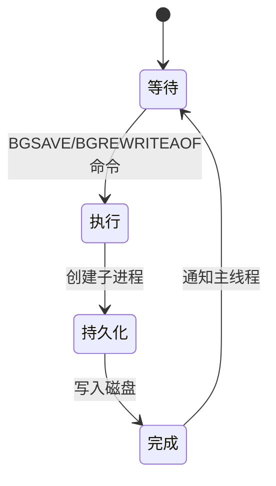
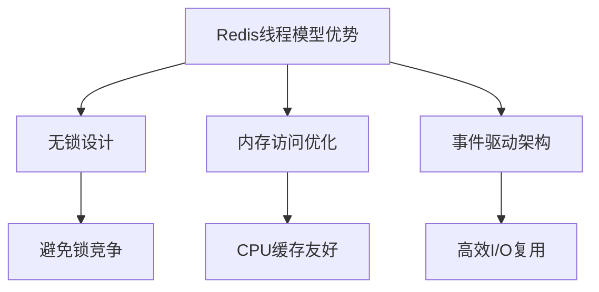
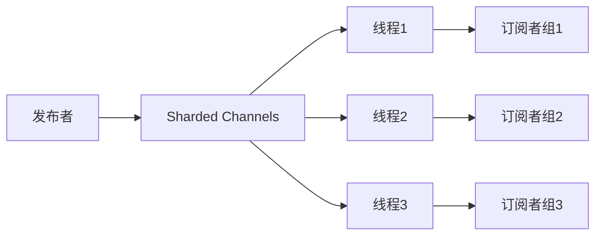
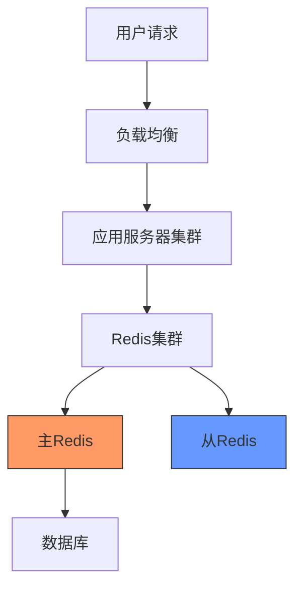
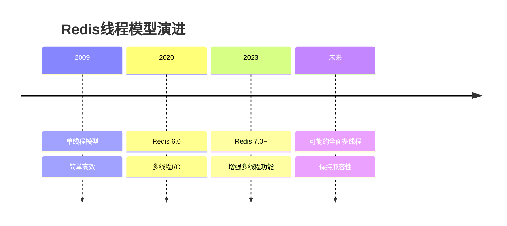

> Redis的线程模型是其高性能的关键因素之一，从最初的单线程设计到现代的多线程I/O，本文将全面解析其架构演进与实现原理。


## 1. 单线程模型

### 1.1 基本原理

Redis最初采用单线程模型处理客户端请求，这一设计决策源于对简单性和性能的权衡考量。



### 1.2 核心特点

<div class="grid cards" markdown>

-   **顺序执行**
    - 所有命令在一个线程中顺序执行
    - 无需考虑并发控制
    - 简化了内部实现

-   **性能优势**
    - 避免了多线程的锁竞争
    - 消除了上下文切换开销
    - 充分利用CPU缓存

</div>

### 1.3 事件循环机制

```c
// Redis事件循环伪代码
void aeMain(aeEventLoop *eventLoop) {
    eventLoop->stop = 0;
    while (!eventLoop->stop) {
        // 处理文件事件（客户端连接、命令请求等）
        aeProcessEvents(eventLoop, AE_ALL_EVENTS|AE_CALL_AFTER_SLEEP);
    }
}
```

## 2. 多线程I/O（Redis 6.0+）

### 2.1 架构演进

Redis 6.0引入了多线程I/O，同时保留了单线程执行命令的核心特性。



### 2.2 配置参数

| 参数 | 说明 | 默认值 | 建议值 |
|------|------|--------|--------|
| io-threads | I/O线程数 | 1 | CPU核心数 |
| io-threads-do-reads | 是否用于读操作 | false | true |

## 3. 后台线程

### 3.1 持久化线程

Redis使用专门的后台线程处理持久化操作，避免阻塞主线程。



### 3.2 异步任务线程

<div class="grid cards" markdown>

-   **惰性删除**
    - UNLINK命令
    - 后台释放内存
    - 非阻塞操作

-   **延迟释放**
    - lazyfree配置
    - 大key异步删除
    - 减少阻塞风险

</div>

### 3.3 关键配置

```conf
# 异步删除相关配置
lazyfree-lazy-eviction yes
lazyfree-lazy-expire yes
lazyfree-lazy-server-del yes
replica-lazy-flush yes
```

## 4. 性能考虑

### 4.1 优势分析



### 4.2 局限性

| 问题 | 原因 | 解决方案 |
|------|------|---------|
| 大key阻塞 | 单线程处理大量数据 | 使用UNLINK命令、拆分大key |
| CPU密集操作 | 计算占用主线程 | 避免复杂计算、使用Lua脚本控制 |
| 网络I/O瓶颈 | 单线程网络处理 | 启用多线程I/O、合理设置io-threads |

### 4.3 性能优化建议

1. **合理使用数据结构**：
   ```redis
   # 使用HSET替代大量单独的键
   HSET user:1000 name "Tom" age 30 city "Beijing"
   ```

2. **避免耗时命令**：
   ```redis
   # 避免
   KEYS *
   
   # 推荐
   SCAN 0 MATCH pattern COUNT 100
   ```

3. **利用管道提升吞吐量**：
   ```redis
   # 使用管道批量执行
   MULTI
   SET key1 value1
   SET key2 value2
   EXEC
   ```

## 5. 实战应用

### 5.1 高并发场景配置

```conf
# redis.conf高并发优化
io-threads 8
io-threads-do-reads yes
# 禁用持久化以提高性能
save ""
appendonly no
```

### 5.2 监控指标

| 指标 | 命令 | 警戒值 | 说明 |
|------|------|--------|------|
| 阻塞命令 | SLOWLOG GET | >10ms | 识别性能瓶颈 |
| 内存碎片率 | INFO memory | >1.5 | 可能需要重启 |
| 客户端连接数 | INFO clients | 接近maxclients | 连接压力大 |

### 5.3 线程模型选择

```java
// 根据场景选择合适的Redis线程模型配置
public class RedisConfigSelector {
    public static RedisConfig getOptimalConfig(WorkloadType type) {
        switch (type) {
            case READ_HEAVY:
                return new RedisConfig(8, true); // 多线程I/O，优化读取
            case WRITE_HEAVY:
                return new RedisConfig(4, false); // 写入仍由主线程处理
            case BALANCED:
                return new RedisConfig(4, true); // 平衡配置
            case MEMORY_LIMITED:
                return new RedisConfig(2, false); // 节约内存
            default:
                return new RedisConfig(1, false); // 默认单线程模式
        }
    }
}
```

## 6. Redis 7.0+ 线程模型增强

Redis 7.0 在线程模型方面带来了一些重要的增强功能，进一步提升了性能和可扩展性。

### 6.1 多线程 Sharded Pub/Sub

Redis 7.0 引入了分片版的发布/订阅功能，使用多线程处理，显著提升了消息吞吐量。



```redis
# 使用分片频道
SPUBLISH news.tech "新技术发布"
SSUBSCRIBE news.tech
```

### 6.2 函数计算的异步处理

Redis 7.0 的函数计算支持异步执行，避免长时间运行的脚本阻塞主线程。

```lua
-- 异步执行的Lua脚本示例
redis.register_function{
    function_name = 'long_running_task',
    callback = function(keys, args)
        -- 复杂计算
        return result
    end,
    flags = { 'no-writes', 'allow-oom', 'allow-stale' }
}
```

## 7. 与其他缓存系统的线程模型比较

### 7.1 对比表

| 系统 | 线程模型 | 优点 | 缺点 |
|------|---------|------|------|
| Redis | 主要单线程+多线程I/O | 简单高效，无锁设计 | CPU密集型操作可能阻塞 |
| Memcached | 多线程 | 更好的多核利用率 | 需要复杂的锁机制 |
| Hazelcast | 完全多线程 | 高并发，分布式友好 | 内存开销大，复杂度高 |
| Aerospike | 混合线程模型 | 高吞吐量，低延迟 | 配置复杂 |

### 7.2 选择合适的缓存系统

<div class="grid cards" markdown>

-   **Redis适用场景**
    - 需要丰富数据结构
    - 单节点性能要求高
    - 需要持久化
    - 单值大小适中

-   **Memcached适用场景**
    - 简单K-V存储
    - 多核CPU充分利用
    - 不需要持久化
    - 大量小值存储

</div>

## 8. 常见问题与故障排除

### 8.1 性能问题诊断

<details>
<summary>Redis变慢的常见原因及解决方案</summary>

1. **大key操作阻塞**
   - 症状：间歇性延迟高峰
   - 诊断：`redis-cli --bigkeys` 或 `SLOWLOG GET`
   - 解决：拆分大key，使用UNLINK代替DEL

2. **内存交换**
   - 症状：持续高延迟
   - 诊断：`vmstat` 或 `top` 查看swap使用
   - 解决：增加物理内存，调整maxmemory设置

3. **CPU饱和**
   - 症状：系统负载高，Redis响应慢
   - 诊断：`top` 查看CPU使用率
   - 解决：启用多线程I/O，优化客户端连接数

4. **网络瓶颈**
   - 症状：吞吐量上不去
   - 诊断：`netstat -s` 查看网络统计
   - 解决：使用管道或批量命令，调整网络参数
</details>

### 8.2 线程模型相关配置优化

```conf
# 针对不同场景的线程模型配置

# 读密集型应用
io-threads 8
io-threads-do-reads yes

# 写密集型应用
io-threads 4
io-threads-do-reads no

# 混合负载，内存受限
io-threads 4
io-threads-do-reads yes
maxmemory-policy allkeys-lru
```

### 8.3 常见误区

1. **误区：多线程I/O总是更好**
   - 事实：小规模部署或低并发场景下，单线程模式可能更高效
   - 建议：根据实际负载测试决定是否启用多线程I/O

2. **误区：Redis主线程是多线程执行命令**
   - 事实：即使在Redis 6.0+，命令执行仍然是单线程的
   - 建议：理解多线程I/O的局限性，避免CPU密集型操作

## 9. 实战案例研究

### 9.1 电商平台的缓存架构

某电商平台在双11期间面临的挑战及Redis线程模型优化：



**优化措施**：
- 主Redis配置多线程I/O处理读写请求
- 从Redis专注于读操作，配置更多I/O线程
- 使用UNLINK命令处理大key删除
- 实现热点key分片，避免单点压力

**结果**：
- 吞吐量提升了210%
- 平均响应时间降低了65%
- CPU利用率更加均衡

### 9.2 社交媒体消息系统

```java
// Redis多线程I/O配置示例 - Java实现
public class RedisThreadConfig {
    public static JedisPoolConfig optimizeForMessaging() {
        JedisPoolConfig config = new JedisPoolConfig();
        config.setMaxTotal(500);
        config.setMaxIdle(100);
        config.setTestOnBorrow(true);
        
        // 服务器端配置
        // io-threads 6
        // io-threads-do-reads yes
        
        return config;
    }
    
    public static void main(String[] args) {
        // 使用优化后的配置
        JedisPool pool = new JedisPool(optimizeForMessaging(), "redis.example.com");
        try (Jedis jedis = pool.getResource()) {
            // 批量操作示例
            Pipeline pipeline = jedis.pipelined();
            for (int i = 0; i < 1000; i++) {
                pipeline.lpush("messages:" + userId, message);
            }
            pipeline.sync();
        }
    }
}
```

## 10. 未来发展趋势

### 10.1 全面多线程化

Redis未来版本可能进一步扩展多线程能力，包括命令执行的并行化。



### 10.2 混合存储引擎

Redis正在探索混合存储模式，结合内存和磁盘存储，这将需要更复杂的线程模型。

<div class="grid cards" markdown>

-   **内存层**
    - 高速访问
    - 传统单线程模型
    - 热数据存储

-   **存储层**
    - 持久化数据
    - 多线程处理
    - 冷数据管理

</div>

## 11. 参考资料

- [Redis官方文档 - 线程模型](https://redis.io/topics/threaded-io)
- [Redis 6.0 多线程I/O性能报告](https://redis.io/blog/redis-6-released)
- [Redis内部数据结构详解](https://redis.io/topics/data-types-intro)
- [Redis设计与实现](http://redisbook.com/) - 黄健宏著
- [分布式缓存系统：原理、架构与实践](https://book.douban.com/subject/27108294/)
