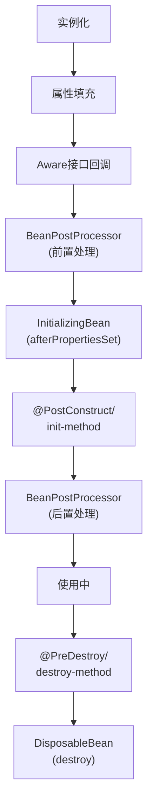

## 1. 概述

BeanPostProcessor（Bean后置处理器）是Spring框架中一个非常重要的扩展点，它允许在Spring容器完成Bean实例化、属性填充之后，但在Bean初始化前后对Bean进行额外的处理。通过BeanPostProcessor，开发者可以插入自定义的逻辑来修改或增强Bean的功能。


## 2. BeanPostProcessor接口详解

### 2.1 核心方法

BeanPostProcessor接口定义了两个核心方法：

```java
public interface BeanPostProcessor {
    // 初始化前调用
    @Nullable
    default Object postProcessBeforeInitialization(Object bean, String beanName) throws BeansException {
        return bean;
    }
    
    // 初始化后调用
    @Nullable
    default Object postProcessAfterInitialization(Object bean, String beanName) throws BeansException {
        return bean;
    }
}
```

这两个方法分别在Bean的初始化前后被调用，允许开发者对Bean进行修改或替换。

### 2.2 执行时机

在Spring Bean的生命周期中，BeanPostProcessor的执行时机如下：

| 执行顺序 | 生命周期阶段 | 相关方法 |
|---------|------------|---------|
| 1 | 实例化 | createBeanInstance() |
| 2 | 属性填充 | populateBean() |
| 3 | **前置处理** | **postProcessBeforeInitialization()** |
| 4 | 初始化 | initializeBean() |
| 5 | **后置处理** | **postProcessAfterInitialization()** |
| 6 | 使用中 | - |
| 7 | 销毁 | destroyBean() |

## 3. 执行流程

BeanPostProcessor的执行流程嵌入在AbstractAutowireCapableBeanFactory的initializeBean方法中：

```java
protected Object initializeBean(final String beanName, final Object bean, RootBeanDefinition mbd) {
    // 处理Aware接口回调
    if (System.getSecurityManager() != null) {
        // 省略安全管理器相关代码
    } else {
        invokeAwareMethods(beanName, bean);
    }

    Object wrappedBean = bean;
    
    // 前置处理
    wrappedBean = applyBeanPostProcessorsBeforeInitialization(wrappedBean, beanName);
    
    // 调用初始化方法
    try {
        invokeInitMethods(beanName, wrappedBean, mbd);
    } catch (Throwable ex) {
        throw new BeanCreationException(...);
    }
    
    // 后置处理
    wrappedBean = applyBeanPostProcessorsAfterInitialization(wrappedBean, beanName);
    return wrappedBean;
}
```

Spring容器会遍历所有注册的BeanPostProcessor实现，并按照优先级顺序依次调用它们的处理方法：

```java
@Override
public Object applyBeanPostProcessorsBeforeInitialization(Object existingBean, String beanName)
        throws BeansException {
    Object result = existingBean;
    // 遍历所有BeanPostProcessor
    for (BeanPostProcessor processor : getBeanPostProcessors()) {
        // 调用前置处理方法
        Object current = processor.postProcessBeforeInitialization(result, beanName);
        if (current == null) {
            return result;
        }
        result = current;
    }
    return result;
}
```

## 4. 常见实现和应用场景

Spring框架内部大量使用BeanPostProcessor来实现各种功能：

<div class="grid cards" markdown>

-   **@Autowired注解支持**
    - AutowiredAnnotationBeanPostProcessor
    - 处理@Autowired、@Value和@Inject注解

-   **AOP代理创建**
    - AbstractAutoProxyCreator
    - 为Bean创建AOP代理对象

-   **初始化注解处理**
    - InitDestroyAnnotationBeanPostProcessor
    - 处理@PostConstruct和@PreDestroy注解

-   **配置属性绑定**
    - ConfigurationPropertiesBindingPostProcessor
    - 将外部配置绑定到@ConfigurationProperties注解的Bean

</div>

### 4.1 常见内置实现

| BeanPostProcessor实现 | 功能描述 | 应用场景 |
|----------------------|---------|---------|
| AutowiredAnnotationBeanPostProcessor | 处理依赖注入注解 | 支持@Autowired、@Value等注解 |
| CommonAnnotationBeanPostProcessor | 处理JSR-250注解 | 支持@PostConstruct、@PreDestroy等 |
| ApplicationContextAwareProcessor | 处理Aware接口 | 注入ApplicationContext等容器资源 |
| BeanValidationPostProcessor | 数据校验 | 对Bean进行JSR-303验证 |
| AbstractAdvisingBeanPostProcessor | AOP增强 | 创建AOP代理 |

## 5. 源码分析

### 5.1 注册过程

BeanPostProcessor的注册过程在AbstractApplicationContext的refresh方法中：

```java
@Override
public void refresh() throws BeansException, IllegalStateException {
    // 省略其他步骤...
    
    // 注册BeanPostProcessor
    registerBeanPostProcessors(beanFactory);
    
    // 省略其他步骤...
}

protected void registerBeanPostProcessors(ConfigurableListableBeanFactory beanFactory) {
    PostProcessorRegistrationDelegate.registerBeanPostProcessors(beanFactory, this);
}
```

PostProcessorRegistrationDelegate会按照PriorityOrdered、Ordered和其他三类优先级来注册BeanPostProcessor：

```java
public static void registerBeanPostProcessors(
        ConfigurableListableBeanFactory beanFactory, AbstractApplicationContext applicationContext) {
    
    // 获取所有BeanPostProcessor的beanName
    String[] postProcessorNames = beanFactory.getBeanNamesForType(BeanPostProcessor.class, true, false);
    
    // 注册BeanPostProcessorChecker
    int beanProcessorTargetCount = beanFactory.getBeanPostProcessorCount() + 1 + postProcessorNames.length;
    beanFactory.addBeanPostProcessor(new BeanPostProcessorChecker(beanFactory, beanProcessorTargetCount));
    
    // 按优先级分组并注册
    List<BeanPostProcessor> priorityOrderedPostProcessors = new ArrayList<>();
    List<String> orderedPostProcessorNames = new ArrayList<>();
    List<String> nonOrderedPostProcessorNames = new ArrayList<>();
    
    // 分类处理
    for (String ppName : postProcessorNames) {
        if (beanFactory.isTypeMatch(ppName, PriorityOrdered.class)) {
            BeanPostProcessor pp = beanFactory.getBean(ppName, BeanPostProcessor.class);
            priorityOrderedPostProcessors.add(pp);
        }
        else if (beanFactory.isTypeMatch(ppName, Ordered.class)) {
            orderedPostProcessorNames.add(ppName);
        }
        else {
            nonOrderedPostProcessorNames.add(ppName);
        }
    }
    
    // 注册PriorityOrdered处理器
    sortPostProcessors(priorityOrderedPostProcessors, beanFactory);
    registerBeanPostProcessors(beanFactory, priorityOrderedPostProcessors);
    
    // 注册Ordered处理器
    List<BeanPostProcessor> orderedPostProcessors = new ArrayList<>(orderedPostProcessorNames.size());
    for (String ppName : orderedPostProcessorNames) {
        BeanPostProcessor pp = beanFactory.getBean(ppName, BeanPostProcessor.class);
        orderedPostProcessors.add(pp);
    }
    sortPostProcessors(orderedPostProcessors, beanFactory);
    registerBeanPostProcessors(beanFactory, orderedPostProcessors);
    
    // 注册普通处理器
    List<BeanPostProcessor> nonOrderedPostProcessors = new ArrayList<>(nonOrderedPostProcessorNames.size());
    for (String ppName : nonOrderedPostProcessorNames) {
        BeanPostProcessor pp = beanFactory.getBean(ppName, BeanPostProcessor.class);
        nonOrderedPostProcessors.add(pp);
    }
    registerBeanPostProcessors(beanFactory, nonOrderedPostProcessors);
    
    // 最后注册内部BeanPostProcessor
    // 省略部分代码...
}
```

### 5.2 调用过程

BeanPostProcessor的调用过程在AbstractAutowireCapableBeanFactory中：

```java
// 前置处理调用
public Object applyBeanPostProcessorsBeforeInitialization(Object existingBean, String beanName)
        throws BeansException {
    Object result = existingBean;
    for (BeanPostProcessor processor : getBeanPostProcessors()) {
        Object current = processor.postProcessBeforeInitialization(result, beanName);
        if (current == null) {
            return result;
        }
        result = current;
    }
    return result;
}

// 后置处理调用
public Object applyBeanPostProcessorsAfterInitialization(Object existingBean, String beanName)
        throws BeansException {
    Object result = existingBean;
    for (BeanPostProcessor processor : getBeanPostProcessors()) {
        Object current = processor.postProcessAfterInitialization(result, beanName);
        if (current == null) {
            return result;
        }
        result = current;
    }
    return result;
}
```

## 6. 自定义BeanPostProcessor示例

### 6.1 基本实现

```java
@Component
public class CustomBeanPostProcessor implements BeanPostProcessor {
    
    @Override
    public Object postProcessBeforeInitialization(Object bean, String beanName) throws BeansException {
        if (bean instanceof TargetService) {
            System.out.println("Before initialization of bean: " + beanName);
            // 可以修改bean的属性或状态
        }
        return bean;
    }
    
    @Override
    public Object postProcessAfterInitialization(Object bean, String beanName) throws BeansException {
        if (bean instanceof TargetService) {
            System.out.println("After initialization of bean: " + beanName);
            // 可以替换bean或创建代理
        }
        return bean;
    }
}
```

### 6.2 高级应用：方法执行时间统计

```java
@Component
public class MethodTimingBeanPostProcessor implements BeanPostProcessor, Ordered {
    
    @Override
    public Object postProcessAfterInitialization(Object bean, String beanName) throws BeansException {
        // 只处理带有@TimingRequired注解的类
        if (AnnotationUtils.findAnnotation(bean.getClass(), TimingRequired.class) != null) {
            // 创建代理
            return Proxy.newProxyInstance(
                bean.getClass().getClassLoader(),
                bean.getClass().getInterfaces(),
                (proxy, method, args) -> {
                    long start = System.currentTimeMillis();
                    try {
                        return method.invoke(bean, args);
                    } finally {
                        long executionTime = System.currentTimeMillis() - start;
                        System.out.printf("Method %s executed in %d ms%n", 
                                          method.getName(), executionTime);
                    }
                });
        }
        return bean;
    }
    
    @Override
    public int getOrder() {
        return Ordered.LOWEST_PRECEDENCE;
    }
}

// 自定义注解
@Target(ElementType.TYPE)
@Retention(RetentionPolicy.RUNTIME)
public @interface TimingRequired {
}
```

### 6.3 实现依赖注入功能

```java
@Component
public class CustomAutowireBeanPostProcessor implements BeanPostProcessor, BeanFactoryAware {
    
    private BeanFactory beanFactory;
    
    @Override
    public void setBeanFactory(BeanFactory beanFactory) throws BeansException {
        this.beanFactory = beanFactory;
    }
    
    @Override
    public Object postProcessBeforeInitialization(Object bean, String beanName) throws BeansException {
        Field[] fields = bean.getClass().getDeclaredFields();
        for (Field field : fields) {
            // 检查自定义注解
            CustomInject annotation = field.getAnnotation(CustomInject.class);
            if (annotation != null) {
                field.setAccessible(true);
                try {
                    // 获取依赖并注入
                    Object dependency = beanFactory.getBean(field.getType());
                    field.set(bean, dependency);
                } catch (IllegalAccessException e) {
                    throw new BeanCreationException(beanName, "Failed to inject field: " + field, e);
                }
            }
        }
        return bean;
    }
}

// 自定义注入注解
@Target(ElementType.FIELD)
@Retention(RetentionPolicy.RUNTIME)
public @interface CustomInject {
}
```

## 7. 最佳实践

### 7.1 优先级控制

实现Ordered或PriorityOrdered接口来控制BeanPostProcessor的执行顺序：

```java
@Component
public class HighPriorityBeanPostProcessor implements BeanPostProcessor, PriorityOrdered {
    
    @Override
    public int getOrder() {
        return Ordered.HIGHEST_PRECEDENCE;
    }
    
    // 其他方法实现...
}

@Component
public class LowPriorityBeanPostProcessor implements BeanPostProcessor, Ordered {
    
    @Override
    public int getOrder() {
        return Ordered.LOWEST_PRECEDENCE;
    }
    
    // 其他方法实现...
}
```

优先级规则：
- 数值越小，优先级越高
- PriorityOrdered接口的实现总是优先于Ordered接口
- 没有实现排序接口的处理器按注册顺序执行

### 7.2 性能考虑

BeanPostProcessor会影响Spring容器的启动性能，因为它们会被应用到每个Bean上：

1. **选择性处理**：
   ```java
   @Override
   public Object postProcessBeforeInitialization(Object bean, String beanName) {
       // 只处理特定类型的Bean
       if (bean instanceof TargetType) {
           // 处理逻辑
       }
       return bean;
   }
   ```

2. **避免重量级操作**：
   - 避免在处理方法中执行IO操作
   - 避免复杂的反射操作
   - 考虑使用缓存

3. **延迟初始化**：
   - 对于耗时的操作，考虑使用懒加载策略

### 7.3 调试技巧

1. **日志记录**：
   ```java
   @Component
   public class LoggingBeanPostProcessor implements BeanPostProcessor {
       private static final Logger logger = LoggerFactory.getLogger(LoggingBeanPostProcessor.class);
       
       @Override
       public Object postProcessBeforeInitialization(Object bean, String beanName) {
           logger.debug("Bean '{}' of type {} before initialization", 
                      beanName, bean.getClass().getName());
           return bean;
       }
       
       @Override
       public Object postProcessAfterInitialization(Object bean, String beanName) {
           logger.debug("Bean '{}' of type {} after initialization", 
                      beanName, bean.getClass().getName());
           return bean;
       }
   }
   ```

2. **条件断点**：在调试时，为特定Bean设置条件断点

3. **启用跟踪**：
   ```properties
   logging.level.org.springframework.beans.factory.support=TRACE
   ```

## 8. 与其他Spring机制的关系

### 8.1 与Bean生命周期的关系



### 8.2 与AOP的关系

BeanPostProcessor是Spring AOP实现的核心机制：

```java
// AbstractAutoProxyCreator是一个BeanPostProcessor
public abstract class AbstractAutoProxyCreator extends ProxyProcessorSupport
        implements SmartInstantiationAwareBeanPostProcessor, PriorityOrdered {
    
    @Override
    public Object postProcessAfterInitialization(@Nullable Object bean, String beanName) {
        if (bean != null) {
            // 为Bean创建代理
            Object cacheKey = getCacheKey(bean.getClass(), beanName);
            if (this.earlyProxyReferences.remove(cacheKey) != bean) {
                return wrapIfNecessary(bean, beanName, cacheKey);
            }
        }
        return bean;
    }
    
    protected Object wrapIfNecessary(Object bean, String beanName, Object cacheKey) {
        // 创建代理的逻辑
        // ...
    }
}
```

### 8.3 与依赖注入的关系

AutowiredAnnotationBeanPostProcessor负责处理@Autowired注解：

```java
public class AutowiredAnnotationBeanPostProcessor implements SmartInstantiationAwareBeanPostProcessor {
    
    @Override
    public PropertyValues postProcessProperties(PropertyValues pvs, Object bean, String beanName) {
        // 查找@Autowired注解并注入依赖
        InjectionMetadata metadata = findAutowiringMetadata(beanName, bean.getClass(), pvs);
        try {
            metadata.inject(bean, beanName, pvs);
        }
        catch (BeanCreationException ex) {
            throw ex;
        }
        catch (Throwable ex) {
            throw new BeanCreationException(beanName, "Injection of autowired dependencies failed", ex);
        }
        return pvs;
    }
}
```

## 9. 总结

BeanPostProcessor是Spring框架中一个强大的扩展点，它允许开发者在Bean初始化前后插入自定义逻辑，实现各种功能增强。通过深入理解BeanPostProcessor的工作原理和应用场景，开发者可以更好地利用Spring框架的能力，实现更灵活、更强大的应用程序。

主要优势：
- 提供了非侵入式的Bean增强机制
- 支持横切关注点的模块化处理
- 是Spring许多核心功能的实现基础

使用建议：
- 明确处理器的执行顺序
- 注意性能影响
- 选择性地处理Bean
- 合理使用返回值来替换或包装Bean