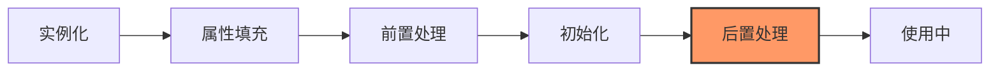
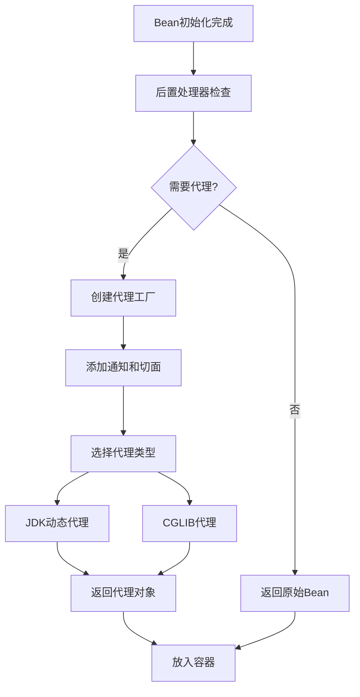

## 1. 概述

Bean后置处理器是Spring框架中BeanPostProcessor接口的postProcessAfterInitialization方法所提供的功能，它在Bean初始化完成后被调用，是Spring框架中最重要的扩展点之一。通过后置处理器，开发者可以在Bean完全初始化后对其进行修改、增强或替换，是实现AOP、代理、包装等功能的核心机制。



## 2. 后置处理器接口详解

### 2.1 核心方法

BeanPostProcessor接口中的后置处理方法定义：

```java
public interface BeanPostProcessor {
    // 前置处理方法（初始化前）
    @Nullable
    default Object postProcessBeforeInitialization(Object bean, String beanName) throws BeansException {
        return bean;
    }
    
    // 后置处理方法（初始化后）
    @Nullable
    default Object postProcessAfterInitialization(Object bean, String beanName) throws BeansException {
        return bean;
    }
}
```

后置处理方法`postProcessAfterInitialization`在Bean的初始化方法（如`InitializingBean.afterPropertiesSet()`或自定义的`init-method`）执行完成后被调用。

### 2.2 执行时机

在Spring Bean的生命周期中，后置处理器的执行时机如下：

| 执行顺序 | 生命周期阶段 | 相关方法 |
|---------|------------|---------|
| 1 | 实例化 | createBeanInstance() |
| 2 | 属性填充 | populateBean() |
| 3 | 前置处理 | postProcessBeforeInitialization() |
| 4 | 初始化 | initializeBean() |
| 5 | **后置处理** | **postProcessAfterInitialization()** |
| 6 | 使用中 | - |
| 7 | 销毁 | destroyBean() |

### 2.3 前置处理与后置处理的区别

| 特性 | 前置处理 | 后置处理 |
|-----|---------|---------|
| 执行时机 | 初始化之前 | 初始化之后 |
| 主要用途 | 属性修改、注入、验证 | 代理创建、包装、增强 |
| 常见应用 | @PostConstruct处理、属性注入 | AOP代理、缓存代理、事务代理 |
| 对象状态 | 尚未完全初始化 | 已完全初始化 |
| 典型实现 | CommonAnnotationBeanPostProcessor | AbstractAutoProxyCreator |

## 3. 执行流程

后置处理器的执行流程嵌入在AbstractAutowireCapableBeanFactory的initializeBean方法中：

```java
protected Object initializeBean(final String beanName, final Object bean, RootBeanDefinition mbd) {
    // 处理Aware接口回调
    if (System.getSecurityManager() != null) {
        // 省略安全管理器相关代码
    } else {
        invokeAwareMethods(beanName, bean);
    }

    Object wrappedBean = bean;
    
    // 前置处理
    wrappedBean = applyBeanPostProcessorsBeforeInitialization(wrappedBean, beanName);
    
    // 调用初始化方法
    try {
        invokeInitMethods(beanName, wrappedBean, mbd);
    } catch (Throwable ex) {
        throw new BeanCreationException(...);
    }
    
    // 后置处理
    wrappedBean = applyBeanPostProcessorsAfterInitialization(wrappedBean, beanName);
    return wrappedBean;
}
```

后置处理的具体实现：

```java
@Override
public Object applyBeanPostProcessorsAfterInitialization(Object existingBean, String beanName)
        throws BeansException {
    Object result = existingBean;
    // 遍历所有BeanPostProcessor
    for (BeanPostProcessor processor : getBeanPostProcessors()) {
        // 调用后置处理方法
        Object current = processor.postProcessAfterInitialization(result, beanName);
        if (current == null) {
            return result;
        }
        result = current;
    }
    return result;
}
```

## 4. 常见实现和应用场景

Spring框架内部大量使用后置处理器来实现各种功能：

<div class="grid cards" markdown>

-   **AOP代理创建**
    - AbstractAutoProxyCreator
    - 为Bean创建AOP代理对象
    - 实现@Aspect注解支持

-   **事务代理**
    - AbstractAdvisingBeanPostProcessor
    - 为@Transactional注解的Bean创建事务代理

-   **缓存代理**
    - CacheOperationSourceAdvisor
    - 为@Cacheable等注解的方法创建缓存代理

-   **异步方法处理**
    - AsyncAnnotationBeanPostProcessor
    - 为@Async注解的方法创建异步执行代理

</div>

### 4.1 常见内置实现

| 后置处理器实现 | 功能描述 | 应用场景 |
|--------------|---------|---------|
| AbstractAutoProxyCreator | AOP代理创建 | 创建@Aspect、@Transactional等注解的代理 |
| AnnotationAwareAspectJAutoProxyCreator | AspectJ风格AOP支持 | 处理@Aspect注解的切面 |
| AsyncAnnotationBeanPostProcessor | 异步方法处理 | 处理@Async注解 |
| MBeanExporter | JMX导出 | 将Bean导出为JMX MBean |
| ApplicationListenerDetector | 监听器检测 | 注册ApplicationListener实现 |

### 4.2 后置处理器与AOP的关系

后置处理器是Spring AOP实现的核心机制，以AbstractAutoProxyCreator为例：

```java
public abstract class AbstractAutoProxyCreator extends ProxyProcessorSupport
        implements SmartInstantiationAwareBeanPostProcessor, PriorityOrdered {
    
    @Override
    public Object postProcessAfterInitialization(@Nullable Object bean, String beanName) {
        if (bean != null) {
            // 为Bean创建代理
            Object cacheKey = getCacheKey(bean.getClass(), beanName);
            if (this.earlyProxyReferences.remove(cacheKey) != bean) {
                return wrapIfNecessary(bean, beanName, cacheKey);
            }
        }
        return bean;
    }
    
    protected Object wrapIfNecessary(Object bean, String beanName, Object cacheKey) {
        // 检查是否需要代理
        if (StringUtils.hasLength(beanName) && this.targetSourcedBeans.contains(beanName)) {
            return bean;
        }
        if (Boolean.FALSE.equals(this.advisedBeans.get(cacheKey))) {
            return bean;
        }
        
        // 跳过不需要代理的Bean
        if (isInfrastructureClass(bean.getClass()) || shouldSkip(bean.getClass(), beanName)) {
            this.advisedBeans.put(cacheKey, Boolean.FALSE);
            return bean;
        }

        // 获取适用于此Bean的通知
        Object[] specificInterceptors = getAdvicesAndAdvisorsForBean(bean.getClass(), beanName, null);
        if (specificInterceptors != DO_NOT_PROXY) {
            this.advisedBeans.put(cacheKey, Boolean.TRUE);
            // 创建代理
            Object proxy = createProxy(
                    bean.getClass(), beanName, specificInterceptors, new SingletonTargetSource(bean));
            this.proxyTypes.put(cacheKey, proxy.getClass());
            return proxy;
        }

        this.advisedBeans.put(cacheKey, Boolean.FALSE);
        return bean;
    }
}
```

## 5. 源码分析

### 5.1 代理创建过程

以AOP代理创建为例，分析后置处理器如何创建代理：

```java
// AbstractAutoProxyCreator.createProxy方法
protected Object createProxy(Class<?> beanClass, @Nullable String beanName,
        @Nullable Object[] specificInterceptors, TargetSource targetSource) {

    // 创建代理工厂
    ProxyFactory proxyFactory = new ProxyFactory();
    proxyFactory.copyFrom(this);
    
    // 处理代理目标类设置
    if (proxyFactory.isProxyTargetClass()) {
        // 确保可以使用CGLIB代理
        if (Proxy.isProxyClass(beanClass)) {
            // JDK动态代理的类不能被CGLIB代理
            proxyFactory.setProxyTargetClass(false);
        }
    }
    else {
        // 检查是否需要保留代理目标类
        if (shouldProxyTargetClass(beanClass, beanName)) {
            proxyFactory.setProxyTargetClass(true);
        }
    }
    
    // 添加通知
    for (Object advisor : specificInterceptors) {
        proxyFactory.addAdvisor((Advisor) advisor);
    }
    
    // 设置目标源
    proxyFactory.setTargetSource(targetSource);
    // 允许自定义代理
    customizeProxyFactory(proxyFactory);
    
    // 控制代理工厂被配置后是否允许修改
    proxyFactory.setFrozen(this.freezeProxy);
    if (advisorsPreFiltered()) {
        proxyFactory.setPreFiltered(true);
    }
    
    // 使用代理工厂创建代理
    return proxyFactory.getProxy(getProxyClassLoader());
}
```

### 5.2 JDK动态代理与CGLIB代理的选择

```java
// DefaultAopProxyFactory.createAopProxy方法
@Override
public AopProxy createAopProxy(AdvisedSupport config) throws AopConfigException {
    // 决定使用JDK动态代理还是CGLIB代理
    if (config.isOptimize() || config.isProxyTargetClass() || hasNoUserSuppliedProxyInterfaces(config)) {
        Class<?> targetClass = config.getTargetClass();
        if (targetClass == null) {
            throw new AopConfigException("TargetSource cannot determine target class: " +
                    "Either an interface or a target is required for proxy creation.");
        }
        // 如果目标类是接口或已经是代理类，使用JDK动态代理
        if (targetClass.isInterface() || Proxy.isProxyClass(targetClass)) {
            return new JdkDynamicAopProxy(config);
        }
        // 否则使用CGLIB代理
        return new ObjenesisCglibAopProxy(config);
    }
    else {
        // 默认使用JDK动态代理
        return new JdkDynamicAopProxy(config);
    }
}
```

## 6. 自定义后置处理器示例

### 6.1 创建方法执行日志代理

```java
@Component
public class MethodLoggingBeanPostProcessor implements BeanPostProcessor {
    
    private static final Logger logger = LoggerFactory.getLogger(MethodLoggingBeanPostProcessor.class);
    
    @Override
    public Object postProcessAfterInitialization(Object bean, String beanName) throws BeansException {
        // 只处理带有@LogMethods注解的类
        if (AnnotationUtils.findAnnotation(bean.getClass(), LogMethods.class) != null) {
            Class<?>[] interfaces = ClassUtils.getAllInterfaces(bean);
            if (interfaces.length == 0) {
                logger.warn("Bean '{}' annotated with @LogMethods but doesn't implement any interface", beanName);
                return bean;
            }
            
            // 创建JDK动态代理
            return Proxy.newProxyInstance(
                bean.getClass().getClassLoader(),
                interfaces,
                (proxy, method, args) -> {
                    logger.info("Method {} of bean {} started with args: {}", 
                              method.getName(), beanName, Arrays.toString(args));
                    try {
                        Object result = method.invoke(bean, args);
                        logger.info("Method {} of bean {} completed successfully", 
                                  method.getName(), beanName);
                        return result;
                    } catch (Exception e) {
                        logger.error("Method {} of bean {} failed with exception", 
                                  method.getName(), beanName, e);
                        throw e;
                    }
                });
        }
        return bean;
    }
}

// 自定义注解
@Target(ElementType.TYPE)
@Retention(RetentionPolicy.RUNTIME)
public @interface LogMethods {
}
```

### 6.2 实现属性加密解密

```java
@Component
public class EncryptionBeanPostProcessor implements BeanPostProcessor {
    
    private final EncryptionService encryptionService;
    
    public EncryptionBeanPostProcessor(EncryptionService encryptionService) {
        this.encryptionService = encryptionService;
    }
    
    @Override
    public Object postProcessAfterInitialization(Object bean, String beanName) throws BeansException {
        Class<?> beanClass = bean.getClass();
        
        // 检查类是否需要加密处理
        if (AnnotationUtils.findAnnotation(beanClass, EncryptedBean.class) != null) {
            // 创建CGLIB代理
            Enhancer enhancer = new Enhancer();
            enhancer.setSuperclass(beanClass);
            enhancer.setCallback(new MethodInterceptor() {
                @Override
                public Object intercept(Object obj, Method method, Object[] args, MethodProxy proxy) 
                        throws Throwable {
                    // 处理加密注解的getter方法
                    if (isGetter(method) && method.isAnnotationPresent(Encrypted.class)) {
                        Object result = proxy.invokeSuper(obj, args);
                        if (result instanceof String) {
                            return encryptionService.decrypt((String) result);
                        }
                        return result;
                    }
                    // 处理加密注解的setter方法
                    else if (isSetter(method) && method.isAnnotationPresent(Encrypted.class)) {
                        if (args.length == 1 && args[0] instanceof String) {
                            args[0] = encryptionService.encrypt((String) args[0]);
                        }
                        return proxy.invokeSuper(obj, args);
                    }
                    return proxy.invokeSuper(obj, args);
                }
            });
            return enhancer.create();
        }
        return bean;
    }
}

// 加密Bean注解
@Target(ElementType.TYPE)
@Retention(RetentionPolicy.RUNTIME)
public @interface EncryptedBean {
}

// 加密字段注解
@Target(ElementType.METHOD)
@Retention(RetentionPolicy.RUNTIME)
public @interface Encrypted {
}
```

## 7. 最佳实践

### 7.1 代理创建的性能优化

1. **选择性代理**：
   ```java
   @Override
   public Object postProcessAfterInitialization(Object bean, String beanName) {
       // 只为特定类型或带有特定注解的Bean创建代理
       if (shouldProxy(bean, beanName)) {
           return createProxy(bean, beanName);
       }
       return bean;
   }
   ```

2. **缓存代理类**：
   ```java
   private final Map<Class<?>, Class<?>> proxyClassCache = new ConcurrentHashMap<>();
   
   protected Class<?> getProxyClass(Class<?> targetClass) {
       return proxyClassCache.computeIfAbsent(targetClass, this::createProxyClass);
   }
   ```

3. **避免重复代理**：
   ```java
   @Override
   public Object postProcessAfterInitialization(Object bean, String beanName) {
       // 检查Bean是否已经是代理
       if (AopUtils.isAopProxy(bean)) {
           return bean;
       }
       // 创建代理
       return createProxy(bean, beanName);
   }
   ```

### 7.2 代理类型选择

1. **JDK动态代理**：
   - 优点：标准JDK功能，无需额外依赖，创建速度快
   - 缺点：只能代理接口，不能代理类
   - 适用场景：Bean实现了接口，主要通过接口调用

2. **CGLIB代理**：
   - 优点：可以代理类，不要求实现接口
   - 缺点：不能代理final类或方法，创建速度较慢
   - 适用场景：Bean没有实现接口，或需要代理类方法

### 7.3 调试技巧

1. **启用代理类保存**：
   ```java
   System.setProperty("spring.aop.proxy.dumpProxyClasses", "/tmp/proxy-classes");
   ```

2. **查看代理类型**：
   ```java
   public void checkProxy(Object bean) {
       System.out.println("Is AOP proxy: " + AopUtils.isAopProxy(bean));
       System.out.println("Is JDK proxy: " + AopUtils.isJdkDynamicProxy(bean));
       System.out.println("Is CGLIB proxy: " + AopUtils.isCglibProxy(bean));
   }
   ```

3. **查看通知链**：
   ```java
   if (AopUtils.isAopProxy(bean)) {
       Advised advised = (Advised) bean;
       System.out.println("Advisors: " + Arrays.toString(advised.getAdvisors()));
   }
   ```

## 8. 与其他Spring机制的关系

### 8.1 与AOP的关系

后置处理器是Spring AOP实现的基础，主要通过以下方式工作：



### 8.2 与事务管理的关系

Spring事务管理通过后置处理器实现：

1. **TransactionAttributeSourceAdvisor**：识别@Transactional注解
2. **TransactionInterceptor**：提供事务管理逻辑
3. **AbstractAutoProxyCreator**：创建事务代理

事务代理的核心工作流程：
- 拦截带有@Transactional注解的方法调用
- 在方法执行前开启事务
- 在方法成功执行后提交事务
- 在方法抛出异常时根据配置回滚事务

### 8.3 与缓存的关系

Spring缓存通过后置处理器实现：

1. **BeanFactoryCacheOperationSourceAdvisor**：识别@Cacheable等注解
2. **CacheInterceptor**：提供缓存逻辑
3. **AbstractAutoProxyCreator**：创建缓存代理

缓存代理的核心工作流程：
- 拦截带有@Cacheable注解的方法调用
- 根据缓存键检查缓存中是否存在结果
- 如果存在，直接返回缓存结果
- 如果不存在，执行方法并将结果存入缓存

## 9. 总结

Bean后置处理器是Spring框架中一个强大的扩展点，它在Bean初始化完成后被调用，是实现AOP、代理、包装等功能的核心机制。通过后置处理器，开发者可以：

1. **创建代理对象**：实现方法拦截、增强和替换
2. **添加横切关注点**：如日志记录、性能监控、安全检查
3. **修改Bean行为**：在不修改原始代码的情况下改变Bean的行为

后置处理器的主要优势：
- 提供了非侵入式的Bean增强机制
- 支持横切关注点的模块化处理
- 是Spring AOP、事务管理、缓存等核心功能的实现基础

使用建议：
- 明确处理器的执行顺序
- 注意代理创建对性能的影响
- 选择合适的代理类型
- 避免重复代理
- 合理使用返回值来替换或包装Bean

通过深入理解Bean后置处理器的工作原理和应用场景，开发者可以更好地利用Spring框架的能力，实现更灵活、更强大的应用程序。