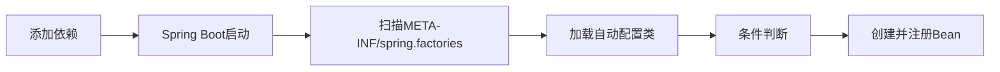
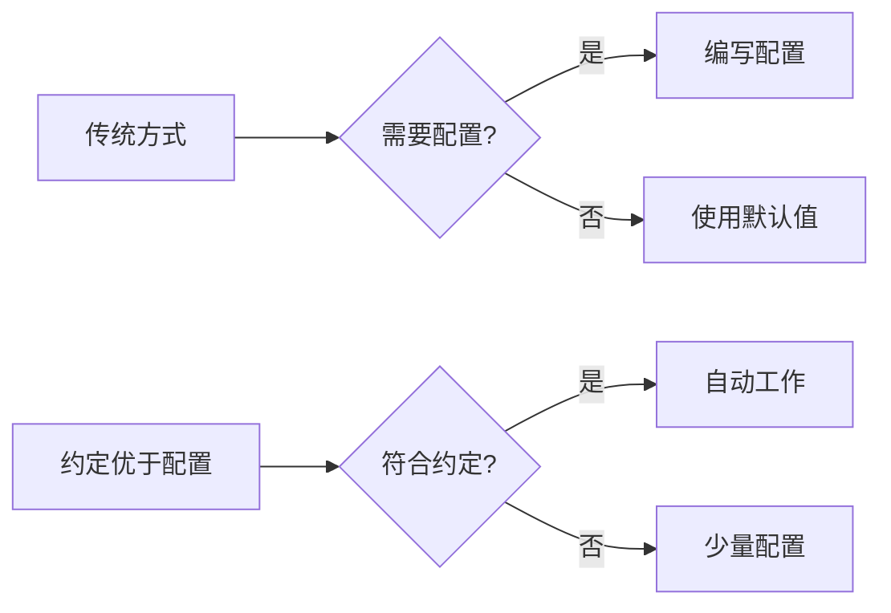

## 1. 自动装配概述

自动装配（Auto-configuration）是Spring Boot的核心特性之一，它使开发者能够快速集成各种技术栈，而无需繁琐的配置。

### 1.1 什么是自动装配

自动装配是Spring Boot根据应用的依赖、环境和配置，自动创建和注册Bean的过程。它遵循"约定优于配置"的原则，大大简化了Spring应用的开发。



### 1.2 自动装配的优势

- **简化配置**：无需大量XML配置或Java配置
- **快速集成**：轻松整合各种技术栈
- **可覆盖性**：默认配置可被自定义配置覆盖
- **模块化**：通过Starter实现功能模块化

## 2. 约定优于配置

### 2.1 概念解释

"约定优于配置"（Convention over Configuration）是一种软件设计范式，旨在减少开发者需要做出的决定数量，从而简化软件开发过程。这一理念的核心是：

> 如果存在一种通常被接受的实现方式，那么系统应该默认采用这种方式，而不需要开发者明确指定。



### 2.2 约定优于配置的优势

1. **减少配置代码量**：遵循约定可以显著减少配置文件的大小和数量
2. **提高开发效率**：开发者只需关注非常规的部分，不必为常见场景编写配置
3. **降低学习成本**：一旦掌握了框架的约定，可以快速上手新项目
4. **增强可维护性**：代码库更加一致，更容易理解和维护
5. **减少决策疲劳**：减少开发者需要做出的决策数量

### 2.3 Spring Boot中的约定示例

| 领域 | 约定 | 配置方式（如需覆盖） |
|------|------|-------------------|
| 应用配置文件 | `application.properties`/`application.yml` | `spring.config.name` |
| 静态资源 | `/static`, `/public`, `/resources`, `/META-INF/resources` | `spring.web.resources.static-locations` |
| 模板文件 | `/templates` | `spring.thymeleaf.prefix` |
| 主类 | 包含`main`方法且带有`@SpringBootApplication`的类 | 自定义`SpringApplication` |
| Bean命名 | 类名首字母小写 | `@Bean(name="customName")` |
| 配置属性 | 遵循特定前缀的命名规则 | `@ConfigurationProperties` |

### 2.4 与自动装配的关系

自动装配是"约定优于配置"理念在Spring Boot中的核心实现机制：

1. **默认配置**：Spring Boot为常用功能提供了默认配置
2. **智能检测**：根据类路径、环境等自动决定使用哪些配置
3. **优雅降级**：当无法确定最佳配置时，采用最安全的默认值
4. **显式覆盖**：允许开发者通过配置属性或自定义Bean覆盖默认行为

```java
// 示例：约定优于配置在数据源配置中的应用
@Configuration
@ConditionalOnClass(DataSource.class)
public class DataSourceAutoConfiguration {
    
    // 约定：如果存在HikariCP，则默认使用它
    @Configuration
    @ConditionalOnClass(HikariDataSource.class)
    static class HikariDatasourceConfiguration {
        // 默认配置
        @Bean
        @ConditionalOnMissingBean
        public DataSource dataSource() {
            return new HikariDataSource();
        }
    }
    
    // 约定：如果不存在HikariCP但存在Tomcat连接池，则使用Tomcat连接池
    @Configuration
    @ConditionalOnClass(org.apache.tomcat.jdbc.pool.DataSource.class)
    @ConditionalOnMissingBean(DataSource.class)
    static class TomcatDataSourceConfiguration {
        // 默认配置
        @Bean
        public DataSource dataSource() {
            return new org.apache.tomcat.jdbc.pool.DataSource();
        }
    }
}
```

### 2.5 实际应用中的平衡

虽然"约定优于配置"带来了诸多好处，但在实际应用中需要注意：

1. **了解约定**：开发者需要了解框架的默认约定，否则可能导致困惑
2. **适度配置**：某些情况下，显式配置比隐式约定更清晰
3. **透明性**：良好的文档和调试工具对于理解"幕后发生的事情"至关重要
4. **灵活性**：框架应提供覆盖默认约定的简便方法

Spring Boot通过以下方式实现了这种平衡：

- 提供详细的参考文档
- 支持`debug=true`模式查看自动装配报告
- 允许通过属性文件、Java配置等多种方式覆盖默认行为
- 保持核心API的稳定性和一致性

## 3. 自动装配原理

### 2.1 核心注解

Spring Boot自动装配的核心是`@EnableAutoConfiguration`注解，它通常通过`@SpringBootApplication`复合注解引入：

```java
@Target(ElementType.TYPE)
@Retention(RetentionPolicy.RUNTIME)
@Documented
@Inherited
@SpringBootConfiguration
@EnableAutoConfiguration
@ComponentScan(excludeFilters = {
        @Filter(type = FilterType.CUSTOM, classes = TypeExcludeFilter.class),
        @Filter(type = FilterType.CUSTOM, classes = AutoConfigurationExcludeFilter.class) })
public @interface SpringBootApplication {
    // ...
}
```

### 2.2 自动装配流程

1. **启动入口**：`SpringApplication.run()`
2. **加载配置类**：通过`@EnableAutoConfiguration`触发自动装配
3. **导入选择器**：`AutoConfigurationImportSelector`实现`ImportSelector`接口
4. **获取配置类**：读取`META-INF/spring.factories`文件中的配置类
5. **条件过滤**：根据条件注解过滤配置类
6. **排序处理**：根据`@AutoConfigureOrder`等注解排序
7. **注册Bean**：将符合条件的配置类中定义的Bean注册到容器

### 2.3 源码分析

```java
// AutoConfigurationImportSelector.java
public String[] selectImports(AnnotationMetadata annotationMetadata) {
    // 检查自动装配是否启用
    if (!isEnabled(annotationMetadata)) {
        return NO_IMPORTS;
    }
    // 加载自动装配元数据
    AutoConfigurationMetadata autoConfigurationMetadata = 
            AutoConfigurationMetadataLoader.loadMetadata(this.beanClassLoader);
    // 获取自动装配条目
    AutoConfigurationEntry autoConfigurationEntry = getAutoConfigurationEntry(
            autoConfigurationMetadata, annotationMetadata);
    return StringUtils.toStringArray(autoConfigurationEntry.getConfigurations());
}

// 获取自动装配条目
protected AutoConfigurationEntry getAutoConfigurationEntry(
        AutoConfigurationMetadata autoConfigurationMetadata, 
        AnnotationMetadata annotationMetadata) {
    // 获取所有候选的自动装配类
    List<String> configurations = getCandidateConfigurations(
            annotationMetadata, attributes);
    // 去重
    configurations = removeDuplicates(configurations);
    // 获取排除的自动装配类
    Set<String> exclusions = getExclusions(annotationMetadata, attributes);
    // 检查排除类
    checkExcludedClasses(configurations, exclusions);
    // 移除排除类
    configurations.removeAll(exclusions);
    // 根据条件过滤
    configurations = filter(configurations, autoConfigurationMetadata);
    // 触发自动装配导入事件
    fireAutoConfigurationImportEvents(configurations, exclusions);
    return new AutoConfigurationEntry(configurations, exclusions);
}

// 获取候选的自动装配类
protected List<String> getCandidateConfigurations(
        AnnotationMetadata metadata, AnnotationAttributes attributes) {
    // 从META-INF/spring.factories加载自动装配类
    List<String> configurations = SpringFactoriesLoader.loadFactoryNames(
            getSpringFactoriesLoaderFactoryClass(), getBeanClassLoader());
    return configurations;
}
```

## 3. 条件注解

条件注解是自动装配的关键机制，它们决定了配置类是否生效。

### 3.1 常用条件注解

| 注解 | 描述 | 示例 |
|------|------|------|
| `@ConditionalOnClass` | 当类路径下有指定类时生效 | `@ConditionalOnClass(DataSource.class)` |
| `@ConditionalOnMissingClass` | 当类路径下没有指定类时生效 | `@ConditionalOnMissingClass("org.example.Legacy")` |
| `@ConditionalOnBean` | 当容器中有指定Bean时生效 | `@ConditionalOnBean(DataSource.class)` |
| `@ConditionalOnMissingBean` | 当容器中没有指定Bean时生效 | `@ConditionalOnMissingBean(DataSource.class)` |
| `@ConditionalOnProperty` | 当配置属性满足条件时生效 | `@ConditionalOnProperty(prefix="app", name="feature", havingValue="enabled")` |
| `@ConditionalOnResource` | 当资源存在时生效 | `@ConditionalOnResource(resources = "classpath:config.properties")` |
| `@ConditionalOnWebApplication` | 当应用是Web应用时生效 | `@ConditionalOnWebApplication(type = Type.SERVLET)` |
| `@ConditionalOnNotWebApplication` | 当应用不是Web应用时生效 | `@ConditionalOnNotWebApplication` |
| `@ConditionalOnExpression` | 当SpEL表达式为true时生效 | `@ConditionalOnExpression("'${app.mode}' == 'prod'")` |

### 3.2 条件注解示例

```java
@Configuration
@ConditionalOnClass(DataSource.class)
@ConditionalOnProperty(prefix = "spring.datasource", name = "url")
public class DataSourceAutoConfiguration {

    @Bean
    @ConditionalOnMissingBean
    public DataSource dataSource(DataSourceProperties properties) {
        return properties.initializeDataSourceBuilder().build();
    }
    
    @Bean
    @ConditionalOnMissingBean
    @ConditionalOnProperty(prefix = "spring.datasource", name = "type")
    public DataSourceInitializer dataSourceInitializer(DataSource dataSource,
            DataSourceProperties properties) {
        return new DataSourceInitializer(dataSource, properties);
    }
}
```

### 3.3 自定义条件注解

可以通过实现`Condition`接口创建自定义条件：

```java
public class OnSystemPropertyCondition implements Condition {
    @Override
    public boolean matches(ConditionContext context, AnnotatedTypeMetadata metadata) {
        Map<String, Object> attributes = metadata.getAnnotationAttributes(
                ConditionalOnSystemProperty.class.getName());
        String propertyName = (String) attributes.get("name");
        String propertyValue = (String) attributes.get("value");
        return propertyValue.equals(System.getProperty(propertyName));
    }
}

@Target({ElementType.TYPE, ElementType.METHOD})
@Retention(RetentionPolicy.RUNTIME)
@Documented
@Conditional(OnSystemPropertyCondition.class)
public @interface ConditionalOnSystemProperty {
    String name();
    String value();
}
```

## 4. 自定义自动装配

### 4.1 创建自动装配类

```java
@Configuration
@ConditionalOnClass(Redis.class)
@EnableConfigurationProperties(RedisProperties.class)
public class RedisAutoConfiguration {

    @Bean
    @ConditionalOnMissingBean
    public RedisTemplate<String, Object> redisTemplate(RedisConnectionFactory connectionFactory) {
        RedisTemplate<String, Object> template = new RedisTemplate<>();
        template.setConnectionFactory(connectionFactory);
        template.setKeySerializer(new StringRedisSerializer());
        template.setValueSerializer(new GenericJackson2JsonRedisSerializer());
        return template;
    }
    
    @Bean
    @ConditionalOnMissingBean
    @ConditionalOnProperty(prefix = "spring.redis", name = "host")
    public RedisConnectionFactory redisConnectionFactory(RedisProperties properties) {
        LettuceConnectionFactory factory = new LettuceConnectionFactory();
        factory.setHostName(properties.getHost());
        factory.setPort(properties.getPort());
        return factory;
    }
}
```

### 4.2 创建配置属性类

```java
@ConfigurationProperties(prefix = "spring.redis")
public class RedisProperties {
    
    private String host = "localhost";
    private int port = 6379;
    private String password;
    
    // getters and setters
}
```

### 4.3 注册自动装配类

在`META-INF/spring.factories`文件中注册自动装配类：

```properties
org.springframework.boot.autoconfigure.EnableAutoConfiguration=\
com.example.RedisAutoConfiguration
```

### 4.4 创建Starter

一个完整的Spring Boot Starter通常包含以下组件：

1. **自动装配模块**：包含自动装配类和配置属性类
2. **核心功能模块**：提供实际功能实现
3. **pom.xml**：定义依赖和构建配置

```xml
<!-- 自动装配模块的pom.xml -->
<project>
    <groupId>com.example</groupId>
    <artifactId>redis-spring-boot-autoconfigure</artifactId>
    <version>1.0.0</version>
    
    <dependencies>
        <dependency>
            <groupId>org.springframework.boot</groupId>
            <artifactId>spring-boot-autoconfigure</artifactId>
        </dependency>
        <dependency>
            <groupId>org.springframework.boot</groupId>
            <artifactId>spring-boot-configuration-processor</artifactId>
            <optional>true</optional>
        </dependency>
        <dependency>
            <groupId>com.example</groupId>
            <artifactId>redis-core</artifactId>
            <optional>true</optional>
        </dependency>
    </dependencies>
</project>

<!-- Starter的pom.xml -->
<project>
    <groupId>com.example</groupId>
    <artifactId>redis-spring-boot-starter</artifactId>
    <version>1.0.0</version>
    
    <dependencies>
        <dependency>
            <groupId>com.example</groupId>
            <artifactId>redis-spring-boot-autoconfigure</artifactId>
            <version>1.0.0</version>
        </dependency>
        <dependency>
            <groupId>com.example</groupId>
            <artifactId>redis-core</artifactId>
            <version>1.0.0</version>
        </dependency>
    </dependencies>
</project>
```

## 5. 自动装配的调试与排查

### 5.1 查看自动装配报告

Spring Boot提供了查看自动装配报告的功能：

```properties
# application.properties
debug=true
```

输出示例：

```
=========================
AUTO-CONFIGURATION REPORT
=========================

Positive matches:
-----------------
   DataSourceAutoConfiguration matched:
      - @ConditionalOnClass found required class 'javax.sql.DataSource' (OnClassCondition)
      - @ConditionalOnProperty (spring.datasource.url) matched (OnPropertyCondition)

Negative matches:
-----------------
   MongoAutoConfiguration:
      Did not match:
         - @ConditionalOnClass did not find required class 'com.mongodb.MongoClient' (OnClassCondition)
```

### 5.2 排除自动装配类

可以通过以下方式排除不需要的自动装配类：

```java
// 方式1：使用@SpringBootApplication注解
@SpringBootApplication(exclude = {DataSourceAutoConfiguration.class})
public class Application {
    public static void main(String[] args) {
        SpringApplication.run(Application.class, args);
    }
}

// 方式2：使用配置属性
// application.properties
spring.autoconfigure.exclude=org.springframework.boot.autoconfigure.jdbc.DataSourceAutoConfiguration
```

### 5.3 自动装配顺序

可以使用以下注解控制自动装配的顺序：

```java
// 控制自动装配类的顺序
@AutoConfigureOrder(Ordered.HIGHEST_PRECEDENCE)

// 控制自动装配类在指定类之前加载
@AutoConfigureBefore({DataSourceAutoConfiguration.class})

// 控制自动装配类在指定类之后加载
@AutoConfigureAfter({JpaRepositoriesAutoConfiguration.class})
```

## 6. 最佳实践

### 6.1 设计原则

1. **提供默认值**：为配置属性提供合理的默认值
2. **条件装配**：使用条件注解确保只在需要时装配
3. **可覆盖性**：允许用户自定义Bean覆盖自动装配的Bean
4. **模块化**：将功能拆分为独立的模块
5. **兼容性**：考虑与不同版本的兼容性

### 6.2 命名规范

- **配置类**：`XxxAutoConfiguration`
- **配置属性类**：`XxxProperties`
- **Starter**：`xxx-spring-boot-starter`
- **自动配置模块**：`xxx-spring-boot-autoconfigure`

### 6.3 测试策略

自动装配的测试应该覆盖以下方面：

```java
@RunWith(SpringRunner.class)
@SpringBootTest
public class RedisAutoConfigurationTest {

    @Autowired
    private ApplicationContext context;
    
    @Test
    public void testAutoConfiguration() {
        // 测试Bean是否正确创建
        assertThat(context.containsBean("redisTemplate")).isTrue();
        
        // 测试Bean的属性是否正确设置
        RedisTemplate template = context.getBean(RedisTemplate.class);
        assertThat(template.getKeySerializer()).isInstanceOf(StringRedisSerializer.class);
        
        // 测试条件注解是否生效
        // ...
    }
    
    @Test
    @TestPropertySource(properties = "spring.redis.host=redis-server")
    public void testCustomProperties() {
        // 测试自定义属性是否生效
        RedisConnectionFactory factory = context.getBean(RedisConnectionFactory.class);
        // 验证属性是否正确应用
    }
}
```

### 6.4 文档化

良好的文档对于自定义Starter至关重要：

1. **README.md**：提供基本使用说明
2. **配置属性表**：列出所有可配置的属性
3. **示例代码**：提供常见使用场景的示例
4. **版本兼容性**：说明与Spring Boot版本的兼容关系

## 7. 高级特性

### 7.1 条件评估报告

Spring Boot 2.0+提供了更详细的条件评估报告：

```java
@Autowired
private ConditionEvaluationReport report;

public void printReport() {
    // 获取所有匹配的条件
    Map<String, ConditionOutcome> conditions = report.getConditionAndOutcomesBySource();
    conditions.forEach((source, outcome) -> {
        System.out.println(source + " - " + outcome.getMessage());
    });
}
```

### 7.2 导入选择器

除了使用`META-INF/spring.factories`，还可以使用`ImportSelector`动态导入配置类：

```java
public class CustomImportSelector implements ImportSelector {
    @Override
    public String[] selectImports(AnnotationMetadata importingClassMetadata) {
        // 动态决定要导入的配置类
        return new String[] {
            "com.example.Config1",
            "com.example.Config2"
        };
    }
}

@Import(CustomImportSelector.class)
@Configuration
public class MainConfig {
    // ...
}
```

### 7.3 模块化自动装配

对于复杂的Starter，可以采用模块化的自动装配方式：

```java
@Configuration
public class RedisAutoConfiguration {

    @Configuration
    @ConditionalOnClass(RedisTemplate.class)
    static class RedisTemplateConfiguration {
        // RedisTemplate相关配置
    }
    
    @Configuration
    @ConditionalOnClass(RedissonClient.class)
    static class RedissonConfiguration {
        // Redisson相关配置
    }
    
    @Configuration
    @ConditionalOnClass(JedisPool.class)
    static class JedisConfiguration {
        // Jedis相关配置
    }
}
```

## 8. 常见问题与解决方案

### 8.1 自动装配不生效

可能的原因和解决方案：

1. **依赖问题**：确保相关依赖已正确添加
2. **条件不满足**：检查条件注解的要求是否满足
3. **配置冲突**：检查是否有冲突的配置
4. **包扫描范围**：确保自动装配类在正确的包中
5. **spring.factories文件**：确保文件路径和内容正确

### 8.2 多个自动装配冲突

当多个自动装配提供相同类型的Bean时：

1. **使用@Primary注解**：标记首选的Bean
   ```java
   @Bean
   @Primary
   public DataSource primaryDataSource() {
       // ...
   }
   ```

2. **使用@ConditionalOnMissingBean**：避免创建重复的Bean
   ```java
   @Bean
   @ConditionalOnMissingBean
   public DataSource dataSource() {
       // ...
   }
   ```

3. **使用@Order或@Priority**：控制Bean的优先级

### 8.3 性能优化

1. **懒加载**：使用`@Lazy`注解延迟初始化Bean
   ```java
   @Bean
   @Lazy
   public ExpensiveService expensiveService() {
       return new ExpensiveService();
   }
   ```

2. **条件细化**：使用更精确的条件注解减少不必要的Bean创建
3. **排除不需要的自动装配**：使用`@EnableAutoConfiguration(exclude=...)`

## 9. 总结

Spring Boot的自动装配机制极大地简化了应用开发，通过"约定优于配置"的理念，让开发者能够专注于业务逻辑而非繁琐的配置。

自动装配的核心优势：

1. **简化开发**：减少样板代码和配置
2. **提高效率**：快速集成各种技术栈
3. **灵活可控**：通过条件注解和配置属性提供灵活性
4. **可扩展**：易于创建自定义Starter扩展功能

掌握自动装配机制，不仅能够更好地使用Spring Boot，还能够创建自己的Starter，为团队和社区贡献可复用的组件。

<details>
<summary>自动装配原理图解</summary>

```
+---------------------------+
| @SpringBootApplication    |
+---------------------------+
            |
            v
+---------------------------+
| @EnableAutoConfiguration  |
+---------------------------+
            |
            v
+---------------------------+
| AutoConfigurationImport   |
| Selector                  |
+---------------------------+
            |
            v
+---------------------------+
| META-INF/spring.factories |
+---------------------------+
            |
            v
+---------------------------+
| 条件过滤                   |
+---------------------------+
            |
            v
+---------------------------+
| 创建并注册Bean             |
+---------------------------+
```

</details>