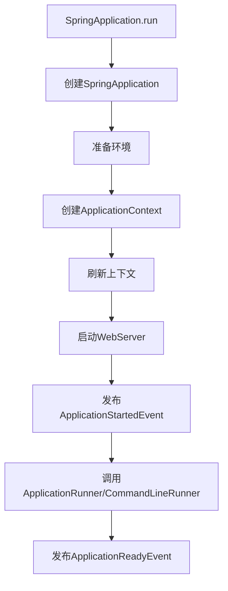
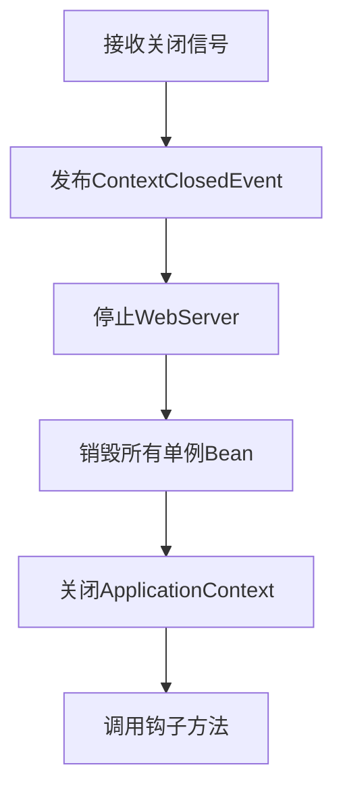

## 1. 优雅启停概述

### 1.1 什么是优雅启停

优雅启停（Graceful Startup and Shutdown）是指应用程序在启动和关闭过程中，能够妥善处理资源分配、请求处理和状态转换，确保不会出现资源泄露、请求丢失或数据不一致等问题。

对于Spring Boot应用而言，优雅启停包括：

- **优雅启动**：确保应用完全初始化后才开始接收请求
- **优雅停机**：在应用关闭前完成所有进行中的请求处理，释放资源，保存状态

### 1.2 为什么需要优雅启停

在生产环境中，优雅启停机制至关重要：

1. **防止请求丢失**：确保在应用停止时不会丢弃正在处理的请求
2. **资源释放**：正确关闭连接池、线程池等资源，避免资源泄露
3. **数据一致性**：确保事务完成，避免数据不一致
4. **支持容器化部署**：在Kubernetes等环境中实现零停机部署
5. **健康检查**：与服务注册发现系统配合，确保流量只路由到健康实例

## 2. Spring Boot启动流程

### 2.1 启动流程概览



### 2.2 启动过程中的关键事件

Spring Boot启动过程中会发布一系列事件，应用可以监听这些事件来执行自定义逻辑：

| 事件 | 触发时机 | 用途 |
|------|---------|------|
| `ApplicationStartingEvent` | 应用启动开始，除了监听器和初始化器注册外，几乎什么都没做 | 非常早期的初始化工作 |
| `ApplicationEnvironmentPreparedEvent` | 环境准备完成，但上下文尚未创建 | 环境相关的配置工作 |
| `ApplicationContextInitializedEvent` | 上下文已初始化，但尚未加载Bean定义 | 上下文初始化后的设置 |
| `ApplicationPreparedEvent` | Bean定义已加载，但上下文尚未刷新 | Bean定义的后处理 |
| `ApplicationStartedEvent` | 上下文已刷新，但Runners尚未调用 | 应用启动后、Runners执行前的操作 |
| `ApplicationReadyEvent` | 应用已准备就绪，可以接收请求 | 应用完全启动后的操作 |
| `AvailabilityChangeEvent` | 应用可用性状态变化 | 监控应用状态变化 |

### 2.3 优雅启动的实现

Spring Boot 2.3+引入了应用可用性状态的概念，包括两种状态：

1. **Liveness**：应用是否"活着"（可能尚未准备好处理请求）
2. **Readiness**：应用是否准备好接收请求

```java
// 监听应用就绪事件
@EventListener(ApplicationReadyEvent.class)
public void onApplicationReady() {
    // 将应用标记为就绪状态
    this.applicationAvailability.setReadiness(true);
}
```

在Kubernetes环境中，这两种状态分别对应存活探针(Liveness Probe)和就绪探针(Readiness Probe)。

## 3. Spring Boot停机流程

### 3.1 停机流程概览



### 3.2 停机触发方式

Spring Boot应用的停机可通过多种方式触发：

1. **JVM关闭钩子**：通过`System.exit()`或SIGTERM信号
2. **Actuator端点**：通过`/actuator/shutdown`端点（需启用）
3. **ApplicationContext关闭**：通过`ConfigurableApplicationContext.close()`方法

### 3.3 优雅停机源码分析

Spring Boot 2.3+中，优雅停机的核心实现在`GracefulShutdownHandler`类中：

```java
/**
 * 处理优雅停机的核心类
 */
class GracefulShutdownHandler implements Handler {

    private final Handler delegate; // 实际的请求处理器
    private final GracefulShutdown gracefulShutdown;

    GracefulShutdownHandler(Handler delegate, GracefulShutdown gracefulShutdown) {
        this.delegate = delegate;
        this.gracefulShutdown = gracefulShutdown;
    }

    @Override
    public void handleRequest(HttpServerExchange exchange) throws Exception {
        // 如果已经开始关闭，拒绝新请求
        if (this.gracefulShutdown.isShutdown() && 
            !this.gracefulShutdown.awaitShutdown(0)) {
            // 返回503 Service Unavailable
            exchange.setStatusCode(StatusCodes.SERVICE_UNAVAILABLE);
            exchange.endExchange();
            return;
        }
        
        // 记录活跃请求
        this.gracefulShutdown.increment();
        try {
            // 处理请求
            this.delegate.handleRequest(exchange);
        }
        finally {
            // 请求完成后减少计数
            this.gracefulShutdown.decrement();
        }
    }
}
```

在Tomcat中，优雅停机通过`TomcatGracefulShutdown`实现：

```java
/**
 * Tomcat优雅停机实现
 */
class TomcatGracefulShutdown implements TomcatConnectorCustomizer, GracefulShutdown {

    private volatile Connector connector;
    private volatile boolean shuttingDown = false;

    @Override
    public void customize(Connector connector) {
        this.connector = connector;
    }

    @Override
    public boolean shutDownGracefully(GracefulShutdownCallback callback) {
        if (this.shuttingDown) {
            return false;
        }
        this.shuttingDown = true;
        
        // 停止接收新请求
        this.connector.pause();
        
        // 创建关闭线程
        Thread shutdownThread = new Thread(() -> {
            try {
                // 等待活跃请求完成
                long startTime = System.currentTimeMillis();
                long timeout = getGracefulShutdownTimeout();
                while (getActiveRequests() > 0 && 
                       System.currentTimeMillis() - startTime < timeout) {
                    Thread.sleep(50);
                }
                // 完成关闭
                callback.shutdownComplete(GracefulShutdownResult.IDLE);
            }
            catch (InterruptedException ex) {
                Thread.currentThread().interrupt();
                callback.shutdownComplete(GracefulShutdownResult.REQUESTS_ACTIVE);
            }
        }, "tomcat-shutdown");
        shutdownThread.setDaemon(true);
        shutdownThread.start();
        return true;
    }

    @Override
    public boolean isShutdown() {
        return this.shuttingDown;
    }
}
```

### 3.4 Bean销毁流程

在应用关闭过程中，Spring容器会按照以下顺序销毁Bean：

1. 调用`DisposableBean.destroy()`方法
2. 调用自定义的销毁方法（通过`@Bean(destroyMethod="xxx")`指定）
3. 调用`@PreDestroy`注解的方法

```java
// AbstractApplicationContext.java
protected void destroyBeans() {
    getBeanFactory().destroySingletons();
}

// DefaultSingletonBeanRegistry.java
public void destroySingletons() {
    // 按注册的逆序销毁Bean
    String[] disposableBeanNames;
    synchronized (this.disposableBeans) {
        disposableBeanNames = StringUtils.toStringArray(this.disposableBeans.keySet());
    }
    for (int i = disposableBeanNames.length - 1; i >= 0; i--) {
        destroySingleton(disposableBeanNames[i]);
    }
    // 清理缓存
    clearSingletonCache();
}
```

## 4. 优雅停机配置

### 4.1 Spring Boot配置

从Spring Boot 2.3开始，可以通过以下配置启用优雅停机：

```properties
# 启用优雅停机
server.shutdown=graceful

# 优雅停机超时时间
spring.lifecycle.timeout-per-shutdown-phase=30s
```

在`application.yml`中的配置：

```yaml
server:
  shutdown: graceful

spring:
  lifecycle:
    timeout-per-shutdown-phase: 30s
```

### 4.2 Web容器特定配置

#### 4.2.1 Tomcat配置

```java
@Bean
public ConfigurableServletWebServerFactory webServerFactory() {
    TomcatServletWebServerFactory factory = new TomcatServletWebServerFactory();
    factory.addConnectorCustomizers(connector -> {
        // 设置最大连接数
        connector.setProperty("maxConnections", "10000");
        // 设置最大线程数
        connector.setProperty("maxThreads", "200");
        // 设置连接超时
        connector.setProperty("connectionTimeout", "20000");
    });
    return factory;
}
```

#### 4.2.2 Undertow配置

```java
@Bean
public ConfigurableServletWebServerFactory webServerFactory() {
    UndertowServletWebServerFactory factory = new UndertowServletWebServerFactory();
    factory.addBuilderCustomizers(builder -> {
        builder.setServerOption(UndertowOptions.MAX_CONNECTIONS, 10000)
               .setServerOption(UndertowOptions.IDLE_TIMEOUT, 60000);
    });
    return factory;
}
```

### 4.3 Actuator端点配置

启用Actuator的shutdown端点：

```properties
management.endpoint.shutdown.enabled=true
management.endpoints.web.exposure.include=shutdown
```

## 5. 实现自定义优雅停机逻辑

### 5.1 监听容器关闭事件

```java
@Component
public class GracefulShutdownListener {

    private final Logger logger = LoggerFactory.getLogger(GracefulShutdownListener.class);
    
    @EventListener(ContextClosedEvent.class)
    public void onContextClosed(ContextClosedEvent event) {
        logger.info("应用上下文正在关闭，执行自定义清理操作...");
        
        // 执行自定义清理逻辑
        cleanupResources();
        
        logger.info("自定义清理操作完成");
    }
    
    private void cleanupResources() {
        // 实现自定义资源清理逻辑
        try {
            // 例如：等待任务完成、关闭连接等
            Thread.sleep(2000);
        } catch (InterruptedException e) {
            Thread.currentThread().interrupt();
            logger.error("清理过程被中断", e);
        }
    }
}
```

### 5.2 实现SmartLifecycle接口

`SmartLifecycle`接口允许Bean参与Spring容器的生命周期：

```java
@Component
public class GracefulShutdownComponent implements SmartLifecycle {

    private final Logger logger = LoggerFactory.getLogger(GracefulShutdownComponent.class);
    private volatile boolean running = false;
    
    @Override
    public void start() {
        logger.info("GracefulShutdownComponent 启动");
        this.running = true;
    }
    
    @Override
    public void stop() {
        logger.info("GracefulShutdownComponent 停止");
        this.running = false;
    }
    
    @Override
    public boolean isRunning() {
        return this.running;
    }
    
    @Override
    public int getPhase() {
        // 返回一个较低的值，确保在其他组件之前启动，在其他组件之后停止
        return Integer.MIN_VALUE;
    }
    
    @Override
    public boolean isAutoStartup() {
        return true;
    }
    
    @Override
    public void stop(Runnable callback) {
        logger.info("GracefulShutdownComponent 正在停止，执行清理操作...");
        
        // 创建一个线程执行清理操作
        new Thread(() -> {
            try {
                // 执行清理逻辑
                Thread.sleep(1000);
                logger.info("GracefulShutdownComponent 清理完成");
                
                // 设置状态
                this.running = false;
                
                // 通知Spring清理完成
                callback.run();
            } catch (InterruptedException e) {
                Thread.currentThread().interrupt();
                logger.error("清理过程被中断", e);
                callback.run();
            }
        }, "graceful-shutdown").start();
    }
}
```

### 5.3 注册JVM关闭钩子

除了Spring提供的机制外，还可以注册JVM关闭钩子：

```java
@PostConstruct
public void registerShutdownHook() {
    Runtime.getRuntime().addShutdownHook(new Thread(() -> {
        logger.info("JVM关闭钩子被触发，执行最终清理操作");
        try {
            // 执行一些必要的清理操作
            // 注意：此时Spring上下文可能已经关闭
            closeResources();
        } catch (Exception e) {
            logger.error("关闭钩子执行过程中发生错误", e);
        }
    }, "shutdown-hook"));
}

private void closeResources() {
    // 实现资源关闭逻辑
    logger.info("关闭外部资源连接...");
    // 例如关闭自定义连接池、释放本地资源等
}
```

## 6. 最佳实践

### 6.1 优雅停机的实施步骤

1. **启用优雅停机配置**
   ```properties
   server.shutdown=graceful
   spring.lifecycle.timeout-per-shutdown-phase=30s
   ```

2. **实现健康检查**
   ```java
   @Component
   public class CustomHealthIndicator implements HealthIndicator {
       @Override
       public Health health() {
           // 检查应用是否健康
           return Health.up().build();
       }
   }
   ```

3. **处理长时间运行的任务**
   ```java
   @Component
   public class TaskManager {
       private final ConcurrentHashMap<String, Future<?>> runningTasks = new ConcurrentHashMap<>();
       
       public void submitTask(String id, Callable<?> task) {
           Future<?> future = taskExecutor.submit(task);
           runningTasks.put(id, future);
       }
       
       public void taskCompleted(String id) {
           runningTasks.remove(id);
       }
       
       @EventListener(ContextClosedEvent.class)
       public void onContextClosed() {
           // 等待所有任务完成或取消
           runningTasks.forEach((id, future) -> {
               try {
                   // 给每个任务一定时间完成
                   future.get(5, TimeUnit.SECONDS);
               } catch (Exception e) {
                   future.cancel(true);
               }
           });
       }
   }
   ```

4. **正确关闭连接池**
   ```java
   @Bean
   public DataSource dataSource() {
       HikariConfig config = new HikariConfig();
       // 设置基本配置
       config.setJdbcUrl("jdbc:mysql://localhost:3306/test");
       config.setUsername("root");
       config.setPassword("password");
       
       // 设置连接池关闭超时
       config.setAllowPoolSuspension(true);
       config.setMaxLifetime(30000);
       
       return new HikariDataSource(config);
   }
   ```

### 6.2 容器环境中的优雅停机

在Docker或Kubernetes环境中，优雅停机需要特别注意：

1. **设置合适的SIGTERM处理**
   
   Docker默认发送SIGTERM信号，然后等待一段时间（默认10秒）后发送SIGKILL。确保应用能够捕获SIGTERM并启动优雅停机流程。

2. **配置Kubernetes优雅终止期**
   
   ```yaml
   apiVersion: apps/v1
   kind: Deployment
   metadata:
     name: spring-boot-app
   spec:
     template:
       spec:
         terminationGracePeriodSeconds: 60  # 给应用60秒的优雅停机时间
         containers:
         - name: spring-boot-app
           image: my-spring-boot-app:latest
           ports:
           - containerPort: 8080
           lifecycle:
             preStop:
               exec:
                 command: ["sh", "-c", "sleep 5"]  # 给应用一些时间处理请求
           readinessProbe:
             httpGet:
               path: /actuator/health/readiness
               port: 8080
             initialDelaySeconds: 10
             periodSeconds: 5
           livenessProbe:
             httpGet:
               path: /actuator/health/liveness
               port: 8080
             initialDelaySeconds: 20
             periodSeconds: 10
   ```

3. **实现就绪探针和存活探针**
   
   Spring Boot 2.3+提供了专门的健康检查端点：
   
   ```properties
   management.endpoint.health.probes.enabled=true
   management.health.livenessState.enabled=true
   management.health.readinessState.enabled=true
   ```

### 6.3 监控优雅停机过程

监控应用的启停过程可以帮助发现潜在问题：

```java
@Component
public class ShutdownMonitor {
    private final Logger logger = LoggerFactory.getLogger(ShutdownMonitor.class);
    private final MeterRegistry meterRegistry;
    
    public ShutdownMonitor(MeterRegistry meterRegistry) {
        this.meterRegistry = meterRegistry;
    }
    
    @EventListener
    public void onContextClosing(ContextClosedEvent event) {
        long startTime = System.currentTimeMillis();
        logger.info("应用开始关闭...");
        
        // 记录关闭开始指标
        meterRegistry.counter("application.shutdown.started").increment();
        
        // 注册一个钩子来记录总关闭时间
        Runtime.getRuntime().addShutdownHook(new Thread(() -> {
            long duration = System.currentTimeMillis() - startTime;
            logger.info("应用完全关闭，耗时: {}ms", duration);
            
            // 在实际场景中，这个指标可能无法发送出去，因为应用已经关闭
            // 可以考虑将这些指标写入文件或发送到外部系统
        }));
    }
}
```

## 7. 常见问题与解决方案

### 7.1 长连接处理

WebSocket或其他长连接在应用关闭时需要特殊处理：

```java
@Component
public class WebSocketShutdownHandler {
    private final Logger logger = LoggerFactory.getLogger(WebSocketShutdownHandler.class);
    private final List<WebSocketSession> sessions = new CopyOnWriteArrayList<>();
    
    public void addSession(WebSocketSession session) {
        sessions.add(session);
    }
    
    public void removeSession(WebSocketSession session) {
        sessions.remove(session);
    }
    
    @EventListener(ContextClosedEvent.class)
    public void onContextClosed() {
        logger.info("关闭所有WebSocket连接: {}", sessions.size());
        
        for (WebSocketSession session : sessions) {
            try {
                // 发送关闭消息
                session.sendMessage(new TextMessage("{\"type\":\"SERVER_SHUTDOWN\"}"));
                // 关闭连接
                session.close(CloseStatus.GOING_AWAY);
            } catch (IOException e) {
                logger.error("关闭WebSocket连接失败", e);
            }
        }
    }
}
```

### 7.2 事务处理

确保在应用关闭时所有事务都能正确提交或回滚：

```java
@Component
public class TransactionMonitor {
    private final Logger logger = LoggerFactory.getLogger(TransactionMonitor.class);
    private final PlatformTransactionManager transactionManager;
    
    public TransactionMonitor(PlatformTransactionManager transactionManager) {
        this.transactionManager = transactionManager;
    }
    
    @EventListener(ContextClosedEvent.class)
    public void onContextClosed() {
        if (transactionManager instanceof DataSourceTransactionManager) {
            DataSourceTransactionManager tm = (DataSourceTransactionManager) transactionManager;
            DataSource dataSource = tm.getDataSource();
            
            if (dataSource instanceof HikariDataSource) {
                HikariDataSource hikari = (HikariDataSource) dataSource;
                logger.info("当前活跃连接数: {}", hikari.getHikariPoolMXBean().getActiveConnections());
                logger.info("等待连接池关闭...");
            }
        }
    }
}
```

### 7.3 定时任务处理

确保定时任务在应用关闭时能够正确停止：

```java
@Configuration
public class SchedulerConfig implements SchedulingConfigurer {
    
    private final Logger logger = LoggerFactory.getLogger(SchedulerConfig.class);
    private ScheduledTaskRegistrar taskRegistrar;
    
    @Override
    public void configureTasks(ScheduledTaskRegistrar taskRegistrar) {
        this.taskRegistrar = taskRegistrar;
    }
    
    @Bean(destroyMethod = "shutdown")
    public Executor taskExecutor() {
        return Executors.newScheduledThreadPool(10);
    }
    
    @EventListener(ContextClosedEvent.class)
    public void onContextClosed() {
        logger.info("取消所有定时任务");
        if (taskRegistrar != null) {
            taskRegistrar.destroy();  // 停止所有定时任务
        }
    }
}
```

### 7.4 缓存数据持久化

在应用关闭前将内存缓存数据持久化：

```java
@Component
public class CachePersistenceManager {
    
    private final Logger logger = LoggerFactory.getLogger(CachePersistenceManager.class);
    private final CacheManager cacheManager;
    private final ObjectMapper objectMapper;
    
    public CachePersistenceManager(CacheManager cacheManager, ObjectMapper objectMapper) {
        this.cacheManager = cacheManager;
        this.objectMapper = objectMapper;
    }
    
    @EventListener(ContextClosedEvent.class)
    public void persistCaches() {
        logger.info("持久化缓存数据");
        
        cacheManager.getCacheNames().forEach(name -> {
            Cache cache = cacheManager.getCache(name);
            if (cache != null) {
                try {
                    // 将缓存数据序列化到文件
                    // 这里只是示例，实际实现可能更复杂
                    Map<Object, Object> cacheData = extractCacheData(cache);
                    objectMapper.writeValue(new File("cache-" + name + ".json"), cacheData);
                } catch (Exception e) {
                    logger.error("持久化缓存 {} 失败", name, e);
                }
            }
        });
    }
    
    private Map<Object, Object> extractCacheData(Cache cache) {
        // 实现从缓存中提取数据的逻辑
        // 这取决于具体的缓存实现
        return new HashMap<>();
    }
}
```

## 8. 源码解析：关键类与方法

### 8.1 SpringApplication.exit()

```java
/**
 * 退出应用并返回退出码
 */
public static int exit(ApplicationContext context, ExitCodeGenerator... exitCodeGenerators) {
    Assert.notNull(context, "Context must not be null");
    // 获取退出码
    int exitCode = getExitCode(context, exitCodeGenerators);
    // 关闭上下文
    if (context instanceof ConfigurableApplicationContext) {
        ConfigurableApplicationContext closable = (ConfigurableApplicationContext) context;
        closable.close();
    }
    return exitCode;
}
```

### 8.2 AbstractApplicationContext.close()

```java
/**
 * 关闭应用上下文
 */
@Override
public void close() {
    synchronized (this.startupShutdownMonitor) {
        doClose();
        // 如果已注册关闭钩子，则移除它
        if (this.shutdownHook != null) {
            try {
                Runtime.getRuntime().removeShutdownHook(this.shutdownHook);
            }
            catch (IllegalStateException ex) {
                // JVM已经关闭
            }
        }
    }
}

/**
 * 实际执行关闭操作
 */
protected void doClose() {
    // 检查是否已经关闭
    if (this.active.get() && this.closed.compareAndSet(false, true)) {
        // 发布ContextClosedEvent事件
        publishEvent(new ContextClosedEvent(this));
        
        // 调用生命周期处理器的onClose方法
        if (this.lifecycleProcessor != null) {
            this.lifecycleProcessor.onClose();
        }
        
        // 销毁所有缓存的单例Bean
        destroyBeans();
        
        // 关闭Bean工厂
        closeBeanFactory();
        
        // 调用特定子类的关闭回调
        onClose();
        
        // 重置本地Bean工厂
        this.active.set(false);
    }
}
```

### 8.3 DefaultLifecycleProcessor.onClose()

```java
/**
 * 处理关闭阶段的生命周期Bean
 */
@Override
public void onClose() {
    // 按照阶段顺序停止所有生命周期Bean
    stopBeans();
}

private void stopBeans() {
    // 获取所有生命周期Bean并按阶段分组
    Map<String, Lifecycle> lifecycleBeans = getLifecycleBeans();
    Map<Integer, LifecycleGroup> phases = new HashMap<>();
    lifecycleBeans.forEach((beanName, bean) -> {
        int phase = getPhase(bean);
        phases.computeIfAbsent(phase, p -> new LifecycleGroup(p, this.timeoutPerShutdownPhase, lifecycleBeans, false))
              .add(beanName, bean);
    });
    
    // 按照阶段逆序停止Bean
    List<Integer> keys = new ArrayList<>(phases.keySet());
    Collections.sort(keys, Collections.reverseOrder());
    for (Integer key : keys) {
        phases.get(key).stop();
    }
}
```

### 8.4 GracefulShutdown接口

```java
/**
 * 优雅停机接口
 */
public interface GracefulShutdown {

    /**
     * 启动优雅停机流程
     */
    boolean shutDownGracefully(GracefulShutdownCallback callback);

    /**
     * 检查是否已经开始关闭
     */
    boolean isShutdown();

    /**
     * 等待关闭完成
     */
    default boolean awaitShutdown(long timeout) throws InterruptedException {
        return true;
    }

    /**
     * 增加活跃请求计数
     */
    default void increment() {
    }

    /**
     * 减少活跃请求计数
     */
    default void decrement() {
    }
}
```

## 9. 总结

Spring Boot的优雅启停机制是构建高可用、可靠应用的关键组成部分。通过本文的分析，我们了解了：

1. **优雅启动**确保应用完全准备就绪后才开始接收请求，避免部分初始化状态下处理请求导致的错误
2. **优雅停机**确保在应用关闭前完成所有进行中的请求处理，释放资源，保存状态
3. Spring Boot 2.3+提供了内置的优雅停机支持，只需简单配置即可启用
4. 在容器环境（如Kubernetes）中，优雅启停与健康检查结合，可以实现零停机部署

在实际应用中，应根据具体场景选择合适的优雅启停策略，并结合健康检查、监控等机制，确保应用在各种环境下都能稳定可靠地运行。