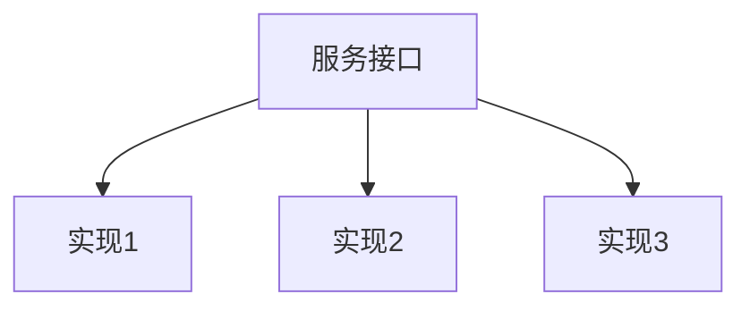

## 1. SPI 机制概述  
  
SPI（Service Provider Interface）是一种服务发现机制，允许框架或库定义接口，而由第三方提供实现。核心思想是**接口与实现分离**，实现**可插拔**的架构设计。  
  

  
## 2. JDK SPI 机制  
  
### 2.1 基本原理  
  
JDK内置的SPI机制通过`java.util.ServiceLoader`类实现，核心流程：  
  
1. 在`META-INF/services/`目录下创建以接口全限定名命名的文件  
2. 文件中写入实现类的全限定名  
3. 通过`ServiceLoader.load()`方法加载实现  
  
### 2.2 实现示例  
  
**接口定义**：  
```java  
public interface DatabaseDriver {  
    String connect(String url);    String disconnect();}  
```  
  
**实现类**：  
```java  
public class MysqlDriver implements DatabaseDriver {  
    @Override    public String connect(String url) {        return "MySQL connected to " + url;    }        @Override  
    public String disconnect() {        return "MySQL disconnected";    }}  
```  
  
**配置文件**：  
```  
# META-INF/services/com.example.DatabaseDriver  
com.example.MysqlDriver  
com.example.OracleDriver  
```  
  
**使用方式**：  
```java  
ServiceLoader<DatabaseDriver> drivers = ServiceLoader.load(DatabaseDriver.class);  
for (DatabaseDriver driver : drivers) {  
    System.out.println(driver.connect("jdbc:mysql://localhost"));}  
```  
  
### 2.3 JDK SPI 特点  
  
| 特性 | 说明 |  
|------|------|  
| 加载方式 | 延迟加载 |  
| 线程安全 | 非线程安全 |  
| 配置方式 | 文本文件 |  
| 实现获取 | 迭代器模式 |  
| 性能 | 每次调用都重新加载 |  
  
## 3. Spring SPI 机制  
  
### 3.1 基本原理  
  
Spring的SPI机制通过`SpringFactoriesLoader`实现，核心改进：  
  
1. 配置文件路径：`META-INF/spring.factories`  
2. 支持批量加载  
3. 缓存机制提升性能  
  
### 3.2 实现示例  
  
**配置文件**：  
```properties  
# META-INF/spring.factories  
com.example.DatabaseDriver=\  
  com.example.MysqlDriver,\  com.example.PostgresDriver  
```  
  
**使用方式**：  
```java  
List<DatabaseDriver> drivers = SpringFactoriesLoader.loadFactories(  
    DatabaseDriver.class, classLoader);  
```  
  
### 3.3 Spring SPI 特点  
  
| 特性 | 说明 |  
|------|------|  
| 加载方式 | 预加载+缓存 |  
| 线程安全 | 线程安全 |  
| 配置方式 | Properties文件 |  
| 实现获取 | 直接返回List |  
| 性能 | 首次加载后缓存 |  
  
## 4. 对比分析  
  
| 特性 | JDK SPI | Spring SPI |  
|------|---------|------------|  
| 配置文件 | META-INF/services/ | META-INF/spring.factories |  
| 文件格式 | 每行一个实现类 | Properties格式 |  
| 加载机制 | 延迟加载 | 预加载+缓存 |  
| 线程安全 | 否 | 是 |  
| 性能 | 较低 | 较高 |  
| 适用场景 | 标准JDK环境 | Spring生态 |  
  
## 5. 实际应用示例  
  
### 5.1 Spring Boot 自动配置  
  
Spring Boot大量使用SPI机制实现自动配置：  
  
```properties  
# spring-boot-autoconfigure/META-INF/spring.factories  
org.springframework.boot.autoconfigure.EnableAutoConfiguration=\  
  org.springframework.boot.autoconfigure.jdbc.DataSourceAutoConfiguration,\  org.springframework.boot.autoconfigure.web.servlet.DispatcherServletAutoConfiguration  
```  
  
### 5.2 自定义SPI实现  
  
**步骤1**：定义接口  
```java  
public interface CacheProvider {  
    void put(String key, Object value);    Object get(String key);}  
```  
  
**步骤2**：创建实现  
```java  
public class RedisCache implements CacheProvider {  
    // 实现方法  
}  
```  
  
**步骤3**：配置spring.factories  
```properties  
com.example.CacheProvider=com.example.RedisCache  
```  
  
**步骤4**：加载使用  
```java  
List<CacheProvider> providers = SpringFactoriesLoader.loadFactories(  
    CacheProvider.class, classLoader);  
```  
  
## 6. 最佳实践  
  
1. **接口设计原则**  
   - 保持接口简洁  
   - 避免频繁变更接口  
   - 明确契约和预期行为  
  
2. **实现类设计**  
   - 提供无参构造函数  
   - 避免依赖注入（除非明确支持）  
   - 线程安全实现  
  
3. **性能优化**  
   - 对于Spring SPI，合理使用缓存  
   - 避免在热路径中频繁加载  
  
4. **错误处理**  
   - 提供有意义的错误信息  
   - 处理实现类加载失败的情况  
  
5. **文档规范**  
   - 明确记录接口契约  
   - 提供实现示例  
   - 说明配置方式  
  
## 7. 总结  
  
SPI机制是Java生态中重要的扩展点设计模式，Spring在JDK SPI基础上进行了优化和改进：  
  
1. **JDK SPI**：  
   - 标准实现，适合基础扩展场景  
   - 简单但功能有限  
  
2. **Spring SPI**：  
   - 增强的加载机制  
   - 更好的性能和线程安全  
   - 深度集成Spring生态  
  
在实际开发中，应根据具体场景选择合适的SPI实现方式。对于Spring项目，优先使用`SpringFactoriesLoader`；对于纯Java项目，可使用标准JDK SPI。