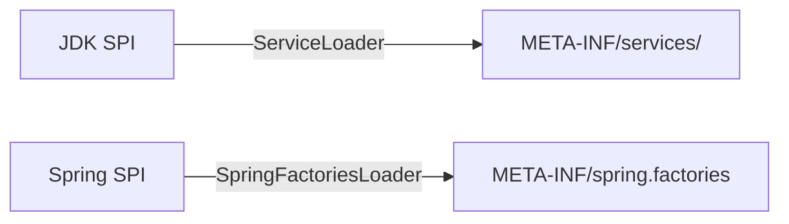

## 1. 核心概念

### 1.1 SPI机制原理

<div class="grid cards" markdown>

-   **核心思想**
    - 接口与实现分离
    - 运行时动态发现
    - 可插拔架构

-   **典型应用**
    - JDBC驱动加载
    - Spring Boot自动配置
    - 日志门面实现

</div>

### 1.2 工作机制对比



## 2. JDK SPI实现

### 2.1 基础实现

**接口定义示例**：
```java
public interface Serializer {
    byte[] serialize(Object obj);
    <T> T deserialize(byte[] bytes);
}
```

**配置文件位置**：
```
META-INF/services/com.example.Serializer
```

<details>
<summary>点击查看完整示例</summary>

**实现类**：
```java
public class JsonSerializer implements Serializer {
    public byte[] serialize(Object obj) {
        // JSON序列化实现
    }
}
```

**使用方式**：
```java
ServiceLoader<Serializer> loader = ServiceLoader.load(Serializer.class);
loader.forEach(serializer -> {...});
```
</details>

## 3. Spring SPI增强

### 3.1 核心改进

<div class="grid cards" markdown>

-   **性能优化**
    - 配置缓存机制
    - 避免重复加载
    - 预初始化支持

-   **功能扩展**
    - 批量加载实现
    - 排序支持
    - 条件过滤

</div>

### 3.2 Spring Boot应用

**自动配置示例**：
```properties
# META-INF/spring.factories
org.springframework.boot.autoconfigure.EnableAutoConfiguration=\
  com.example.MyAutoConfiguration
```

**自定义扩展点**：
```java
public interface MyServiceProvider {
    String provideService();
}
```

## 4. 深度对比

| 维度         | JDK SPI                  | Spring SPI               |
|--------------|--------------------------|--------------------------|
| **加载方式**   | 延迟加载                  | 预加载+缓存               |
| **配置格式**   | 纯文本                    | Properties格式           |
| **线程安全**   | 非线程安全                | 线程安全                  |
| **排序支持**   | 无                       | 通过@Order支持            |
| **适用场景**   | 标准Java环境              | Spring生态系统           |

## 5. 生产实践

### 5.1 最佳实践

1. **接口设计**：
   ```java
   // 明确扩展点契约
   public @FunctionalInterface interface Filter {
       boolean accept(Request request);
   }
   ```

2. **实现规范**：
   ```java
   // 提供无参构造
   public class IpFilter implements Filter {
       public boolean accept(Request req) {
           // 实现逻辑
       }
   }
   ```

### 5.2 性能优化

**Spring SPI缓存配置**：
```java
// 带缓存的加载方式
List<MyService> services = SpringFactoriesLoader
    .loadFactories(MyService.class, classLoader);
```

**JDK SPI优化方案**：
```java
// 单例缓存实现
private static final List<Serializer> SERIALIZERS = StreamSupport
    .stream(ServiceLoader.load(Serializer.class).spliterator(), false)
    .collect(Collectors.toList());
```

## 6. 常见问题

### 6.1 加载失败排查

1. **检查文件路径**：
   ```bash
   # JDK SPI
   ls META-INF/services/

   # Spring SPI
   ls META-INF/spring.factories
   ```

2. **验证类加载器**：
   ```java
   Thread.currentThread().getContextClassLoader().getResource("META-INF/services/...");
   ```

### 6.2 实现冲突解决

**方案1：条件过滤**
```java
ServiceLoader.load(Filter.class)
    .stream()
    .filter(p -> !p.type().isAnnotationPresent(Deprecated.class))
    .map(ServiceLoader.Provider::get)
    .forEach(...);
```

**方案2：优先级排序**
```java
@Order(Ordered.HIGHEST_PRECEDENCE)
public class PrimaryFilter implements Filter {}
```
