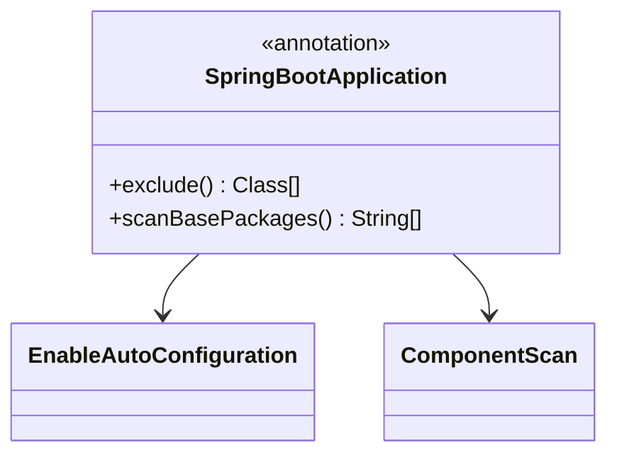
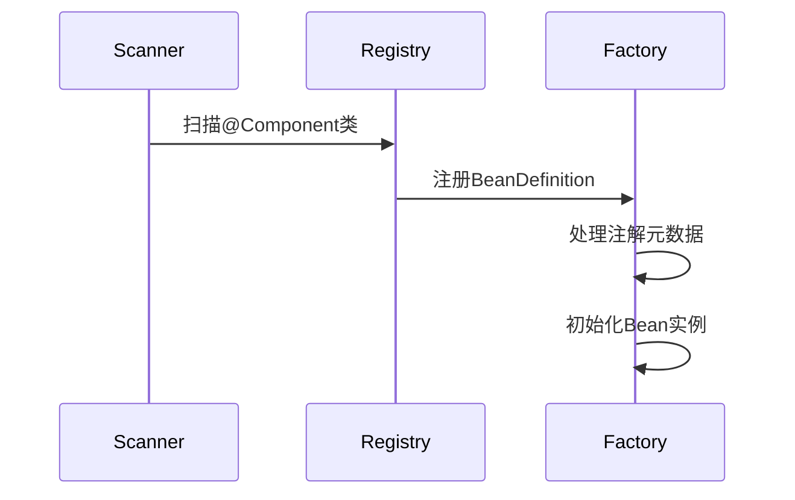

## 1. 核心注解机制

### 1.1 启动注解解析

<div class="grid cards" markdown>

-   **@SpringBootApplication**
    - 组合注解
    - 自动配置核心
    - 组件扫描控制

-   **@EnableAutoConfiguration**
    - 自动配置入口
    - 条件化加载
    - 外部化配置

</div>



## 2. 依赖注入体系

### 2.1 自动装配原理

**@Autowired处理流程**：
```java
// AutowiredAnnotationBeanPostProcessor核心逻辑
public void postProcessProperties(
    PropertyValues pvs, Object bean, String beanName) {
    // 1. 查找注入点元数据
    InjectionMetadata metadata = findAutowiringMetadata(beanName, bean.getClass(), pvs);
    // 2. 执行依赖注入
    metadata.inject(bean, beanName, pvs);
}
```

<details>
<summary>点击查看@Value实现细节</summary>

**@Value处理机制**：
```java
public class AutowiredFieldElement extends InjectionMetadata.InjectedElement {
    protected void inject(Object bean, String beanName, PropertyValues pvs) {
        // 解析SpEL表达式或占位符
        Object value = beanFactory.resolveDependency(
            new DependencyDescriptor(field, true), beanName);
        // 反射设置字段值
        ReflectionUtils.makeAccessible(field);
        field.set(bean, value);
    }
}
```
</details>

## 3. Bean生命周期管理

### 3.1 组件扫描机制



**派生注解关系**：
```java
@Target(ElementType.TYPE)
@Retention(RetentionPolicy.RUNTIME)
@Documented
@Component
public @interface Service {
    @AliasFor(annotation = Component.class)
    String value() default "";
}
```

## 4. AOP实现原理

### 4.1 切面编程模型

<div class="grid cards" markdown>

-   **@Aspect**
    - 切面声明
    - 代理创建
    - 执行顺序控制

-   **@Pointcut**
    - 切点表达式
    - 连接点匹配
    - 参数绑定

</div>

**通知类型对比**：

| 注解类型 | 执行时机 | 异常处理 |
|---------|---------|---------|
| @Before | 方法执行前 | 不影响流程 |
| @After  | 方法执行后 | 始终执行 |
| @Around | 包裹方法 | 可控制流程 |

## 5. 条件化配置

### 5.1 @Conditional实现

**条件注解处理流程**：
```java
public class OnClassCondition implements Condition {
    public boolean matches(ConditionContext context, AnnotatedTypeMetadata metadata) {
        // 检查类路径是否存在指定类
        ClassLoader classLoader = context.getClassLoader();
        return ClassUtils.isPresent(className, classLoader);
    }
}
```

<details>
<summary>点击查看常用条件注解</summary>

| 条件注解 | 作用 | 实现类 |
|---------|------|-------|
| @ConditionalOnBean | 存在Bean时生效 | OnBeanCondition |
| @ConditionalOnClass | 存在类时生效 | OnClassCondition |
| @ConditionalOnProperty | 配置属性匹配时生效 | OnPropertyCondition |
</details>

## 6. 配置属性绑定

### 6.1 @ConfigurationProperties

**属性绑定流程**：
```java
public class ConfigurationPropertiesBindingPostProcessor {
    private void bind(Object bean, String beanName) {
        // 1. 获取注解元数据
        ConfigurationProperties annotation = findAnnotation(bean);
        // 2. 绑定属性值
        Binder binder = new Binder(configurationPropertySources);
        binder.bind(annotation.prefix(), bean);
    }
}
```

## 7. 最佳实践

### 7.1 注解使用准则

1. **明确作用域**：
   ```java
   // 正确示例：限定注解使用范围
   @Target({ElementType.TYPE, ElementType.METHOD})
   @Retention(RetentionPolicy.RUNTIME)
   public @interface AuditLog {}
   ```

2. **合理组合**：
   ```java
   // 组合注解减少样板代码
   @Target(ElementType.TYPE)
   @Retention(RetentionPolicy.RUNTIME)
   @Service
   @Transactional
   public @interface BusinessService {}
   ```

3. **性能考量**：
   ```java
   // 避免注解过度扫描
   @ComponentScan(basePackages = "com.business")
   @Configuration
   public class ModuleConfig {}
   ```
