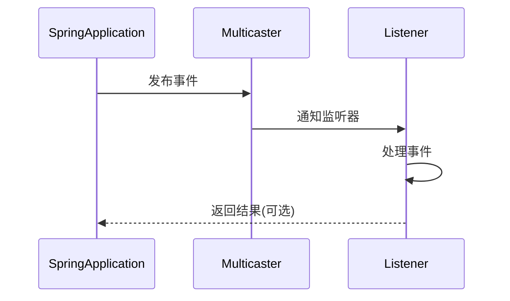
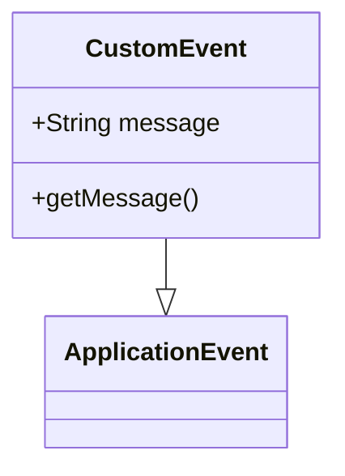

## 1. 核心机制 

### 1.1 事件发布流程



<div class="grid cards" markdown>

-   **核心组件**
    - ApplicationEventPublisher
    - ApplicationEventMulticaster
    - SmartApplicationListener

-   **关键特性**
    - 同步/异步发布
    - 条件过滤
    - 顺序控制

</div>

## 2. 生命周期事件

### 2.1 标准事件序列

| 事件类型 | 触发阶段 | 典型用途 |
|---------|---------|---------|
| `ApplicationStartingEvent` | 启动开始时 | 初始化日志系统 |
| `ApplicationEnvironmentPreparedEvent` | 环境准备后 | 修改配置属性 |
| `ApplicationPreparedEvent` | Bean加载完成 | 预处理Bean定义 |
| `ApplicationStartedEvent` | 上下文刷新后 | 启动后台服务 |
| `ApplicationReadyEvent` | 应用就绪时 | 健康检查注册 |

<details>
<summary>点击查看事件发布源码</summary>

```java
// SpringApplicationRunListeners核心逻辑
void starting(ConfigurableBootstrapContext bootstrapContext) {
    doWithListeners((listener) -> listener.starting(bootstrapContext));
}
```
</details>

## 3. 监听器实现

### 3.1 注册方式对比

**接口实现方式**：
```java
@Component
public class TraditionalListener implements ApplicationListener<ApplicationReadyEvent> {
    @Override
    public void onApplicationEvent(ApplicationReadyEvent event) {
        // 处理逻辑
    }
}
```

**注解驱动方式**：
```java
@Component
public class AnnotationListener {
    @EventListener(condition = "#event.source.activeProfiles.contains('prod')")
    public void handleReady(ApplicationReadyEvent event) {
        // 条件处理
    }
}
```

## 4. 自定义扩展

### 4.1 自定义事件示例



**实现步骤**：
1. 定义事件类
```java
public class AuditEvent extends ApplicationEvent {
    private final String action;
    // 构造器和方法
}
```

2. 发布事件
```java
@Service
public class AuditService {
    private final ApplicationEventPublisher publisher;
    
    public void logAction(String action) {
        publisher.publishEvent(new AuditEvent(this, action));
    }
}
```

3. 监听处理
```java
@Component
public class AuditListener {
    @Async
    @EventListener
    public void handleAudit(AuditEvent event) {
        // 异步处理审计日志
    }
}
```

## 5. 高级特性

### 5.1 异步事件处理

```properties
# application.properties
spring.task.execution.pool.core-size=4
spring.task.execution.pool.max-size=8
```

```java
@Configuration
@EnableAsync
public class AsyncConfig implements AsyncConfigurer {
    @Override
    public Executor getAsyncExecutor() {
        ThreadPoolTaskExecutor executor = new ThreadPoolTaskExecutor();
        executor.initialize();
        return executor;
    }
}
```

### 5.2 监听器排序

```java
@Order(Ordered.HIGHEST_PRECEDENCE)
@Component
public class PriorityListener implements ApplicationListener<ApplicationEvent> {
    // 优先执行
}
```

## 6. 最佳实践

### 6.1 使用准则

1. **轻量处理**：
   ```java
   @EventListener
   public void handleEvent(Event event) {
       // 快速处理，避免阻塞
       eventQueue.add(event);
   }
   ```

2. **异常隔离**：
   ```java
   @EventListener
   public void safeHandle(Event event) {
       try {
           // 业务逻辑
       } catch (Exception e) {
           log.error("处理失败", e);
       }
   }
   ```

3. **条件过滤**：
   ```java
   @EventListener(condition = "#event.type == T(com.example.EventType).IMPORTANT")
   public void handleImportant(Event event) {
       // 重要事件处理
   }
   ```
