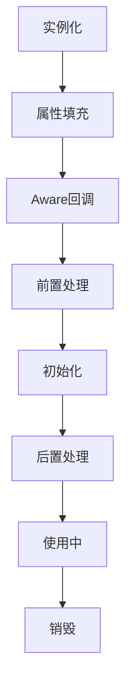

## 1. 核心机制

### 1.1 生命周期流程



<div class="grid cards" markdown>

-   **关键阶段**
    - 实例化：反射创建对象
    - 依赖注入：填充属性
    - 初始化：执行回调
    - 销毁：资源释放

-   **扩展点**
    - BeanPostProcessor
    - Aware接口
    - 生命周期接口
    - 自定义方法

</div>

## 2. 源码级分析

### 2.1 创建过程

**AbstractAutowireCapableBeanFactory.doCreateBean()**：
```java
protected Object doCreateBean(String beanName, RootBeanDefinition mbd, Object[] args) {
    // 1. 实例化
    BeanWrapper instanceWrapper = createBeanInstance(beanName, mbd, args);
    // 2. 提前暴露引用（解决循环依赖）
    addSingletonFactory(beanName, () -> getEarlyBeanReference(beanName, mbd, bean));
    // 3. 属性填充
    populateBean(beanName, mbd, instanceWrapper);
    // 4. 初始化
    Object exposedObject = initializeBean(beanName, bean, mbd);
    return exposedObject;
}
```

**initializeBean()核心逻辑**：
```java
protected Object initializeBean(String beanName, Object bean, RootBeanDefinition mbd) {
    // 1. Aware接口回调
    invokeAwareMethods(beanName, bean);
    // 2. 前置处理
    wrappedBean = applyBeanPostProcessorsBeforeInitialization(bean, beanName);
    // 3. 初始化方法
    invokeInitMethods(beanName, wrappedBean, mbd);
    // 4. 后置处理
    wrappedBean = applyBeanPostProcessorsAfterInitialization(wrappedBean, beanName);
    return wrappedBean;
}
```

**1. Aware接口回调**

Spring通过`invokeAwareMethods()`方法执行Aware接口的回调：
```java
private void invokeAwareMethods(String beanName, Object bean) {
    if (bean instanceof BeanNameAware) {
        ((BeanNameAware) bean).setBeanName(beanName);
    }
    if (bean instanceof BeanClassLoaderAware) {
        ((BeanClassLoaderAware) bean).setBeanClassLoader(getBeanClassLoader());
    }
    if (bean instanceof BeanFactoryAware) {
        ((BeanFactoryAware) bean).setBeanFactory(AbstractAutowireCapableBeanFactory.this);
    }
}
```
主要处理以下Aware接口：
- BeanNameAware：注入Bean的名称
- BeanClassLoaderAware：注入类加载器
- BeanFactoryAware：注入BeanFactory实例

**2. 前置处理**

通过`applyBeanPostProcessorsBeforeInitialization()`方法执行所有BeanPostProcessor的前置处理：
```java
public Object applyBeanPostProcessorsBeforeInitialization(Object existingBean, String beanName) {
    Object result = existingBean;
    for (BeanPostProcessor processor : getBeanPostProcessors()) {
        Object current = processor.postProcessBeforeInitialization(result, beanName);
        if (current == null) {
            return result;
        }
        result = current;
    }
    return result;
}
```
常见的前置处理：
- @PostConstruct注解的处理
- 配置属性的注入
- 自定义的Bean增强逻辑

[[Spring Bean前置处理器详解]]    
  
**3. 初始化方法**

`invokeInitMethods()`方法按顺序调用初始化方法：
```java
protected void invokeInitMethods(String beanName, Object bean, RootBeanDefinition mbd) {
    // 1. 处理InitializingBean接口
    if (bean instanceof InitializingBean) {
        ((InitializingBean) bean).afterPropertiesSet();
    }
    
    // 2. 调用自定义init-method
    if (mbd != null && bean.getClass() != NullBean.class) {
        String initMethodName = mbd.getInitMethodName();
        if (StringUtils.hasLength(initMethodName)) {
            invokeCustomInitMethod(beanName, bean, mbd);
        }
    }
}
```
初始化顺序：
1. InitializingBean接口的afterPropertiesSet()方法
2. XML配置的init-method或@Bean注解指定的初始化方法

**4. 后置处理**

最后通过`applyBeanPostProcessorsAfterInitialization()`执行后置处理：
```java
public Object applyBeanPostProcessorsAfterInitialization(Object existingBean, String beanName) {
    Object result = existingBean;
    for (BeanPostProcessor processor : getBeanPostProcessors()) {
        Object current = processor.postProcessAfterInitialization(result, beanName);
        if (current == null) {
            return result;
        }
        result = current;
    }
    return result;
}
```
主要用途：
- AOP代理的创建
- @Bean方法返回值的处理
- 缓存代理的生成
- 其他自定义的Bean包装或代理逻辑

[[Spring Bean后置处理器详解]]   

