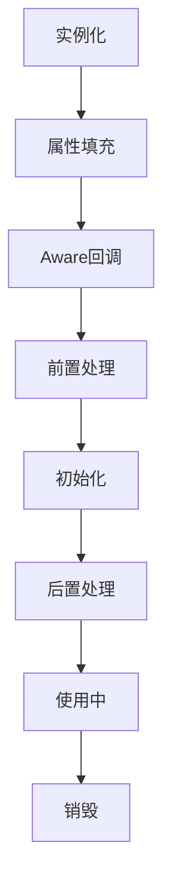
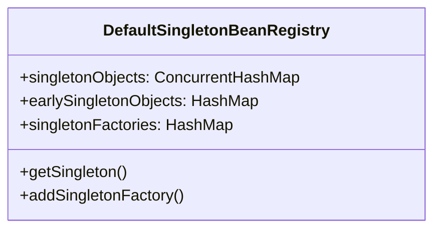
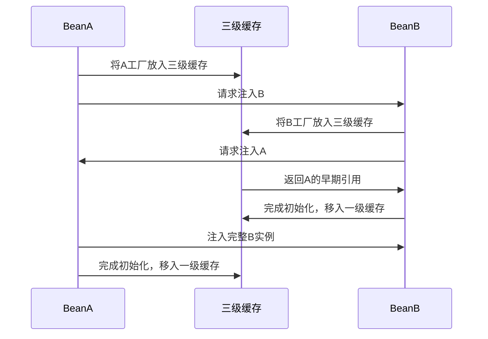

## 1. 核心机制

### 1.1 生命周期流程



<div class="grid cards" markdown>

-   **关键阶段**
    - 实例化：反射创建对象
    - 依赖注入：填充属性
    - 初始化：执行回调
    - 销毁：资源释放

-   **扩展点**
    - BeanPostProcessor
    - Aware接口
    - 生命周期接口
    - 自定义方法

</div>

## 2. 源码级分析

### 2.1 创建过程

**AbstractAutowireCapableBeanFactory.doCreateBean()**：
```java
protected Object doCreateBean(String beanName, RootBeanDefinition mbd, Object[] args) {
    // 1. 实例化
    BeanWrapper instanceWrapper = createBeanInstance(beanName, mbd, args);
    // 2. 提前暴露引用（解决循环依赖）
    addSingletonFactory(beanName, () -> getEarlyBeanReference(beanName, mbd, bean));
    // 3. 属性填充
    populateBean(beanName, mbd, instanceWrapper);
    // 4. 初始化
    Object exposedObject = initializeBean(beanName, bean, mbd);
    return exposedObject;
}
```

<details>
<summary>点击查看初始化细节</summary>

**initializeBean()核心逻辑**：
```java
protected Object initializeBean(String beanName, Object bean, RootBeanDefinition mbd) {
    // 1. Aware接口回调
    invokeAwareMethods(beanName, bean);
    // 2. 前置处理
    wrappedBean = applyBeanPostProcessorsBeforeInitialization(bean, beanName);
    // 3. 初始化方法
    invokeInitMethods(beanName, wrappedBean, mbd);
    // 4. 后置处理
    wrappedBean = applyBeanPostProcessorsAfterInitialization(wrappedBean, beanName);
    return wrappedBean;
}
```
</details>

## 3. 循环依赖解决方案

### 3.1 三级缓存机制



**缓存作用对比**：

| 缓存层级 | 存储内容 | 用途 |
|---------|---------|------|
| 一级缓存 | 完整Bean | 提供最终实例 |
| 二级缓存 | 原始Bean | 解决循环依赖 |
| 三级缓存 | 工厂对象 | 支持AOP代理 |

### 3.2 解决流程



## 4. 最佳实践

### 4.1 生命周期管理

1. **初始化逻辑**：
```java
@Component
public class ServiceBean implements InitializingBean {
    @PostConstruct
    public void init() {
        // 注解方式初始化
    }

    @Override
    public void afterPropertiesSet() {
        // 接口方式初始化
    }
}
```

2. **销毁逻辑**：
```java
@Component
public class ResourceHolder implements DisposableBean {
    @PreDestroy
    public void cleanup() {
        // 注解方式销毁
    }

    @Override
    public void destroy() {
        // 接口方式销毁
    }
}
```

### 4.2 循环依赖规避

1. **设计建议**：
   - 避免构造器循环依赖
   - 使用@Lazy延迟注入
   - 重构代码消除循环

2. **延迟注入示例**：
```java
@Service
public class ServiceA {
    @Lazy
    @Autowired
    private ServiceB serviceB;
}
```

## 5. 高级场景

### 5.1 原型Bean循环依赖

**解决方案**：
```java
@Scope(scopeName = ConfigurableBeanFactory.SCOPE_PROTOTYPE, 
       proxyMode = ScopedProxyMode.TARGET_CLASS)
@Service
public class PrototypeService {
    // 通过代理模式解决
}
```

### 5.2 构造器注入处理

**替代方案**：
```java
@Service
public class ConstructorService {
    private final DependencyService dependency;
    
    @Autowired
    public ConstructorService(@Lazy DependencyService dependency) {
        this.dependency = dependency;
    }
}
```
