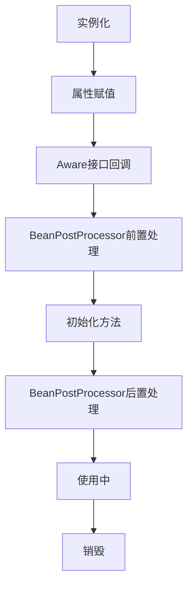

## 1. Spring Bean 生命周期与循环依赖  
  
### 1.1. Bean 的生命周期  
  
Bean 的生命周期是 Spring 框架中的核心概念，包含以下主要阶段：  
  
#### 1.1.1 完整生命周期流程  
  

  
#### 1.1.2 源码级分析  
  
Bean的生命周期主要在`AbstractAutowireCapableBeanFactory.doCreateBean()`方法中实现：  
  
```java  
// AbstractAutowireCapableBeanFactory.doCreateBean() 核心源码分析  
protected Object doCreateBean(String beanName, RootBeanDefinition mbd, @Nullable Object[] args) {  
    // 1. 实例化Bean  
    BeanWrapper instanceWrapper = null;    if (mbd.isSingleton()) {        instanceWrapper = this.factoryBeanInstanceCache.remove(beanName);    }    if (instanceWrapper == null) {        // 创建Bean实例  
        instanceWrapper = createBeanInstance(beanName, mbd, args);    }    Object bean = instanceWrapper.getWrappedInstance();    // 2. 判断是否需要提前暴露（解决循环依赖）  
    boolean earlySingletonExposure = (mbd.isSingleton() && this.allowCircularReferences &&            isSingletonCurrentlyInCreation(beanName));    if (earlySingletonExposure) {        // 添加到三级缓存  
        addSingletonFactory(beanName, () -> getEarlyBeanReference(beanName, mbd, bean));    }    // 3. 属性填充  
    populateBean(beanName, mbd, instanceWrapper);    // 4. 初始化Bean  
    Object exposedObject = initializeBean(beanName, exposedObject, mbd);    // 5. 注册销毁方法  
    registerDisposableBeanIfNecessary(beanName, bean, mbd);        return exposedObject;  
}  
```  
  
**initializeBean方法源码分析**：  
  
```java  
// AbstractAutowireCapableBeanFactory.initializeBean() 源码分析  
protected Object initializeBean(String beanName, Object bean, RootBeanDefinition mbd) {  
    // 1. 执行Aware接口方法  
    if (bean instanceof Aware) {        if (bean instanceof BeanNameAware) {            ((BeanNameAware) bean).setBeanName(beanName);        }        if (bean instanceof BeanClassLoaderAware) {            ((BeanClassLoaderAware) bean).setBeanClassLoader(getBeanClassLoader());        }        if (bean instanceof BeanFactoryAware) {            ((BeanFactoryAware) bean).setBeanFactory(AbstractAutowireCapableBeanFactory.this);        }    }        // 2. BeanPostProcessor前置处理  
    Object wrappedBean = bean;    if (mbd == null || !mbd.isSynthetic()) {        wrappedBean = applyBeanPostProcessorsBeforeInitialization(wrappedBean, beanName);    }    // 3. 执行初始化方法  
    try {        // 调用@PostConstruct注解的方法  
        invokeInitMethods(beanName, wrappedBean, mbd);    }    catch (Throwable ex) {        throw new BeanCreationException(mbd.getResourceDescription(), beanName, "Invocation of init method failed", ex);    }        // 4. BeanPostProcessor后置处理  
    if (mbd == null || !mbd.isSynthetic()) {        wrappedBean = applyBeanPostProcessorsAfterInitialization(wrappedBean, beanName);    }        return wrappedBean;  
}  
```  
  
#### 1.1.3 各阶段详解  
  
1. **实例化（Instantiation）**  
   - 调用构造方法创建对象  
   - 使用反射或CGLIB  
   - 源码位置：`createBeanInstance(beanName, mbd, args)`  
  
2. **属性赋值（Populate）**  
   - 设置依赖属性  
   - 注入依赖对象  
   - 源码位置：`populateBean(beanName, mbd, instanceWrapper)`  
  
3. **初始化（Initialization）**  
   - `BeanNameAware.setBeanName()`  
   - `BeanFactoryAware.setBeanFactory()`  
   - `ApplicationContextAware.setApplicationContext()`  
   - `@PostConstruct` (通过CommonAnnotationBeanPostProcessor实现)  
   - `InitializingBean.afterPropertiesSet()`  
   - 自定义 init-method  
   - 源码位置：`initializeBean(beanName, exposedObject, mbd)`  
  
4. **使用（In Use）**  
   - Bean 可以被应用程序使用  
   - 位于Spring容器管理下  
  
5. **销毁（Destruction）**  
   - `@PreDestroy` (通过CommonAnnotationBeanPostProcessor实现)  
   - `DisposableBean.destroy()`  
   - 自定义 destroy-method  
   - 源码位置：`DisposableBeanAdapter.destroy()`  
  
### 1.2. 循环依赖解决方案  
  
Spring 通过三级缓存机制解决循环依赖：  
  
| 缓存 | 用途 | 内容 |  
|------|------|------|  
| 一级缓存 | 存放完全初始化好的 Bean | `singletonObjects` |  
| 二级缓存 | 存放原始的 Bean 对象 | `earlySingletonObjects` |  
| 三级缓存 | 存放 Bean 工厂对象 | `singletonFactories` |  
  
#### 1.2.1 三级缓存源码定义  
  
```java  
// DefaultSingletonBeanRegistry 中的三级缓存定义  
/** 一级缓存：存放完全初始化好的bean */  
private final Map<String, Object> singletonObjects = new ConcurrentHashMap<>(256);  
  
/** 二级缓存：存放原始的bean对象（尚未填充属性） */private final Map<String, Object> earlySingletonObjects = new HashMap<>(16);  
  
/** 三级缓存：存放bean工厂对象 */private final Map<String, ObjectFactory<?>> singletonFactories = new HashMap<>(16);  
```  
  
#### 1.2.2 循环依赖解决流程  
  
以A、B两个Bean循环依赖为例：  
  
```java  
// DefaultSingletonBeanRegistry.getSingleton() 源码分析  
public Object getSingleton(String beanName, boolean allowEarlyReference) {  
    // 首先从一级缓存中获取  
    Object singletonObject = this.singletonObjects.get(beanName);    // 如果一级缓存没有，且当前bean正在创建中  
    if (singletonObject == null && isSingletonCurrentlyInCreation(beanName)) {        // 从二级缓存获取  
        singletonObject = this.earlySingletonObjects.get(beanName);        // 如果二级缓存也没有，且允许提前引用  
        if (singletonObject == null && allowEarlyReference) {            // 从三级缓存获取  
            ObjectFactory<?> singletonFactory = this.singletonFactories.get(beanName);            if (singletonFactory != null) {                // 通过工厂创建对象  
                singletonObject = singletonFactory.getObject();                // 放入二级缓存  
                this.earlySingletonObjects.put(beanName, singletonObject);                // 从三级缓存移除  
                this.singletonFactories.remove(beanName);            }        }    }    return singletonObject;}  
```  
  
**循环依赖解决步骤**：  
  
1. 创建A实例，A尚未完成属性填充，将A放入三级缓存  
2. 填充A的属性，发现依赖B，开始创建B  
3. 创建B实例，B尚未完成属性填充，将B放入三级缓存  
4. 填充B的属性，发现依赖A，尝试获取A  
5. 从三级缓存中获取到A的工厂，通过工厂创建A的早期引用  
6. 将A的早期引用放入二级缓存，从三级缓存移除A  
7. B注入A的早期引用，B完成初始化，放入一级缓存  
8. 继续A的初始化，注入B，A完成初始化，放入一级缓存  
  
#### 1.2.3 为什么需要三级缓存  
  
1. **一级缓存**：存放完全初始化好的Bean，对外提供访问  
2. **二级缓存**：存放原始Bean对象，解决循环依赖  
3. **三级缓存**：存放Bean工厂对象，主要用于支持AOP代理  
  
三级缓存的关键作用是处理AOP代理。如果没有AOP，二级缓存足以解决循环依赖。但当Bean需要被代理时，三级缓存中的工厂可以确保返回的是代理对象而非原始对象。  
  
> 注意：Spring 只能解决单例作用域下的setter注入的循环依赖。构造器注入的循环依赖无法解决，因为对象实例化和构造器注入是同一步操作。