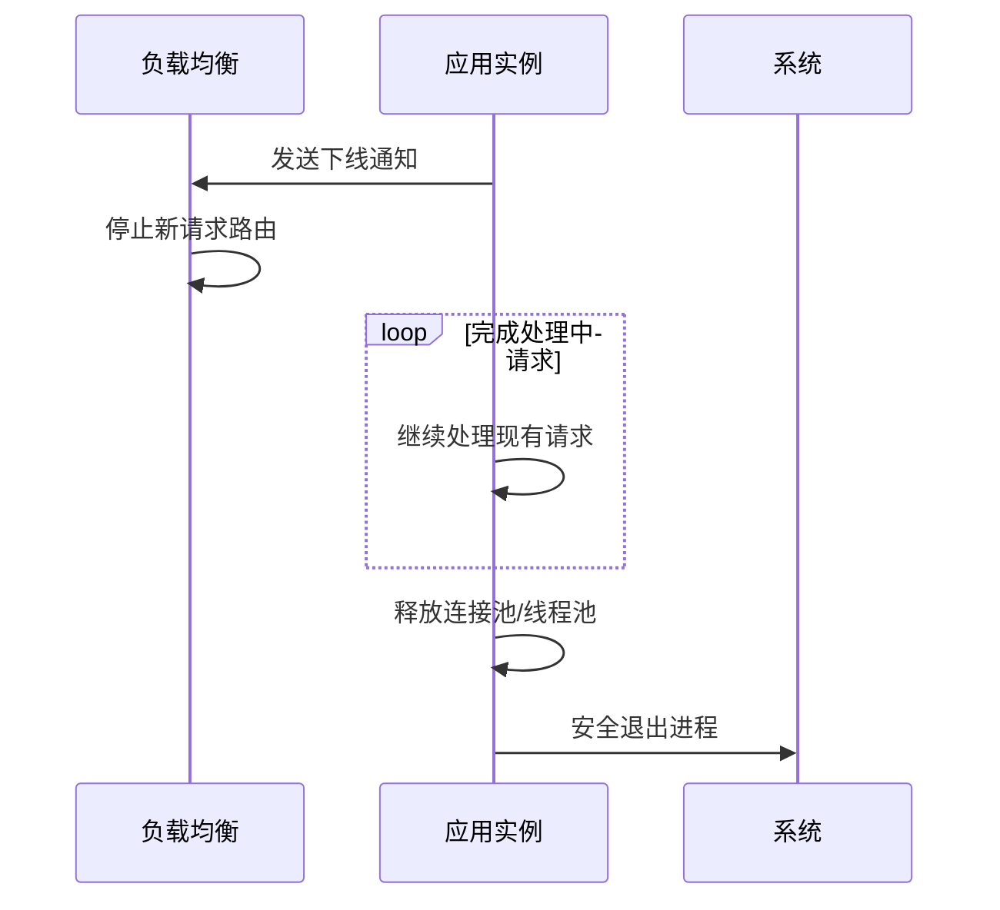

## 1. 核心机制 

### 1.1 工作流程



<div class="grid cards" markdown>

-   **关键阶段**
    - 流量摘除：从LB下线
    - 请求消化：完成进行中请求
    - 资源释放：关闭连接/线程
    - 进程退出：安全终止

-   **配置要点**
    - 超时时间设置
    - 线程池管理
    - 健康检查集成
    - 资源清理

</div>

## 2. 配置实现

### 2.1 基础配置

**application.yml**：
```yaml
server:
  shutdown: graceful
spring:
  lifecycle:
    timeout-per-shutdown-phase: 60s
```

### 2.2 服务器调优

<details>
<summary>点击查看服务器专用配置</summary>

**Tomcat优化**：
```properties
server.tomcat.threads.max=200
server.tomcat.threads.min-spare=10
server.tomcat.connection-timeout=5s
```

**Undertow优化**：
```properties
server.undertow.threads.io=16
server.undertow.threads.worker=100
server.undertow.no-request-timeout=60s
```
</details>

## 3. 高级实现

### 3.1 自定义终止处理器

```java
@Component
public class GracefulShutdown implements WebServerFactoryCustomizer<TomcatServletWebServerFactory> {

    @Override
    public void customize(TomcatServletWebServerFactory factory) {
        factory.addConnectorCustomizers(connector -> {
            connector.setProperty("relaxedQueryChars", "|{}[]");
            Runtime.getRuntime().addShutdownHook(new Thread(() -> {
                connector.pause();
                Executor executor = connector.getProtocolHandler().getExecutor();
                if (executor instanceof ThreadPoolExecutor) {
                    ThreadPoolExecutor pool = (ThreadPoolExecutor) executor;
                    pool.shutdown();
                    try {
                        if (!pool.awaitTermination(30, TimeUnit.SECONDS)) {
                            pool.shutdownNow();
                        }
                    } catch (InterruptedException e) {
                        Thread.currentThread().interrupt();
                    }
                }
            }));
        });
    }
}
```

## 4. Kubernetes集成

### 4.1 部署配置

```yaml
apiVersion: apps/v1
kind: Deployment
spec:
  template:
    spec:
      terminationGracePeriodSeconds: 90
      containers:
      - name: app
        lifecycle:
          preStop:
            exec:
              command: 
              - sh
              - -c
              - "sleep 30 && curl -X POST http://localhost:8080/actuator/shutdown"
```

### 4.2 健康检查

```yaml
readinessProbe:
  httpGet:
    path: /actuator/health/readiness
    port: 8080
  failureThreshold: 3
  periodSeconds: 5

livenessProbe:  
  httpGet:
    path: /actuator/health/liveness
    port: 8080
  initialDelaySeconds: 60
  periodSeconds: 15
```

## 5. 最佳实践

### 5.1 资源清理模板

```java
@PreDestroy
public void cleanup() {
    // 1. 关闭数据源
    dataSource.close();
    
    // 2. 停止消息监听
    messageListenerContainer.stop();
    
    // 3. 清理临时文件
    FileUtils.cleanTempDir();
    
    // 4. 记录关闭日志
    log.info("应用资源清理完成");
}
```

### 5.2 监控指标

```java
@Bean
public MeterRegistryCustomizer<MeterRegistry> metrics() {
    return registry -> {
        registry.config().commonTags(
            "app", "order-service",
            "region", System.getenv("REGION")
        );
        
        // 记录关闭事件
        Counter.builder("app.shutdown.events")
              .tag("type", "graceful")
              .register(registry);
    };
}
```

## 6. 故障排查

### 6.1 常见问题处理

| 问题现象 | 解决方案 | 配置示例 |
|---------|---------|---------|
| 请求被中断 | 增加超时时间 | `timeout-per-shutdown-phase: 120s` |
| 线程池阻塞 | 强制关闭线程池 | `executor.shutdownNow()` |
| 连接泄漏 | 显式关闭连接池 | `dataSource.close()` |

### 6.2 诊断命令

```bash
# 查看线程状态
jstack <pid> | grep -i pool

# 监控关闭过程
watch -n 1 "curl -s http://localhost:8080/actuator/health | jq"
```
