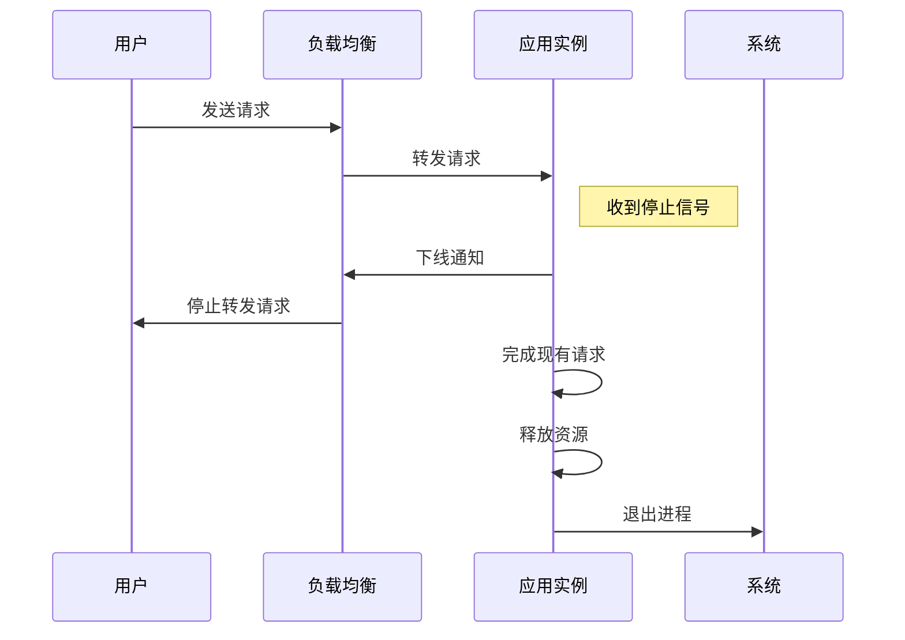

# Spring Boot 优雅启停指南  
  
## 1. 优雅启停概述  
  
优雅启停(Graceful Shutdown)是指应用程序在收到停止信号后：  
- 停止接收新请求  
- 完成正在处理的请求  
- 释放占用的资源  
- 然后才真正退出  
  

  
## 2. 配置优雅启停  
  
### 2.1 基础配置  
  
在`application.properties`或`application.yml`中添加：  
  
```properties  
# 启用优雅停机  
server.shutdown=graceful  
  
# 设置等待时间(默认30s)  
spring.lifecycle.timeout-per-shutdown-phase=60s  
```  
  
### 2.2 高级配置  
  
对于不同嵌入式服务器：  
  
**Tomcat**:  
```properties  
server.tomcat.threads.max=200  
server.tomcat.threads.min-spare=10  
```  
  
**Undertow**:  
```properties  
server.undertow.threads.io=16  
server.undertow.threads.worker=100  
```  
  
## 3. 代码实现示例  
  
### 3.1 自定义终止处理器  
  
```java  
@Component  
public class GracefulShutdown implements TomcatConnectorCustomizer, ApplicationListener<ContextClosedEvent> {  
        private volatile Connector connector;  
        @Override  
    public void customize(Connector connector) {        this.connector = connector;    }        @Override  ``
    public void onApplicationEvent(ContextClosedEvent event) {        this.connector.pause();        Executor executor = this.connector.getProtocolHandler().getExecutor();        if (executor instanceof ThreadPoolExecutor) {            try {                ThreadPoolExecutor threadPool = (ThreadPoolExecutor) executor;                threadPool.shutdown();                if (!threadPool.awaitTermination(30, TimeUnit.SECONDS)) {                    log.warn("线程池等待超时，将强制关闭");  
                }            } catch (InterruptedException ex) {                Thread.currentThread().interrupt();            }        }    }}
```  
  
### 3.2 注册自定义Bean  
  
```java  
@Bean  
public GracefulShutdown gracefulShutdown() {  
    return new GracefulShutdown();}  
  
@Bean  
public ServletWebServerFactory servletContainer(GracefulShutdown gracefulShutdown) {  
    TomcatServletWebServerFactory factory = new TomcatServletWebServerFactory();    factory.addConnectorCustomizers(gracefulShutdown);    return factory;}  
```  
  
## 4. Kubernetes集成  
  
### 4.1 部署配置  
  
```yaml  
apiVersion: apps/v1  
kind: Deployment  
spec:  
  template:    spec:      containers:      - name: app        lifecycle:          preStop:            exec:              command: ["sh", "-c", "sleep 30"]  
```  
  
### 4.2 健康检查配置  
  
```yaml  
readinessProbe:  
  httpGet:    path: /actuator/health/readiness    port: 8080  initialDelaySeconds: 20  periodSeconds: 5  
livenessProbe:  
  httpGet:    path: /actuator/health/liveness    port: 8080  initialDelaySeconds: 30  periodSeconds: 10  
```  
  
## 5. 最佳实践  
  
1. **超时设置**：  
   - 根据平均请求处理时间设置合理的超时  
   - 监控历史请求耗时确定最佳值  
  
2. **资源清理**：  
   - 数据库连接池关闭  
   - 文件句柄释放  
   - 线程池关闭  
  
3. **日志记录**：  
   ```java  
   @PreDestroy  
   public void onDestroy() {       log.info("应用正在关闭，清理资源...");  
       // 清理逻辑  
   }  
   ```  
4. **测试策略**：  
   - 模拟长时间请求验证优雅停机  
   - 压力测试期间重启服务验证影响  
  
5. **监控指标**：  
   ```java  
   @Bean  
   public MeterRegistryCustomizer<MeterRegistry> metricsCommonTags() {       return registry -> registry.config().commonTags("application", "your-app-name");   }  
   ```  
## 6. 常见问题处理  
  
### 6.1 请求被中断  
  
**解决方案**：  
```properties  
# 增加等待时间  
spring.lifecycle.timeout-per-shutdown-phase=120s  
```  
  
### 6.2 线程池无法关闭  
  
**解决方案**：  
```java  
executor.shutdownNow(); // 强制中断  
```  
  
### 6.3 数据库连接泄漏  
  
**解决方案**：  
```java  
@PreDestroy  
public void cleanup() {  
    dataSource.close();}  
```  
  
## 7. 总结  
  
Spring Boot优雅启停的关键点：  
  
1. **配置简单**：通过几个属性即可启用  
2. **灵活控制**：可自定义终止逻辑  
3. **云原生友好**：完美适配Kubernetes等平台  
4. **生产必备**：确保服务更新/扩缩容时不影响用户体验  
  
通过合理配置和实现，可以确保服务在停止时：  
- 不丢失请求  
- 不中断重要业务  
- 不泄漏资源  
- 不影响用户体验