## 1. 核心机制 

### 1.1 完整生命周期

```mermaid
gantt
    title 应用生命周期管理
    dateFormat  HH:mm:ss
    section 启动阶段
    初始化配置 :a1, 00:00:00, 5s
    资源预加载 :a2, after a1, 10s
    健康检查就绪 :a3, after a2, 3s
    section 运行阶段
    服务流量 :a4, after a3, 60s
    section 停止阶段
    流量摘除 :a5, after a4, 5s
    请求消化 :a6, after a5, 30s
    资源释放 :a7, after a6, 10s
```



## 2. 优雅启动 

### 2.1 启动优化配置

**预热配置**：
```yaml
spring:
  datasource:
    hikari:
      initialization-fail-timeout: 30000 # 连接池初始化超时
      pool-name: HikariCP-Warmup
      leak-detection-threshold: 60000 # 连接泄漏检测
```

### 2.2 启动健康检查

```java
@Component
public class StartupHealthIndicator implements HealthIndicator {
    
    private volatile boolean ready = false;
    
    @Override
    public Health health() {
        return ready ? Health.up().build() 
                   : Health.down().withDetail("reason", "warming up").build();
    }
    
    @EventListener(ContextRefreshedEvent.class)
    public void setReady() {
        this.ready = true;
    }
}
```

## 3. 优雅停止 

### 3.1 基础配置

**application.yml**：
```yaml
server:
  shutdown: graceful
spring:
  lifecycle:
    timeout-per-shutdown-phase: 60s
  kafka:
    listener:
      shutdown-timeout: 30s
```

### 3.2 资源清理模板

```java
@PreDestroy
public void cleanup() {
    // 1. 数据源关闭
    if (!dataSource.isClosed()) {
        dataSource.close();
    }
    
    // 2. 消息消费者停止
    kafkaListenerEndpointRegistry.stop();
    
    // 3. 线程池关闭
    executorService.shutdown();
    try {
        if (!executorService.awaitTermination(30, TimeUnit.SECONDS)) {
            executorService.shutdownNow();
        }
    } catch (InterruptedException e) {
        Thread.currentThread().interrupt();
    }
}
```

## 4. 高级实现 

### 4.1 启动顺序控制

```java
@Configuration
@AutoConfigureOrder(Ordered.HIGHEST_PRECEDENCE)
public class CoreConfig {
    
    @Bean
    @DependsOn("dataSourceInitializer")
    public ServiceInitializer serviceInitializer() {
        return new ServiceInitializer();
    }
}
```

### 4.2 停止事件监听

```java
@Component
public class ShutdownListener {
    
    @EventListener(ContextClosedEvent.class)
    public void onShutdown(ContextClosedEvent event) {
        // 1. 标记服务不可用
        ServiceRegistry.markUnavailable();
        
        // 2. 等待处理中请求完成
        RequestCounter.waitUntilEmpty(30_000);
        
        // 3. 发送停机通知
        NotificationService.sendShutdownAlert();
    }
}
```

## 5. Kubernetes集成 {#kubernetes}

### 5.1 完整部署配置

```yaml
apiVersion: apps/v1
kind: Deployment
spec:
  strategy:
    rollingUpdate:
      maxSurge: 1
      maxUnavailable: 0
  template:
    spec:
      terminationGracePeriodSeconds: 90
      containers:
      - name: app
        lifecycle:
          postStart:
            exec:
              command: ["/bin/sh", "-c", "curl -X POST http://localhost:8080/actuator/warmup"]
          preStop:
            exec:
              command: ["/bin/sh", "-c", "curl -X POST http://localhost:8080/actuator/shutdown && sleep 30"]
        readinessProbe:
          httpGet:
            path: /actuator/health/readiness
            port: 8080
          initialDelaySeconds: 20
          periodSeconds: 5
        livenessProbe:
          httpGet:
            path: /actuator/health/liveness
            port: 8080
          initialDelaySeconds: 60
          periodSeconds: 15
```

## 6. 最佳实践 {#best-practices}

### 6.1 启动检查清单

1. **依赖服务验证**：
```java
@Bean
public CommandLineRunner checkDependencies() {
    return args -> {
        databaseHealthChecker.validate();
        redisClient.ping();
    };
}
```

2. **缓存预热**：
```java
@EventListener(ApplicationReadyEvent.class)
public void warmupCache() {
    cacheLoader.loadFrequentData();
}
```

### 6.2 停止检查清单

1. **会话处理**：
```java
@PreDestroy
public void handleSessions() {
    sessionRepository.saveAll();
    distributedLock.releaseAll();
}
```

2. **监控上报**：
```java
@PreDestroy
public void reportShutdown() {
    metricsCounter.recordShutdown();
    logPublisher.flush();
}
```

## 7. 故障排查 {#troubleshooting}

### 7.1 启动问题诊断

**检查顺序**：
1. 依赖服务连通性
2. 资源配额限制
3. 健康检查配置
4. 启动超时设置

**诊断命令**：
```bash
kubectl logs -f <pod> --since=5m | grep "Started"
```

### 7.2 停止问题处理

**常见场景**：
| 现象 | 解决方案 |
|------|---------|
| 线程阻塞 | 增加shutdown-timeout |
| 连接泄漏 | 添加资源关闭钩子 |
| 长事务 | 设置事务超时 |

**强制终止**：
```bash
kill -TERM <pid> # 先尝试优雅终止
kill -KILL <pid> # 最终强制终止
```
