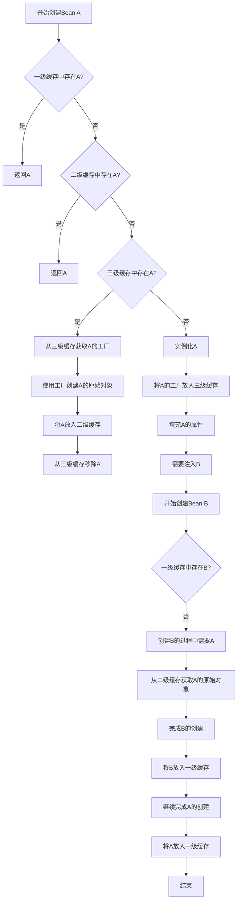

## 1. 循环依赖概述

循环依赖是指两个或多个Bean之间相互依赖，形成一个闭环的依赖关系。例如，A依赖B，B依赖A，这就形成了一个最简单的循环依赖。


在Spring框架中，循环依赖主要有以下几种类型：

1. **构造器循环依赖**：通过构造器注入形成的循环依赖
2. **Setter循环依赖**：通过Setter方法注入形成的循环依赖
3. **字段循环依赖**：通过字段注入形成的循环依赖

Spring默认只能解决非构造器的循环依赖，即Setter和字段注入形成的循环依赖。

## 2. Spring解决循环依赖的机制

### 2.1 三级缓存机制

Spring通过三级缓存机制来解决循环依赖问题：

```java
/** 一级缓存：存放完全初始化好的Bean */
private final Map<String, Object> singletonObjects = new ConcurrentHashMap<>(256);

/** 二级缓存：存放原始的Bean对象（尚未填充属性） */
private final Map<String, Object> earlySingletonObjects = new HashMap<>(16);

/** 三级缓存：存放Bean工厂对象，用于创建原始Bean对象 */
private final Map<String, ObjectFactory<?>> singletonFactories = new HashMap<>(16);
```

### 2.2 解决流程

Spring解决循环依赖的基本流程如下：



### 2.3 关键源码分析

以下是Spring解决循环依赖的关键源码：

```java
// AbstractBeanFactory.java
protected <T> T doGetBean(final String name, @Nullable final Class<T> requiredType,
        @Nullable final Object[] args, boolean typeCheckOnly) throws BeansException {
    
    // 尝试从缓存中获取Bean
    Object sharedInstance = getSingleton(beanName);
    
    if (sharedInstance != null && args == null) {
        // 返回缓存中的Bean
        bean = getObjectForBeanInstance(sharedInstance, name, beanName, null);
    } else {
        // 创建Bean
        // ...
        
        // 单例模式
        if (mbd.isSingleton()) {
            sharedInstance = getSingleton(beanName, () -> {
                try {
                    // 创建Bean的实例
                    return createBean(beanName, mbd, args);
                } catch (BeansException ex) {
                    // 销毁单例
                    destroySingleton(beanName);
                    throw ex;
                }
            });
            bean = getObjectForBeanInstance(sharedInstance, name, beanName, mbd);
        }
        // ...
    }
    // ...
    return (T) bean;
}

// DefaultSingletonBeanRegistry.java
public Object getSingleton(String beanName) {
    return getSingleton(beanName, true);
}

protected Object getSingleton(String beanName, boolean allowEarlyReference) {
    // 从一级缓存获取
    Object singletonObject = this.singletonObjects.get(beanName);
    
    // 如果一级缓存没有，且当前Bean正在创建中
    if (singletonObject == null && isSingletonCurrentlyInCreation(beanName)) {
        synchronized (this.singletonObjects) {
            // 从二级缓存获取
            singletonObject = this.earlySingletonObjects.get(beanName);
            
            // 如果二级缓存没有，且允许早期引用
            if (singletonObject == null && allowEarlyReference) {
                // 从三级缓存获取工厂
                ObjectFactory<?> singletonFactory = this.singletonFactories.get(beanName);
                if (singletonFactory != null) {
                    // 使用工厂创建对象
                    singletonObject = singletonFactory.getObject();
                    // 放入二级缓存
                    this.earlySingletonObjects.put(beanName, singletonObject);
                    // 从三级缓存移除
                    this.singletonFactories.remove(beanName);
                }
            }
        }
    }
    return singletonObject;
}

// AbstractAutowireCapableBeanFactory.java
protected Object doCreateBean(final String beanName, final RootBeanDefinition mbd, final @Nullable Object[] args)
        throws BeanCreationException {
    
    // 实例化Bean
    BeanWrapper instanceWrapper = createBeanInstance(beanName, mbd, args);
    final Object bean = instanceWrapper.getWrappedInstance();
    
    // ...
    
    // 是否需要提前暴露
    boolean earlySingletonExposure = (mbd.isSingleton() && this.allowCircularReferences &&
            isSingletonCurrentlyInCreation(beanName));
    
    if (earlySingletonExposure) {
        // 将工厂添加到三级缓存
        addSingletonFactory(beanName, () -> getEarlyBeanReference(beanName, mbd, bean));
    }
    
    // 填充Bean属性
    populateBean(beanName, mbd, instanceWrapper);
    
    // 初始化Bean
    exposedObject = initializeBean(beanName, exposedObject, mbd);
    
    // ...
    
    return exposedObject;
}
```

## 3. 循环依赖的限制条件

虽然Spring能够解决大多数循环依赖问题，但仍有一些限制条件：

### 3.1 无法解决的循环依赖

1. **构造器注入的循环依赖**：
   ```java
   @Component
   public class A {
       private B b;
       
       @Autowired
       public A(B b) {
           this.b = b;
       }
   }
   
   @Component
   public class B {
       private A a;
       
       @Autowired
       public B(A a) {
           this.a = a;
       }
   }
   ```

2. **原型模式（Prototype）的循环依赖**：
   ```java
   @Component
   @Scope("prototype")
   public class A {
       @Autowired
       private B b;
   }
   
   @Component
   @Scope("prototype")
   public class B {
       @Autowired
       private A a;
   }
   ```

3. **代理对象的循环依赖**：某些情况下，使用@Async、@Transactional等注解会导致循环依赖问题。

### 3.2 解决方案

对于无法自动解决的循环依赖，可以采用以下方案：

1. **使用@Lazy注解**：延迟加载依赖的Bean
   ```java
   @Component
   public class A {
       private B b;
       
       @Autowired
       public A(@Lazy B b) {
           this.b = b;
       }
   }
   ```

2. **使用Setter注入替代构造器注入**：
   ```java
   @Component
   public class A {
       private B b;
       
       @Autowired
       public void setB(B b) {
           this.b = b;
       }
   }
   ```

3. **使用@PostConstruct初始化**：
   ```java
   @Component
   public class A {
       @Autowired
       private B b;
       
       private C c;
       
       @PostConstruct
       public void init() {
           c = b.getC();
       }
   }
   ```

4. **重新设计避免循环依赖**：
   - 引入第三方对象作为中介
   - 合并有循环依赖的类
   - 使用事件机制解耦

