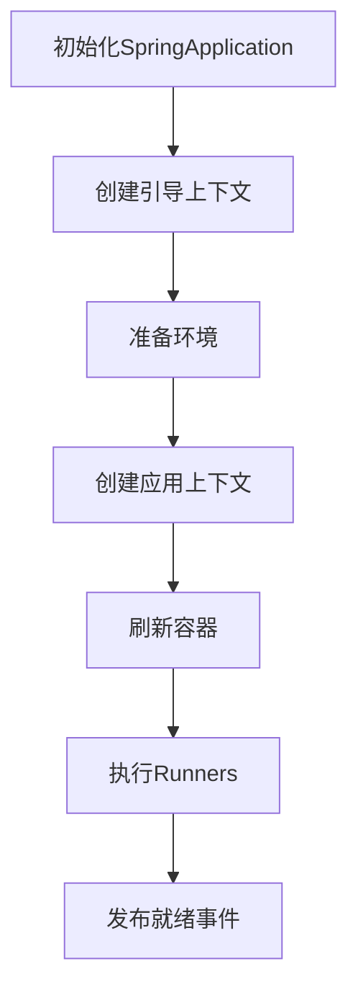

## 1. 启动流程概览 

### 1.1 核心阶段



## 2. 初始化阶段 

### 2.1 SpringApplication构造

```java
/**
 * 主构造方法：完成SpringApplication的核心初始化
 * @param resourceLoader 可选资源加载器
 * @param primarySources 主配置类(通常标注@SpringBootApplication的类)
 */
public SpringApplication(ResourceLoader resourceLoader, Class<?>... primarySources) {
    // 1. 设置资源加载器(可能为null)
    this.resourceLoader = resourceLoader;
    
    // 2. 保存主配置类(去重处理)
    this.primarySources = new LinkedHashSet<>(Arrays.asList(primarySources));
    
    // 3. 推断Web应用类型(Servlet/Reactive/None)
    this.webApplicationType = WebApplicationType.deduceFromClasspath();
    
    // 4. 加载BootstrapRegistryInitializer扩展实现(META-INF/spring.factories)
    this.bootstrapRegistryInitializers = getSpringFactoriesInstances(
        BootstrapRegistryInitializer.class);
    
    // 5. 加载ApplicationContextInitializer扩展实现
    setInitializers(getSpringFactoriesInstances(
        ApplicationContextInitializer.class));
    
    // 6. 加载ApplicationListener扩展实现
    setListeners(getSpringFactoriesInstances(
        ApplicationListener.class));
    
    // 7. 推断主应用类(通过堆栈分析)
    this.mainApplicationClass = deduceMainApplicationClass();
}
```

### 2.2 类型推断逻辑

```java
/**
 * 根据类路径推断Web应用类型
 */
static WebApplicationType deduceFromClasspath() {
    // 1. 检查是否存在WebFlux相关类
    if (ClassUtils.isPresent("org.springframework.web.reactive.DispatcherHandler", null) 
        && !ClassUtils.isPresent("org.springframework.web.servlet.DispatcherServlet", null)) {
        return WebApplicationType.REACTIVE; // 响应式应用
    }
    
    // 2. 检查是否存在Servlet相关类
    for (String className : SERVLET_INDICATOR_CLASSES) {
        if (!ClassUtils.isPresent(className, null)) {
            return WebApplicationType.NONE; // 非Web应用
        }
    }
    return WebApplicationType.SERVLET; // Servlet应用
}
```

## 3. 运行阶段

### 3.1 run方法详解

`run`方法是Spring Boot应用启动的入口，它协调整个启动流程，从初始化到最终应用运行。下面是对这个核心方法的详细解析：

```java
/**
 * 运行Spring应用，创建并刷新ApplicationContext
 * @param args 命令行参数
 * @return 应用上下文
 */
public ConfigurableApplicationContext run(String... args) {
    // 1. 启动计时器
    StopWatch stopWatch = new StopWatch();
    stopWatch.start();
    
    // 2. 创建引导上下文和应用上下文
    DefaultBootstrapContext bootstrapContext = createBootstrapContext();
    ConfigurableApplicationContext context = null;
    
    // 3. 配置Headless模式
    configureHeadlessProperty();
    
    // 4. 获取SpringApplicationRunListeners
    SpringApplicationRunListeners listeners = getRunListeners(args);
    
    // 5. 发布ApplicationStartingEvent事件
    listeners.starting(bootstrapContext, this.mainApplicationClass);
    
    try {
        // 6. 准备命令行参数
        ApplicationArguments applicationArguments = new DefaultApplicationArguments(args);
        
        // 7. 准备环境
        ConfigurableEnvironment environment = prepareEnvironment(listeners, applicationArguments);
        configureIgnoreBeanInfo(environment);
        
        // 8. 打印Banner
        Banner printedBanner = printBanner(environment);
        
        // 9. 创建应用上下文
        context = createApplicationContext();
        context.setApplicationStartup(this.applicationStartup);
        
        // 10. 准备上下文
        prepareContext(bootstrapContext, context, environment, listeners, applicationArguments, printedBanner);
        
        // 11. 刷新上下文
        refreshContext(context);
        
        // 12. 刷新后处理
        afterRefresh(context, applicationArguments);
        
        // 13. 停止计时器
        stopWatch.stop();
        
        // 14. 记录启动信息
        if (this.logStartupInfo) {
            new StartupInfoLogger(this.mainApplicationClass).logStarted(getApplicationLog(), stopWatch);
        }
        
        // 15. 发布ApplicationStartedEvent事件
        listeners.started(context);
        
        // 16. 调用ApplicationRunner和CommandLineRunner
        callRunners(context, applicationArguments);
        
        // 17. 发布ApplicationReadyEvent事件
        listeners.running(context);
        
        return context;
    }
    catch (Throwable ex) {
        // 18. 异常处理
        handleRunFailure(context, ex, listeners);
        throw new IllegalStateException(ex);
    }
}
```

#### 3.1.1 启动流程关键步骤解析

1. **启动计时器**：记录应用启动耗时，用于性能分析
2. **创建引导上下文**：创建一个临时的引导上下文，用于早期初始化
3. **配置Headless模式**：设置`java.awt.headless`属性，适用于无显示设备的服务器环境
4. **获取RunListeners**：从`spring.factories`加载`SpringApplicationRunListener`实现
5. **发布Starting事件**：通知监听器应用开始启动
6. **准备命令行参数**：将原始参数封装为`ApplicationArguments`对象
7. **准备环境**：创建并配置`Environment`，加载属性源，处理配置文件
8. **打印Banner**：在控制台显示Spring Boot的Banner
9. **创建应用上下文**：根据应用类型创建对应的`ApplicationContext`
10. **准备上下文**：设置环境，加载Bean定义，应用上下文初始化器
11. **刷新上下文**：核心步骤，初始化所有单例Bean
12. **刷新后处理**：执行自定义的刷新后逻辑
13. **记录启动信息**：记录应用启动耗时和相关信息
14. **发布Started事件**：通知监听器应用已启动
15. **调用Runners**：执行所有`ApplicationRunner`和`CommandLineRunner`
16. **发布Ready事件**：通知监听器应用已就绪，可以接收请求

#### 3.1.2 prepareContext方法解析

`prepareContext`方法负责在刷新上下文之前进行必要的准备工作：

```java
/**
 * 准备应用上下文
 */
private void prepareContext(DefaultBootstrapContext bootstrapContext, ConfigurableApplicationContext context,
        ConfigurableEnvironment environment, SpringApplicationRunListeners listeners,
        ApplicationArguments applicationArguments, Banner printedBanner) {
    
    // 1. 设置环境
    context.setEnvironment(environment);
    
    // 2. 应用上下文后处理
    postProcessApplicationContext(context);
    
    // 3. 应用初始化器
    applyInitializers(context);
    
    // 4. 发布ApplicationContextInitializedEvent事件
    listeners.contextPrepared(context);
    
    // 5. 关闭引导上下文
    bootstrapContext.close(context);
    
    // 6. 打印启动日志
    if (this.logStartupInfo) {
        logStartupInfo(context.getParent() == null);
        logStartupProfileInfo(context);
    }
    
    // 7. 注册单例Bean
    ConfigurableListableBeanFactory beanFactory = context.getBeanFactory();
    beanFactory.registerSingleton("springApplicationArguments", applicationArguments);
    if (printedBanner != null) {
        beanFactory.registerSingleton("springBootBanner", printedBanner);
    }
    
    // 8. 加载源类
    Set<Object> sources = getAllSources();
    Assert.notEmpty(sources, "Sources must not be empty");
    load(context, sources.toArray(new Object[0]));
    
    // 9. 发布ApplicationPreparedEvent事件
    listeners.contextLoaded(context);
}
```

#### 3.1.3 refreshContext方法解析

`refreshContext`方法是启动流程中最核心的步骤，它调用`AbstractApplicationContext.refresh()`方法完成容器的初始化：

```java
/**
 * 刷新应用上下文
 */
private void refreshContext(ConfigurableApplicationContext context) {
    if (this.registerShutdownHook) {
        try {
            // 注册JVM关闭钩子
            context.registerShutdownHook();
        }
        catch (AccessControlException ex) {
            // 在某些环境下可能没有权限注册关闭钩子
        }
    }
    
    // 执行刷新操作
    refresh(context);
}

/**
 * 执行上下文刷新
 */
protected void refresh(ApplicationContext applicationContext) {
    Assert.isInstanceOf(AbstractApplicationContext.class, applicationContext);
    // 调用AbstractApplicationContext的refresh方法
    ((AbstractApplicationContext) applicationContext).refresh();
}
```

#### 3.1.4 callRunners方法解析

`callRunners`方法在容器刷新完成后执行所有的`ApplicationRunner`和`CommandLineRunner`：

```java
/**
 * 调用所有注册的Runner
 */
private void callRunners(ApplicationContext context, ApplicationArguments args) {
    List<Object> runners = new ArrayList<>();
    
    // 获取所有ApplicationRunner
    runners.addAll(context.getBeansOfType(ApplicationRunner.class).values());
    
    // 获取所有CommandLineRunner
    runners.addAll(context.getBeansOfType(CommandLineRunner.class).values());
    
    // 按Order排序
    AnnotationAwareOrderComparator.sort(runners);
    
    // 依次执行
    for (Object runner : new LinkedHashSet<>(runners)) {
        if (runner instanceof ApplicationRunner) {
            callRunner((ApplicationRunner) runner, args);
        }
        if (runner instanceof CommandLineRunner) {
            callRunner((CommandLineRunner) runner, args);
        }
    }
}

private void callRunner(ApplicationRunner runner, ApplicationArguments args) {
    try {
        runner.run(args);
    }
    catch (Exception ex) {
        throw new IllegalStateException("Failed to execute ApplicationRunner", ex);
    }
}

private void callRunner(CommandLineRunner runner, String... args) {
    try {
        runner.run(args);
    }
    catch (Exception ex) {
        throw new IllegalStateException("Failed to execute CommandLineRunner", ex);
    }
}
```

## 4. 容器刷新 

`refresh()`方法是Spring容器启动的核心，采用模板方法设计模式，定义了容器刷新的标准流程。这个方法包含了12个主要步骤，每个步骤都有特定的职责，共同构成了Spring容器的完整生命周期。

### 4.1 AbstractApplicationContext.refresh()方法概览

```java
/**
 * 容器刷新核心方法(模板模式)
 */
public void refresh() throws BeansException {
    synchronized (this.startupShutdownMonitor) {
        // [1] 准备刷新：记录启动时间、初始化状态、校验环境变量等
        prepareRefresh();
        
        // [2] 获取新的BeanFactory(销毁旧的如有必要)
        ConfigurableListableBeanFactory beanFactory = obtainFreshBeanFactory();
        
        // [3] 准备标准BeanFactory(类加载器、EL解析器等)
        prepareBeanFactory(beanFactory);
        
        try {
            // [4] 后处理BeanFactory(子类可扩展)
            postProcessBeanFactory(beanFactory);
            
            // [5] 执行BeanFactoryPostProcessor
            invokeBeanFactoryPostProcessors(beanFactory);
            
            // [6] 注册BeanPostProcessor
            registerBeanPostProcessors(beanFactory);
            
            // [7] 初始化消息源(国际化)
            initMessageSource();
            
            // [8] 初始化事件广播器
            initApplicationEventMulticaster();
            
            // [9] 模板方法(子类初始化特殊Bean)
            onRefresh();
            
            // [10] 注册监听器
            registerListeners();
            
            // [11] 完成BeanFactory初始化(实例化所有非懒加载单例)
            finishBeanFactoryInitialization(beanFactory);
            
            // [12] 完成刷新(发布ContextRefreshedEvent事件)
            finishRefresh();
        } catch (BeansException ex) {
            // 销毁已创建的单例以避免资源悬挂
            destroyBeans();
            
            // 重置'active'标志
            cancelRefresh(ex);
            
            // 传播异常
            throw ex;
        } finally {
            // 重置Spring核心缓存
            resetCommonCaches();
        }
    }
}
```

在接下来的部分，我们将详细分析`refresh()`方法中的每个步骤，包括其源码实现和关键功能。

### 4.2 refresh()方法前4个步骤详解

#### 4.2.1 prepareRefresh() - 准备刷新

这是容器刷新的第一步，主要完成刷新前的准备工作：

```java
/**
 * 准备刷新上下文环境
 */
protected void prepareRefresh() {
    // 记录启动时间
    this.startupDate = System.currentTimeMillis();
    
    // 设置容器状态标志
    this.closed.set(false);
    this.active.set(true);
    
    // 初始化属性源(空实现，留给子类扩展)
    initPropertySources();
    
    // 验证必要的环境属性
    getEnvironment().validateRequiredProperties();
    
    // 存储早期应用事件
    if (this.earlyApplicationEvents == null) {
        this.earlyApplicationEvents = new LinkedHashSet<>();
    }
}
```

**关键点**：
- 记录容器启动时间戳，用于性能分析
- 设置容器状态标志（关闭=false，激活=true）
- 调用`initPropertySources()`初始化属性源，这是一个空方法，留给子类实现自定义逻辑
- 验证必要的环境属性，确保所有标记为required的属性都已设置
- 初始化早期应用事件集合，用于存储在容器刷新过程中产生但尚未发布的事件

#### 4.2.2 obtainFreshBeanFactory() - 获取BeanFactory

这一步负责创建或刷新BeanFactory，是容器的核心：

```java
/**
 * 获取新的BeanFactory实例
 */
protected ConfigurableListableBeanFactory obtainFreshBeanFactory() {
    // 刷新BeanFactory(由子类实现)
    refreshBeanFactory();
    
    // 获取BeanFactory(由子类实现)
    return getBeanFactory();
}

// 在GenericApplicationContext中的实现
@Override
protected final void refreshBeanFactory() throws IllegalStateException {
    if (!this.refreshed.compareAndSet(false, true)) {
        throw new IllegalStateException("GenericApplicationContext不允许多次刷新");
    }
    this.beanFactory.setSerializationId(getId());
}

// 在AbstractRefreshableApplicationContext中的实现
@Override
protected final void refreshBeanFactory() throws BeansException {
    // 如果已存在BeanFactory，则销毁所有Bean并关闭BeanFactory
    if (hasBeanFactory()) {
        destroyBeans();
        closeBeanFactory();
    }
    
    try {
        // 创建新的DefaultListableBeanFactory
        DefaultListableBeanFactory beanFactory = createBeanFactory();
        beanFactory.setSerializationId(getId());
        
        // 自定义BeanFactory(是否允许BeanDefinition覆盖、是否允许循环引用)
        customizeBeanFactory(beanFactory);
        
        // 加载BeanDefinition
        loadBeanDefinitions(beanFactory);
        this.beanFactory = beanFactory;
    } catch (IOException ex) {
        throw new ApplicationContextException("加载BeanDefinition时I/O错误", ex);
    }
}
```

**关键点**：
- 根据上下文类型不同有两种实现：
  - `GenericApplicationContext`：只允许刷新一次，适用于注解配置
  - `AbstractRefreshableApplicationContext`：支持多次刷新，适用于XML配置
- 在可刷新的实现中，会销毁旧的BeanFactory及其中的Bean
- 创建新的DefaultListableBeanFactory实例
- 加载Bean定义信息（XML、注解等）
- 设置序列化ID，用于序列化时的唯一标识

#### 4.2.3 prepareBeanFactory() - 准备BeanFactory

这一步为BeanFactory设置基本属性和特性：

```java
/**
 * 配置标准的BeanFactory特性
 */
protected void prepareBeanFactory(ConfigurableListableBeanFactory beanFactory) {
    // 设置类加载器
    beanFactory.setBeanClassLoader(getClassLoader());
    
    // 设置表达式解析器
    beanFactory.setBeanExpressionResolver(new StandardBeanExpressionResolver(beanFactory.getBeanClassLoader()));
    beanFactory.addPropertyEditorRegistrar(new ResourceEditorRegistrar(this, getEnvironment()));
    
    // 添加ApplicationContextAwareProcessor
    beanFactory.addBeanPostProcessor(new ApplicationContextAwareProcessor(this));
    
    // 忽略特定接口的自动装配
    beanFactory.ignoreDependencyInterface(EnvironmentAware.class);
    beanFactory.ignoreDependencyInterface(EmbeddedValueResolverAware.class);
    beanFactory.ignoreDependencyInterface(ResourceLoaderAware.class);
    beanFactory.ignoreDependencyInterface(ApplicationEventPublisherAware.class);
    beanFactory.ignoreDependencyInterface(MessageSourceAware.class);
    beanFactory.ignoreDependencyInterface(ApplicationContextAware.class);
    
    // 注册特殊依赖
    beanFactory.registerResolvableDependency(BeanFactory.class, beanFactory);
    beanFactory.registerResolvableDependency(ResourceLoader.class, this);
    beanFactory.registerResolvableDependency(ApplicationEventPublisher.class, this);
    beanFactory.registerResolvableDependency(ApplicationContext.class, this);
    
    // 注册ApplicationListener检测器
    beanFactory.addBeanPostProcessor(new ApplicationListenerDetector(this));
    
    // 添加AspectJ支持(如果存在)
    if (beanFactory.containsBean(LOAD_TIME_WEAVER_BEAN_NAME)) {
        beanFactory.addBeanPostProcessor(new LoadTimeWeaverAwareProcessor(beanFactory));
        beanFactory.setTempClassLoader(new ContextTypeMatchClassLoader(beanFactory.getBeanClassLoader()));
    }
    
    // 注册默认环境Bean
    if (!beanFactory.containsLocalBean(ENVIRONMENT_BEAN_NAME)) {
        beanFactory.registerSingleton(ENVIRONMENT_BEAN_NAME, getEnvironment());
    }
    if (!beanFactory.containsLocalBean(SYSTEM_PROPERTIES_BEAN_NAME)) {
        beanFactory.registerSingleton(SYSTEM_PROPERTIES_BEAN_NAME, getEnvironment().getSystemProperties());
    }
    if (!beanFactory.containsLocalBean(SYSTEM_ENVIRONMENT_BEAN_NAME)) {
        beanFactory.registerSingleton(SYSTEM_ENVIRONMENT_BEAN_NAME, getEnvironment().getSystemEnvironment());
    }
}
```

**关键点**：
- 设置类加载器，用于加载Bean类
- 设置表达式解析器，用于解析SpEL表达式
- 添加ApplicationContextAwareProcessor，处理Aware接口的注入
- 设置忽略自动装配的接口，这些接口通过Aware方式注入而非自动装配
- 注册可解析的依赖（BeanFactory、ResourceLoader等），用于自动装配
- 添加ApplicationListener检测器，用于检测实现了ApplicationListener接口的Bean
- 添加AspectJ支持（如果存在）
- 注册默认的环境相关Bean（environment、systemProperties、systemEnvironment）

#### 4.2.4 postProcessBeanFactory() - 后处理BeanFactory

这是一个模板方法，允许子类对BeanFactory进行自定义处理：

```java
/**
 * 允许子类对BeanFactory进行后处理
 * 默认为空实现，由子类覆盖
 */
protected void postProcessBeanFactory(ConfigurableListableBeanFactory beanFactory) {
    // 默认空实现，由子类覆盖
}

// 在GenericWebApplicationContext中的实现示例
@Override
protected void postProcessBeanFactory(ConfigurableListableBeanFactory beanFactory) {
    // 添加Web特定的作用域
    beanFactory.registerScope(WebApplicationContext.SCOPE_REQUEST, new RequestScope());
    beanFactory.registerScope(WebApplicationContext.SCOPE_SESSION, new SessionScope());
    
    // 添加Web特定的环境Bean
    beanFactory.registerResolvableDependency(ServletRequest.class, new RequestObjectFactory());
    beanFactory.registerResolvableDependency(ServletResponse.class, new ResponseObjectFactory());
    beanFactory.registerResolvableDependency(HttpSession.class, new SessionObjectFactory());
    
    // 添加Web特定的处理器
    beanFactory.addBeanPostProcessor(new ServletContextAwareProcessor(this.servletContext));
}
```

**关键点**：
- 这是一个模板方法，默认为空实现
- 子类可以覆盖此方法以添加特定的BeanFactory后处理逻辑
- 在Web应用上下文中，会注册Web特定的作用域（request、session）和依赖
- 这一步在BeanFactoryPostProcessor执行之前，可以添加自定义的BeanFactoryPostProcessor

### 4.3 refresh()方法中间4个步骤详解

#### 4.3.1 invokeBeanFactoryPostProcessors() - 执行BeanFactory后处理器

这一步执行所有已注册的BeanFactoryPostProcessor，允许修改BeanDefinition：

```java
/**
 * 实例化并调用所有已注册的BeanFactoryPostProcessor
 */
protected void invokeBeanFactoryPostProcessors(ConfigurableListableBeanFactory beanFactory) {
    // 委托给PostProcessorRegistrationDelegate处理
    PostProcessorRegistrationDelegate.invokeBeanFactoryPostProcessors(beanFactory, getBeanFactoryPostProcessors());
}

// PostProcessorRegistrationDelegate中的核心实现(简化版)
public static void invokeBeanFactoryPostProcessors(
        ConfigurableListableBeanFactory beanFactory, List<BeanFactoryPostProcessor> beanFactoryPostProcessors) {
    
    // 已处理的处理器名称
    Set<String> processedBeans = new HashSet<>();
    
    // 1. 首先处理BeanDefinitionRegistryPostProcessor
    if (beanFactory instanceof BeanDefinitionRegistry) {
        BeanDefinitionRegistry registry = (BeanDefinitionRegistry) beanFactory;
        List<BeanFactoryPostProcessor> regularPostProcessors = new ArrayList<>();
        List<BeanDefinitionRegistryPostProcessor> registryProcessors = new ArrayList<>();
        
        // 1.1 处理手动添加的BeanFactoryPostProcessor
        for (BeanFactoryPostProcessor postProcessor : beanFactoryPostProcessors) {
            if (postProcessor instanceof BeanDefinitionRegistryPostProcessor) {
                BeanDefinitionRegistryPostProcessor registryProcessor = 
                    (BeanDefinitionRegistryPostProcessor) postProcessor;
                registryProcessor.postProcessBeanDefinitionRegistry(registry);
                registryProcessors.add(registryProcessor);
            }
            else {
                regularPostProcessors.add(postProcessor);
            }
        }
        
        // 1.2 处理实现PriorityOrdered接口的BeanDefinitionRegistryPostProcessor
        List<BeanDefinitionRegistryPostProcessor> currentRegistryProcessors = new ArrayList<>();
        String[] postProcessorNames = 
            beanFactory.getBeanNamesForType(BeanDefinitionRegistryPostProcessor.class, true, false);
        for (String ppName : postProcessorNames) {
            if (beanFactory.isTypeMatch(ppName, PriorityOrdered.class)) {
                currentRegistryProcessors.add(beanFactory.getBean(ppName, BeanDefinitionRegistryPostProcessor.class));
                processedBeans.add(ppName);
            }
        }
        sortPostProcessors(currentRegistryProcessors, beanFactory);
        registryProcessors.addAll(currentRegistryProcessors);
        invokeBeanDefinitionRegistryPostProcessors(currentRegistryProcessors, registry);
        currentRegistryProcessors.clear();
        
        // 1.3 处理实现Ordered接口的BeanDefinitionRegistryPostProcessor
        // 1.4 处理其余的BeanDefinitionRegistryPostProcessor
        // ...类似的处理逻辑
        
        // 2. 接着处理常规的BeanFactoryPostProcessor
        // 2.1 调用所有已注册的BeanFactoryPostProcessor
        invokeBeanFactoryPostProcessors(regularPostProcessors, beanFactory);
        
        // 2.2 处理容器中的BeanFactoryPostProcessor Bean
        String[] postProcessorNames = 
            beanFactory.getBeanNamesForType(BeanFactoryPostProcessor.class, true, false);
        
        // 2.3 分别处理PriorityOrdered、Ordered和其他的BeanFactoryPostProcessor
        // ...类似的处理逻辑
    }
    else {
        // 如果BeanFactory不是BeanDefinitionRegistry，直接调用所有BeanFactoryPostProcessor
        invokeBeanFactoryPostProcessors(beanFactoryPostProcessors, beanFactory);
    }
}
```

**关键点**：
- 首先处理BeanDefinitionRegistryPostProcessor，它可以注册新的BeanDefinition
- 按照PriorityOrdered、Ordered和无序三种优先级分组处理
- 然后处理常规的BeanFactoryPostProcessor，同样按优先级分组
- 这一步是Spring Boot自动装配的关键环节，ConfigurationClassPostProcessor会在此阶段处理@Configuration类
- 所有的属性占位符解析也在此阶段完成（PropertySourcesPlaceholderConfigurer）

#### 4.3.2 registerBeanPostProcessors() - 注册Bean后处理器

这一步注册所有BeanPostProcessor，它们将在Bean实例化和初始化过程中被调用：

```java
/**
 * 注册BeanPostProcessor，它们将应用于后续创建的Bean
 */
protected void registerBeanPostProcessors(ConfigurableListableBeanFactory beanFactory) {
    // 委托给PostProcessorRegistrationDelegate处理
    PostProcessorRegistrationDelegate.registerBeanPostProcessors(beanFactory, this);
}

// PostProcessorRegistrationDelegate中的实现(简化版)
public static void registerBeanPostProcessors(
        ConfigurableListableBeanFactory beanFactory, AbstractApplicationContext applicationContext) {
    
    // 1. 获取所有BeanPostProcessor的Bean名称
    String[] postProcessorNames = beanFactory.getBeanNamesForType(BeanPostProcessor.class, true, false);
    
    // 2. 注册BeanPostProcessorChecker
    int beanProcessorTargetCount = beanFactory.getBeanPostProcessorCount() + 1 + postProcessorNames.length;
    beanFactory.addBeanPostProcessor(new BeanPostProcessorChecker(beanFactory, beanProcessorTargetCount));
    
    // 3. 按优先级分组处理BeanPostProcessor
    // 3.1 处理实现PriorityOrdered接口的BeanPostProcessor
    List<BeanPostProcessor> priorityOrderedPostProcessors = new ArrayList<>();
    List<String> internalPostProcessorNames = new ArrayList<>();
    for (String ppName : postProcessorNames) {
        if (beanFactory.isTypeMatch(ppName, PriorityOrdered.class)) {
            BeanPostProcessor pp = beanFactory.getBean(ppName, BeanPostProcessor.class);
            priorityOrderedPostProcessors.add(pp);
            if (pp instanceof MergedBeanDefinitionPostProcessor) {
                internalPostProcessorNames.add(ppName);
            }
        }
    }
    sortPostProcessors(priorityOrderedPostProcessors, beanFactory);
    registerBeanPostProcessors(beanFactory, priorityOrderedPostProcessors);
    
    // 3.2 处理实现Ordered接口的BeanPostProcessor
    // 3.3 处理常规的BeanPostProcessor
    // 3.4 处理内部的MergedBeanDefinitionPostProcessor
    // ...类似的处理逻辑
    
    // 4. 重新注册ApplicationListenerDetector，确保它在最后执行
    beanFactory.addBeanPostProcessor(new ApplicationListenerDetector(applicationContext));
}
```

**关键点**：
- 按照PriorityOrdered、Ordered和无序三种优先级分组注册BeanPostProcessor
- 特别处理MergedBeanDefinitionPostProcessor，它们在Bean创建过程中有特殊作用
- 添加BeanPostProcessorChecker，用于检测Bean是否错过了BeanPostProcessor的处理
- 将ApplicationListenerDetector重新注册到最后，确保它能捕获所有的ApplicationListener

#### 4.3.3 initMessageSource() - 初始化消息源

这一步初始化国际化消息源，用于支持多语言：

```java
/**
 * 初始化MessageSource，用于国际化消息解析
 */
protected void initMessageSource() {
    ConfigurableListableBeanFactory beanFactory = getBeanFactory();
    
    // 1. 检查容器中是否已有messageSource Bean
    if (beanFactory.containsLocalBean(MESSAGE_SOURCE_BEAN_NAME)) {
        this.messageSource = beanFactory.getBean(MESSAGE_SOURCE_BEAN_NAME, MessageSource.class);
        
        // 如果是HierarchicalMessageSource，设置父消息源
        if (this.parent != null && this.messageSource instanceof HierarchicalMessageSource) {
            HierarchicalMessageSource hms = (HierarchicalMessageSource) this.messageSource;
            if (hms.getParentMessageSource() == null) {
                hms.setParentMessageSource(getInternalParentMessageSource());
            }
        }
    }
    // 2. 如果没有，创建一个默认的DelegatingMessageSource
    else {
        DelegatingMessageSource dms = new DelegatingMessageSource();
        dms.setParentMessageSource(getInternalParentMessageSource());
        this.messageSource = dms;
        beanFactory.registerSingleton(MESSAGE_SOURCE_BEAN_NAME, this.messageSource);
    }
}
```

**关键点**：
- 检查容器中是否已有名为"messageSource"的Bean
- 如果有，直接使用；如果是HierarchicalMessageSource，设置父消息源
- 如果没有，创建一个默认的DelegatingMessageSource
- 这个步骤使得应用可以支持国际化消息，通过MessageSource接口获取不同语言的消息

#### 4.3.4 initApplicationEventMulticaster() - 初始化事件广播器

这一步初始化应用事件广播器，用于事件的发布和监听：

```java
/**
 * 初始化ApplicationEventMulticaster，用于事件发布
 */
protected void initApplicationEventMulticaster() {
    ConfigurableListableBeanFactory beanFactory = getBeanFactory();
    
    // 1. 检查容器中是否已有applicationEventMulticaster Bean
    if (beanFactory.containsLocalBean(APPLICATION_EVENT_MULTICASTER_BEAN_NAME)) {
        this.applicationEventMulticaster =
                beanFactory.getBean(APPLICATION_EVENT_MULTICASTER_BEAN_NAME, ApplicationEventMulticaster.class);
    }
    // 2. 如果没有，创建一个默认的SimpleApplicationEventMulticaster
    else {
        this.applicationEventMulticaster = new SimpleApplicationEventMulticaster(beanFactory);
        beanFactory.registerSingleton(APPLICATION_EVENT_MULTICASTER_BEAN_NAME, this.applicationEventMulticaster);
    }
}
```

**关键点**：
- 检查容器中是否已有名为"applicationEventMulticaster"的Bean
- 如果有，直接使用；如果没有，创建一个默认的SimpleApplicationEventMulticaster
- 事件广播器负责将应用事件分发给所有注册的监听器
- 这个步骤为Spring的事件机制提供了基础设施

### 4.4 refresh()方法最后4个步骤详解

#### 4.4.1 onRefresh() - 特殊Bean初始化

这是一个模板方法，允许子类在容器刷新时初始化特殊的Bean：

```java
/**
 * 模板方法，允许子类初始化特殊的Bean
 * 默认为空实现
 */
protected void onRefresh() throws BeansException {
    // 默认空实现，由子类覆盖
}

// 在AbstractRefreshableWebApplicationContext中的实现示例
@Override
protected void onRefresh() {
    super.onRefresh();
    // 创建ThemeSource
    this.themeSource = UiApplicationContextUtils.initThemeSource(this);
}

// 在ServletWebServerApplicationContext中的实现示例
@Override
protected void onRefresh() {
    super.onRefresh();
    try {
        // 创建并启动嵌入式Web服务器
        createWebServer();
    }
    catch (Throwable ex) {
        throw new ApplicationContextException("Web服务器启动失败", ex);
    }
}
```

**关键点**：
- 这是一个模板方法，默认为空实现
- 子类可以覆盖此方法以初始化特殊的Bean
- 在Web应用上下文中，会初始化主题源（ThemeSource）
- 在Spring Boot中，这一步会创建并启动嵌入式Web服务器（如Tomcat、Jetty等）
- 这是Spring Boot能够内嵌Web服务器的关键步骤

#### 4.4.2 registerListeners() - 注册监听器

这一步注册所有的事件监听器：

```java
/**
 * 注册监听器，将它们添加到事件广播器
 */
protected void registerListeners() {
    // 1. 注册静态指定的监听器
    for (ApplicationListener<?> listener : getApplicationListeners()) {
        getApplicationEventMulticaster().addApplicationListener(listener);
    }
    
    // 2. 注册容器中的ApplicationListener Bean
    String[] listenerBeanNames = getBeanNamesForType(ApplicationListener.class, true, false);
    for (String listenerBeanName : listenerBeanNames) {
        getApplicationEventMulticaster().addApplicationListenerBean(listenerBeanName);
    }
    
    // 3. 发布早期事件
    Set<ApplicationEvent> earlyEventsToProcess = this.earlyApplicationEvents;
    this.earlyApplicationEvents = null;
    if (earlyEventsToProcess != null) {
        for (ApplicationEvent earlyEvent : earlyEventsToProcess) {
            getApplicationEventMulticaster().multicastEvent(earlyEvent);
        }
    }
}
```

**关键点**：
- 注册所有已添加的ApplicationListener实例
- 注册容器中所有类型为ApplicationListener的Bean
- 发布之前存储的早期事件
- 这一步使得Spring的事件机制可以正常工作，监听器可以接收到事件

#### 4.4.3 finishBeanFactoryInitialization() - 初始化所有非懒加载单例

这一步完成BeanFactory的初始化，实例化所有非懒加载的单例Bean：

```java
/**
 * 完成BeanFactory的初始化，实例化所有非懒加载的单例Bean
 */
protected void finishBeanFactoryInitialization(ConfigurableListableBeanFactory beanFactory) {
    // 1. 初始化转换服务
    if (beanFactory.containsBean(CONVERSION_SERVICE_BEAN_NAME) &&
            beanFactory.isTypeMatch(CONVERSION_SERVICE_BEAN_NAME, ConversionService.class)) {
        beanFactory.setConversionService(
                beanFactory.getBean(CONVERSION_SERVICE_BEAN_NAME, ConversionService.class));
    }
    
    // 2. 注册默认的嵌入值解析器
    if (!beanFactory.hasEmbeddedValueResolver()) {
        beanFactory.addEmbeddedValueResolver(strVal -> getEnvironment().resolvePlaceholders(strVal));
    }
    
    // 3. 初始化LoadTimeWeaverAware Bean
    String[] weaverAwareNames = beanFactory.getBeanNamesForType(LoadTimeWeaverAware.class, false, false);
    for (String weaverAwareName : weaverAwareNames) {
        getBean(weaverAwareName);
    }
    
    // 4. 停止使用临时类加载器
    beanFactory.setTempClassLoader(null);
    
    // 5. 冻结配置
    beanFactory.freezeConfiguration();
    
    // 6. 实例化所有非懒加载的单例Bean
    beanFactory.preInstantiateSingletons();
}

// DefaultListableBeanFactory中的preInstantiateSingletons实现
@Override
public void preInstantiateSingletons() throws BeansException {
    // 1. 获取所有Bean定义名称
    List<String> beanNames = new ArrayList<>(this.beanDefinitionNames);
    
    // 2. 遍历所有Bean定义，初始化所有非懒加载的单例Bean
    for (String beanName : beanNames) {
        RootBeanDefinition bd = getMergedLocalBeanDefinition(beanName);
        if (!bd.isAbstract() && bd.isSingleton() && !bd.isLazyInit()) {
            // 2.1 处理FactoryBean
            if (isFactoryBean(beanName)) {
                Object bean = getBean(FACTORY_BEAN_PREFIX + beanName);
                if (bean instanceof FactoryBean) {
                    FactoryBean<?> factory = (FactoryBean<?>) bean;
                    if (factory.isSingleton()) {
                        getBean(beanName);
                    }
                }
            }
            // 2.2 处理普通Bean
            else {
                getBean(beanName);
            }
        }
    }
    
    // 3. 调用所有SmartInitializingSingleton的afterSingletonsInstantiated方法
    for (String beanName : beanNames) {
        Object singletonInstance = getSingleton(beanName);
        if (singletonInstance instanceof SmartInitializingSingleton) {
            SmartInitializingSingleton smartSingleton = (SmartInitializingSingleton) singletonInstance;
            smartSingleton.afterSingletonsInstantiated();
        }
    }
}
```

**关键点**：
- 初始化转换服务（ConversionService），用于类型转换
- 注册嵌入值解析器，用于解析占位符
- 初始化LoadTimeWeaverAware Bean，用于AspectJ加载时织入
- 冻结BeanFactory配置，不再允许修改Bean定义
- 实例化所有非懒加载的单例Bean，这是Spring容器启动过程中最耗时的步骤
- 调用所有SmartInitializingSingleton的afterSingletonsInstantiated方法
- 这一步完成后，所有非懒加载的单例Bean都已创建完成

#### 4.4.4 finishRefresh() - 完成刷新

这是容器刷新的最后一步，发布相应的事件：

```java
/**
 * 完成容器的刷新，发布相应的事件
 */
protected void finishRefresh() {
    // 1. 清除资源缓存
    clearResourceCaches();
    
    // 2. 初始化生命周期处理器
    initLifecycleProcessor();
    
    // 3. 调用生命周期处理器的onRefresh方法
    getLifecycleProcessor().onRefresh();
    
    // 4. 发布ContextRefreshedEvent事件
    publishEvent(new ContextRefreshedEvent(this));
    
    // 5. 注册MBean（如果有）
    LiveBeansView.registerApplicationContext(this);
}

// 初始化生命周期处理器
protected void initLifecycleProcessor() {
    ConfigurableListableBeanFactory beanFactory = getBeanFactory();
    
    // 检查是否已有lifecycleProcessor Bean
    if (beanFactory.containsLocalBean(LIFECYCLE_PROCESSOR_BEAN_NAME)) {
        this.lifecycleProcessor =
                beanFactory.getBean(LIFECYCLE_PROCESSOR_BEAN_NAME, LifecycleProcessor.class);
    }
    else {
        // 创建默认的DefaultLifecycleProcessor
        DefaultLifecycleProcessor defaultProcessor = new DefaultLifecycleProcessor();
        defaultProcessor.setBeanFactory(beanFactory);
        this.lifecycleProcessor = defaultProcessor;
        beanFactory.registerSingleton(LIFECYCLE_PROCESSOR_BEAN_NAME, this.lifecycleProcessor);
    }
}
```

**关键点**：
- 清除资源缓存，释放不再使用的资源
- 初始化生命周期处理器，用于管理Lifecycle Bean
- 调用生命周期处理器的onRefresh方法，启动所有实现了Lifecycle接口的Bean
- 发布ContextRefreshedEvent事件，表示容器刷新完成
- 注册MBean，用于JMX监控
- 这一步标志着Spring容器已经完全启动，可以提供服务

### 4.5 refresh()方法异常处理

```java
catch (BeansException ex) {
    // 销毁已创建的单例以避免资源悬挂
    destroyBeans();
    
    // 重置'active'标志
    cancelRefresh(ex);
    
    // 传播异常
    throw ex;
}
finally {
    // 重置Spring核心缓存
    resetCommonCaches();
}
```

**关键点**：
- 如果刷新过程中发生异常，会销毁已创建的所有单例Bean
- 重置容器的激活状态
- 重置Spring核心缓存，释放内存
- 这确保了即使在启动失败的情况下，也不会有资源泄漏

## 5. 启动后处理 

### 5.1 Runner执行机制

```java
/**
 * 执行所有ApplicationRunner和CommandLineRunner
 */
private void callRunners(ApplicationContext context, ApplicationArguments args) {
    List<Object> runners = new ArrayList<>();
    
    // 1. 获取所有ApplicationRunner类型的Bean
    runners.addAll(context.getBeansOfType(ApplicationRunner.class).values());
    
    // 2. 获取所有CommandLineRunner类型的Bean
    runners.addAll(context.getBeansOfType(CommandLineRunner.class).values());
    
    // 3. 按Order注解或Ordered接口排序
    AnnotationAwareOrderComparator.sort(runners);
    
    // 4. 遍历执行所有Runner
    for (Object runner : runners) {
        if (runner instanceof ApplicationRunner) {
            callRunner((ApplicationRunner) runner, args);
        }
        if (runner instanceof CommandLineRunner) {
            callRunner((CommandLineRunner) runner, args);
        }
    }
}

private void callRunner(ApplicationRunner runner, ApplicationArguments args) {
    try {
        runner.run(args); // 执行ApplicationRunner
    } catch (Exception ex) {
        throw new IllegalStateException("Failed to execute ApplicationRunner", ex);
    }
}
```

## 6. 最佳实践 

### 6.1 自定义初始化器示例

```java
/**
 * 自定义环境准备逻辑
 */
public class EnvPreprocessor implements 
    ApplicationContextInitializer<ConfigurableApplicationContext> {
    
    @Override
    public void initialize(ConfigurableApplicationContext context) {
        // 1. 获取环境对象
        ConfigurableEnvironment env = context.getEnvironment();
        
        // 2. 动态添加配置源
        Map<String, Object> customConfig = fetchConfigFromRemote();
        env.getPropertySources().addFirst(
            new MapPropertySource("customConfig", customConfig)
        );
        
        // 3. 根据条件激活Profile
        if (env.acceptsProfiles(Profiles.of("cloud"))) {
            env.addActiveProfile("kubernetes");
        }
    }
}
```

### 6.2 启动生命周期监听

```java
/**
 * 监听启动全过程的生命周期事件
 */
@Component
public class StartupMonitor implements ApplicationListener<SpringApplicationEvent> {
    
    @Override
    public void onApplicationEvent(SpringApplicationEvent event) {
        // 1. 应用启动事件
        if (event instanceof ApplicationStartingEvent) {
            log.info("应用开始启动...");
        }
        
        // 2. 环境准备完成事件
        else if (event instanceof ApplicationEnvironmentPreparedEvent) {
            log.info("环境准备完成，活跃Profile: {}",
                ((ConfigurableEnvironment)event.getEnvironment()).getActiveProfiles());
        }
        
        // 3. 应用就绪事件
        else if (event instanceof ApplicationReadyEvent) {
            log.info("应用启动完成，耗时: {}ms", 
                System.currentTimeMillis() - ((ApplicationReadyEvent)event).getTimestamp());
        }
    }
}
```
