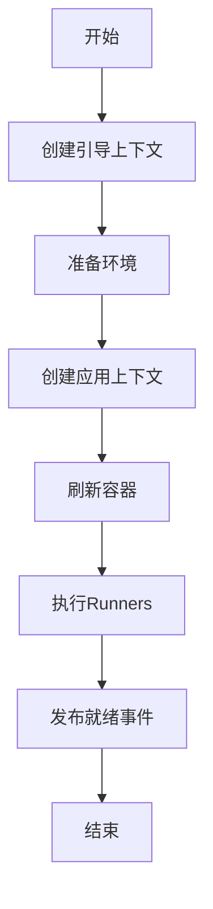

> Spring Boot 让创建独立的、生产级的基于Spring的应用变得容易，"约定优于配置"的思想贯穿始终。
  
---  

## 1. 核心启动流程（源码级）

Spring Boot 应用启动过程是一个复杂而精密的过程，主要分为初始化和运行两个阶段。

### 1.1. 初始化 SpringApplication

当我们执行 `SpringApplication.run()` 方法时，首先会创建 `SpringApplication` 实例：

```java  
public static ConfigurableApplicationContext run(Class<?> primarySource, String... args) {  
   return run(new Class[]{primarySource}, args);}  
  
public static ConfigurableApplicationContext run(Class<?>[] primarySources, String[] args) {  
   return (new SpringApplication(primarySources)).run(args);}  
```  

在构造方法中，主要完成以下初始化工作：

- **配置基本的环境变量**
- **准备必要的资源**
- **初始化构造器**
- **注册监听器**

这个初始化阶段为后续运行 `SpringApplication` 实例做好了准备。

具体的初始化过程如下：

```java  
public SpringApplication(Class<?>... primarySources) {  
   this(null, primarySources);}  
  
@SuppressWarnings({ "unchecked", "rawtypes" })  
public SpringApplication(ResourceLoader resourceLoader, Class<?>... primarySources) {  
   this.resourceLoader = resourceLoader;   Assert.notNull(primarySources, "PrimarySources must not be null");   this.primarySources = new LinkedHashSet<>(Arrays.asList(primarySources));   // 推断应用类型（SERVLET、REACTIVE 或 NONE）  
   this.webApplicationType = WebApplicationType.deduceFromClasspath();   this.bootstrapRegistryInitializers = new ArrayList<>(           getSpringFactoriesInstances(BootstrapRegistryInitializer.class));   /**    * 加载初始化器  
    * 从 spring.factories 文件中找出 Key 为 ApplicationContextInitiallizer 的类并实例化  
    * 并设置到 SpringApplication的 initiallizer 属性中  
    */   setInitializers((Collection) getSpringFactoriesInstances(ApplicationContextInitializer.class));   /**    * 加载监听器  
    * 从 spring.factories 文件中找出 Key 为 ApplicationListener 的类并实例化  
    * 监听器设置到 SpringApplication的 listeners 属性中  
    */   setListeners((Collection) getSpringFactoriesInstances(ApplicationListener.class));   // 获取启动类  
   this.mainApplicationClass = deduceMainApplicationClass();}  
```  

初始化过程中的关键步骤说明：

1. **推断应用类型**：根据类路径判断是Web应用还是普通应用
2. **加载初始化器**：用于在容器刷新前执行一些初始化工作
3. **加载监听器**：用于监听启动过程中的各种事件
4. **获取启动类**：确定主应用类，用于日志显示等

### 1.2. 执行 run 方法

`run` 方法是 Spring Boot 应用启动的核心，它完成了从初始化到最终运行的全过程：

```java  
public ConfigurableApplicationContext run(String... args) {  
   // 记录启动时间  
   long startTime = System.nanoTime();   // 创建引导上下文  
   DefaultBootstrapContext bootstrapContext = this.createBootstrapContext();   ConfigurableApplicationContext context = null;   // 配置 Headless 属性（用于无显示器环境）  
   this.configureHeadlessProperty();   // 获取 SpringApplicationRunListeners   SpringApplicationRunListeners listeners = this.getRunListeners(args);   // 发布 ApplicationStartingEvent 事件  
   listeners.starting(bootstrapContext, this.mainApplicationClass);  
   try {      // 封装命令行参数  
      ApplicationArguments applicationArguments = new DefaultApplicationArguments(args);      // 准备环境  
      ConfigurableEnvironment environment = this.prepareEnvironment(listeners, bootstrapContext, applicationArguments);      this.configureIgnoreBeanInfo(environment);      // 打印 banner      Banner printedBanner = this.printBanner(environment);      // 创建应用上下文  
      context = this.createApplicationContext();      context.setApplicationStartup(this.applicationStartup);      // 准备上下文  
      this.prepareContext(bootstrapContext, context, environment, listeners, applicationArguments, printedBanner);      // 核心：刷新容器，触发 bean 的加载、初始化  
      this.refreshContext(context);      // 刷新后的操作  
      this.afterRefresh(context, applicationArguments);  
      /**       * afterRefresh方法源码:  
       * protected void afterRefresh(ConfigurableApplicationContext context, ApplicationArguments args) {       *     // 默认为空实现，留给子类扩展  
       *     // 可以在此处添加容器刷新后的自定义逻辑  
       * }       */  
      // 计算启动耗时  
      Duration timeTakenToStartup = Duration.ofNanos(System.nanoTime() - startTime);      if (this.logStartupInfo) {         (new StartupInfoLogger(this.mainApplicationClass)).logStarted(this.getApplicationLog(), timeTakenToStartup);      }  
      // 发布 ApplicationStartedEvent 事件  
      listeners.started(context, timeTakenToStartup);      // 执行 ApplicationRunner、CommandLineRunner  
      this.callRunners(context, applicationArguments);   } catch (Throwable var12) {      this.handleRunFailure(context, var12, listeners);      throw new IllegalStateException(var12);   }  
   try {      Duration timeTakenToReady = Duration.ofNanos(System.nanoTime() - startTime);      // 发布 ApplicationReadyEvent 事件  
      listeners.ready(context, timeTakenToReady);      return context;   } catch (Throwable var11) {      this.handleRunFailure(context, var11, (SpringApplicationRunListeners)null);      throw new IllegalStateException(var11);   }}  
```  

**run方法执行流程**：



详细执行步骤说明：

1. **创建引导上下文 createBootstrapContext()**

   ```java  
   // SpringApplication.createBootstrapContext() 源码分析  
   private DefaultBootstrapContext createBootstrapContext() {  
       DefaultBootstrapContext bootstrapContext = new DefaultBootstrapContext();       this.bootstrapRegistryInitializers.forEach((initializer) -> {           initializer.initialize(bootstrapContext);       });       return bootstrapContext;   }  
   ```  
   **源码执行流程详解**：

    2. 创建DefaultBootstrapContext实例：
        - 提供引导阶段的基础设施
        - 管理早期初始化的对象

    3. 执行所有BootstrapRegistryInitializer：
        - 初始化引导注册表
        - 配置早期的系统服务
        - 准备核心系统变量

4. **准备环境 prepareEnvironment()**

   ```java  
   // SpringApplication.prepareEnvironment() 源码分析  
   private ConfigurableEnvironment prepareEnvironment(SpringApplicationRunListeners listeners,  
           DefaultBootstrapContext bootstrapContext, ApplicationArguments applicationArguments) {       // 创建并配置环境  
       ConfigurableEnvironment environment = getOrCreateEnvironment();  
       configureEnvironment(environment, applicationArguments.getSourceArgs());       ConfigurationPropertySources.attach(environment);       // 发布环境准备事件  
       listeners.environmentPrepared(bootstrapContext, environment);  
       // 绑定环境到SpringApplication  
       bindToSpringApplication(environment);       // 如果不是自定义环境，则转换为标准环境类型  
       if (!this.isCustomEnvironment) {  
           environment = new EnvironmentConverter(getClassLoader()).convertEnvironmentIfNecessary(environment,                   deduceEnvironmentClass());       }       // 附加配置属性源  
       ConfigurationPropertySources.attach(environment);  
       return environment;   }  
   ```  
   **源码执行流程详解**：

    5. `getOrCreateEnvironment()`：
        - 根据应用类型创建对应的环境对象
        - Web应用创建StandardServletEnvironment
        - 非Web应用创建StandardEnvironment

    6. `configureEnvironment()`：
        - 配置PropertySources
        - 配置Profiles
        - 添加命令行参数

    7. `ConfigurationPropertySources.attach()`：
        - 将配置属性源附加到环境

    8. `listeners.environmentPrepared()`：
        - 发布ApplicationEnvironmentPreparedEvent事件
        - 允许监听器修改环境

    9. `bindToSpringApplication()`：
        - 将环境属性绑定到SpringApplication
        - 支持spring.main.*配置项

10. **创建应用上下文 createApplicationContext()**

```java  
// SpringApplication.createApplicationContext() 源码分析  
protected ConfigurableApplicationContext createApplicationContext() {  
    Class<?> contextClass = this.applicationContextClass;       if (contextClass == null) {           try {               switch (this.webApplicationType) {               case SERVLET:                   contextClass = Class.forName(DEFAULT_SERVLET_WEB_CONTEXT_CLASS);                   break;               case REACTIVE:                   contextClass = Class.forName(DEFAULT_REACTIVE_WEB_CONTEXT_CLASS);                   break;               default:                   contextClass = Class.forName(DEFAULT_CONTEXT_CLASS);               }           }           catch (ClassNotFoundException ex) {               throw new IllegalStateException(                       "Unable create a default ApplicationContext, please specify an ApplicationContextClass", ex);           }       }       return (ConfigurableApplicationContext) BeanUtils.instantiateClass(contextClass);   }  
```  
**源码执行流程详解**：

11. 根据webApplicationType选择合适的ApplicationContext实现类：
- SERVLET类型：`AnnotationConfigServletWebServerApplicationContext`
- REACTIVE类型：`AnnotationConfigReactiveWebServerApplicationContext`
- 默认类型：`AnnotationConfigApplicationContext`

12. 使用反射实例化选定的ApplicationContext类

13. 创建的上下文随后会在prepareContext方法中进行配置：

```java  
// SpringApplication.prepareContext() 源码分析  
private void prepareContext(DefaultBootstrapContext bootstrapContext, ConfigurableApplicationContext context,  
        ConfigurableEnvironment environment, SpringApplicationRunListeners listeners,           ApplicationArguments applicationArguments, Banner printedBanner) {       // 设置环境  
    context.setEnvironment(environment);  
    // 应用上下文后处理  
    postProcessApplicationContext(context);  
    // 应用初始化器  
    applyInitializers(context);  
    // 发布上下文准备事件  
    listeners.contextPrepared(context);  
    // 注册springApplicationArguments单例  
    if (this.registerShutdownHook) {  
        try {               context.registerShutdownHook();           }           catch (AccessControlException ex) {               // 无权限注册关闭钩子时忽略  
        }  
    }       // 加载bean定义  
    load(context, sources.toArray(new Object[0]));  
    // 发布上下文加载事件  
    listeners.contextLoaded(context);  
}  
```  
**源码执行流程详解**：

14. `context.setEnvironment(environment)`：
- 将准备好的环境设置到上下文中
- 包含配置文件、属性和profiles

15. `postProcessApplicationContext(context)`：
- 设置BeanNameGenerator
- 设置ConversionService
- 设置ResourceLoader

16. `applyInitializers(context)`：
- 执行所有ApplicationContextInitializer
- 允许自定义上下文初始化

17. `listeners.contextPrepared(context)`：
- 发布ApplicationContextInitializedEvent事件
- 通知监听器上下文已准备

18. `context.registerShutdownHook()`：
- 注册JVM关闭钩子
- 确保应用优雅关闭

19. `load(context, sources)`：
- 加载主配置类
- 注册Bean定义
- 处理@Import和@ComponentScan

20. `listeners.contextLoaded(context)`：
- 发布ApplicationPreparedEvent事件
- 通知监听器Bean定义已加载

21. **刷新容器 refreshContext()**

这是Spring Boot启动过程中最核心的步骤，主要在AbstractApplicationContext.refresh()方法中实现：

```java  
// AbstractApplicationContext.refresh() 核心源码分析  
protected void refresh() throws BeansException, IllegalStateException {  
    synchronized (this.startupShutdownMonitor) {           StartupStep contextRefresh = this.applicationStartup.start("spring.context.refresh");           // 第一步：刷新前的预处理  
        prepareRefresh();  

        // 第二步：获取新的BeanFactory，加载所有bean定义  
        ConfigurableListableBeanFactory beanFactory = obtainFreshBeanFactory();  

        // 第三步：BeanFactory的预准备工作，例如设置类加载器等  
        prepareBeanFactory(beanFactory);  

        try {               // 第四步：允许子类在容器刷新前进行一些预处理  
            postProcessBeanFactory(beanFactory);  

            // 第五步：激活各种BeanFactory处理器  
            invokeBeanFactoryPostProcessors(beanFactory);  

            // 第六步：注册拦截Bean创建的Bean处理器  
            registerBeanPostProcessors(beanFactory);  

            // 第七步：初始化MessageSource组件（做国际化功能）  
            initMessageSource();  

            // 第八步：初始化事件派发器  
            initApplicationEventMulticaster();  

            // 第九步：子类重写这个方法，在容器刷新时可以自定义逻辑  
            onRefresh();  

            // 第十步：注册监听器，派发之前步骤产生的事件  
            registerListeners();  

            // 第十一步：初始化所有剩下的单实例Bean  
            finishBeanFactoryInitialization(beanFactory);  
            // 第十二步：完成刷新过程，通知生命周期处理器lifecycleProcessor完成刷新过程  
            finishRefresh();  
        }           catch (BeansException ex) {               // 销毁已经创建的单例Bean  
            destroyBeans();               // 取消刷新  
            cancelRefresh(ex);  
            throw ex;           }           finally {               contextRefresh.end();           }       }   }  
```  
**源码执行流程详解**：

22. `prepareRefresh()`：
- 记录启动时间
- 设置容器状态
- 初始化属性源配置

23. `obtainFreshBeanFactory()`：
- 创建DefaultListableBeanFactory
- 加载所有bean定义信息

24. `prepareBeanFactory()`：
- 设置类加载器
- 设置表达式解析器
- 添加属性编辑器

25. `postProcessBeanFactory()`：
- 子类处理自定义的BeanFactory配置

26. `invokeBeanFactoryPostProcessors()`：
- 调用BeanDefinitionRegistryPostProcessor
- 调用BeanFactoryPostProcessor

27. `registerBeanPostProcessors()`：
- 注册BeanPostProcessor
- 设置优先级顺序

28. `initMessageSource()`：
- 初始化国际化资源处理器

29. `initApplicationEventMulticaster()`：
- 初始化事件广播器

30. `onRefresh()`：
- Web应用会创建web服务器
- 非Web应用则为空实现

31. `registerListeners()`：
- 注册事件监听器
- 派发早期事件

11. `finishBeanFactoryInitialization()`：
- 初始化所有非延迟加载单例
- 触发依赖注入

12. `finishRefresh()`：
- 清除资源缓存
- 初始化生命周期处理器
- 发布ContextRefreshedEvent事件

5. **执行Runners callRunners()**

   ```java  
   // SpringApplication.callRunners() 源码分析  
   private void callRunners(ApplicationContext context, ApplicationArguments args) {  
       List<Object> runners = new ArrayList<>();       // 获取所有ApplicationRunner类型的bean  
       runners.addAll(context.getBeansOfType(ApplicationRunner.class).values());       // 获取所有CommandLineRunner类型的bean  
       runners.addAll(context.getBeansOfType(CommandLineRunner.class).values());       // 对runners进行排序  
       AnnotationAwareOrderComparator.sort(runners);  
       // 依次调用所有runner  
       for (Object runner : new LinkedHashSet<>(runners)) {           if (runner instanceof ApplicationRunner) {               callRunner((ApplicationRunner) runner, args);           }           if (runner instanceof CommandLineRunner) {               callRunner((CommandLineRunner) runner, args);           }       }   }  
   private void callRunner(ApplicationRunner runner, ApplicationArguments args) {       try {           (runner).run(args);       }       catch (Exception ex) {           throw new IllegalStateException("Failed to execute ApplicationRunner", ex);       }   }  
   private void callRunner(CommandLineRunner runner, ApplicationArguments args) {       try {           (runner).run(args.getSourceArgs());       }       catch (Exception ex) {           throw new IllegalStateException("Failed to execute CommandLineRunner", ex);       }   }  
   ```  
   **源码执行流程详解**：

    6. 收集所有Runner实现：
        - 获取ApplicationRunner类型的bean
        - 获取CommandLineRunner类型的bean

    7. 对Runner进行排序：
        - 使用AnnotationAwareOrderComparator进行排序
        - 支持@Order注解和Ordered接口

    8. 按顺序执行Runner：
        - 先执行ApplicationRunner
        - 再执行CommandLineRunner
        - 捕获并包装异常

   > **ApplicationRunner vs CommandLineRunner**:
   > - ApplicationRunner接收封装后的ApplicationArguments
   > - CommandLineRunner接收原始的命令行参数字符串数组
   > - 两者功能相似，但ApplicationRunner提供更多便利方法

9. **发布就绪事件 listeners.ready()**

   ```java  
   // SpringApplicationRunListeners.ready() 源码分析  
   void ready(ConfigurableApplicationContext context, Duration timeTaken) {  
       for (SpringApplicationRunListener listener : this.listeners) {           listener.ready(context, timeTaken);       }   }   // EventPublishingRunListener.ready() 实现  
   @Override  
   public void ready(ConfigurableApplicationContext context, Duration timeTaken) {       context.publishEvent(new ApplicationReadyEvent(this.application, this.args, context, timeTaken));   }  
   ```  
   **源码执行流程详解**：

    10. 遍历所有SpringApplicationRunListener：

    - 主要是EventPublishingRunListener
    - 负责事件发布

    11. 发布ApplicationReadyEvent事件：

    - 标志应用已完全启动
    - 所有Bean已初始化完成
    - 可以开始处理请求

    12. 事件处理：

    - 监听器可以处理此事件
    - 执行应用就绪后的逻辑
    - 例如启动后台任务、建立连接等

   > **ApplicationReadyEvent的重要性**：
   > - 这是应用启动过程中的最后一个事件
   > - 表示应用已完全准备好处理请求
   > - 适合执行需要完整应用上下文的初始化工作

> 注意：整个启动过程中会发布多个事件（ApplicationStartingEvent、ApplicationEnvironmentPreparedEvent等），监听器可以监听这些事件来执行自定义逻辑。