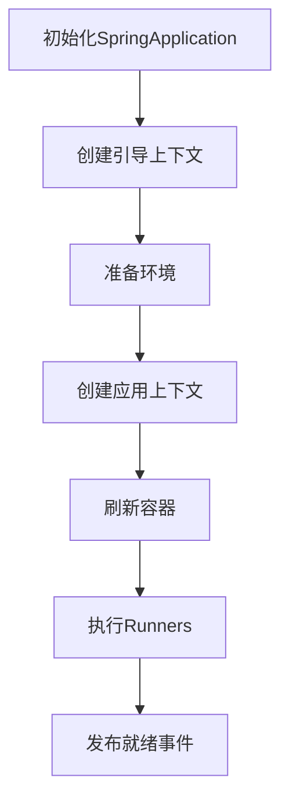

## 1. 启动流程概览 {#overview}

### 1.1 核心阶段



## 2. 初始化阶段 {#initialization}

### 2.1 SpringApplication构造

```java
/**
 * 主构造方法：完成SpringApplication的核心初始化
 * @param resourceLoader 可选资源加载器
 * @param primarySources 主配置类(通常标注@SpringBootApplication的类)
 */
public SpringApplication(ResourceLoader resourceLoader, Class<?>... primarySources) {
    // 1. 设置资源加载器(可能为null)
    this.resourceLoader = resourceLoader;
    
    // 2. 保存主配置类(去重处理)
    this.primarySources = new LinkedHashSet<>(Arrays.asList(primarySources));
    
    // 3. 推断Web应用类型(Servlet/Reactive/None)
    this.webApplicationType = WebApplicationType.deduceFromClasspath();
    
    // 4. 加载BootstrapRegistryInitializer扩展实现(META-INF/spring.factories)
    this.bootstrapRegistryInitializers = getSpringFactoriesInstances(
        BootstrapRegistryInitializer.class);
    
    // 5. 加载ApplicationContextInitializer扩展实现
    setInitializers(getSpringFactoriesInstances(
        ApplicationContextInitializer.class));
    
    // 6. 加载ApplicationListener扩展实现
    setListeners(getSpringFactoriesInstances(
        ApplicationListener.class));
    
    // 7. 推断主应用类(通过堆栈分析)
    this.mainApplicationClass = deduceMainApplicationClass();
}
```

### 2.2 类型推断逻辑

```java
/**
 * 根据类路径推断Web应用类型
 */
static WebApplicationType deduceFromClasspath() {
    // 1. 检查是否存在WebFlux相关类
    if (ClassUtils.isPresent("org.springframework.web.reactive.DispatcherHandler", null) 
        && !ClassUtils.isPresent("org.springframework.web.servlet.DispatcherServlet", null)) {
        return WebApplicationType.REACTIVE; // 响应式应用
    }
    
    // 2. 检查是否存在Servlet相关类
    for (String className : SERVLET_INDICATOR_CLASSES) {
        if (!ClassUtils.isPresent(className, null)) {
            return WebApplicationType.NONE; // 非Web应用
        }
    }
    return WebApplicationType.SERVLET; // Servlet应用
}
```

## 3. 运行阶段 

### 3.1 环境准备流程

```java
/**
 * 准备运行时环境
 */
private ConfigurableEnvironment prepareEnvironment(SpringApplicationRunListeners listeners,
        ApplicationArguments applicationArguments) {
    // 1. 根据应用类型创建环境对象
    ConfigurableEnvironment environment = getOrCreateEnvironment();
    
    // 2. 配置PropertySources(按优先级排序)
    configureEnvironment(environment, applicationArguments.getSourceArgs());
    
    // 3. 发布ApplicationEnvironmentPreparedEvent事件
    listeners.environmentPrepared(environment);
    
    // 4. 将环境绑定到SpringApplication
    bindToSpringApplication(environment);
    
    // 5. 环境后处理(Profile激活等)
    if (!this.isCustomEnvironment) {
        environment = new EnvironmentConverter(getClassLoader())
            .convertEnvironmentIfNecessary(environment, deduceEnvironmentClass());
    }
    return environment;
}
```

## 4. 容器刷新 

### 4.1 AbstractApplicationContext.refresh()

```java
/**
 * 容器刷新核心方法(模板模式)
 */
public void refresh() throws BeansException {
    synchronized (this.startupShutdownMonitor) {
        // [1] 准备刷新：记录启动时间、初始化状态、校验环境变量等
        prepareRefresh();
        
        // [2] 获取新的BeanFactory(销毁旧的如有必要)
        ConfigurableListableBeanFactory beanFactory = obtainFreshBeanFactory();
        
        // [3] 准备标准BeanFactory(类加载器、EL解析器等)
        prepareBeanFactory(beanFactory);
        
        try {
            // [4] 后处理BeanFactory(子类可扩展)
            postProcessBeanFactory(beanFactory);
            
            // [5] 执行BeanFactoryPostProcessor
            invokeBeanFactoryPostProcessors(beanFactory);
            
            // [6] 注册BeanPostProcessor
            registerBeanPostProcessors(beanFactory);
            
            // [7] 初始化消息源(国际化)
            initMessageSource();
            
            // [8] 初始化事件广播器
            initApplicationEventMulticaster();
            
            // [9] 模板方法(子类初始化特殊Bean)
            onRefresh();
            
            // [10] 注册监听器
            registerListeners();
            
            // [11] 完成BeanFactory初始化(实例化所有非懒加载单例)
            finishBeanFactoryInitialization(beanFactory);
            
            // [12] 完成刷新(发布ContextRefreshedEvent事件)
            finishRefresh();
        } catch (...) {
            // 异常处理...
        }
    }
}
```

## 5. 启动后处理 

### 5.1 Runner执行机制

```java
/**
 * 执行所有ApplicationRunner和CommandLineRunner
 */
private void callRunners(ApplicationContext context, ApplicationArguments args) {
    List<Object> runners = new ArrayList<>();
    
    // 1. 获取所有ApplicationRunner类型的Bean
    runners.addAll(context.getBeansOfType(ApplicationRunner.class).values());
    
    // 2. 获取所有CommandLineRunner类型的Bean
    runners.addAll(context.getBeansOfType(CommandLineRunner.class).values());
    
    // 3. 按Order注解或Ordered接口排序
    AnnotationAwareOrderComparator.sort(runners);
    
    // 4. 遍历执行所有Runner
    for (Object runner : runners) {
        if (runner instanceof ApplicationRunner) {
            callRunner((ApplicationRunner) runner, args);
        }
        if (runner instanceof CommandLineRunner) {
            callRunner((CommandLineRunner) runner, args);
        }
    }
}

private void callRunner(ApplicationRunner runner, ApplicationArguments args) {
    try {
        runner.run(args); // 执行ApplicationRunner
    } catch (Exception ex) {
        throw new IllegalStateException("Failed to execute ApplicationRunner", ex);
    }
}
```

## 6. 最佳实践 

### 6.1 自定义初始化器示例

```java
/**
 * 自定义环境准备逻辑
 */
public class EnvPreprocessor implements 
    ApplicationContextInitializer<ConfigurableApplicationContext> {
    
    @Override
    public void initialize(ConfigurableApplicationContext context) {
        // 1. 获取环境对象
        ConfigurableEnvironment env = context.getEnvironment();
        
        // 2. 动态添加配置源
        Map<String, Object> customConfig = fetchConfigFromRemote();
        env.getPropertySources().addFirst(
            new MapPropertySource("customConfig", customConfig)
        );
        
        // 3. 根据条件激活Profile
        if (env.acceptsProfiles(Profiles.of("cloud"))) {
            env.addActiveProfile("kubernetes");
        }
    }
}
```

### 6.2 启动生命周期监听

```java
/**
 * 监听启动全过程的生命周期事件
 */
@Component
public class StartupMonitor implements ApplicationListener<SpringApplicationEvent> {
    
    @Override
    public void onApplicationEvent(SpringApplicationEvent event) {
        // 1. 应用启动事件
        if (event instanceof ApplicationStartingEvent) {
            log.info("应用开始启动...");
        }
        
        // 2. 环境准备完成事件
        else if (event instanceof ApplicationEnvironmentPreparedEvent) {
            log.info("环境准备完成，活跃Profile: {}",
                ((ConfigurableEnvironment)event.getEnvironment()).getActiveProfiles());
        }
        
        // 3. 应用就绪事件
        else if (event instanceof ApplicationReadyEvent) {
            log.info("应用启动完成，耗时: {}ms", 
                System.currentTimeMillis() - ((ApplicationReadyEvent)event).getTimestamp());
        }
    }
}
```
