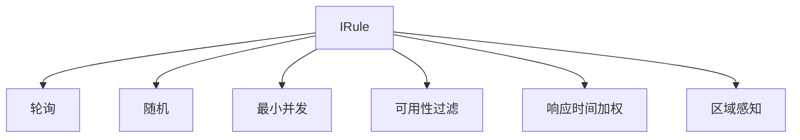
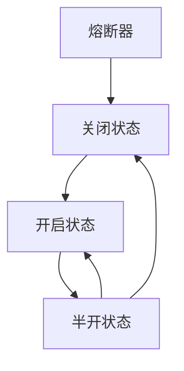
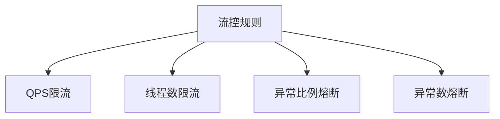
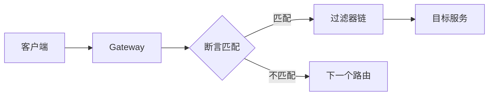
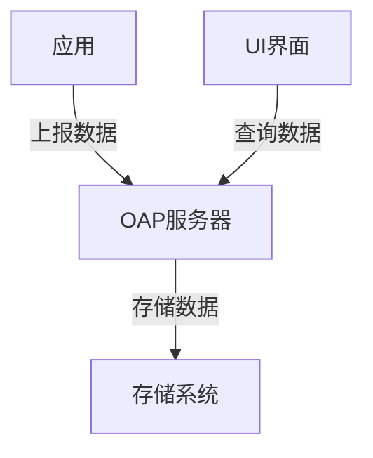
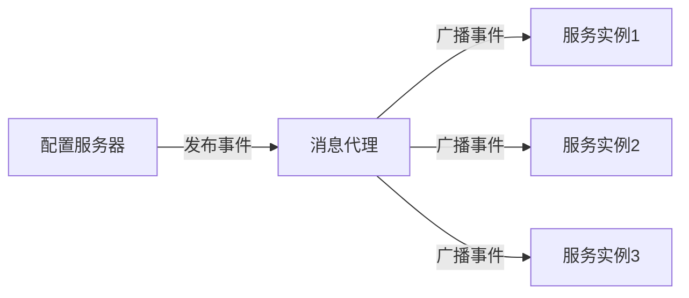

# Spring Cloud 核心组件详解


## 1. 配置中心对比

### 1.1 Nacos vs Apollo vs Eureka

| 特性 | Nacos | Apollo | Eureka |
|------|-------|---------|---------|
| 一致性协议 | CP+AP | CP | AP |
| 健康检查 | TCP/HTTP/MYSQL/Client Beat | Client Beat | Client Beat |
| 负载均衡 | 权重/metadata/Selector | 无 | Region/Zone |
| 雪崩保护 | 有 | 无 | 有 |
| 自动注销实例 | 支持 | 支持 | 支持 |
| 访问协议 | HTTP/DNS/UDP | HTTP | HTTP |
| 监听支持 | 支持 | 支持 | 支持 |
| 多数据中心 | 支持 | 支持 | 支持 |
| 跨注册中心 | 支持 | 不支持 | 支持 |
| 界面 | 支持 | 支持 | 支持 |

### 1.2 Nacos特性详解

#### 1.2.1 命名空间作用

1. **环境隔离**：开发、测试、生产环境配置隔离
2. **租户隔离**：不同团队/项目的配置隔离
3. **版本管理**：支持配置的版本控制和回滚
4. **权限控制**：可以针对命名空间进行细粒度的权限控制

```yaml
spring:
  cloud:
    nacos:
      config:
        server-addr: localhost:8848
        namespace: dev   # 开发环境命名空间
        group: APP_GROUP
        file-extension: yaml
```

#### 1.2.2 AP/CP模式切换

Nacos支持AP和CP两种一致性模式的动态切换：

- **AP模式（默认）**：保证高可用，牺牲一致性，适用于服务发现场景
- **CP模式**：保证强一致性，牺牲部分可用性，适用于配置管理场景

```bash
# 切换为CP模式
curl -X PUT 'http://localhost:8848/nacos/v1/ns/operator/switches?entry=serverMode&value=CP'
```

### 1.3 技术选型建议

1. **Nacos适用场景**：
   - 需要配置中心和服务发现的统一方案
   - 对一致性要求不是特别高
   - 需要动态服务发现和配置管理
   - **优点**：统一的服务发现和配置管理，支持AP/CP切换
   - **缺点**：相对较新，社区不如Eureka成熟

2. **Apollo适用场景**：
   - 配置管理要求较高
   - 需要完善的配置修改审核流程
   - 配置修改需要灰度发布
   - **优点**：配置管理功能强大，支持灰度发布
   - **缺点**：主要专注于配置中心，需要与其他组件配合使用

3. **Eureka适用场景**：
   - 主要用于服务注册发现
   - AP架构，强调可用性
   - 适合AWS环境
   - **优点**：成熟稳定，自我保护机制完善
   - **缺点**：已停止更新，功能相对简单

## 2. 服务调用方式

### 2.1 Feign调用

Feign是一个声明式的Web服务客户端，使编写Web服务客户端变得更加简单。

#### 2.1.1 基本使用

```java
// 定义Feign客户端接口
@FeignClient(name = "user-service", fallback = UserServiceFallback.class)
public interface UserClient {
    
    @GetMapping("/users/{id}")
    User getUserById(@PathVariable("id") Long id);
    
    @PostMapping("/users")
    User createUser(@RequestBody User user);
}

// 实现降级处理
@Component
public class UserServiceFallback implements UserClient {
    
    @Override
    public User getUserById(Long id) {
        return new User(); // 返回默认用户
    }
    
    @Override
    public User createUser(User user) {
        return null; // 创建失败
    }
}
```

#### 2.1.2 配置详解

```yaml
feign:
  client:
    config:
      default:  # 默认配置
        connectTimeout: 5000
        readTimeout: 5000
        loggerLevel: full
      user-service:  # 针对特定服务的配置
        connectTimeout: 1000
        readTimeout: 1000
        loggerLevel: basic
  hystrix:
    enabled: true  # 启用Hystrix支持
  compression:
    request:
      enabled: true
      min-request-size: 2048
    response:
      enabled: true
```

#### 2.1.3 重试机制

Feign内置了重试机制，可以通过配置Retryer来实现：

```java
@Configuration
public class FeignConfig {
    
    @Bean
    public Retryer feignRetryer() {
        // 重试间隔为100ms，最大重试时间为1s，重试3次
        return new Retryer.Default(100, TimeUnit.SECONDS.toMillis(1), 3);
    }
}
```

### 2.2 RestTemplate调用

RestTemplate是Spring提供的用于访问REST服务的客户端，提供了多种便捷访问远程HTTP服务的方法。

#### 2.2.1 基本使用

```java
@Configuration
public class RestTemplateConfig {
    
    @Bean
    @LoadBalanced  // 启用负载均衡
    public RestTemplate restTemplate() {
        return new RestTemplate();
    }
}

@Service
public class UserService {
    
    @Autowired
    private RestTemplate restTemplate;
    
    public User getUserById(Long id) {
        return restTemplate.getForObject(
            "http://user-service/users/{id}",
            User.class,
            id
        );
    }
    
    public User createUser(User user) {
        return restTemplate.postForObject(
            "http://user-service/users",
            user,
            User.class
        );
    }
}
```

#### 2.2.2 重试配置

RestTemplate本身不提供重试机制，但可以通过配置底层的HTTP客户端来实现：

```java
@Configuration
public class RestTemplateConfig {
    
    @Bean
    @LoadBalanced
    public RestTemplate restTemplate() {
        RestTemplate template = new RestTemplate();
        
        // 配置重试策略
        HttpComponentsClientHttpRequestFactory factory = 
            new HttpComponentsClientHttpRequestFactory();
        factory.setConnectTimeout(1000);
        factory.setReadTimeout(1000);
        
        CloseableHttpClient httpClient = HttpClientBuilder.create()
            .setRetryHandler(new DefaultHttpRequestRetryHandler(3, true))
            .build();
        factory.setHttpClient(httpClient);
        
        template.setRequestFactory(factory);
        return template;
    }
}
```

### 2.3 Feign vs RestTemplate

| 特性 | Feign | RestTemplate |
|------|-------|--------------|
| 声明式API | 支持 | 不支持 |
| 可读性 | 高 | 中 |
| 灵活性 | 中 | 高 |
| 学习曲线 | 陡 | 平缓 |
| 集成难度 | 低 | 中 |
| 功能特性 | 丰富 | 基础 |
| 性能 | 略低 | 较高 |
| 重试机制 | 内置 | 需配置 |
| 负载均衡 | 内置 | 需@LoadBalanced |
| 熔断降级 | 内置 | 需手动实现 |

## 3. 负载均衡

### 3.1 Ribbon

Ribbon是Netflix开发的客户端负载均衡器，提供了多种负载均衡策略。

#### 3.1.1 核心组件



#### 3.1.2 配置示例

```yaml
user-service:  # 服务名称
  ribbon:
    NFLoadBalancerRuleClassName: com.netflix.loadbalancer.RandomRule  # 负载均衡策略
    NFLoadBalancerPingClassName: com.netflix.loadbalancer.PingUrl     # 心跳检测策略
    ConnectTimeout: 1000
    ReadTimeout: 3000
    MaxAutoRetries: 1           # 同一实例最大重试次数
    MaxAutoRetriesNextServer: 1 # 切换实例的重试次数
```

#### 3.1.3 自定义规则

```java
public class CustomRule extends AbstractLoadBalancerRule {
    
    @Override
    public Server choose(Object key) {
        List<Server> servers = getLoadBalancer().getAllServers();
        if (servers.isEmpty()) {
            return null;
        }
        
        // 实现自定义选择逻辑
        int index = ThreadLocalRandom.current().nextInt(servers.size());
        return servers.get(index);
    }
    
    @Override
    public void initWithNiwsConfig(IClientConfig clientConfig) {
        // 初始化配置
    }
}
```

### 3.2 Spring Cloud LoadBalancer

Spring Cloud LoadBalancer是Spring官方提供的负载均衡器，旨在替代Ribbon。

#### 3.2.1 基本配置

```yaml
spring:
  cloud:
    loadbalancer:
      ribbon:
        enabled: false  # 禁用Ribbon
      retry:
        enabled: true  # 启用重试
```

#### 3.2.2 自定义负载均衡策略

```java
@Configuration
public class LoadBalancerConfig {
    
    @Bean
    ReactorLoadBalancer<ServiceInstance> randomLoadBalancer(Environment environment,
            LoadBalancerClientFactory loadBalancerClientFactory) {
        String name = environment.getProperty(LoadBalancerClientFactory.PROPERTY_NAME);
        return new RandomLoadBalancer(loadBalancerClientFactory
                .getLazyProvider(name, ServiceInstanceListSupplier.class),
                name);
    }
}

// 使用配置
@LoadBalancerClient(name = "user-service", configuration = LoadBalancerConfig.class)
public class UserServiceConfig {
}
```

#### 3.2.3 Ribbon vs LoadBalancer

| 特性 | Ribbon | Spring Cloud LoadBalancer |
|------|--------|---------------------------|
| 维护状态 | 停止维护 | 活跃维护 |
| 响应式支持 | 不支持 | 支持 |
| 缓存支持 | 有限 | 完全支持 |
| 自定义策略 | 复杂 | 简单 |
| 生态集成 | Netflix套件 | Spring生态 |
| 成熟度 | 高 | 中等 |

## 4. 熔断限流组件

### 4.1 Hystrix

Netflix开发的熔断器组件（已停止维护）。

#### 4.1.1 核心概念



#### 4.1.2 配置示例

```yaml
hystrix:
  command:
    default:
      execution:
        isolation:
          thread:
            timeoutInMilliseconds: 1000
      circuitBreaker:
        requestVolumeThreshold: 20
        errorThresholdPercentage: 50
        sleepWindowInMilliseconds: 5000
```

### 4.2 Sentinel

阿里巴巴开发的流量控制组件。

#### 4.2.1 流控规则



#### 4.2.2 源码分析

```java
// Sentinel核心限流逻辑
public class DefaultController implements TrafficShapingController {
    
    private final double count;
    private final MetricTimerListener metric;
    
    @Override
    public boolean canPass(Node node, int acquireCount) {
        return canPass(node, acquireCount, false);
    }
    
    @Override
    public boolean canPass(Node node, int acquireCount, boolean prioritized) {
        // 获取当前QPS
        double currentQps = metric.getWindowIntervalInSec() != null ?
                metric.getQps(TimeUtil.currentTimeMillis()) : node.passQps();
        
        // 判断是否超过阈值
        if (currentQps + acquireCount <= count) {
            return true;
        }
        
        // 特权请求直接通过
        if (prioritized && currentQps < count) {
            return true;
        }
        
        return false;
    }
}
```

#### 4.2.3 使用示例

```java
// 资源定义
@SentinelResource(value = "getUserById", 
                 blockHandler = "handleBlock", 
                 fallback = "handleFallback")
public User getUserById(Long id) {
    return userRepository.findById(id)
            .orElseThrow(() -> new UserNotFoundException(id));
}

// 限流处理
public User handleBlock(Long id, BlockException ex) {
    log.warn("Request blocked: {}", ex.getMessage());
    return new User(); // 返回默认用户
}

// 降级处理
public User handleFallback(Long id, Throwable t) {
    log.error("Service degraded: {}", t.getMessage());
    return new User(); // 返回默认用户
}
```

#### 4.2.4 配置示例

```yaml
spring:
  cloud:
    sentinel:
      transport:
        dashboard: localhost:8080
      datasource:
        ds:
          nacos:
            server-addr: localhost:8848
            dataId: sentinel-rules
            groupId: DEFAULT_GROUP
            rule-type: flow
```

### 4.3 Resilience4j

一个轻量级的容错库，是Hystrix的替代品。

#### 4.3.1 核心功能

- **断路器**：防止调用不可用服务
- **限流器**：限制并发请求数
- **隔板模式**：限制并发执行数
- **重试机制**：自动重试失败调用
- **超时处理**：中断长时间运行的调用
- **缓存**：缓存调用结果

#### 4.3.2 源码分析

```java
// Resilience4j断路器核心实现
public class CircuitBreakerStateMachine implements CircuitBreaker {
    
    private final String name;
    private final AtomicReference<CircuitBreakerState> stateReference;
    private final CircuitBreakerConfig config;
    private final CircuitBreakerEventProcessor eventProcessor;
    
    @Override
    public boolean tryAcquirePermission() {
        boolean permission = stateReference.get().tryAcquirePermission();
        if (!permission) {
            publishCallNotPermittedEvent();
        }
        return permission;
    }
    
    @Override
    public void releasePermission() {
        stateReference.get().releasePermission();
    }
    
    @Override
    public void onError(long durationInNanos, Throwable throwable) {
        // 记录失败并可能触发状态转换
        if (throwable != null) {
            stateReference.get().onError(durationInNanos, throwable);
        }
    }
    
    @Override
    public void onSuccess(long durationInNanos) {
        // 记录成功并可能触发状态转换
        stateReference.get().onSuccess(durationInNanos);
    }
    
    @Override
    public void reset() {
        // 重置断路器状态
        stateReference.get().reset();
    }
}
```

#### 4.3.3 使用示例

```java
@Service
public class UserService {
    
    private final CircuitBreaker circuitBreaker;
    private final RateLimiter rateLimiter;
    private final UserRepository userRepository;
    
    public UserService(CircuitBreakerRegistry circuitBreakerRegistry,
                      RateLimiterRegistry rateLimiterRegistry,
                      UserRepository userRepository) {
        this.circuitBreaker = circuitBreakerRegistry.circuitBreaker("userService");
        this.rateLimiter = rateLimiterRegistry.rateLimiter("userService");
        this.userRepository = userRepository;
    }
    
    public User getUserById(Long id) {
        return CircuitBreaker.decorateSupplier(circuitBreaker,
                () -> RateLimiter.decorateSupplier(rateLimiter,
                        () -> userRepository.findById(id).orElseThrow(() -> new UserNotFoundException(id))
                ).get()
        ).get();
    }
}
```

### 4.4 熔断限流组件对比

| 特性 | Hystrix | Sentinel | Resilience4j |
|------|---------|----------|--------------|
| 维护状态 | 停止维护 | 活跃维护 | 活跃维护 |
| 响应式支持 | 有限 | 支持 | 完全支持 |
| 功能丰富度 | 中等 | 丰富 | 丰富 |
| 监控集成 | 需配置 | 内置 | 需配置 |
| 规则配置 | 代码/配置 | 动态配置 | 代码/配置 |
| 资源消耗 | 较高 | 低 | 低 |
| 学习曲线 | 中等 | 中等 | 较陡 |
| 社区活跃度 | 低 | 高 | 高 |
| 生态整合 | Netflix | Alibaba | Spring |
| 动态规则 | 不支持 | 支持 | 部分支持 |

### 4.5 选型建议

1. **新项目推荐**：
   - Spring Cloud生态：选择Resilience4j
   - Alibaba生态：选择Sentinel

2. **迁移项目**：
   - 从Hystrix迁移：优先考虑Resilience4j
   - 需要动态配置：选择Sentinel

3. **特殊场景**：
   - 响应式编程：选择Resilience4j
   - 规则动态调整：选择Sentinel
   - 简单场景：选择Spring Cloud Circuit Breaker


## 5. Gateway

Spring Cloud Gateway是基于Spring WebFlux的API网关，提供了路由、过滤、限流等功能。

### 5.1 核心概念

- **路由(Route)**：由ID、目标URI、断言集合和过滤器集合组成
- **断言(Predicate)**：匹配HTTP请求的条件
- **过滤器(Filter)**：修改请求和响应的工厂



### 5.2 配置示例

```yaml
spring:
  cloud:
    gateway:
      routes:
        - id: user-service
          uri: lb://user-service
          predicates:
            - Path=/users/**
          filters:
            - StripPrefix=1
            - name: RequestRateLimiter
              args:
                redis-rate-limiter.replenishRate: 10
                redis-rate-limiter.burstCapacity: 20
        
        - id: order-service
          uri: lb://order-service
          predicates:
            - Path=/orders/**
            - Method=GET,POST
          filters:
            - StripPrefix=1
            - AddRequestHeader=X-Request-Source, gateway
```

### 5.3 自定义过滤器

```java
@Component
public class LoggingGatewayFilterFactory extends AbstractGatewayFilterFactory<LoggingGatewayFilterFactory.Config> {
    
    private static final Logger log = LoggerFactory.getLogger(LoggingGatewayFilterFactory.class);
    
    public LoggingGatewayFilterFactory() {
        super(Config.class);
    }
    
    @Override
    public GatewayFilter apply(Config config) {
        return (exchange, chain) -> {
            // 前置处理
            if (config.isPreLogger()) {
                log.info("Pre Gateway Filter: {}", exchange.getRequest().getPath());
            }
            
            return chain.filter(exchange)
                    .then(Mono.fromRunnable(() -> {
                        // 后置处理
                        if (config.isPostLogger()) {
                            log.info("Post Gateway Filter: {}", exchange.getResponse().getStatusCode());
                        }
                    }));
        };
    }
    
    public static class Config {
        private boolean preLogger;
        private boolean postLogger;
        
        // getters and setters
        public boolean isPreLogger() {
            return preLogger;
        }
        
        public void setPreLogger(boolean preLogger) {
            this.preLogger = preLogger;
        }
        
        public boolean isPostLogger() {
            return postLogger;
        }
        
        public void setPostLogger(boolean postLogger) {
            this.postLogger = postLogger;
        }
    }
}
```

### 5.4 Gateway vs Zuul

| 特性 | Spring Cloud Gateway | Netflix Zuul |
|------|---------------------|--------------|
| 基础框架 | Spring WebFlux (异步非阻塞) | Servlet (同步阻塞) |
| 性能 | 高 | 中 |
| 长连接 | 支持 | 不支持 |
| 限流 | 内置 | 需扩展 |
| 动态路由 | 支持 | 有限支持 |
| 维护状态 | 活跃 | Zuul 1.x停止维护 |
| 响应式 | 支持 | 不支持 |
| 易用性 | 中等 | 简单 |

## 6. SkyWalking

SkyWalking是一个开源的APM（应用性能监控）系统，特别为微服务、云原生和容器化架构设计。

### 6.1 核心功能

- **分布式追踪**：跟踪请求在分布式系统中的流转
- **性能指标分析**：收集和分析应用、实例、服务和端点的性能指标
- **服务拓扑**：自动发现服务依赖关系
- **告警**：基于性能指标的告警机制

### 6.2 架构组件



- **探针(Agent)**：收集追踪数据和指标
- **OAP(Observability Analysis Platform)**：分析和处理数据
- **存储**：持久化数据（支持ElasticSearch、MySQL等）
- **UI**：可视化展示

### 6.3 集成方式

#### 6.3.1 Java应用集成

```bash
# 添加JVM参数
java -javaagent:/path/to/skywalking-agent.jar -Dskywalking.agent.service_name=your-service-name -jar your-application.jar
```

#### 6.3.2 Spring Boot集成

```yaml
# application.yml
spring:
  application:
    name: user-service
  sleuth:
    sampler:
      probability: 1.0
```

### 6.4 告警配置

```yaml
# alarm-settings.yml
rules:
  # 服务响应时间超过1000ms
  - name: service_resp_time_rule
    metrics-name: service_resp_time
    op: ">"
    threshold: 1000
    period: 10
    count: 3
    silence-period: 5
    message: 服务响应时间过长
```

### 6.5 SkyWalking vs Zipkin

| 特性 | SkyWalking | Zipkin |
|------|------------|--------|
| 追踪方式 | 自动/手动 | 主要手动 |
| UI功能 | 丰富 | 基础 |
| 存储选项 | 多种 | 有限 |
| 指标分析 | 强大 | 基础 |
| 告警功能 | 内置 | 无 |
| 服务拓扑 | 支持 | 有限 |
| 无侵入性 | 高 | 中 |
| 社区活跃度 | 高 | 中 |

## 7. Spring Cloud Bus

Spring Cloud Bus使用轻量级消息代理连接分布式系统的节点，可用于广播配置变更或其他管理指令。

### 7.1 工作原理



### 7.2 配置示例

```yaml
spring:
  cloud:
    bus:
      enabled: true
      refresh:
        enabled: true
      trace:
        enabled: true
  rabbitmq:  # 使用RabbitMQ作为消息代理
    host: localhost
    port: 5672
    username: guest
    password: guest
```

### 7.3 自定义事件

```java
// 自定义事件
public class CustomRemoteApplicationEvent extends RemoteApplicationEvent {
    
    private String message;
    
    public CustomRemoteApplicationEvent(Object source, String originService, 
                                      String destinationService, String message) {
        super(source, originService, destinationService);
        this.message = message;
    }
    
    public String getMessage() {
        return message;
    }
}

// 事件监听器
@Component
public class CustomEventListener implements ApplicationListener<CustomRemoteApplicationEvent> {
    
    private static final Logger log = LoggerFactory.getLogger(CustomEventListener.class);
    
    @Override
    public void onApplicationEvent(CustomRemoteApplicationEvent event) {
        log.info("Received custom event: {}", event.getMessage());
        // 处理自定义事件
    }
}

// 发布事件
@RestController
public class EventController {
    
    @Autowired
    private ApplicationEventPublisher publisher;
    
    @PostMapping("/publish")
    public void publishEvent(@RequestBody String message) {
        publisher.publishEvent(new CustomRemoteApplicationEvent(
            this,
            "source-service:8080",
            null, // null表示广播到所有服务
            message
        ));
    }
}
```

### 7.4 使用场景

1. **配置刷新**：当配置中心的配置发生变化时，通过Bus广播到所有服务实例
2. **状态变更**：广播系统状态变更
3. **缓存失效**：通知所有实例清除缓存
4. **集群管理**：发送集群管理命令

### 7.5 消息总线对比

| 特性 | Spring Cloud Bus | Kafka | RocketMQ |
|------|-----------------|-------|----------|
| 集成难度 | 低 | 中 | 中 |
| 性能 | 中 | 高 | 高 |
| 可靠性 | 中 | 高 | 高 |
| 功能 | 基础 | 丰富 | 丰富 |
| 适用场景 | 配置刷新 | 大数据处理 | 高可靠消息 |
| 社区支持 | Spring生态 | 广泛 | 阿里生态 |

## 8. 最佳实践与总结

### 8.1 微服务架构设计原则

1. **单一职责**：
   - 每个服务专注于单一业务功能
   - 避免服务之间的紧耦合
   - 保持服务边界清晰

2. **服务自治**：
   - 服务可以独立部署和扩展
   - 服务间通过标准接口通信
   - 避免共享数据库

3. **数据管理**：
   - 每个服务维护自己的数据
   - 使用事件驱动实现数据一致性
   - 采用CQRS模式分离读写操作

### 8.2 技术选型建议

1. **配置中心选择**：
   - 新项目推荐：Nacos（配置管理+服务发现的统一方案）
   - 配置管理要求高：Apollo
   - AWS环境：Eureka

2. **服务调用方式**：
   - 推荐使用OpenFeign（声明式、可读性高）
   - 特殊场景可选RestTemplate（灵活性高）

3. **熔断限流组件**：
   - 推荐使用Sentinel（轻量级、动态配置）
   - 响应式编程推荐Resilience4j

4. **网关选择**：
   - Spring Cloud Gateway（响应式、性能好）
   - 特殊需求可选Zuul

### 8.3 性能优化建议

1. **服务优化**：
   - 使用连接池管理资源
   - 合理配置线程池
   - 启用压缩减少传输量
   - 使用缓存提高响应速度

2. **网关优化**：
   - 启用响应式编程
   - 合理配置路由规则
   - 使用缓存减少转发延迟
   - 配置熔断保护下游服务

3. **监控优化**：
   - 使用SkyWalking进行全链路追踪
   - 设置合理的采样率
   - 配置有效的告警规则
   - 定期分析性能瓶颈

### 8.4 开发运维建议

1. **CI/CD实践**：
   - 使用Docker容器化部署
   - 实现自动化测试
   - 配置灰度发布
   - 建立监控告警机制

2. **文档管理**：
   - 维护API文档
   - 记录配置变更
   - 建立故障处理手册
   - 更新技术文档

3. **安全实践**：
   - 实现服务认证授权
   - 配置网关安全策略
   - 加密敏感数据
   - 定期安全审计

### 8.5 常见问题解决方案

1. **服务注册与发现**：
   - 配置心跳检测机制
   - 实现服务优雅下线
   - 处理服务注册延迟

2. **配置管理**：
   - 实现配置热更新
   - 配置加密存储
   - 管理配置版本

3. **服务容错**：
   - 配置熔断策略
   - 实现服务降级
   - 处理超时重试

4. **分布式事务**：
   - 使用Seata处理分布式事务
   - 实现补偿机制
   - 保证数据一致性

## 9. 参考资源

### 9.1 官方文档
- Spring Cloud: https://spring.io/projects/spring-cloud
- Nacos: https://nacos.io/zh-cn/docs/
- Sentinel: https://github.com/alibaba/Sentinel/wiki
- SkyWalking: https://skywalking.apache.org/docs/

### 9.2 推荐书籍
- 《Spring Cloud微服务实战》
- 《Spring Cloud Alibaba微服务原理与实战》
- 《微服务架构设计模式》

### 9.3 社区资源
- Spring Cloud中文社区：http://springcloud.cn/
- Nacos社区：https://nacos.io/zh-cn/community/
- Sentinel社区：https://github.com/alibaba/Sentinel/wiki/社区

---
