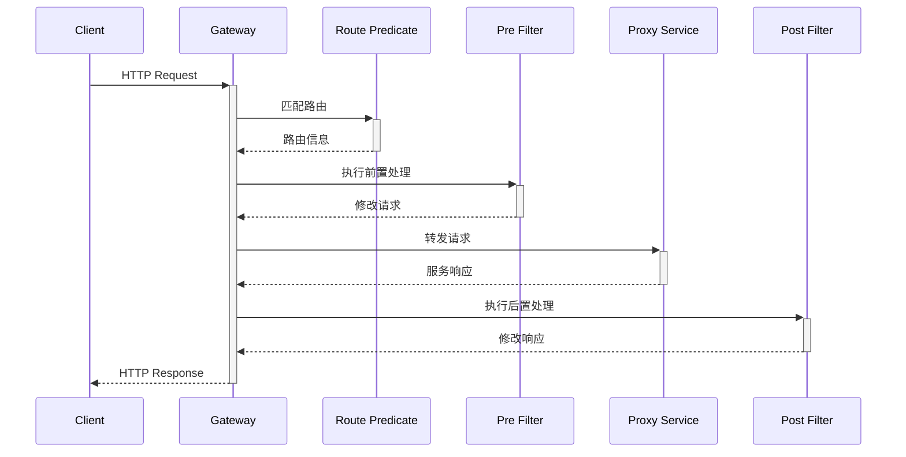

# Spring Cloud Gateway 深度解析

## 1. 核心架构

### 1.1 请求处理流程



### 1.2 核心组件

| 组件          | 职责                          | 示例                     |
|---------------|-------------------------------|--------------------------|
| Route         | 定义转发规则                  | 路径、主机、方法等匹配    |
| Predicate     | 请求匹配条件                  | Path=/api/**             |
| Filter        | 请求/响应处理逻辑             | 添加头信息、重试逻辑      |
| LoadBalancer  | 服务实例选择                  | 轮询、随机等算法          |

## 2. 基础配置

### 2.1 路由定义

**YAML配置**：
```yaml
spring:
  cloud:
    gateway:
      routes:
        - id: user-service
          uri: lb://user-service
          predicates:
            - Path=/api/users/**
          filters:
            - StripPrefix=1
            - name: Retry
              args:
                retries: 3
                statuses: BAD_GATEWAY
```

**Java DSL配置**：
```java
@Bean
public RouteLocator customRouteLocator(RouteLocatorBuilder builder) {
    return builder.routes()
        .route("order-service", r -> r.path("/api/orders/**")
            .filters(f -> f.stripPrefix(1)
                .addRequestHeader("X-Gateway", "true"))
            .uri("lb://order-service"))
        .build();
}
```

## 3. 高级特性

### 3.1 自定义过滤器

**全局过滤器**：
```java
@Component
public class AuthFilter implements GlobalFilter, Ordered {
    @Override
    public Mono<Void> filter(ServerWebExchange exchange, GatewayFilterChain chain) {
        String token = exchange.getRequest()
            .getHeaders()
            .getFirst("Authorization");
        
        if (!validateToken(token)) {
            exchange.getResponse().setStatusCode(HttpStatus.UNAUTHORIZED);
            return exchange.getResponse().setComplete();
        }
        
        return chain.filter(exchange);
    }
    
    @Override
    public int getOrder() {
        return -1;
    }
}
```

### 3.2 动态路由

**数据库存储路由**：
```java
@Bean
public RouteDefinitionLocator dynamicRouteLocator(RouteRepository routeRepository) {
    return new RouteDefinitionLocator() {
        @Override
        public Flux<RouteDefinition> getRouteDefinitions() {
            return routeRepository.findAll()
                .map(route -> {
                    RouteDefinition definition = new RouteDefinition();
                    definition.setId(route.getId());
                    definition.setUri(URI.create(route.getUri()));
                    definition.setPredicates(route.getPredicates());
                    definition.setFilters(route.getFilters());
                    return definition;
                });
        }
    };
}
```

## 4. 安全控制

### 4.1 JWT验证

```java
public class JwtFilter implements GatewayFilter {
    @Override
    public Mono<Void> filter(ServerWebExchange exchange, GatewayFilterChain chain) {
        String token = extractToken(exchange.getRequest());
        try {
            Jws<Claims> claims = Jwts.parser()
                .setSigningKey(secretKey)
                .parseClaimsJws(token);
            exchange.getAttributes().put("user", claims.getBody().getSubject());
            return chain.filter(exchange);
        } catch (Exception e) {
            exchange.getResponse().setStatusCode(HttpStatus.UNAUTHORIZED);
            return exchange.getResponse().setComplete();
        }
    }
}
```

### 4.2 速率限制

**Redis限流**：
```java
@Bean
public RedisRateLimiter redisRateLimiter(ReactiveRedisTemplate<String, String> redisTemplate) {
    return new RedisRateLimiter(redisTemplate, 
        properties -> new Config()
            .setBurstCapacity(20)
            .setReplenishRate(10)
    );
}
```

## 5. 性能优化

### 5.1 连接池配置

```yaml
spring:
  cloud:
    gateway:
      httpclient:
        pool:
          max-connections: 500
          max-idle-time: 30000
```

### 5.2 响应式调优

```java
@Bean
public HttpClient httpClient() {
    return HttpClient.create()
        .tcpConfiguration(tcpClient -> tcpClient
            .option(ChannelOption.CONNECT_TIMEOUT_MILLIS, 2000)
            .doOnConnected(conn -> conn
                .addHandlerLast(new ReadTimeoutHandler(5))
                .addHandlerLast(new WriteTimeoutHandler(5))));
}
```

## 6. 生产实践

### 6.1 监控指标

**Prometheus配置**：
```yaml
management:
  endpoints:
    web:
      exposure:
        include: health,prometheus
  metrics:
    distribution:
      percentiles-histogram:
        http.server.requests: true
```

### 6.2 灰度发布

**基于Header的路由**：
```java
.route("canary-user-service", r -> r.header("X-Canary", "true")
    .filters(f -> f.rewritePath("/api/(?<segment>.*)", "/$\\{segment}"))
    .uri("lb://user-service-canary"))
```

## 7. 故障排查

### 7.1 常见问题

| 问题现象                 | 可能原因                   | 解决方案                  |
|--------------------------|---------------------------|---------------------------|
| 504 Gateway Timeout      | 下游服务响应超时           | 调整超时参数/扩容服务      |
| 503 Service Unavailable  | 服务实例不可用             | 检查注册中心/健康检查      |
| 401 Unauthorized         | 认证失败                   | 验证Token/权限配置         |

### 7.2 日志分析

```java
logging:
  level:
    org.springframework.cloud.gateway: DEBUG
    reactor.netty.http.client: WARN
```

## 8. 最佳实践

### 8.1 配置建议

- 超时设置：
  ```yaml
  spring:
    cloud:
      gateway:
        httpclient:
          connect-timeout: 1000
          response-timeout: 5s
  ```

- 重试策略：
  ```yaml
  filters:
    - name: Retry
      args:
        retries: 3
        statuses: SERVICE_UNAVAILABLE
        methods: GET
  ```

### 8.2 安全规范

1. 禁用敏感端点：
   ```yaml
   management:
     endpoints:
       web:
         exposure:
           exclude: shutdown,refresh
   ```

2. 请求头校验：
   ```java
   exchange.getRequest()
       .getHeaders()
       .containsKey("X-Request-ID");
   ```

## 9. 迁移指南

### 9.1 Zuul迁移

**兼容配置**：
```yaml
zuul:
  ignored-services: '*'
  routes:
    legacy-service: /legacy/**
```

### 9.2 分阶段切换

1. **并行运行**：
   ```yaml
   spring:
     cloud:
       gateway:
         enabled: true
       zuul:
         enabled: true
   ```

2. **流量对比**：
   - 监控两个网关的QPS和延迟
   - 对比错误率

3. **全面切换**：
   ```yaml
   spring:
     cloud:
       zuul:
         enabled: false
   ```
