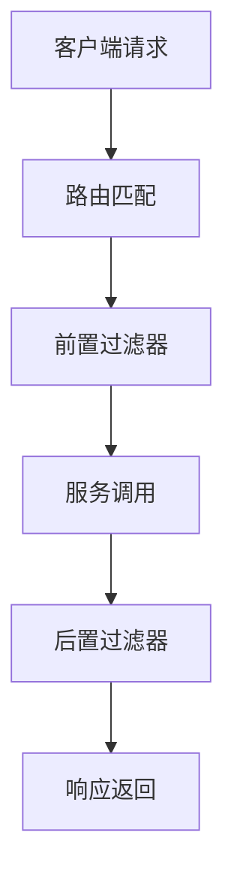
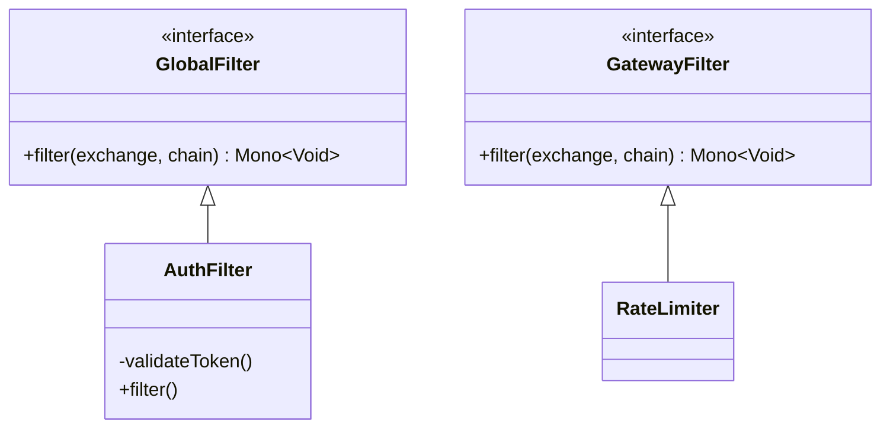

## 1. 架构设计 

### 1.1 请求处理流程



<div class="grid cards" markdown>

-   **核心组件**
    - 路由定位器
    - 断言工厂
    - 过滤器链
    - 负载均衡器

-   **关键特性**
    - 响应式编程
    - 动态路由
    - 全局过滤
    - 服务熔断

</div>

## 2. 基础配置

### 2.1 路由规则定义

**YAML配置示例**：
```yaml
spring:
  cloud:
    gateway:
      routes:
        - id: payment-service
          uri: lb://payment-service
          predicates:
            - Path=/api/payments/**
            - Method=GET,POST
          filters:
            - StripPrefix=1
            - name: RequestRateLimiter
              args:
                redis-rate-limiter.replenishRate: 10
                redis-rate-limiter.burstCapacity: 20
```

<details>
<summary>点击查看Java DSL配置</summary>

```java
@Bean
public RouteLocator customRoutes(RouteLocatorBuilder builder) {
    return builder.routes()
        .route("inventory-service", r -> r.path("/api/inventory/**")
            .filters(f -> f
                .circuitBreaker(config -> config
                    .setName("inventoryCB")
                    .setFallbackUri("forward:/fallback")))
            .uri("lb://inventory-service"))
        .build();
}
```
</details>

## 3. 高级功能

### 3.1 自定义过滤器



**JWT认证过滤器**：
```java
@Component
public class JwtAuthFilter implements GlobalFilter {
    @Override
    public Mono<Void> filter(ServerWebExchange exchange, GatewayFilterChain chain) {
        String token = exchange.getRequest()
            .getHeaders().getFirst("Authorization");
        
        if (!validateToken(token)) {
            exchange.getResponse().setStatusCode(HttpStatus.UNAUTHORIZED);
            return exchange.getResponse().setComplete();
        }
        return chain.filter(exchange);
    }
}
```

## 4. 生产实践

### 4.1 性能优化

**连接池配置**：
```yaml
spring:
  cloud:
    gateway:
      httpclient:
        pool:
          max-connections: 1000
          max-idle-time: 60s
          acquire-timeout: 2000
```

**响应式调优**：
```java
@Bean
public HttpClient httpClient() {
    return HttpClient.create()
        .compress(true)
        .keepAlive(true)
        .option(ChannelOption.CONNECT_TIMEOUT_MILLIS, 2000)
        .doOnConnected(conn -> conn
            .addHandlerLast(new ReadTimeoutHandler(10))
            .addHandlerLast(new WriteTimeoutHandler(10)));
}
```

## 5. 监控告警

### 5.1 Prometheus集成

```yaml
management:
  endpoints:
    web:
      exposure:
        include: health,prometheus,metrics
  metrics:
    distribution:
      percentiles-histogram:
        http.server.requests: true
      percentiles:
        http.server.requests: 0.95,0.99
```

**关键指标**：
- `gateway_requests_seconds_count`：请求计数
- `gateway_requests_seconds_sum`：请求总耗时
- `gateway_requests_seconds_max`：最大耗时

## 6. 安全防护

### 6.1 防御策略

| 攻击类型 | 防护措施 | 实现方式 |
|---------|---------|---------|
| DDoS | 速率限制 | RequestRateLimiter |
| 注入攻击 | 请求校验 | ModifyRequestBodyFilter |
| 未授权访问 | JWT验证 | GlobalFilter |
| 数据泄露 | 响应过滤 | ModifyResponseBodyFilter |

## 7. 故障排查

### 7.1 常见问题处理

**连接超时**：
```yaml
spring:
  cloud:
    gateway:
      httpclient:
        connect-timeout: 2000
        response-timeout: 5s
```

**服务熔断**：
```java
f -> f.circuitBreaker(config -> config
    .setName("serviceCB")
    .setFallbackUri("forward:/fallback"))
```

## 8. 最佳实践

### 8.1 配置准则

1. **路由组织**：
   ```yaml
   routes:
     - id: service-group1
       uri: lb://service-group1
       predicates:
         - Path=/api/v1/group1/**
     - id: service-group2  
       uri: lb://service-group2
       predicates:
         - Path=/api/v1/group2/**
   ```

2. **过滤器顺序**：
   ```java
   @Override
   public int getOrder() {
       return Ordered.HIGHEST_PRECEDENCE + 1;
   }
   ```

3. **日志规范**：
   ```properties
   logging.level.org.springframework.cloud.gateway=DEBUG
   logging.level.reactor.netty.http.client=WARN
   ```
