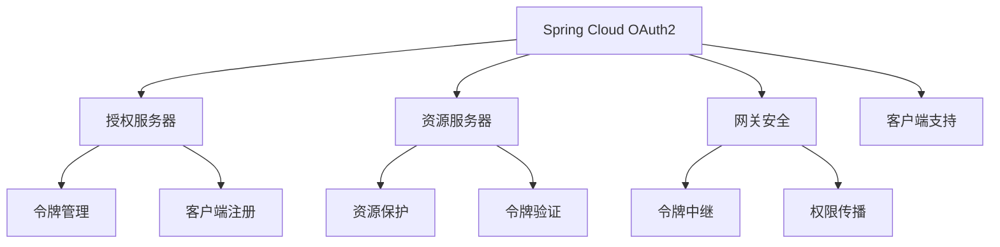
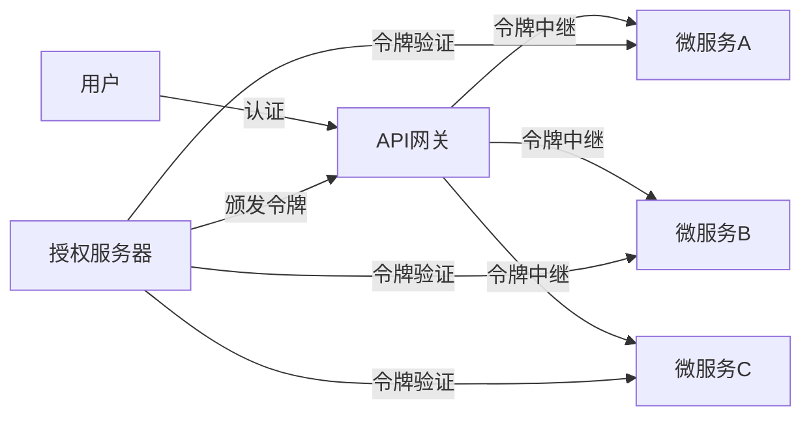

## 1. Spring Cloud OAuth2概述

Spring Cloud OAuth2是Spring Cloud生态系统中的安全组件，为微服务架构提供了基于OAuth2的认证和授权解决方案。它与Spring Security无缝集成，提供了一套完整的安全框架，用于保护微服务应用。

### 1.1 核心组件



<div class="grid cards" markdown>

-   **授权服务器**
    - 负责认证用户
    - 颁发访问令牌
    - 管理客户端注册
    - 处理令牌刷新

-   **资源服务器**
    - 保护API资源
    - 验证访问令牌
    - 实施权限控制
    - 与微服务集成

-   **安全网关**
    - 集中式认证
    - 令牌转换与中继
    - 权限传播
    - 安全策略执行

</div>

### 1.2 微服务安全架构



## 2. 授权服务器配置

### 2.1 依赖配置

```xml
<dependency>
    <groupId>org.springframework.cloud</groupId>
    <artifactId>spring-cloud-starter-oauth2</artifactId>
</dependency>
<dependency>
    <groupId>org.springframework.cloud</groupId>
    <artifactId>spring-cloud-starter-security</artifactId>
</dependency>
```

> **注意**：Spring Cloud OAuth2已被弃用，推荐使用Spring Authorization Server替代。

### 2.2 授权服务器实现

```java
@Configuration
@EnableAuthorizationServer
public class AuthServerConfig extends AuthorizationServerConfigurerAdapter {

    @Autowired
    private AuthenticationManager authenticationManager;
    
    @Override
    public void configure(ClientDetailsServiceConfigurer clients) throws Exception {
        clients.inMemory()
            .withClient("web-client")
            .secret(passwordEncoder.encode("secret"))
            .authorizedGrantTypes("authorization_code", "refresh_token")
            .scopes("read", "write")
            .redirectUris("http://localhost:8080/login/oauth2/code/client")
            .and()
            .withClient("service-client")
            .secret(passwordEncoder.encode("service-secret"))
            .authorizedGrantTypes("client_credentials")
            .scopes("service");
    }
    
    @Override
    public void configure(AuthorizationServerEndpointsConfigurer endpoints) {
        endpoints
            .authenticationManager(authenticationManager)
            .tokenStore(tokenStore())
            .accessTokenConverter(accessTokenConverter());
    }
    
    @Bean
    public TokenStore tokenStore() {
        return new JwtTokenStore(accessTokenConverter());
    }
    
    @Bean
    public JwtAccessTokenConverter accessTokenConverter() {
        JwtAccessTokenConverter converter = new JwtAccessTokenConverter();
        converter.setSigningKey("123"); // 生产环境使用非对称密钥
        return converter;
    }
}
```

### 2.3 用户认证配置

```java
@Configuration
@EnableWebSecurity
public class SecurityConfig extends WebSecurityConfigurerAdapter {

    @Bean
    public PasswordEncoder passwordEncoder() {
        return new BCryptPasswordEncoder();
    }
    
    @Override
    protected void configure(AuthenticationManagerBuilder auth) throws Exception {
        auth.inMemoryAuthentication()
            .withUser("user")
            .password(passwordEncoder().encode("password"))
            .roles("USER")
            .and()
            .withUser("admin")
            .password(passwordEncoder().encode("admin"))
            .roles("USER", "ADMIN");
    }
    
    @Override
    @Bean
    public AuthenticationManager authenticationManagerBean() throws Exception {
        return super.authenticationManagerBean();
    }
}
```

## 3. 资源服务器配置

### 3.1 基本配置

```java
@Configuration
@EnableResourceServer
public class ResourceServerConfig extends ResourceServerConfigurerAdapter {

    @Override
    public void configure(HttpSecurity http) throws Exception {
        http
            .authorizeRequests()
            .antMatchers("/api/public/**").permitAll()
            .antMatchers("/api/user/**").hasRole("USER")
            .antMatchers("/api/admin/**").hasRole("ADMIN")
            .anyRequest().authenticated();
    }
    
    @Bean
    public JwtAccessTokenConverter accessTokenConverter() {
        JwtAccessTokenConverter converter = new JwtAccessTokenConverter();
        converter.setSigningKey("123"); // 与授权服务器相同的密钥
        return converter;
    }
}
```

### 3.2 应用属性配置

```yaml
security:
  oauth2:
    resource:
      jwt:
        key-value: 123  # 与授权服务器相同的密钥
```

## 4. 网关安全配置

### 4.1 Spring Cloud Gateway配置

```java
@Configuration
public class GatewaySecurityConfig {

    @Bean
    public SecurityWebFilterChain springSecurityFilterChain(ServerHttpSecurity http) {
        http
            .authorizeExchange()
            .pathMatchers("/public/**").permitAll()
            .anyExchange().authenticated()
            .and()
            .oauth2Login()
            .and()
            .oauth2ResourceServer()
            .jwt();
        return http.build();
    }
}
```

### 4.2 令牌中继配置

```yaml
spring:
  cloud:
    gateway:
      routes:
        - id: user-service
          uri: lb://user-service
          predicates:
            - Path=/api/users/**
          filters:
            - TokenRelay
```

## 5. 微服务间安全通信

### 5.1 客户端凭证模式

```java
@Configuration
public class ServiceClientConfig {
    
    @Bean
    public OAuth2RestTemplate oAuth2RestTemplate(OAuth2ClientContext oauth2ClientContext,
                                               OAuth2ProtectedResourceDetails details) {
        return new OAuth2RestTemplate(details, oauth2ClientContext);
    }
    
    @Bean
    public OAuth2ProtectedResourceDetails clientCredentialsResourceDetails() {
        ClientCredentialsResourceDetails details = new ClientCredentialsResourceDetails();
        details.setAccessTokenUri("http://auth-server:9000/oauth/token");
        details.setClientId("service-client");
        details.setClientSecret("service-secret");
        details.setScope(Arrays.asList("service"));
        return details;
    }
}
```

### 5.2 Feign客户端集成

```java
@Configuration
public class FeignClientConfig {
    
    @Bean
    public RequestInterceptor oauth2FeignRequestInterceptor(OAuth2ClientContext oauth2ClientContext) {
        return new OAuth2FeignRequestInterceptor(oauth2ClientContext, clientCredentialsResourceDetails());
    }
}
```

## 6. 迁移到Spring Authorization Server

Spring Cloud OAuth2已被弃用，推荐迁移到Spring Authorization Server。

### 6.1 依赖更新

```xml
<dependency>
    <groupId>org.springframework.security</groupId>
    <artifactId>spring-security-oauth2-authorization-server</artifactId>
    <version>0.3.1</version>
</dependency>
```

### 6.2 授权服务器配置

```java
@Configuration
@EnableWebSecurity
public class AuthServerConfig {

    @Bean
    @Order(1)
    public SecurityFilterChain authorizationServerSecurityFilterChain(HttpSecurity http) throws Exception {
        OAuth2AuthorizationServerConfiguration.applyDefaultSecurity(http);
        
        return http
            .getConfigurer(OAuth2AuthorizationServerConfigurer.class)
            .oidc(Customizer.withDefaults())
            .and()
            .build();
    }
    
    @Bean
    public RegisteredClientRepository registeredClientRepository() {
        RegisteredClient webClient = RegisteredClient.withId(UUID.randomUUID().toString())
            .clientId("web-client")
            .clientSecret("{noop}secret")
            .clientAuthenticationMethod(ClientAuthenticationMethod.CLIENT_SECRET_BASIC)
            .authorizationGrantType(AuthorizationGrantType.AUTHORIZATION_CODE)
            .authorizationGrantType(AuthorizationGrantType.REFRESH_TOKEN)
            .redirectUri("http://localhost:8080/login/oauth2/code/client")
            .scope("read")
            .scope("write")
            .build();
            
        return new InMemoryRegisteredClientRepository(webClient);
    }
    
    @Bean
    public JWKSource<SecurityContext> jwkSource() {
        RSAKey rsaKey = generateRsa();
        JWKSet jwkSet = new JWKSet(rsaKey);
        return (jwkSelector, securityContext) -> jwkSelector.select(jwkSet);
    }
    
    private static RSAKey generateRsa() {
        KeyPair keyPair = generateRsaKey();
        RSAPublicKey publicKey = (RSAPublicKey) keyPair.getPublic();
        RSAPrivateKey privateKey = (RSAPrivateKey) keyPair.getPrivate();
        return new RSAKey.Builder(publicKey)
            .privateKey(privateKey)
            .keyID(UUID.randomUUID().toString())
            .build();
    }
}
```

## 7. 最佳实践

### 7.1 安全配置

1. **使用JWT令牌**：
   - 支持无状态验证
   - 减少授权服务器负载
   - 包含必要的用户信息和权限

2. **令牌安全**：
   - 使用非对称密钥(RSA)
   - 设置合理的令牌有效期
   - 实现令牌撤销机制

3. **客户端安全**：
   - 安全存储客户端密钥
   - 使用HTTPS传输
   - 限制授权范围

### 7.2 微服务安全架构

1. **API网关集中认证**：
   - 在网关层处理认证
   - 减少微服务认证复杂性
   - 统一安全策略

2. **令牌中继**：
   - 保留用户上下文
   - 支持服务间授权
   - 维护审计跟踪

## 8. 常见问题

### 8.1 令牌验证问题

| 问题 | 解决方案 |
|------|---------|
| 令牌无效 | 检查签名密钥是否一致 |
| 令牌过期 | 使用刷新令牌获取新令牌 |
| 权限不足 | 检查令牌中的权限声明 |
| 跨域问题 | 配置正确的CORS设置 |

### 8.2 性能优化

1. **JWT令牌优化**：
   - 减少令牌大小，仅包含必要信息
   - 使用压缩算法
   - 缓存频繁使用的令牌验证结果

2. **授权服务器扩展**：
   - 集群部署
   - 使用Redis存储会话状态
   - 实现负载均衡

## 9. 监控与审计

### 9.1 安全事件监控

```java
@Component
public class OAuth2EventListener {

    private static final Logger log = LoggerFactory.getLogger(OAuth2EventListener.class);

    @EventListener
    public void onAuthenticationSuccess(AuthenticationSuccessEvent event) {
        log.info("用户登录成功: {}", event.getAuthentication().getName());
    }

    @EventListener
    public void onAuthenticationFailure(AbstractAuthenticationFailureEvent event) {
        log.warn("用户登录失败: {}, 原因: {}", 
                event.getAuthentication().getName(), 
                event.getException().getMessage());
    }
}
```

### 9.2 审计日志

```java
@Configuration
@EnableJpaAuditing
public class AuditConfig {

    @Bean
    public AuditorAware<String> auditorProvider() {
        return () -> {
            Authentication authentication = SecurityContextHolder.getContext().getAuthentication();
            if (authentication == null || !authentication.isAuthenticated()) {
                return Optional.of("system");
            }
            return Optional.of(authentication.getName());
        };
    }
}
```

## 10. 总结

Spring Cloud OAuth2为微服务架构提供了全面的安全解决方案，通过集成授权服务器、资源服务器和API网关，实现了分布式系统的认证和授权。

虽然Spring Cloud OAuth2已被弃用，但其核心概念和安全模型仍然适用于现代微服务架构。迁移