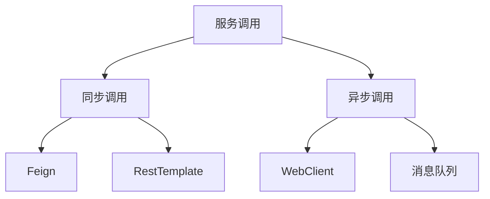
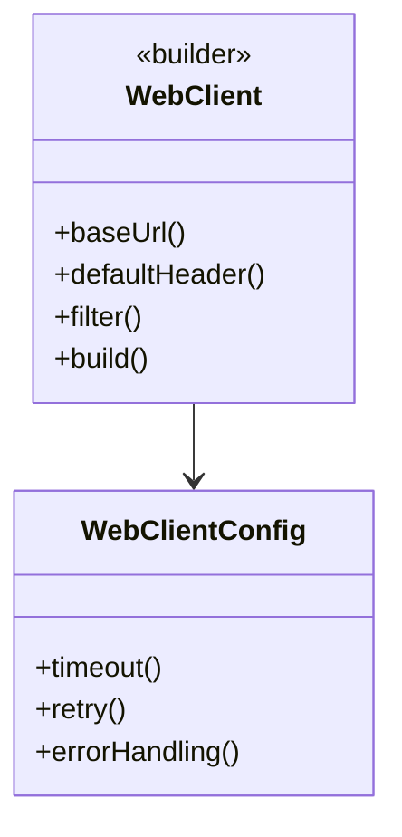

## 1. 核心机制

### 1.1 调用模式架构



<div class="grid cards" markdown>

-   **同步方案**
   - Feign：声明式REST客户端
   - RestTemplate：传统REST模板
   - Dubbo：RPC调用

-   **异步方案**
   - WebClient：响应式HTTP客户端
   - RabbitMQ：消息队列
   - Kafka：事件驱动

</div>

## 2. Feign深度实践

### 2.1 基础集成

**依赖配置**：
```xml
<dependency>
    <groupId>org.springframework.cloud</groupId>
    <artifactId>spring-cloud-starter-openfeign</artifactId>
    <version>3.1.0</version>
</dependency>
```

<details>
<summary>点击查看完整客户端示例</summary>

```java
@FeignClient(
    name = "order-service",
    url = "${feign.client.order.url:}",
    configuration = OrderFeignConfig.class
)
public interface OrderClient {
    
    @GetMapping("/orders/{id}")
    Order getOrder(@PathVariable Long id);

    @PostMapping(value = "/orders", 
        consumes = MediaType.APPLICATION_JSON_VALUE)
    Order createOrder(@RequestBody OrderRequest request);
}
```
</details>

## 3. WebClient响应式调用

### 3.1 核心配置



**使用示例**：
```java
public Mono<Product> getProduct(String id) {
    return webClient.get()
        .uri("/products/{id}", id)
        .retrieve()
        .bodyToMono(Product.class)
        .timeout(Duration.ofSeconds(3))
        .retryWhen(Retry.backoff(3, Duration.ofMillis(100)));
}
```

## 4. 生产级配置

### 4.1 性能优化

**连接池配置**：
```yaml
feign:
  httpclient:
    enabled: true
    max-connections: 500
    max-connections-per-route: 50
    connection-timeout: 2000
```

**超时设置**：
```java
@Bean
public WebClient webClient(WebClient.Builder builder) {
    return builder
        .clientConnector(new ReactorClientHttpConnector(
            HttpClient.create()
                .responseTimeout(Duration.ofSeconds(5))
        ))
        .build();
}
```

## 5. 安全实践

### 5.1 认证传递

| 方案 | 实现方式 | 适用场景 |
|------|---------|---------|
| OAuth2 | Feign拦截器 | 统一认证 |
| JWT | 请求头注入 | 微服务间调用 |
| Basic Auth | 配置编码 | 内部服务 |

**JWT示例**：
```java
public class JwtAuthInterceptor implements RequestInterceptor {
    @Override
    public void apply(RequestTemplate template) {
        template.header("Authorization", "Bearer " + getJwtToken());
    }
}
```

## 6. 监控告警

### 6.1 关键指标

```yaml
management:
  endpoints:
    web:
      exposure:
        include: health,prometheus
  metrics:
    distribution:
      percentiles:
        http.client.requests: 0.95,0.99
```

**监控看板应包含**：
- 请求成功率
- 平均响应时间
- 异常类型分布
- 熔断器状态

## 7. 最佳实践

### 7.1 错误处理

**Feign Fallback**：
```java
@FeignClient(name = "payment-service", 
    fallback = PaymentFallback.class)
public interface PaymentClient {
    // ...
}

@Component
public class PaymentFallback implements PaymentClient {
    @Override
    public Payment getPayment(Long id) {
        return Payment.dummy();
    }
}
```

### 7.2 日志规范

```java
@Aspect
@Component
@Slf4j
public class FeignLogAspect {
    
    @Around("@within(feignClient)")
    public Object logFeignCall(ProceedingJoinPoint joinPoint, 
            FeignClient feignClient) throws Throwable {
        long start = System.currentTimeMillis();
        try {
            Object result = joinPoint.proceed();
            log.info("{} call success in {}ms", 
                feignClient.name(), 
                System.currentTimeMillis()-start);
            return result;
        } catch (Exception e) {
            log.error("{} call failed: {}", 
                feignClient.name(), e.getMessage());
            throw e;
        }
    }
}
```

## 5. 失败重试机制 {#retry-mechanism}

### 5.1 Feign重试配置

**全局重试策略**：
```yaml
feign:
  client:
    config:
      default:
        retryer: feign.Retryer.Default
        retryable-exceptions:
          - java.io.IOException
          - org.springframework.web.client.HttpServerErrorException
```

**自定义重试器**：
```java
public class CustomRetryer implements Retryer {
    private final int maxAttempts;
    private final long backoff;
    private int attempt = 1;

    public CustomRetryer(int maxAttempts, long backoff) {
        this.maxAttempts = maxAttempts;
        this.backoff = backoff;
    }

    @Override
    public void continueOrPropagate(RetryableException e) {
        if (attempt++ >= maxAttempts) {
            throw e;
        }
        try {
            Thread.sleep(backoff);
        } catch (InterruptedException ignored) {
            Thread.currentThread().interrupt();
        }
    }

    @Override
    public Retryer clone() {
        return new CustomRetryer(maxAttempts, backoff);
    }
}
```

### 5.2 WebClient重试策略

**指数退避重试**：
```java
public Mono<Product> getProductWithRetry(String id) {
    return webClient.get()
        .uri("/products/{id}", id)
        .retrieve()
        .bodyToMono(Product.class)
        .retryWhen(Retry.backoff(3, Duration.ofMillis(100))
            .filter(this::shouldRetry)
            .onRetryExhaustedThrow((retryBackoffSpec, retrySignal) -> 
                new ServiceUnavailableException()));
}

private boolean shouldRetry(Throwable throwable) {
    return throwable instanceof WebClientResponseException && 
           ((WebClientResponseException) throwable).getStatusCode().is5xxServerError();
}
```

### 5.3 RestTemplate重试

**拦截器实现**：
```java
public class RetryInterceptor implements ClientHttpRequestInterceptor {
    private final int maxAttempts;
    private final long delay;

    @Override
    public ClientHttpResponse intercept(HttpRequest request, byte[] body, 
            ClientHttpRequestExecution execution) throws IOException {
        int attempt = 0;
        ClientHttpResponse response;
        while (true) {
            try {
                response = execution.execute(request, body);
                if (!response.getStatusCode().is5xxServerError() || ++attempt >= maxAttempts) {
                    return response;
                }
                Thread.sleep(delay);
            } catch (Exception e) {
                if (++attempt >= maxAttempts) {
                    throw e;
                }
            }
        }
    }
}
```

### 5.4 重试最佳实践

1. **重试条件**：
   - 仅重试幂等操作（GET/HEAD）
   - 针对5xx错误和网络超时
   - 避免重试4xx客户端错误

2. **退避策略**：
   ```java
   // 指数退避公式
   long delay = (long) (initialDelay * Math.pow(multiplier, retryCount - 1));
   ```

3. **熔断结合**：
   ```yaml
   resilience4j:
     retry:
       instances:
         backend:
           maxAttempts: 3
           waitDuration: 100ms
     circuitbreaker:
       instances:
         backend:
           failureRateThreshold: 50
           minimumNumberOfCalls: 10
   ```

[...保留后续原有章节...]
