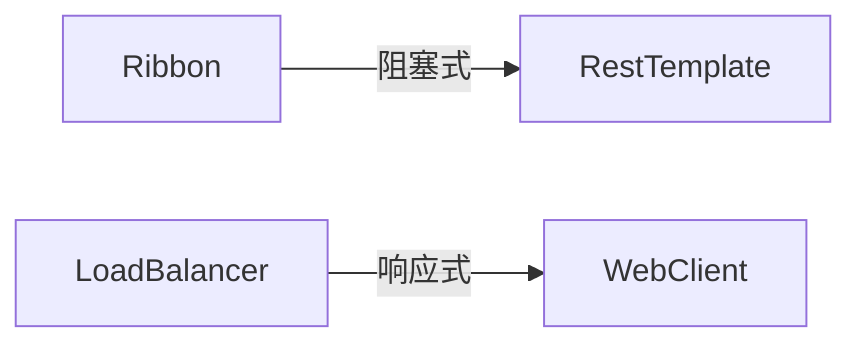
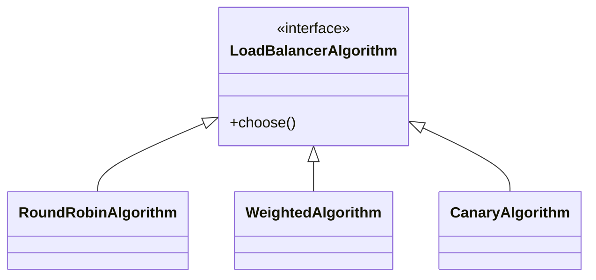

## 1. 架构演进 {#loadbalance-arch}

### 1.1 组件对比



<div class="grid cards" markdown>

-   **Ribbon特性**
    - 基于接口的扩展
    - 静态配置
    - 线程池模型
    - 成熟稳定

-   **LoadBalancer特性**
    - 函数式编程
    - 动态配置
    - 响应式支持
    - 官方推荐

</div>

## 2. 核心配置 {#core-config}

### 2.1 LoadBalancer基础

```yaml
spring:
  cloud:
    loadbalancer:
      health-check:
        interval: 30s
        initial-delay: 10s
      cache:
        ttl: 30s
```

<details>
<summary>点击查看自定义负载均衡器</summary>

```java
@Bean
public ReactorLoadBalancer<ServiceInstance> customLoadBalancer(
        Environment env, 
        LoadBalancerClientFactory factory) {
    return new CustomLoadBalancer(
        factory.getLazyProvider(
            env.getProperty(LoadBalancerClientFactory.PROPERTY_NAME),
            ServiceInstanceListSupplier.class
        )
    );
}
```
</details>

## 3. 高级特性 {#advanced-features}

### 3.1 流量控制



**灰度发布实现**：
```java
public Response<ServiceInstance> choose(Request request) {
    String version = getRequestVersion(request);
    return instances.stream()
        .filter(i -> i.getMetadata().get("version").equals(version))
        .findFirst()
        .map(instance -> new DefaultResponse(instance))
        .orElseGet(() -> new EmptyResponse());
}
```

## 4. 性能优化 {#performance}

### 4.1 关键参数

| 参数 | 推荐值 | 说明 |
|------|--------|------|
| 最大连接数 | 500 | 防止资源耗尽 |
| 连接超时 | 2000ms | 快速失败 |
| 响应超时 | 5000ms | 避免阻塞 |
| 健康检查间隔 | 30s | 及时感知状态 |

### 4.2 监控告警

**Prometheus配置**：
```yaml
management:
  metrics:
    export:
      prometheus:
        enabled: true
    distribution:
      percentiles:
        http.server.requests: 0.95,0.99
```

## 5. 生产实践 {#best-practices}

### 5.1 故障演练

**Chaos工程方案**：
```yaml
apiVersion: chaos-mesh.org/v1alpha1
kind: NetworkChaos
metadata:
  name: network-test
spec:
  action: delay
  delay:
    latency: "300ms"
  duration: "5m"
```

### 5.2 迁移指南

1. **评估阶段**：
   - 梳理现有Ribbon配置
   - 识别定制化组件

2. **并行运行**：
   ```yaml
   spring:
     cloud:
       loadbalancer:
         ribbon:
           enabled: true
   ```

3. **全面切换**：
   ```yaml
   spring:
     cloud:
       loadbalancer:
         ribbon:
           enabled: false
   ```

## 6. 常见问题 {#faq}

### 6.1 性能调优

**连接池配置**：
```java
@Bean
public HttpClient httpClient() {
    return HttpClient.create()
        .option(ChannelOption.CONNECT_TIMEOUT_MILLIS, 2000)
        .responseTimeout(Duration.ofSeconds(5));
}
```

### 6.2 异常处理

**重试策略**：
```java
@Bean
public WebClient.Builder webClientBuilder(RetryLoadBalancerFilterFactory factory) {
    return WebClient.builder()
        .filter(factory.apply(retry -> retry
            .maxAttempts(3)
            .backoff(Backoff.exponential(100, 2, 1000))
        ));
}
```
