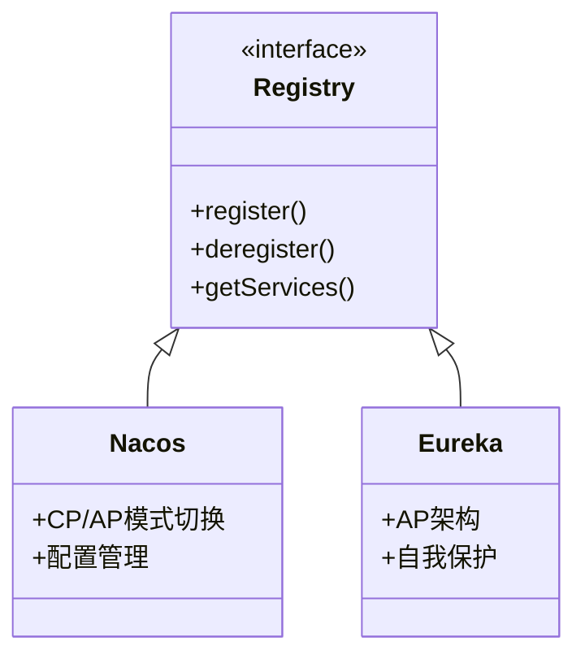
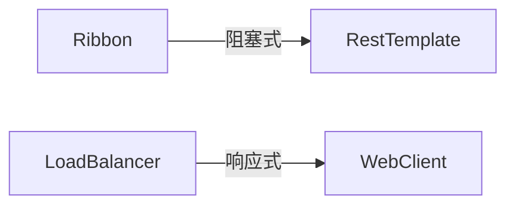
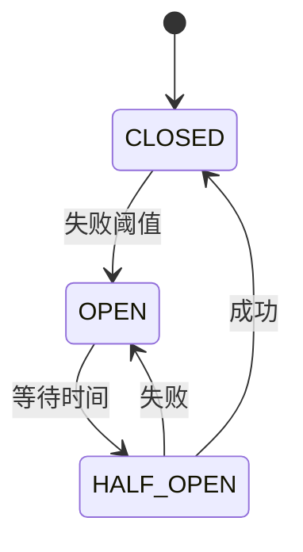
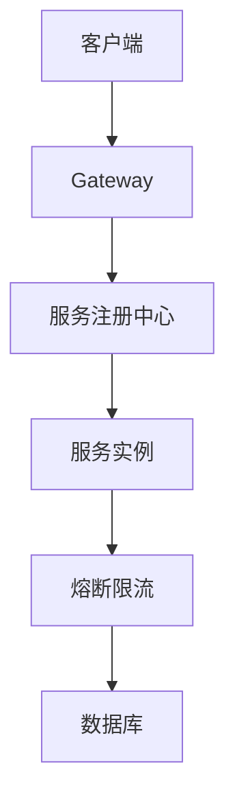

## 1. 服务注册中心 

### 1.1 主流方案对比



<div class="grid cards" markdown>

-   **核心特性**
    - 服务注册/发现
    - 健康检查
    - 负载均衡
    - 容错机制

-   **选型建议**
    - 新项目：Nacos
    - AWS环境：Eureka
    - 配置中心集成：Nacos

</div>

## 2. 服务调用 

### 2.1 调用方式对比

| 组件 | 编程模型 | 协议支持 | 适用场景 |
|------|---------|---------|---------|
| Feign | 声明式 | HTTP | 常规REST调用 |
| WebClient | 响应式 | HTTP/SSE | 异步非阻塞 |
| RestTemplate | 同步 | HTTP | 传统应用 |

<details>
<summary>点击查看Feign最佳实践</summary>

```java
@FeignClient(name = "payment-service", 
    configuration = PaymentFeignConfig.class)
public interface PaymentClient {
    
    @GetMapping("/payments/{id}")
    Payment getPayment(@PathVariable Long id);

    @PostMapping("/payments")
    Payment createPayment(@RequestBody PaymentRequest request);
}
```
</details>

## 3. 负载均衡 

### 3.1 架构演进



**关键配置**：
```yaml
spring:
  cloud:
    loadbalancer:
      health-check:
        interval: 30s
      cache:
        ttl: 10s
```

## 4. 熔断限流 

### 4.1 状态机模型



**Resilience4j配置**：
```yaml
resilience4j:
  circuitbreaker:
    instances:
      backendA:
        failureRateThreshold: 50
        minimumNumberOfCalls: 20
```

## 5. 生产实践 

### 5.1 监控告警

**Prometheus配置**：
```yaml
management:
  endpoints:
    web:
      exposure:
        include: health,prometheus
  metrics:
    distribution:
      percentiles:
        http.server.requests: 0.95,0.99
```

### 5.2 性能优化

1. **连接池配置**：
```yaml
feign:
  httpclient:
    max-connections: 200
    max-connections-per-route: 50
```

2. **线程隔离**：
```java
BulkheadConfig.custom()
    .maxConcurrentCalls(20)
    .build();
```

## 6. 组件集成 

### 6.1 典型架构



### 6.2 配置示例

**全局过滤器**：
```java
@Component
public class AuthFilter implements GlobalFilter {
    @Override
    public Mono<Void> filter(ServerWebExchange exchange, GatewayFilterChain chain) {
        // 认证逻辑
        return chain.filter(exchange);
    }
}
```

## 7. 迁移指南 

### 7.1 版本兼容

| 组件 | Spring Cloud 2020+ | Spring Cloud Hoxton |
|------|--------------------|--------------------|
| 负载均衡 | LoadBalancer | Ribbon |
| 熔断器 | Resilience4j | Hystrix |

### 7.2 分阶段迁移

1. **并行运行**：
```yaml
spring:
  cloud:
    loadbalancer:
      ribbon:
        enabled: true
```

2. **全面切换**：
```yaml
spring:
  cloud:
    loadbalancer:
    ribbon:
      enabled: false
```
