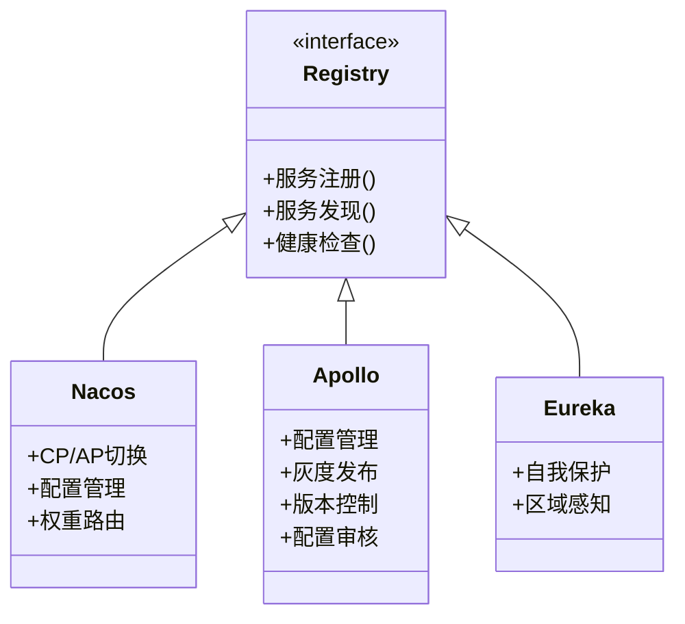

## 1. 核心特性对比 

### 1.1 功能矩阵



<div class="grid cards" markdown>

-   **Nacos优势**
    - 服务发现+配置中心
    - 支持CP/AP切换
    - 丰富的路由策略
    - 活跃社区支持

-   **Apollo优势**
    - 企业级配置管理
    - 完善的权限控制
    - 配置变更审核
    - 灰度发布能力

-   **Eureka优势**
    - 成熟稳定
    - 自我保护机制
    - AWS生态友好
    - 简单易用

</div>

## 2. 技术细节 

### 2.1 Apollo核心特性

<details>
<summary>点击查看Apollo配置示例</summary>

```yaml
app:
  id: application
apollo:
  meta: http://localhost:8080
  bootstrap:
    enabled: true
    namespaces: application,TEST1.public
  cache-dir: /opt/data/apollo-config
```
</details>

### 2.2 一致性模式对比

| 特性       | Nacos | Apollo | Eureka |
|------------|-------|--------|--------|
| 一致性协议    | CP+AP | CP     | AP     |
| 配置实时生效   | ✓     | ✓      | ×      |
| 服务发现     | ✓     | ×      | ✓      |
| 配置版本管理   | ✓     | ✓      | ×      |
| 灰度发布能力   | ✓     | ✓      | ×      |

## 3. 生产建议 

### 3.1 选型决策树

```mermaid
flowchart TD
    A[新项目?] -->|是| B[需要配置中心?]
    A -->|否| C[维护现有系统]
    B -->|是| D{需要服务发现?}
    D -->|是| E[选择Nacos]
    D -->|否| F[选择Apollo]
    B -->|否| G[选择Eureka]
    C --> H[评估迁移成本]
```



### 3.2 Apollo适用场景

1. **企业级需求**：
   - 严格的配置权限控制
   - 配置变更审计追踪
   - 多环境配置管理

2. **技术架构**：
   ```mermaid
   graph LR
       A[Admin Service] --> B[ConfigDB]
       C[Client] --> D[Config Service]
       D --> B
       E[Portal] --> A
   ```

## 4. 迁移方案 {#migration}

### 4.1 Apollo集成方案

**多配置中心并存**：
```java
@Configuration
@EnableApolloConfig
public class ApolloConfiguration {
    @Bean
    public ApolloConfigChangeListener listener() {
        return changeEvent -> {
            // 处理配置变更
        };
    }
}
```

## 5. 常见问题 

### 5.1 Apollo最佳实践

1. **命名空间规划**：
   ```properties
   # 公共配置
   apollo.bootstrap.namespaces = application,common
   # 部门私有配置
   apollo.bootstrap.namespaces = application,dept.common
   ```

2. **灰度发布流程**：
   ```mermaid
   sequenceDiagram
       participant A as 开发环境
       participant B as 测试环境
       participant C as 生产环境
       A->>B: 提交配置变更
       B->>C: 灰度10%实例
       C->>B: 监控1小时
       B->>C: 全量发布
   ```

### 5.2 性能对比

| 指标         | Nacos | Apollo | Eureka |
|--------------|-------|--------|--------|
| 注册速度(ms)  | 50    | N/A    | 30     |
| 发现延迟(ms)  | 100   | N/A    | 80     |
| 配置推送(s)   | 1     | 3      | N/A    |
| 最大实例数     | 10万+ | N/A    | 5万+   |
